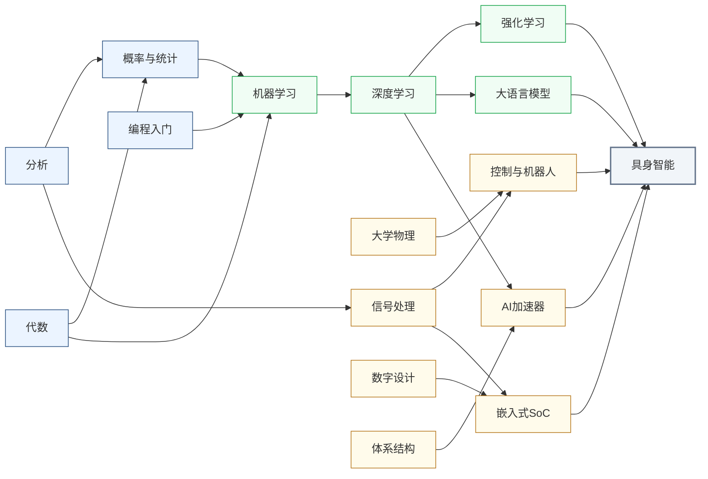

---
hide:
  - navigation
---
让机器拥有物理身体，在真实世界中感知、决策、行动，是 AI 算法从数字空间延伸到物理世界的核心课题。

<svg viewBox="0 0 1140 532" xmlns="http://www.w3.org/2000/svg" style="width:100%;max-width:1140px;display:block;margin:1.5rem auto;font-family:system-ui,-apple-system,sans-serif;">
  <rect width="1140" height="532" rx="10" fill="#FFFFFF" stroke="#CBD5E1" stroke-width="1.5"/>
  <text x="570" y="26" text-anchor="middle" font-size="17" font-weight="bold" fill="#1E293B">集成电路科研方向全景图</text>
  <text x="250" y="54" text-anchor="middle" font-size="13.5" font-weight="bold" fill="#0E7490">← 计算媒介更奇异</text>
  <text x="1000" y="54" text-anchor="middle" font-size="13.5" font-weight="bold" fill="#16A34A">更贴近物理世界 →</text>
  <defs><filter id="loc-b" x="-5%" y="-5%" width="110%" height="110%"><feGaussianBlur stdDeviation="1.4"/></filter></defs>
  <rect x="88" y="88" width="147" height="298" rx="6" fill="#ECFEFF"/>
  <rect x="239" y="88" width="147" height="298" rx="6" fill="#F8FAFC"/>
  <rect x="390" y="88" width="147" height="298" rx="6" fill="#FEF2F2"/>
  <rect x="541" y="88" width="289" height="298" rx="6" fill="#EFF6FF"/>
  <rect x="834" y="88" width="76" height="298" rx="6" fill="#FFFBEB"/>
  <rect x="914" y="88" width="218" height="298" rx="6" fill="#F0FDF4"/>
  <text x="161" y="82" text-anchor="middle" font-size="12" font-weight="bold" fill="#0E7490">量子 · 光子</text>
  <text x="312" y="82" text-anchor="middle" font-size="12" font-weight="bold" fill="#64748B">存算 · 类脑</text>
  <text x="463" y="82" text-anchor="middle" font-size="12" font-weight="bold" fill="#DC2626">模拟 · 射频</text>
  <text x="685" y="82" text-anchor="middle" font-size="13" font-weight="bold" fill="#1D4ED8">数字计算</text>
  <text x="872" y="82" text-anchor="middle" font-size="12" font-weight="bold" fill="#D97706">功率电子</text>
  <text x="1023" y="82" text-anchor="middle" font-size="12" font-weight="bold" fill="#16A34A">传感 · 生物 · 机械</text>
  <line x1="86" y1="92" x2="1132" y2="92" stroke="#E2E8F0" stroke-width="1"/>
  <line x1="86" y1="150" x2="1132" y2="150" stroke="#EEF2F6" stroke-width="1"/>
  <line x1="86" y1="208" x2="1132" y2="208" stroke="#EEF2F6" stroke-width="1"/>
  <line x1="86" y1="266" x2="1132" y2="266" stroke="#EEF2F6" stroke-width="1"/>
  <line x1="86" y1="324" x2="1132" y2="324" stroke="#EEF2F6" stroke-width="1"/>
  <line x1="86" y1="382" x2="1132" y2="382" stroke="#E2E8F0" stroke-width="1"/>
  <line x1="86" y1="92" x2="86" y2="382" stroke="#CBD5E1" stroke-width="1"/>
  <text x="81" y="124" text-anchor="end" font-size="10.5" fill="#475569">算法 / 应用</text>
  <text x="81" y="182" text-anchor="end" font-size="10.5" fill="#475569">系统 / 软件</text>
  <text x="81" y="240" text-anchor="end" font-size="10.5" fill="#475569">体系结构</text>
  <text x="81" y="298" text-anchor="end" font-size="10.5" fill="#475569">电路</text>
  <text x="81" y="356" text-anchor="end" font-size="10.5" fill="#475569">器件</text>
  <g filter="url(#loc-b)" opacity="0.42">
  <rect x="92" y="92" width="68" height="290" rx="5" fill="#CFFAFE" stroke="#0E7490" stroke-width="1.2"/>
  <text x="126" y="231" text-anchor="middle" font-size="10.5" font-weight="bold" fill="#0E7490">量子计算</text>
  <text x="126" y="246" text-anchor="middle" font-size="10.5" font-weight="bold" fill="#0E7490">与量子芯片</text>
  <rect x="163" y="92" width="68" height="290" rx="5" fill="#CFFAFE" stroke="#0E7490" stroke-width="1.2"/>
  <text x="197" y="231" text-anchor="middle" font-size="10.5" font-weight="bold" fill="#0E7490">光电子</text>
  <text x="197" y="246" text-anchor="middle" font-size="10.5" font-weight="bold" fill="#0E7490">与硅光集成</text>
  <rect x="394" y="266" width="68" height="116" rx="5" fill="#FEE2E2" stroke="#DC2626" stroke-width="1.2"/>
  <text x="428" y="317" text-anchor="middle" font-size="10.5" font-weight="bold" fill="#DC2626">模拟与</text>
  <text x="428" y="332" text-anchor="middle" font-size="10.5" font-weight="bold" fill="#DC2626">混合信号IC</text>
  <rect x="465" y="266" width="68" height="116" rx="5" fill="#FEE2E2" stroke="#DC2626" stroke-width="1.2"/>
  <text x="499" y="317" text-anchor="middle" font-size="10.5" font-weight="bold" fill="#DC2626">射频与</text>
  <text x="499" y="332" text-anchor="middle" font-size="10.5" font-weight="bold" fill="#DC2626">毫米波IC</text>
  <rect x="243" y="92" width="68" height="290" rx="5" fill="#FEE2E2" stroke="#DC2626" stroke-width="1.2"/>
  <text x="277" y="239" text-anchor="middle" font-size="11.5" font-weight="bold" fill="#DC2626">类脑芯片</text>
  <rect x="314" y="92" width="68" height="290" rx="5" fill="#EDE9FE" stroke="#7C3AED" stroke-width="1.2"/>
  <text x="348" y="231" text-anchor="middle" font-size="10.5" font-weight="bold" fill="#7C3AED">存算一体</text>
  <text x="348" y="246" text-anchor="middle" font-size="10.5" font-weight="bold" fill="#7C3AED">与近存计算</text>
  <rect x="545" y="92" width="68" height="290" rx="5" fill="#EDE9FE" stroke="#7C3AED" stroke-width="1.2"/>
  <text x="579" y="231" text-anchor="middle" font-size="10.5" font-weight="bold" fill="#7C3AED">硬件安全</text>
  <text x="579" y="246" text-anchor="middle" font-size="10.5" font-weight="bold" fill="#7C3AED">与可信计算</text>
  <rect x="616" y="92" width="68" height="174" rx="5" fill="#DBEAFE" stroke="#1D4ED8" stroke-width="1.2"/>
  <text x="650" y="172" text-anchor="middle" font-size="10.5" font-weight="bold" fill="#1D4ED8">AI 算法</text>
  <text x="650" y="187" text-anchor="middle" font-size="10.5" font-weight="bold" fill="#1D4ED8">与系统</text>
  <rect x="687" y="150" width="68" height="116" rx="5" fill="#DBEAFE" stroke="#1D4ED8" stroke-width="1.2"/>
  <text x="721" y="201" text-anchor="middle" font-size="10.5" font-weight="bold" fill="#1D4ED8">处理器架构</text>
  <text x="721" y="216" text-anchor="middle" font-size="10.5" font-weight="bold" fill="#1D4ED8">与编译系统</text>
  <rect x="758" y="208" width="68" height="116" rx="5" fill="#DBEAFE" stroke="#1D4ED8" stroke-width="1.2"/>
  <text x="792" y="259" text-anchor="middle" font-size="10.5" font-weight="bold" fill="#1D4ED8">可重构计算</text>
  <text x="792" y="274" text-anchor="middle" font-size="10.5" font-weight="bold" fill="#1D4ED8">与 FPGA</text>
  <rect x="838" y="266" width="68" height="116" rx="5" fill="#FEF3C7" stroke="#D97706" stroke-width="1.2"/>
  <text x="872" y="317" text-anchor="middle" font-size="10.5" font-weight="bold" fill="#B45309">功率半导体</text>
  <text x="872" y="332" text-anchor="middle" font-size="10" font-weight="bold" fill="#B45309">与宽禁带器件</text>
  <rect x="918" y="92" width="68" height="290" rx="5" fill="#ECFCCB" stroke="#65A30D" stroke-width="1.2"/>
  <text x="952" y="239" text-anchor="middle" font-size="11.5" font-weight="bold" fill="#4D7C0F">具身智能</text>
  <rect x="989" y="266" width="68" height="116" rx="5" fill="#D1FAE5" stroke="#059669" stroke-width="1.2"/>
  <text x="1023" y="317" text-anchor="middle" font-size="10.5" font-weight="bold" fill="#047857">生物电子</text>
  <text x="1023" y="332" text-anchor="middle" font-size="10.5" font-weight="bold" fill="#047857">与脑机接口</text>
  <rect x="1060" y="266" width="68" height="116" rx="5" fill="#DCFCE7" stroke="#16A34A" stroke-width="1.2"/>
  <text x="1094" y="317" text-anchor="middle" font-size="10.5" font-weight="bold" fill="#15803D">MEMS 与</text>
  <text x="1094" y="332" text-anchor="middle" font-size="10.5" font-weight="bold" fill="#15803D">微纳传感器</text>
  </g>
  <text x="81" y="450" text-anchor="end" font-size="10.5" fill="#475569">各方向通用</text>
  <g filter="url(#loc-b)" opacity="0.42">
  <rect x="92" y="408" width="1040" height="28" rx="5" fill="#F1F5F9" stroke="#64748B" stroke-width="1.1"/>
  <text x="612" y="426" text-anchor="middle" font-size="12" font-weight="bold" fill="#475569">EDA 与设计自动化</text>
  <rect x="92" y="440" width="1040" height="28" rx="5" fill="#EEF2F6" stroke="#64748B" stroke-width="1.1"/>
  <text x="612" y="458" text-anchor="middle" font-size="12" font-weight="bold" fill="#475569">先进封装与系统集成</text>
  <rect x="92" y="472" width="1040" height="30" rx="5" fill="#E2E8F0" stroke="#475569" stroke-width="1.2"/>
  <text x="612" y="491" text-anchor="middle" font-size="12" font-weight="bold" fill="#334155">半导体器件与先进工艺</text>
  </g>
  <rect x="92" y="512" width="13" height="13" rx="2" fill="#DBEAFE" stroke="#1D4ED8" stroke-width="1.1"/>
  <text x="110" y="522" text-anchor="start" font-size="10.5" fill="#475569">数字</text>
  <rect x="160" y="512" width="13" height="13" rx="2" fill="#FEE2E2" stroke="#DC2626" stroke-width="1.1"/>
  <text x="178" y="522" text-anchor="start" font-size="10.5" fill="#475569">模拟</text>
  <rect x="228" y="512" width="13" height="13" rx="2" fill="#EDE9FE" stroke="#7C3AED" stroke-width="1.1"/>
  <text x="246" y="522" text-anchor="start" font-size="10.5" fill="#475569">数字 / 模拟 交叉</text>
  <rect x="910" y="91" width="80" height="294" rx="6" fill="#3F6212" opacity="0.16"/>
  <rect x="908" y="89" width="80" height="294" rx="6" fill="#ECFCCB" stroke="#4D7C0F" stroke-width="2.6"/>
  <text x="948" y="244" text-anchor="middle" font-size="13.5" font-weight="bold" fill="#3F6212">具身智能</text>
</svg>

## 这个方向在研究什么

最强的 AI 能考过律师资格、写出能跑的代码、下赢人类围棋冠军，可它拿不起桌上那个杯子，也走不稳一段不平的路。<u>人类幼崽一岁就能做到的事，对于 AI 来说难如登天</u>。这便是 **Moravec 悖论**。具身智能（Embodied Intelligence）研究的，就是把 AI 从赛博空间接生到现实世界，让它从纸上谈兵进化到能身体力行。其中的关键在于，如何让 AI 拥有一个能在真实物理世界里感知、决策、行动的身体。

目前横亘在机器人商业落地面前的有三大难关。第一关是**操作**。让机器人把一个没见过的杯子拿起来放进洗碗机，人不假思索就做了，机器却要同时解决一大堆问题。它得先认出杯子，而杯子的形状、颜色、被挡住多少都可能不一样。还得估出杯子在空间里的朝向，再规划一条手臂轨迹绕开桌上别的东西。抓的时候每根手指要用恰好的力，太轻松手、太重捏碎。放进洗碗机时又得应付开门、搁架高低这些新情况。任何一环出错，整件事就崩，而人是把这些并行、无缝地一气做完的。第二关是**运动**。双足走路、在不平的地上保持平衡，看着轻巧，机器人却摔了几十年，人形和足式机器人至今还在为站稳、跑起来较劲。第三关是**导航**，走进一个陌生房间，要一边认路、一边随时知道自己在哪。这三样都是小孩的本能，可它们有一个共同的麻烦，那就是没法从网上学来。没人把"怎么用恰好的力气捏住杯子""打滑的瞬间怎么调整重心"写成文字，<u>这类知识没有文字记录，只能在大量真实动作尝试中积累。</u>

<svg viewBox="0 0 860 220" xmlns="http://www.w3.org/2000/svg" style="width:100%;max-width:860px;display:block;margin:1.5rem auto;font-family:system-ui,sans-serif;">
  <defs>
    <marker id="emb-arrow" markerWidth="9" markerHeight="9" refX="7" refY="4" orient="auto">
      <path d="M0,1 L0,7 L8,4 z" fill="#475569"/>
    </marker>
  </defs>
  <!-- Center label -->
  <circle cx="430" cy="110" r="38" fill="#F1F5F9" stroke="#94A3B8" stroke-width="1.5"/>
  <text x="430" y="106" text-anchor="middle" font-size="13" font-weight="700" fill="#334155">机器人</text>
  <text x="430" y="122" text-anchor="middle" font-size="10" fill="#64748B">感知→决策→执行</text>
  <!-- Segment 1: 感知 (top-left, blue) -->
  <path d="M430,110 L230,30 L430,30 Z" fill="#DBEAFE" stroke="#3B82F6" stroke-width="1.5" opacity="0.85"/>
  <text x="345" y="58" text-anchor="middle" font-size="14" font-weight="700" fill="#1D4ED8">感知</text>
  <text x="345" y="74" text-anchor="middle" font-size="10" fill="#1E40AF">摄像头 · LiDAR</text>
  <text x="345" y="87" text-anchor="middle" font-size="10" fill="#1E40AF">触觉传感器</text>
  <!-- Segment 2: 决策 (top-right, purple) -->
  <path d="M430,110 L430,30 L630,30 Z" fill="#EDE9FE" stroke="#7C3AED" stroke-width="1.5" opacity="0.85"/>
  <text x="515" y="58" text-anchor="middle" font-size="14" font-weight="700" fill="#6D28D9">决策</text>
  <text x="515" y="74" text-anchor="middle" font-size="10" fill="#5B21B6">视觉-语言模型</text>
  <text x="515" y="87" text-anchor="middle" font-size="10" fill="#5B21B6">策略网络 · RL</text>
  <!-- Segment 3: 执行 (bottom, green) -->
  <path d="M430,110 L230,30 L430,195 Z" fill="#DCFCE7" stroke="#16A34A" stroke-width="1.5" opacity="0.7"/>
  <path d="M430,110 L630,30 L430,195 Z" fill="#DCFCE7" stroke="#16A34A" stroke-width="1.5" opacity="0.7"/>
  <text x="430" y="168" text-anchor="middle" font-size="14" font-weight="700" fill="#15803D">执行</text>
  <text x="340" y="155" text-anchor="middle" font-size="10" fill="#166534">电机控制</text>
  <text x="520" y="155" text-anchor="middle" font-size="10" fill="#166534">力反馈</text>
  <!-- Clockwise arrows on the perimeter -->
  <!-- 感知→决策 -->
  <path d="M 390,32 Q 430,18 470,32" fill="none" stroke="#475569" stroke-width="1.8" marker-end="url(#emb-arrow)"/>
  <!-- 决策→执行 -->
  <path d="M 590,80 Q 620,130 550,178" fill="none" stroke="#475569" stroke-width="1.8" marker-end="url(#emb-arrow)"/>
  <!-- 执行→感知 -->
  <path d="M 310,178 Q 240,130 270,80" fill="none" stroke="#475569" stroke-width="1.8" marker-end="url(#emb-arrow)"/>
  <!-- Warning note -->
  <rect x="660" y="70" width="190" height="80" rx="6" fill="#FEF9C3" stroke="#CA8A04" stroke-width="1.2"/>
  <text x="755" y="92" text-anchor="middle" font-size="12" font-weight="600" fill="#92400E">⚠ 每个环节都是</text>
  <text x="755" y="108" text-anchor="middle" font-size="12" font-weight="600" fill="#92400E">开放问题</text>
  <text x="755" y="126" text-anchor="middle" font-size="10" fill="#A16207">感知泛化 · 决策规划</text>
  <text x="755" y="140" text-anchor="middle" font-size="10" fill="#A16207">Sim-to-Real · 灵巧操作</text>
</svg>

难归难，这两年 LLM 的爆发让机器人的大脑迎来了一波升级。一些具身智能研究者直接把那些在互联网上训练出来的大模型，直接搬到机器人的决策上。2023 年 Google DeepMind 的 **RT-2** 就是这么干的，它把一个视觉-语言大模型直接当成机器人的“大脑”，输入是摄像头看到的画面加上一句指令，输出直接就是机械臂的动作。因为这个大模型在海量网络数据里见过世界，它能听懂训练时从没出现过的指令。你让它“把可乐罐放到和可口可乐 logo 同颜色的方块上”，它能自己推断出那是红色，再去做。这种举一反三的本领，是过去任何机器人都没有的。

<svg viewBox="0 0 820 340" xmlns="http://www.w3.org/2000/svg" style="width:100%;max-width:820px;display:block;margin:1.5rem auto;font-family:system-ui,sans-serif;">
  <defs>
    <marker id="emBorrow" markerWidth="9" markerHeight="9" refX="6" refY="3" orient="auto"><path d="M0,0 L0,6 L8,3 z" fill="#1D4ED8"/></marker>
    <marker id="emEarn" markerWidth="9" markerHeight="9" refX="6" refY="3" orient="auto"><path d="M0,0 L0,6 L8,3 z" fill="#C2410C"/></marker>
  </defs>
  <rect width="820" height="340" rx="10" fill="#F8FAFC" stroke="#CBD5E1" stroke-width="1.5"/>
  <text x="410" y="28" text-anchor="middle" font-size="15" font-weight="bold" fill="#1E293B">认知可迁移自互联网，技能只能靠本体反复采集</text>
  <rect x="372" y="62" width="76" height="46" rx="6" fill="#DBEAFE" stroke="#1E40AF" stroke-width="1.5"/>
  <text x="410" y="82" text-anchor="middle" font-size="13" font-weight="bold" fill="#1E40AF">认知</text>
  <text x="410" y="99" text-anchor="middle" font-size="10" fill="#1D4ED8">理解·识物·常识</text>
  <line x1="410" y1="108" x2="410" y2="120" stroke="#475569" stroke-width="1.5"/>
  <rect x="360" y="120" width="100" height="84" rx="8" fill="#DCFCE7" stroke="#16A34A" stroke-width="1.5"/>
  <text x="410" y="150" text-anchor="middle" font-size="13" font-weight="bold" fill="#15803D">执行</text>
  <text x="410" y="168" text-anchor="middle" font-size="11" fill="#166534">力控·平衡</text>
  <text x="410" y="181" text-anchor="middle" font-size="11" fill="#166534">灵巧操作</text>
  <rect x="64" y="56" width="148" height="54" rx="10" fill="#EFF6FF" stroke="#93C5FD" stroke-width="1.4"/>
  <text x="138" y="80" text-anchor="middle" font-size="12" font-weight="bold" fill="#1E40AF">互联网大模型</text>
  <text x="138" y="97" text-anchor="middle" font-size="11" fill="#64748B">海量文本 + 图像</text>
  <line x1="214" y1="84" x2="368" y2="84" stroke="#1D4ED8" stroke-width="2" marker-end="url(#emBorrow)"/>
  <text x="291" y="74" text-anchor="middle" font-size="12" font-weight="bold" fill="#1D4ED8">迁移</text>
  <text x="476" y="158" text-anchor="start" font-size="11" fill="#B91C1C">此类数据互联网缺失</text>
  <text x="476" y="172" text-anchor="start" font-size="11" fill="#B91C1C">无法迁移</text>
  <rect x="92" y="276" width="160" height="40" rx="6" fill="#FFF7ED" stroke="#C2410C" stroke-width="1.3"/>
  <text x="172" y="295" text-anchor="middle" font-size="11" font-weight="bold" fill="#9A3412">人工遥操作示范</text>
  <text x="172" y="309" text-anchor="middle" font-size="11" fill="#C2410C">成本高</text>
  <rect x="330" y="276" width="160" height="40" rx="6" fill="#FFF7ED" stroke="#C2410C" stroke-width="1.3"/>
  <text x="410" y="295" text-anchor="middle" font-size="11" font-weight="bold" fill="#9A3412">仿真训练</text>
  <text x="410" y="309" text-anchor="middle" font-size="11" fill="#C2410C">有 Sim-to-Real 鸿沟</text>
  <rect x="568" y="276" width="160" height="40" rx="6" fill="#FFF7ED" stroke="#C2410C" stroke-width="1.3"/>
  <text x="648" y="295" text-anchor="middle" font-size="11" font-weight="bold" fill="#9A3412">真机在线学习</text>
  <text x="648" y="309" text-anchor="middle" font-size="11" fill="#C2410C">慢·有风险·易遗忘</text>
  <line x1="172" y1="276" x2="372" y2="204" stroke="#C2410C" stroke-width="1.6" marker-end="url(#emEarn)"/>
  <line x1="410" y1="276" x2="410" y2="208" stroke="#C2410C" stroke-width="1.6" marker-end="url(#emEarn)"/>
  <line x1="648" y1="276" x2="448" y2="204" stroke="#C2410C" stroke-width="1.6" marker-end="url(#emEarn)"/>
  <text x="410" y="250" text-anchor="middle" font-size="12" font-weight="bold" fill="#C2410C">积累（反复采集经验）</text>
</svg>

可问题在于，捏杯子的力度、走路的平衡，这种身体功夫在互联网上依然没有现成答案，LLM 也不懂。机器只能一次次真实地试、从结果里学。麻烦是真实的尝试又慢又贵，于是研究者凑出了三条攒经验的路。第一条路是**真人遥控**，让人手把手地遥控机器人，把一个个动作示范给它看，π0 这类模型就靠海量的人类示范学会了叠衣服、装洗碗机，代价是请人示范极费工夫。第二条路是**仿真**，在虚拟环境里让成千上万个机器人并行练习，又快又便宜，人形机器人的跑、跳、平衡几乎都是这么练出来的。但仿真里的物理和真实世界总对不上，这道**仿真到现实的鸿沟**（Sim-to-Real）让练好的技能一搬到真机就常常失灵。

第三条路最诱人也最难，就是让机器人自己在真实世界里边做边学，熟能生巧，也就是**在线学习**。可是真机试错又慢、又有风险、还特别费样本，机器人摔一次可能就摔坏了。而且光有数据还不够，把新经验真正更新进模型的权重，本身也是一道坎。神经网络有个老毛病叫**灾难性遗忘**（catastrophic forgetting），一学新动作，旧本事常常被覆盖、忘掉；在线更新又不像离线那样能先测好再上线，一次坏的更新就可能让机器人当场变笨、甚至闯祸，事后还很难撤回。把这条路走通，再让机器人在部署之后还能持续学、自己纠错、适应没见过的新环境，就能把"攒经验"从一次性的训练变成一辈子的本事。说到底，<u>如何以可承受的成本积累足够的物理交互数据，是这个方向最核心的瓶颈之一。</u>

再往前看，还有人想给机器人配上一种“想象力”，让它在脑子里建起一个物理世界的模型，真动手之前先预演一下“推这一下会怎样、松了手会不会倒”，这就是当下很热的**世界模型**和**空间智能**。具身智能整体还是个剧烈变形中的早期方向，视觉-语言-动作模型会长成什么样、眼下都没有定论。可也正因为没定型，真正的开放问题特别多，早期进入有较大的方向选择空间。

此外，机器人不能每动一下都去问云端，延迟太高，断了网就瘫，所以模型必须在机器人身上就地运行。可机器人是电池供电的，留给芯片的功耗和散热预算往往只有十几瓦，决策却得在几十毫秒内出结果。把一个几十亿参数的**视觉-语言-动作模型**（Vision-Language-Action, VLA）塞进这么小的预算里实时跑，逼出了一类专门的**具身芯片**研究。一头是边缘 AI 推理的专用加速器和模型压缩，一头是把感知、决策和微秒级电机力矩控制集成进一颗机器人 SoC，还要给触觉、视觉这些传感器配上高密度的读出前端。功耗、散热、延迟这三堵墙，正好把芯片架构和能效推到了最前线。

<svg viewBox="0 0 820 300" xmlns="http://www.w3.org/2000/svg" style="width:100%;max-width:820px;display:block;margin:1.5rem auto;font-family:system-ui,sans-serif;">
  <defs>
    <marker id="emWall" markerWidth="8" markerHeight="8" refX="6" refY="3" orient="auto"><path d="M0,0 L0,6 L8,3 z" fill="#DC2626"/></marker>
    <marker id="emCut" markerWidth="8" markerHeight="8" refX="6" refY="3" orient="auto"><path d="M0,0 L0,6 L8,3 z" fill="#475569"/></marker>
  </defs>
  <rect width="820" height="300" rx="10" fill="#F8FAFC" stroke="#CBD5E1" stroke-width="1.5"/>
  <text x="410" y="28" text-anchor="middle" font-size="15" font-weight="bold" fill="#1E293B">具身芯片：把几十亿参数的 VLA 压进十几瓦、几十毫秒</text>
  <rect x="330" y="98" width="160" height="68" rx="6" fill="#E2E8F0" stroke="#475569" stroke-width="1.6"/>
  <text x="410" y="126" text-anchor="middle" font-size="13" font-weight="bold" fill="#334155">具身芯片</text>
  <text x="410" y="144" text-anchor="middle" font-size="11" fill="#64748B">实时运行 VLA · 几十亿参数</text>
  <line x1="345" y1="98" x2="345" y2="90" stroke="#475569" stroke-width="1.4"/>
  <line x1="375" y1="98" x2="375" y2="90" stroke="#475569" stroke-width="1.4"/>
  <line x1="445" y1="98" x2="445" y2="90" stroke="#475569" stroke-width="1.4"/>
  <line x1="475" y1="98" x2="475" y2="90" stroke="#475569" stroke-width="1.4"/>
  <rect x="150" y="98" width="12" height="68" fill="#FCA5A5" stroke="#DC2626" stroke-width="1"/>
  <line x1="178" y1="132" x2="324" y2="132" stroke="#DC2626" stroke-width="1.8" marker-end="url(#emWall)"/>
  <text x="140" y="124" text-anchor="end" font-size="11" font-weight="bold" fill="#B91C1C">功耗墙</text>
  <text x="140" y="138" text-anchor="end" font-size="11" fill="#9A3412">只有十几瓦</text>
  <rect x="658" y="98" width="12" height="68" fill="#FCA5A5" stroke="#DC2626" stroke-width="1"/>
  <line x1="642" y1="132" x2="496" y2="132" stroke="#DC2626" stroke-width="1.8" marker-end="url(#emWall)"/>
  <text x="680" y="124" text-anchor="start" font-size="11" font-weight="bold" fill="#B91C1C">延迟墙</text>
  <text x="680" y="138" text-anchor="start" font-size="11" fill="#9A3412">几十毫秒要出结果</text>
  <rect x="330" y="68" width="160" height="10" fill="#FCA5A5" stroke="#DC2626" stroke-width="1"/>
  <line x1="410" y1="84" x2="410" y2="94" stroke="#DC2626" stroke-width="1.8" marker-end="url(#emWall)"/>
  <text x="410" y="60" text-anchor="middle" font-size="11" font-weight="bold" fill="#B91C1C">散热墙 · 散热受限</text>
  <line x1="370" y1="166" x2="190" y2="206" stroke="#475569" stroke-width="1.2" marker-end="url(#emCut)"/>
  <line x1="410" y1="166" x2="410" y2="206" stroke="#475569" stroke-width="1.2" marker-end="url(#emCut)"/>
  <line x1="450" y1="166" x2="630" y2="206" stroke="#475569" stroke-width="1.2" marker-end="url(#emCut)"/>
  <rect x="100" y="210" width="180" height="44" rx="6" fill="#DBEAFE" stroke="#3B82F6" stroke-width="1.2"/>
  <text x="190" y="230" text-anchor="middle" font-size="11" font-weight="bold" fill="#1E40AF">边缘 AI 加速器</text>
  <text x="190" y="244" text-anchor="middle" font-size="11" fill="#1D4ED8">+ 模型压缩</text>
  <rect x="320" y="210" width="180" height="44" rx="6" fill="#DCFCE7" stroke="#16A34A" stroke-width="1.2"/>
  <text x="410" y="230" text-anchor="middle" font-size="11" font-weight="bold" fill="#15803D">机器人 SoC</text>
  <text x="410" y="244" text-anchor="middle" font-size="10.5" fill="#166534">感知+决策+微秒级力矩控制</text>
  <rect x="540" y="210" width="180" height="44" rx="6" fill="#FEF3C7" stroke="#D97706" stroke-width="1.2"/>
  <text x="630" y="230" text-anchor="middle" font-size="11" font-weight="bold" fill="#92400E">传感器读出前端</text>
  <text x="630" y="244" text-anchor="middle" font-size="11" fill="#B45309">触觉 / 视觉</text>
  <text x="410" y="282" text-anchor="middle" font-size="11" fill="#475569">再强的模型，也要在这颗芯片上实时运行。三堵墙把架构和能效推到最前线。</text>
</svg>

### 核心研究问题

- **灵巧操作与触觉力闭环**：抓取、手内操作、装配形状各异的物体，要靠触觉和力控在抓握力过轻（滑落）与过重（损坏）之间实时闭环调节。
- **足式与人形全身控制**：走、跑、跳、被推还能站稳，要在几十个关节上实时协调动力学，学习方法和经典控制怎么结合，各家做法不一。
- **视觉-语言-动作模型**：基础大模型能把世界知识迁到动作上，可每项灵巧操作仍要海量真人示范，泛化到底卡在数据还是卡在身体，没有定论。
- **训练经验的来源**：真机示范贵，仿真有 Sim-to-Real 鸿沟，真实世界强化学习又慢又险还会灾难性遗忘，三条路各有代价。
- **端侧实时推理**：要在十几瓦的功耗预算里、几十毫秒内跑通几十亿参数的 VLA 模型，对芯片架构和能效是直接的考验。

### 知识路径

IC 背景的人从硬件线（数字设计→嵌入式→加速器）切入，算法背景的人走算法线（数学三件套→机器学习→强化学习/大模型），控制线（大学物理的力学 + 信号处理→控制与机器人）是机器人独有的一支，三条线在系统层汇合。节点都是[学习地图](../学习地图/index.md)里的目录：

- 数学：[分析](../学习地图/数学/分析/index.md) · [代数](../学习地图/数学/代数/index.md)（线性代数） · [概率与统计](../学习地图/数学/概率与统计/index.md)
- 算法编程：[编程入门](../学习地图/算法编程/编程入门/index.md)（Python）
- 人工智能：[机器学习](../学习地图/人工智能/机器学习/index.md) · [深度学习](../学习地图/人工智能/深度学习/index.md) · [强化学习](../学习地图/人工智能/强化学习/index.md) · [大语言模型](../学习地图/人工智能/大语言模型/index.md)
- 物理：[大学物理](../学习地图/物理/大学物理/index.md)（力学是运动学/动力学的基础）
- 电路：[信号处理](../学习地图/电路/信号处理/index.md) · [数字设计](../学习地图/电路/数字设计/index.md) · [嵌入式SoC](../学习地图/电路/嵌入式SoC/index.md) · [控制与机器人](../学习地图/电路/控制与机器人/index.md)（待建）
- 系统架构：[体系结构](../学习地图/系统架构/体系结构/index.md) · [AI加速器](../学习地图/系统架构/AI加速器/index.md)

> 想做硬件视角(边缘 AI 芯片、机器人 SoC、传感器 IC、TinyML/SNN)与完整全栈学习(VLA / SLAM / 控制 / 仿真),请见 [专题社区](../专题社区/index.md) 中收录的 Embodied-AI-Guide。

## 这个方向适合谁

这个方向的日常一半在仿真里训练，一半在真机上调试。机器人会摔、会坏、练好的技能搬到现实常常失灵，得受得了跟硬件打交道的繁琐工程，同时要求一定的体能，价值几十万的机器人摔倒是常事。核心圈是机器人加机器学习，想进迟早要补机器人学和强化学习；微电子出身的切口在硬件侧，传感器读出、边缘推理、机器人 SoC，在十几瓦功耗预算内完成大模型的实时推理，是实际的工程挑战。整个领域还在剧烈变形，技术路线没有定型，适合喜欢开辟新方向、能忍受不确定性的人。

## 学术界

### 课题组

**境内**

-   **[刘华平](https://sites.google.com/site/thuliuhuaping/home)** 清华

    多模态机器人感知 | 跨模态持续学习 | 交互式控制

-   **[孙富春](https://www.cs.tsinghua.edu.cn/info/1121/3555.htm)** 清华

    机器人灵巧操作 | 主动感知 | 虚实迁移强化学习

-   **[高阳](https://iiis.tsinghua.edu.cn/rydw/qzjs/gaoyang.htm)** 清华

    具身智能与 AI 智能体 | 大模型引导导航与操作 | 视觉-语言-动作模型

-   **[许华哲](https://github.com/TEA-Lab)** 清华

    强化学习 | 感觉运动控制 | 触觉感知

-   **[陈建宇](http://people.iiis.tsinghua.edu.cn/~jychen/)** 清华

    强化学习 | 足式机器人控制 | 安全约束优化

-   **[李响](https://thu-irml.com/)** 清华

    灵巧操作 | 手内操作 | 人机协作外骨骼

-   **[赵行](https://hangzhaomit.github.io/)** 清华

    多模态机器学习 | 机器人/人形跑酷学习 | 自动驾驶视觉

-   **[苏昊](https://www.haosu.ai/publications)** 复旦

    机器人灵巧操作 | 仿真基准 ManiSkill | 视觉语言动作模型

-   **[陈涛](https://faculty.fudan.edu.cn/chentao1/zh_CN/)** 复旦

    3D 场景理解 | 具身多模态大模型 | 嵌入式 AI 推理

-   **[甘中学](https://faet.fudan.edu.cn/e4/72/c23898a255090/page.htm)** 复旦

    多智能体协同控制 | 视觉强化学习 | 自主无人系统

-   **[徐鉴](https://faet.fudan.edu.cn/e4/70/c23830a255088/page.htm)** 复旦

    仿生软体驱动 | 外骨骼与假肢 | 非线性时滞控制

-   **[张文强](https://faet.fudan.edu.cn/e4/28/c23898a255016/page.htm)** 复旦

    机器人视觉感知 | 知识图谱推理 | 柔性手术机器人

-   **[张立华](https://faet.fudan.edu.cn/3f/9e/c23898a671646/page.htm)** 复旦

    强化学习机器人控制 | 多模态行为感知 | 数字孪生仿真

-   **[朱毅鑫](https://pku.ai/)** 北大

    触觉感知 | 人形机器人 | 物理推理与具身 AI

-   **[董浩](https://zsdonghao.github.io/)** 北大

    具身 AI 缩放律 | 大模型 + 强化学习 | 操作与导航

-   **[王鹤](https://cfcs.pku.edu.cn/english/people/faculty/hewang/index.htm)** 北大

    6DoF 位姿估计 | 通用操作技能 | 具身多模态大模型

-   **[卢宗青](https://z0ngqing.github.io/)** 北大

    视觉语言动作模型 VLA | 人形机器人全身控制 | 多智能体强化学习

-   **[董豪](http://zsdonghao.github.io)** 北大

    灵巧手操作与抓取 | 具身基础模型 | 仿真到现实迁移

-   **[卢策吾](http://www.qingyuan.sjtu.edu.cn/a/Cewu-Lu.html)** 交大

    通用机器人具身智能 | 从视频学习机器人行为 | 手部动作理解

-   **[穆尧](https://www.cs.sjtu.edu.cn/jiaoshiml/muyao.html)** 交大

    多模态具身认知 | 视觉-语言-动作模型 VLA | 机器人操作与具身世界模型

-   **[高阳](https://is.nju.edu.cn/d3/56/c58208a643926/page.htm)** 南大

    具身智能与 AI 智能体 | 大模型引导导航与操作 | 视觉-语言-动作模型

-   **[王越](https://ywang-zju.github.io/)** 浙大

    学习驱动机器人系统 | 真实世界强化学习 | 具身 AI 模型

-   **[熊蓉](https://person.zju.edu.cn/rongxiong)** 浙大 

    机器人操作感知与规划 | 仿人机器人动态运动与平衡控制 | 机器人学习

<button class="prof-show-all">显示全部 ↓</button>

**境外**

-   **[Yunhui Liu（刘云辉）](https://www.cse.cuhk.edu.hk/people/faculty/yunhui-liu/)** 港中大

    视觉机器人 | 医疗机器人 | 具身 AI 系统

-   **[Hongsheng Li（李鸿升）](https://www.ee.cuhk.edu.hk/~hsli/)** 港中大

    具身 AI 与灵巧操作 | VLM 驱动机器人感知 | 多模态大模型

-   **[Ping Luo（罗平）](https://www.ai.hku.hk/people/academic-staff/pluo)** 港大

    深度学习基础 | 自动驾驶感知 | 具身 AI 基础模型

-   **[Ping Tan（谭平）](https://ece.hkust.edu.hk/pingtan)** 港科大

    计算机视觉与三维重建 | 具身智能端到端规划 | 多模态大模型

-   **[Shaojie Shen（沈劭劼）](https://ece.hkust.edu.hk/eeshaojie)** 港科大

    无人机自主导航 | SLAM 与传感器融合 | 状态估计

-   **[Deepak Pathak](https://www.cs.cmu.edu/~dpathak/)** CMU

    通用机器人基础模型 | 灵巧手操作 | 跨机器人策略迁移

-   **[Russ Tedrake](https://locomotion.csail.mit.edu/)** MIT

    轨迹优化与运动规划 | 控制理论融合机器学习 | Sim-to-Real 协同训练

-   **[Pulkit Agrawal](https://people.csail.mit.edu/pulkitag/)** MIT

    机器人强化学习 | 灵巧手与足式运动 | 仿真到现实迁移

-   **[Chelsea Finn](https://ai.stanford.edu/~cbfinn/)** Stanford 

    模仿学习 | 少样本机器人策略 | 视觉语言操作

-   **[Shuran Song（宋舒然）](https://shurans.github.io/)** Stanford 

    机器人操作学习 | Diffusion Policy | 可形变物体操作

-   **[Fei-Fei Li（李飞飞）](https://profiles.stanford.edu/fei-fei-li)** Stanford

    空间智能与世界模型 | 具身视觉感知与操作 | 视觉语言基础模型

-   **[Pieter Abbeel](https://rll.berkeley.edu/)** UC Berkeley

    模仿学习操作 | 真实到仿真迁移 | 机器人策略微调

-   **[Sergey Levine](https://rail.eecs.berkeley.edu/)** UC Berkeley

    机器人基础模型 | 离线强化学习 | 视觉语言动作

-   **[Xiaolong Wang（王小龙）](https://xiaolonw.github.io/)** UCSD

    视频表示学习 | 触觉感知 | 人形机器人全身控制

<button class="prof-show-all">显示全部 ↓</button>

### 学术会议与期刊

  
会议
    RSS
    ICRA
    IROS
    CoRL
    NeurIPS
    ICML
    CVPR
  

  
期刊
    Science Robotics
    IEEE T-RO
    IJRR
    IEEE RA-L
  

## 毕业去向

### 企业

  
国内
    <a class="dm-chip" href="https://www.unitree.com/cn/">宇树科技 Unitree</a>
    <a class="dm-chip" href="http://www.agibot.com.cn/">智元机器人 AgiBot</a>
    <a class="dm-chip" href="https://www.fftai.com/">傅利叶 Fourier</a>
    <a href="https://www.ubtrobot.com/">优必选 UBTech</a>
    <a class="dm-chip" href="https://www.x-humanoid.com/">北京人形机器人创新中心 X-Humanoid</a>
    <a class="dm-chip" href="https://www.inspire-robots.com/">因时机器人 Inspire-Robots</a>
    <a class="dm-chip" href="https://linkerbot.cn/">灵心巧手 LinkerBot</a>
    <a class="dm-chip" href="https://paxini.com/cn/">帕西尼 PaXini</a>
    <a href="http://www.leaderdrive.cn/home">绿的谐波 Leaderdrive</a>
    <a class="dm-chip" href="https://www.galbot.com/">银河通用机器人 Galbot</a>
    <a class="dm-chip" href="https://www.limxdynamics.com/zh">逐际动力 LimX Dynamics</a>
    <a class="dm-chip" href="https://www.robotera.com/">星动纪元</a>
    <a class="dm-chip" href="https://www.gotokepler.com/">开普勒 Kepler</a>
    <a class="dm-chip" href="https://www.xiaopeng.com/airobot.html">小鹏 IRON</a>
    <a class="dm-chip" href="https://galaxea-ai.com/">星海图 GALAXEA</a>
  

  
国外
    <a class="dm-chip" href="https://www.figure.ai/">Figure AI</a>
    <a class="dm-chip" href="https://www.1x.tech/">1X Technologies</a>
    <a href="https://www.tesla.com/AI">Tesla Optimus</a>
    <a href="https://bostondynamics.com/">Boston Dynamics</a>
    <a class="dm-chip" href="https://www.agilityrobotics.com/">Agility Robotics</a>
    <a class="dm-chip" href="https://www.pi.website/">Physical Intelligence (π)</a>
    <a class="dm-chip" href="https://www.skild.ai/">Skild AI</a>
    <a class="dm-chip" href="https://www.shadowrobot.com/">Shadow Robot</a>
    <a class="dm-chip" href="https://www.gelsight.com/">GelSight</a>
    <a class="dm-chip" href="https://research.nvidia.com/labs/gear/">NVIDIA GEAR Lab</a>
    <a class="dm-chip" href="https://deepmind.google/">Google DeepMind Robotics</a>
    <a class="dm-chip" href="https://www.tri.global/">Toyota Research Institute (TRI)</a>
  

### 科研院所

  
国内
    <a class="dm-chip" href="https://www.shlab.org.cn/">上海人工智能实验室</a>
    <a class="dm-chip" href="https://www.baai.ac.cn/">北京智源人工智能研究院 BAAI</a>
    <a class="dm-chip" href="https://www.x-humanoid.com/">国地共建具身智能机器人创新中心 / 北京人形机器人创新中心</a>
  

  
国外
    <a class="dm-chip" href="https://www.csail.mit.edu/">MIT CSAIL</a>
  

## 相关科普

  <a class="vc-card" href="https://www.bilibili.com/video/BV1AcbVzwEEc" target="_blank" rel="noopener">
    
      
      B站
    
    
      机器人，真的要来了么……？
      小Lin说 · 577万播放
    
  </a>
  <a class="vc-card" href="https://www.bilibili.com/video/BV1JYRjYoEzE" target="_blank" rel="noopener">
    
      
      B站
    
    
      【硬核】我们造了一个跟人一样灵动的机器人！
      稚晖君 · 458万播放
    
  </a>

## 论文推荐

!!! note "待补充"
    欢迎推荐该方向的入门综述或经典论文，[参与建设 →](../参与建设.md)
