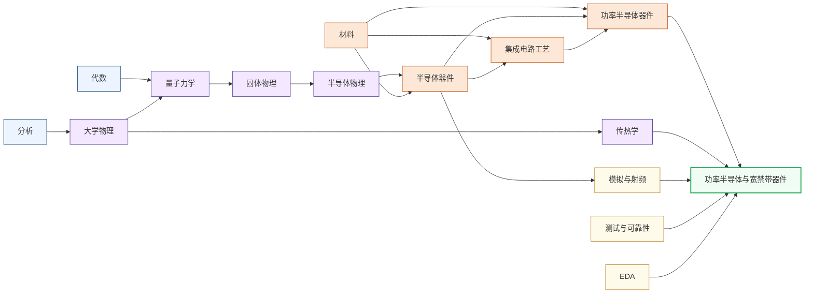

---
hide:
  - navigation
---
研究能承受高压大电流的“电力开关”芯片，以碳化硅（SiC）和氮化镓（GaN）为代表的宽禁带材料器件是新能源革命的核心硬件。

<svg viewBox="0 0 1140 532" xmlns="http://www.w3.org/2000/svg" style="width:100%;max-width:1140px;display:block;margin:1.5rem auto;font-family:system-ui,-apple-system,sans-serif;">
  <rect width="1140" height="532" rx="10" fill="#FFFFFF" stroke="#CBD5E1" stroke-width="1.5"/>
  <text x="570" y="26" text-anchor="middle" font-size="17" font-weight="bold" fill="#1E293B">集成电路科研方向全景图</text>
  <text x="250" y="54" text-anchor="middle" font-size="13.5" font-weight="bold" fill="#0E7490">← 计算媒介更奇异</text>
  <text x="1000" y="54" text-anchor="middle" font-size="13.5" font-weight="bold" fill="#16A34A">更贴近物理世界 →</text>
  <defs><filter id="loc-b" x="-5%" y="-5%" width="110%" height="110%"><feGaussianBlur stdDeviation="1.4"/></filter></defs>
  <rect x="88" y="88" width="147" height="298" rx="6" fill="#ECFEFF"/>
  <rect x="239" y="88" width="147" height="298" rx="6" fill="#F8FAFC"/>
  <rect x="390" y="88" width="147" height="298" rx="6" fill="#FEF2F2"/>
  <rect x="541" y="88" width="289" height="298" rx="6" fill="#EFF6FF"/>
  <rect x="834" y="88" width="76" height="298" rx="6" fill="#FFFBEB"/>
  <rect x="914" y="88" width="218" height="298" rx="6" fill="#F0FDF4"/>
  <text x="161" y="82" text-anchor="middle" font-size="12" font-weight="bold" fill="#0E7490">量子 · 光子</text>
  <text x="312" y="82" text-anchor="middle" font-size="12" font-weight="bold" fill="#64748B">存算 · 类脑</text>
  <text x="463" y="82" text-anchor="middle" font-size="12" font-weight="bold" fill="#DC2626">模拟 · 射频</text>
  <text x="685" y="82" text-anchor="middle" font-size="13" font-weight="bold" fill="#1D4ED8">数字计算</text>
  <text x="872" y="82" text-anchor="middle" font-size="12" font-weight="bold" fill="#D97706">功率电子</text>
  <text x="1023" y="82" text-anchor="middle" font-size="12" font-weight="bold" fill="#16A34A">传感 · 生物 · 机械</text>
  <line x1="86" y1="92" x2="1132" y2="92" stroke="#E2E8F0" stroke-width="1"/>
  <line x1="86" y1="150" x2="1132" y2="150" stroke="#EEF2F6" stroke-width="1"/>
  <line x1="86" y1="208" x2="1132" y2="208" stroke="#EEF2F6" stroke-width="1"/>
  <line x1="86" y1="266" x2="1132" y2="266" stroke="#EEF2F6" stroke-width="1"/>
  <line x1="86" y1="324" x2="1132" y2="324" stroke="#EEF2F6" stroke-width="1"/>
  <line x1="86" y1="382" x2="1132" y2="382" stroke="#E2E8F0" stroke-width="1"/>
  <line x1="86" y1="92" x2="86" y2="382" stroke="#CBD5E1" stroke-width="1"/>
  <text x="81" y="124" text-anchor="end" font-size="10.5" fill="#475569">算法 / 应用</text>
  <text x="81" y="182" text-anchor="end" font-size="10.5" fill="#475569">系统 / 软件</text>
  <text x="81" y="240" text-anchor="end" font-size="10.5" fill="#475569">体系结构</text>
  <text x="81" y="298" text-anchor="end" font-size="10.5" fill="#475569">电路</text>
  <text x="81" y="356" text-anchor="end" font-size="10.5" fill="#475569">器件</text>
  <g filter="url(#loc-b)" opacity="0.42">
  <rect x="92" y="92" width="68" height="290" rx="5" fill="#CFFAFE" stroke="#0E7490" stroke-width="1.2"/>
  <text x="126" y="231" text-anchor="middle" font-size="10.5" font-weight="bold" fill="#0E7490">量子计算</text>
  <text x="126" y="246" text-anchor="middle" font-size="10.5" font-weight="bold" fill="#0E7490">与量子芯片</text>
  <rect x="163" y="92" width="68" height="290" rx="5" fill="#CFFAFE" stroke="#0E7490" stroke-width="1.2"/>
  <text x="197" y="231" text-anchor="middle" font-size="10.5" font-weight="bold" fill="#0E7490">光电子</text>
  <text x="197" y="246" text-anchor="middle" font-size="10.5" font-weight="bold" fill="#0E7490">与硅光集成</text>
  <rect x="394" y="266" width="68" height="116" rx="5" fill="#FEE2E2" stroke="#DC2626" stroke-width="1.2"/>
  <text x="428" y="317" text-anchor="middle" font-size="10.5" font-weight="bold" fill="#DC2626">模拟与</text>
  <text x="428" y="332" text-anchor="middle" font-size="10.5" font-weight="bold" fill="#DC2626">混合信号IC</text>
  <rect x="465" y="266" width="68" height="116" rx="5" fill="#FEE2E2" stroke="#DC2626" stroke-width="1.2"/>
  <text x="499" y="317" text-anchor="middle" font-size="10.5" font-weight="bold" fill="#DC2626">射频与</text>
  <text x="499" y="332" text-anchor="middle" font-size="10.5" font-weight="bold" fill="#DC2626">毫米波IC</text>
  <rect x="243" y="92" width="68" height="290" rx="5" fill="#FEE2E2" stroke="#DC2626" stroke-width="1.2"/>
  <text x="277" y="239" text-anchor="middle" font-size="11.5" font-weight="bold" fill="#DC2626">类脑芯片</text>
  <rect x="314" y="92" width="68" height="290" rx="5" fill="#EDE9FE" stroke="#7C3AED" stroke-width="1.2"/>
  <text x="348" y="231" text-anchor="middle" font-size="10.5" font-weight="bold" fill="#7C3AED">存算一体</text>
  <text x="348" y="246" text-anchor="middle" font-size="10.5" font-weight="bold" fill="#7C3AED">与近存计算</text>
  <rect x="545" y="92" width="68" height="290" rx="5" fill="#EDE9FE" stroke="#7C3AED" stroke-width="1.2"/>
  <text x="579" y="231" text-anchor="middle" font-size="10.5" font-weight="bold" fill="#7C3AED">硬件安全</text>
  <text x="579" y="246" text-anchor="middle" font-size="10.5" font-weight="bold" fill="#7C3AED">与可信计算</text>
  <rect x="616" y="92" width="68" height="174" rx="5" fill="#DBEAFE" stroke="#1D4ED8" stroke-width="1.2"/>
  <text x="650" y="172" text-anchor="middle" font-size="10.5" font-weight="bold" fill="#1D4ED8">AI 算法</text>
  <text x="650" y="187" text-anchor="middle" font-size="10.5" font-weight="bold" fill="#1D4ED8">与系统</text>
  <rect x="687" y="150" width="68" height="116" rx="5" fill="#DBEAFE" stroke="#1D4ED8" stroke-width="1.2"/>
  <text x="721" y="201" text-anchor="middle" font-size="10.5" font-weight="bold" fill="#1D4ED8">处理器架构</text>
  <text x="721" y="216" text-anchor="middle" font-size="10.5" font-weight="bold" fill="#1D4ED8">与编译系统</text>
  <rect x="758" y="208" width="68" height="116" rx="5" fill="#DBEAFE" stroke="#1D4ED8" stroke-width="1.2"/>
  <text x="792" y="259" text-anchor="middle" font-size="10.5" font-weight="bold" fill="#1D4ED8">可重构计算</text>
  <text x="792" y="274" text-anchor="middle" font-size="10.5" font-weight="bold" fill="#1D4ED8">与 FPGA</text>
  <rect x="838" y="266" width="68" height="116" rx="5" fill="#FEF3C7" stroke="#D97706" stroke-width="1.2"/>
  <text x="872" y="317" text-anchor="middle" font-size="10.5" font-weight="bold" fill="#B45309">功率半导体</text>
  <text x="872" y="332" text-anchor="middle" font-size="10" font-weight="bold" fill="#B45309">与宽禁带器件</text>
  <rect x="918" y="92" width="68" height="290" rx="5" fill="#ECFCCB" stroke="#65A30D" stroke-width="1.2"/>
  <text x="952" y="239" text-anchor="middle" font-size="11.5" font-weight="bold" fill="#4D7C0F">具身智能</text>
  <rect x="989" y="266" width="68" height="116" rx="5" fill="#D1FAE5" stroke="#059669" stroke-width="1.2"/>
  <text x="1023" y="317" text-anchor="middle" font-size="10.5" font-weight="bold" fill="#047857">生物电子</text>
  <text x="1023" y="332" text-anchor="middle" font-size="10.5" font-weight="bold" fill="#047857">与脑机接口</text>
  <rect x="1060" y="266" width="68" height="116" rx="5" fill="#DCFCE7" stroke="#16A34A" stroke-width="1.2"/>
  <text x="1094" y="317" text-anchor="middle" font-size="10.5" font-weight="bold" fill="#15803D">MEMS 与</text>
  <text x="1094" y="332" text-anchor="middle" font-size="10.5" font-weight="bold" fill="#15803D">微纳传感器</text>
  </g>
  <text x="81" y="450" text-anchor="end" font-size="10.5" fill="#475569">各方向通用</text>
  <g filter="url(#loc-b)" opacity="0.42">
  <rect x="92" y="408" width="1040" height="28" rx="5" fill="#F1F5F9" stroke="#64748B" stroke-width="1.1"/>
  <text x="612" y="426" text-anchor="middle" font-size="12" font-weight="bold" fill="#475569">EDA 与设计自动化</text>
  <rect x="92" y="440" width="1040" height="28" rx="5" fill="#EEF2F6" stroke="#64748B" stroke-width="1.1"/>
  <text x="612" y="458" text-anchor="middle" font-size="12" font-weight="bold" fill="#475569">先进封装与系统集成</text>
  <rect x="92" y="472" width="1040" height="30" rx="5" fill="#E2E8F0" stroke="#475569" stroke-width="1.2"/>
  <text x="612" y="491" text-anchor="middle" font-size="12" font-weight="bold" fill="#334155">半导体器件与先进工艺</text>
  </g>
  <rect x="92" y="512" width="13" height="13" rx="2" fill="#DBEAFE" stroke="#1D4ED8" stroke-width="1.1"/>
  <text x="110" y="522" text-anchor="start" font-size="10.5" fill="#475569">数字</text>
  <rect x="160" y="512" width="13" height="13" rx="2" fill="#FEE2E2" stroke="#DC2626" stroke-width="1.1"/>
  <text x="178" y="522" text-anchor="start" font-size="10.5" fill="#475569">模拟</text>
  <rect x="228" y="512" width="13" height="13" rx="2" fill="#EDE9FE" stroke="#7C3AED" stroke-width="1.1"/>
  <text x="246" y="522" text-anchor="start" font-size="10.5" fill="#475569">数字 / 模拟 交叉</text>
  <rect x="822" y="269" width="104" height="116" rx="9" fill="#1E293B" opacity="0.16"/>
  <rect x="820" y="266" width="104" height="116" rx="9" fill="#FEF3C7" stroke="#D97706" stroke-width="2.6"/>
  <text x="872" y="317" text-anchor="middle" font-size="13" font-weight="bold" fill="#B45309">功率半导体</text>
  <text x="872" y="332" text-anchor="middle" font-size="12.5" font-weight="bold" fill="#B45309">与宽禁带器件</text>
</svg>

## 这个方向在研究什么

智能手机的氮化镓（Gallium Nitride, GaN）快充头，和如今新能源汽车的越来越长的续航，背后是同一样东西在起作用：功率半导体。它是电力世界里的开关，在导通和关断之间高速切换，把电压、电流、频率变成下游需要的样子。太阳能板的直流要变交流才能并网，电池的高压直流要变频交流才能驱动电机，市电要降压整流才能给手机充电，每一次变换都靠它，也都伴着损耗。对动辄几百上千瓦的系统，效率每提高一个百分点，省下的就是数以亿计度电。所以这个方向的核心问题其实很朴素。<u>怎么让这个开关开得更快、扛得住更高的电压和电流、还尽量少发热？</u>

材料上首先要排除硅。硅能当几十年的主角，靠的是便宜、好加工，可一旦既要扛住几百上千伏、又要把开关频率提上去，它就力不从心了。根子在一个叫**禁带宽度**（bandgap）的材料参数上。禁带是电子从不导电跳到导电要跨过的一道能量台阶，硅这道台阶只有 1.1 电子伏特，偏矮。<u>台阶矮，材料耐高压的能力就弱。</u>硅要扛高压不是做不到，但要么把承压的那层做得很厚，要么改用开关更慢的 IGBT（Insulated-Gate Bipolar Transistor，绝缘栅双极型晶体管），不管哪样，导通和开关的损耗都压不下来，频率也提不上去。温度一高，它还容易漏电。

<svg viewBox="0 0 860 300" xmlns="http://www.w3.org/2000/svg" style="width:100%;max-width:860px;display:block;margin:1.5em auto;font-family:system-ui,-apple-system,sans-serif">
  <text x="430" y="24" text-anchor="middle" font-size="18" font-weight="700" fill="#1E293B">禁带越宽，越能耐高压、耐高温、低损耗（禁带宽度 / eV）</text>
  <line x1="50" y1="240" x2="810" y2="240" stroke="#CBD5E1" stroke-width="1.2"/>
  <!-- Si -->
  <rect x="82" y="206" width="56" height="34" rx="3" fill="#DBEAFE" stroke="#93C5FD" stroke-width="1.5"/>
  <text x="110" y="199" text-anchor="middle" font-size="14" font-weight="700" fill="#1E40AF">1.1</text>
  <text x="110" y="258" text-anchor="middle" font-size="13" font-weight="600" fill="#334155">硅 Si</text>
  <text x="110" y="274" text-anchor="middle" font-size="11" fill="#64748B">工频/工业 · 可达 6.5kV</text>
  <!-- SiC -->
  <rect x="234" y="138" width="56" height="102" rx="3" fill="#93C5FD" stroke="#3B82F6" stroke-width="1.5"/>
  <text x="262" y="131" text-anchor="middle" font-size="14" font-weight="700" fill="#1E40AF">3.3</text>
  <text x="262" y="258" text-anchor="middle" font-size="13" font-weight="600" fill="#334155">碳化硅 SiC</text>
  <text x="262" y="274" text-anchor="middle" font-size="11" fill="#64748B">电动车逆变器</text>
  <!-- GaN -->
  <rect x="386" y="135" width="56" height="105" rx="3" fill="#60A5FA" stroke="#2563EB" stroke-width="1.5"/>
  <text x="414" y="128" text-anchor="middle" font-size="14" font-weight="700" fill="#1E40AF">3.4</text>
  <text x="414" y="258" text-anchor="middle" font-size="13" font-weight="600" fill="#334155">氮化镓 GaN</text>
  <text x="414" y="274" text-anchor="middle" font-size="11" fill="#64748B">快充 · 中低压高频</text>
  <!-- Ga2O3 -->
  <rect x="538" y="91" width="56" height="149" rx="3" fill="#3B82F6" stroke="#1D4ED8" stroke-width="1.5"/>
  <text x="566" y="84" text-anchor="middle" font-size="14" font-weight="700" fill="#1E40AF">4.8</text>
  <text x="566" y="258" text-anchor="middle" font-size="13" font-weight="600" fill="#334155">氧化镓 Ga₂O₃</text>
  <text x="566" y="274" text-anchor="middle" font-size="11" fill="#64748B">超宽禁带 · 可熔体长晶</text>
  <!-- 金刚石 -->
  <rect x="690" y="70" width="56" height="170" rx="3" fill="#1E40AF" stroke="#1E3A8A" stroke-width="1.5"/>
  <text x="718" y="63" text-anchor="middle" font-size="14" font-weight="700" fill="#1E40AF">5.5</text>
  <text x="718" y="258" text-anchor="middle" font-size="13" font-weight="600" fill="#334155">金刚石 C</text>
  <text x="718" y="274" text-anchor="middle" font-size="11" fill="#64748B">超宽禁带 · 导热最强</text>
  <!-- 分组 -->
  <text x="110" y="291" text-anchor="middle" font-size="11" fill="#94A3B8">硅基</text>
  <text x="338" y="291" text-anchor="middle" font-size="11" fill="#94A3B8">宽禁带（第三代）</text>
  <text x="642" y="291" text-anchor="middle" font-size="11" fill="#94A3B8">超宽禁带（前沿）</text>
</svg>

出路是把这道台阶垫高，换一种禁带更宽的材料。**碳化硅**（Silicon Carbide, SiC）和**氮化镓**的禁带都在 3.3 电子伏特上下，差不多是硅的三倍。台阶高了，扛同样的高压只需薄薄一层材料，导通省电、开关又快，还耐得住两百度高温。拿电动车主驱那级别的高压开关来说，硅得靠又厚又慢的 IGBT，碳化硅却能换上又快又省的 MOSFET（Metal-Oxide-Semiconductor Field-Effect Transistor，金属-氧化物-半导体场效应晶体管）。这就是它们被合称为**宽禁带半导体**（Wide-Bandgap Semiconductor, WBG）、又被寄予厚望的来由。

这两种材料很快各自找到了主场。电动车的主驱逆变器认准了碳化硅，它要把电池几百伏的直流变成驱动电机的交流，用老的硅方案效率约 95%，换上碳化硅能提到 97% 到 98%。别小看这两三个百分点，落到续航上就是几十公里，落到车上就是更小的散热器和更轻的车身，特斯拉 Model 3 率先大规模用了它，比亚迪、蔚来跟着上。氮化镓走的是另一条路，它在更高频率、较低电压下的性能更好。我们用的 65 瓦快充能比老充电器小一半，靠的就是氮化镓能在高得多的开关频率下工作，频率一高，里面储能的电感电容跟着缩小，整个充电器就袖珍了。

可家家有本难念的经。新材料性能虽好，却比硅难伺候得多。碳化硅难的是把晶体长出来。它的单晶比硅难长太多，长晶里留下的位错和微管缺陷会直接吃掉一整片晶圆能用的器件数量，怎么把缺陷压下去、还压得便宜，是老生常谈的难题了。氮化镓也有自己的麻烦。快充和射频里的氮化镓是横向器件，电流贴着表面那薄薄一层走，耐压做到六百多伏就开始吃力，所以它只能守在中低压的高频场。想让氮化镓也进电动车那种几百上千伏、几百安的场合，就得把器件竖过来，让电流在材料里纵向穿过、靠厚度扛电压，高电场被推进体内，背面还能直接当散热的出口。但困难在于衬底，又大又便宜、缺陷又少的体氮化镓晶圆至今难得。

<svg viewBox="0 0 860 320" xmlns="http://www.w3.org/2000/svg" style="width:100%;max-width:860px;display:block;margin:1.5em auto;font-family:system-ui,-apple-system,sans-serif">
  <defs>
    <marker id="gan-cur" markerWidth="9" markerHeight="9" refX="6.5" refY="3" orient="auto"><path d="M0,0 L0,6 L8,3 z" fill="#DC2626"/></marker>
  </defs>
  <text x="230" y="30" text-anchor="middle" font-size="15" font-weight="700" fill="#1E293B">横向 GaN（HEMT）</text>
  <text x="630" y="30" text-anchor="middle" font-size="15" font-weight="700" fill="#1E293B">垂直 GaN</text>
  <line x1="430" y1="48" x2="430" y2="262" stroke="#E2E8F0" stroke-width="1" stroke-dasharray="4 4"/>
  <!-- 左：横向 -->
  <rect x="110" y="116" width="46" height="24" rx="2" fill="#64748B"/>
  <text x="133" y="133" text-anchor="middle" font-size="12" font-weight="700" fill="#FFFFFF">S</text>
  <rect x="212" y="116" width="46" height="24" rx="2" fill="#1E293B"/>
  <text x="235" y="133" text-anchor="middle" font-size="12" font-weight="700" fill="#FFFFFF">G</text>
  <rect x="314" y="116" width="46" height="24" rx="2" fill="#64748B"/>
  <text x="337" y="133" text-anchor="middle" font-size="12" font-weight="700" fill="#FFFFFF">D</text>
  <rect x="70" y="140" width="320" height="66" fill="#DCFCE7" stroke="#16A34A" stroke-width="1.5"/>
  <text x="86" y="176" font-size="12" fill="#15803D">GaN</text>
  <line x1="158" y1="152" x2="312" y2="152" stroke="#DC2626" stroke-width="2" marker-end="url(#gan-cur)"/>
  <text x="240" y="172" text-anchor="middle" font-size="11" fill="#B91C1C">电流沿 2DEG 横向流</text>
  <rect x="70" y="206" width="320" height="38" fill="#E2E8F0" stroke="#94A3B8" stroke-width="1.5"/>
  <text x="230" y="230" text-anchor="middle" font-size="12" fill="#475569">Si / SiC 衬底</text>
  <text x="230" y="270" text-anchor="middle" font-size="12" fill="#475569">耐压靠拉开 S–D 间距，商用 ~650V</text>
  <text x="230" y="288" text-anchor="middle" font-size="11" fill="#94A3B8">主场：快充 · 数据中心电源</text>
  <!-- 右：垂直 -->
  <rect x="556" y="100" width="70" height="22" rx="2" fill="#64748B"/>
  <text x="591" y="116" text-anchor="middle" font-size="12" font-weight="700" fill="#FFFFFF">S</text>
  <rect x="632" y="100" width="46" height="22" rx="2" fill="#1E293B"/>
  <text x="655" y="116" text-anchor="middle" font-size="12" font-weight="700" fill="#FFFFFF">G</text>
  <rect x="470" y="122" width="320" height="92" fill="#DCFCE7" stroke="#16A34A" stroke-width="1.5"/>
  <text x="612" y="162" text-anchor="middle" font-size="12" fill="#15803D">GaN 漂移层</text>
  <text x="612" y="178" text-anchor="middle" font-size="11" fill="#15803D">（耐压靠厚度）</text>
  <rect x="470" y="214" width="320" height="30" fill="#BBF7D0" stroke="#16A34A" stroke-width="1.5"/>
  <text x="630" y="234" text-anchor="middle" font-size="12" fill="#15803D">体 GaN 衬底</text>
  <rect x="470" y="244" width="320" height="16" fill="#475569"/>
  <text x="630" y="256" text-anchor="middle" font-size="10.5" fill="#FFFFFF">漏极 Drain（背面，兼散热）</text>
  <line x1="712" y1="124" x2="712" y2="242" stroke="#DC2626" stroke-width="2" marker-end="url(#gan-cur)"/>
  <text x="744" y="186" text-anchor="middle" font-size="11" fill="#B91C1C">纵向</text>
  <text x="630" y="280" text-anchor="middle" font-size="12" fill="#475569">耐压靠漂移层厚度，目标 &gt;1.2kV</text>
  <text x="630" y="298" text-anchor="middle" font-size="11" fill="#94A3B8">卡点：缺又大又便宜的体 GaN 衬底</text>
</svg>

尽管新材料在工业上有诸多难题，学界还是不遗余力地在探索更新的材料。既然把禁带垫高这么管用，能不能再宽一点？沿着这个思路走，就是氧化镓（Ga₂O₃）和金刚石这类**超宽禁带**（Ultra-Wide-Bandgap, UWBG）材料，禁带宽到 4.8 甚至 5.5 电子伏特，扛电压的本事比碳化硅、氮化镓还要高一截。氧化镓尤其诱人，因为它能像拉硅锭那样从熔体里直接长出大块单晶，成本和尺寸上比靠高温高压才长得出来的碳化硅、氮化镓都占便宜。可它的软肋也更极端，几乎不导热，热量全憋在器件里出不来，而且至今做不出像样的 p 型。
说到底，电动车、充电桩、电网的工况比实验室苛刻得多：器件要在高压、高温、大电流和高速开关下连着跑十年不出故障，还得过车规、扛辐射。材料、器件、电路、封装各有失效机制，可靠性测试覆盖整个链条，是独立的研究课题。

把这些材料按各自的本事铺开，就能看清它们各占哪块地盘。硅占着低频这一大片，从消费电子到电网、轨交的工频高压，用的多半还是它。碳化硅抢的是电动车主驱、充电桩、新能源并网这类既扛高压又讲效率的活，氮化镓凭高频拿下快充、数据中心电源和车载充电机。再往更高压、更前沿走，是还在攻关的垂直氮化镓和超宽禁带的氧化镓。

<svg viewBox="0 0 860 400" xmlns="http://www.w3.org/2000/svg" style="width:100%;max-width:860px;display:block;margin:1.5em auto;font-family:system-ui,-apple-system,sans-serif">
  <defs>
    <marker id="pw-ax" markerWidth="9" markerHeight="9" refX="4" refY="3" orient="auto"><path d="M0,0 L8,3 L0,6 z" fill="#64748B"/></marker>
  </defs>
  <!-- 轴 -->
  <line x1="70" y1="360" x2="70" y2="48" stroke="#64748B" stroke-width="1.4" marker-end="url(#pw-ax)"/>
  <line x1="70" y1="360" x2="815" y2="360" stroke="#64748B" stroke-width="1.4" marker-end="url(#pw-ax)"/>
  <text x="78" y="44" font-size="12" fill="#475569">耐压 · 功率 高</text>
  <text x="812" y="380" text-anchor="end" font-size="12" fill="#475569">开关频率 高 →</text>
  <!-- Si -->
  <rect x="100" y="272" width="142" height="74" rx="6" fill="#DBEAFE" stroke="#93C5FD" stroke-width="1.5"/>
  <text x="171" y="298" text-anchor="middle" font-size="14" font-weight="700" fill="#1E40AF">硅 Si</text>
  <text x="171" y="316" text-anchor="middle" font-size="11" fill="#475569">消费电子 · 工频</text>
  <text x="171" y="332" text-anchor="middle" font-size="11" fill="#94A3B8">低频 · 可到电网高压</text>
  <!-- SiC -->
  <rect x="100" y="92" width="186" height="110" rx="6" fill="#93C5FD" stroke="#2563EB" stroke-width="1.5"/>
  <text x="193" y="124" text-anchor="middle" font-size="14" font-weight="700" fill="#1E3A8A">碳化硅 SiC</text>
  <text x="193" y="144" text-anchor="middle" font-size="11" fill="#1E3A8A">电动车主驱 · 充电桩 · 电网</text>
  <text x="193" y="162" text-anchor="middle" font-size="11" fill="#1E40AF">≥1200V · 中频 · 大功率</text>
  <!-- 横向GaN -->
  <rect x="558" y="268" width="235" height="78" rx="6" fill="#BFDBFE" stroke="#3B82F6" stroke-width="1.5"/>
  <text x="675" y="294" text-anchor="middle" font-size="14" font-weight="700" fill="#1E40AF">横向 GaN</text>
  <text x="675" y="312" text-anchor="middle" font-size="11" fill="#475569">快充 · 数据中心 · 车载 OBC</text>
  <text x="675" y="328" text-anchor="middle" font-size="11" fill="#94A3B8">80–650V · 高频</text>
  <!-- 垂直GaN -->
  <rect x="330" y="186" width="200" height="70" rx="6" fill="#FFFFFF" stroke="#2563EB" stroke-width="1.5" stroke-dasharray="5 4"/>
  <text x="430" y="216" text-anchor="middle" font-size="13" font-weight="700" fill="#1E40AF">垂直 GaN（研发）</text>
  <text x="430" y="235" text-anchor="middle" font-size="11" fill="#475569">突破 650V，目标 &gt;1.2kV</text>
  <!-- Ga2O3 -->
  <rect x="330" y="88" width="200" height="70" rx="6" fill="#FFFFFF" stroke="#1D4ED8" stroke-width="1.5" stroke-dasharray="5 4"/>
  <text x="430" y="118" text-anchor="middle" font-size="13" font-weight="700" fill="#1E3A8A">氧化镓 Ga₂O₃（前沿）</text>
  <text x="430" y="137" text-anchor="middle" font-size="11" fill="#475569">超高压潜力 · 散热待解</text>
</svg>

### 核心研究问题

- **SiC 器件结构、工艺与可靠性**：衬底生长里的位错微管直接卡住整片晶圆的良率，沟槽 MOSFET、超级结这些新结构还要在高压大电流下抗辐射、扛车规、长年不退化。
- **GaN HEMT 的电流崩塌与散热**：缓冲层陷阱会让 GaN HEMT（High-Electron-Mobility Transistor，高电子迁移率晶体管）在高压开关时电流远低于直流值，陷阱来源与外延抑制至今各执一词，再加上 GaN 自加热严重，得靠 GaN-on-SiC 甚至 GaN-on-diamond 抽热。
- **垂直 GaN 器件**：横向 GaN 耐压受表面限制，做到六百多伏就吃力；垂直结构靠厚度扛高压、背面散热，却卡在缺少又大又便宜的体 GaN 衬底。
- **超宽禁带材料与外延**：Ga₂O₃、金刚石、AlN 把禁带推到 4.8 eV 以上换更高耐压，可氮化物外延的缺陷、Ga₂O₃ 几乎不导热又做不出 p 型，材料这关决定器件能不能落地。
- **功率 IC 与电路-器件协同**：宽禁带器件开关快到纳秒级，几纳亨寄生电感就能激起上百伏过电压，门极驱动、保护与开关贴着器件特性单片集成成功率 IC，性能才能兑现。

### 知识路径

物理线（分析→大学物理→量子力学→固体→半导体）决定器件性能上限，材料和工艺线决定 SiC/GaN 能否制造，传热和可靠性决定系统能用多大功率，模拟与射频里的功率电子是器件的应用出口。节点对应[学习地图](../学习地图/index.md)里的目录：

- 数学：[分析](../学习地图/数学/分析/index.md)（微积分） · [代数](../学习地图/数学/代数/index.md)（线性代数，量子力学的语言）
- 物理：[大学物理](../学习地图/物理/大学物理/index.md) · [量子力学](../学习地图/物理/量子力学/index.md) · [固体物理](../学习地图/物理/固体物理/index.md) · [半导体物理](../学习地图/物理/半导体物理/index.md) · [传热学](../学习地图/物理/传热学/index.md)
- 器件与工艺：[半导体器件](../学习地图/器件与工艺/半导体器件/index.md) · [材料](../学习地图/器件与工艺/材料/index.md) · [集成电路工艺](../学习地图/器件与工艺/集成电路工艺/index.md) · [功率半导体器件](../学习地图/器件与工艺/功率半导体器件/index.md)（待建）
- 电路：[模拟与射频](../学习地图/电路/模拟与射频/index.md)（功率电子、栅驱动） · [测试与可靠性](../学习地图/电路/测试与可靠性/index.md)（高压器件的可靠性测试） · [EDA](../学习地图/电路/EDA/index.md)（TCAD 仿真）

## 这个方向适合谁

适合喜欢跟实际的材料与电学打交道的人。课程上学固体物理、半导体物理和模拟电路，看到 I-V 曲线异常就想深入查是哪层物理出了问题，这种人很合适。这里也是两拨人，做器件的在 TCAD（Technology Computer-Aided Design）仿真和高压测试台之间来回，做电路的围绕门极驱动和纳秒级开关来设计功率 IC。节奏偏慢，一颗器件从设计到敢说可靠常以季度甚至年计，而且高压大电流的实验是真有危险，胆大心细缺一不可。

## 学术界

### 课题组

**境内**

-   **[王敬](https://www.ime.tsinghua.edu.cn/info/1013/1796.htm)** 清华

    宽禁带功率射频器件 | 高压HEMT设计 | 宽禁带材料外延

-   **[岳瑞峰](https://www.ime.tsinghua.edu.cn/info/1013/1776.htm)** 清华

    SiC/Si功率器件 | 功率模块封装 | 器件数值建模

-   **[刘效森](https://www.sic.tsinghua.edu.cn/en/info/1072/1426.htm)** 清华

    GaN 功率开关器件 | 集成开关电容稳压器 | 高压整流与电源分发

-   **[王彦](https://www.sic.tsinghua.edu.cn/en/info/1094/1421.htm)** 清华 

    SiC/GaN 器件建模 | 电路-器件协同仿真 EDA | 微波功率模块设计

-   **[黄伟](https://sme.fudan.edu.cn/5e/f3/c31168a351987/page.htm)** 复旦

    GaN 功率器件与驱动电路 | 射频与电力电子 IC | 新能源功率集成

-   **[方志来](https://sme.fudan.edu.cn/60/af/c31153a352495/page.htm)** 复旦

    氧化镓超宽禁带功率器件 | Ga₂O₃ 器件设计与制备 | 深紫外光电探测

-   **[张清纯](http://sicpower.fudan.edu.cn/27778/list.htm)** 复旦

    SiC MOSFET 设计与工艺 | 碳化硅芯片产业化 | 高压功率器件测试

-   **[朱颢](https://icmne.fudan.edu.cn/2d/63/c48925a732515/page.htm)** 复旦

    宽禁带功率器件设计 | p-GaN HEMT 与沟槽栅结构 | 低功耗半导体器件

-   **[樊嘉杰](https://sicpower.fudan.edu.cn/27780/list.htm)** 复旦

    SiC 功率模块封装可靠性 | 多物理场仿真与数字孪生 | 电力电子热管理

-   **[刘文军](https://icmne.fudan.edu.cn/2d/2c/c48925a732460/page.htm)** 复旦

    超宽禁带功率器件 | 氧化物半导体工艺

-   **[陈映平](https://icmne.fudan.edu.cn/2c/a9/c48925a732329/page.htm)** 复旦

    宽禁带功率转换器 | 模拟电源管理 IC

-   **[魏进](https://ic.pku.edu.cn/szdw/zzjs/jcwndzx1/wj/index.htm)** 北大

    增强型 GaN 功率器件 | GaN p 沟道与 CMOS 集成 | 动态阈值行为分析

-   **[沈波](https://faculty.pku.edu.cn/shenbo/zh_CN/index.htm)** 北大

    氮化物异质外延生长 | 缺陷物理与工程 | 深紫外与电子器件

-   **[王茂俊](https://ic.pku.edu.cn/szdw/zzjs/jcwndzx1/wmj/index.htm)** 北大

    GaN 射频微波器件 | 功率开关器件工艺 | 器件物理与制造

-   **[杨树](https://faculty.ustc.edu.cn/yangshu/zh_CN/index.htm)** 中科大 

    垂直 GaN 功率器件 | 器件可靠性与新结构 | 无电流崩塌设计

-   **[孙海定](https://faculty.ustc.edu.cn/sunhaiding/zh_CN/index.htm)** 中科大

    GaN 外延材料生长 | 高电子迁移率晶体管 | 宽禁带光电器件

-   **[龙世兵](https://sme.ustc.edu.cn/2022/0601/c30996a556910/page.htm)** 中科大

    超宽禁带氧化镓器件 | 功率整流与开关器件 | 微纳加工与探测器

-   **[刘新宇](https://people.ucas.ac.cn/~0001716)** 中科院

    GaN/AlGaN 功率与射频器件 | 微波毫米波集成电路 | 射频功率芯片

-   **[陆海](https://ese.nju.edu.cn/lh/list.htm)** 南大

    GaN 高功率电子器件 | 宽禁带功率集成电路 | 紫外与辐射探测器

-   **[修向前](https://ese.nju.edu.cn/xxq/list.htm)** 南大

    GaN 衬底材料生长 | 超宽禁带半导体器件 | HVPE 外延装备研发

-   **[盛况](https://hic.zju.edu.cn/2021/0407/c57258a2276651/page.htm)** 浙大

    SiC 功率芯片与高压模块 | 超级结 SiC 二极管 | 全 SiC 电力电子变压器

-   **[任娜](https://hic.zju.edu.cn/2024/0919/c85891a3017887/page.htm)** 浙大 

    SiC MOSFET 结构与工艺 | 器件失效分析与可靠性 | 抗辐射功率器件加固

-   **[张进成](https://web.xidian.edu.cn/jchzhang/)** 西电

    Ga₂O₃/AlN 超宽禁带器件 | GaN 功率与微波器件 | 大功率射频芯片

-   **[郑雪峰](https://web.xidian.edu.cn/xfzheng/)** 西电

    GaN 器件可靠性与缺陷表征 | 宽禁带器件抗辐射加固 | 新型宽禁带器件结构

-   **[郝跃](https://faculty.xidian.edu.cn/HY2/zh_CN/index.htm)** 西电

    宽禁带半导体器件 | GaN/SiC 微波毫米波器件 | 器件失效与可靠性

-   **[张波](https://faculty.uestc.edu.cn/zhangbo2/zh_CN/index.htm)** 电子科大

    功率半导体器件 | 功率集成技术 | 宽禁带功率器件

<button class="prof-show-all">显示全部 ↓</button>

**境外**

-   **[Yuhao Zhang（张宇昊）](https://ece.hku.hk/people/y-zhang/)** 港大

    宽禁带/超宽禁带功率器件 | 异构集成功率模块 | 高压高温电子系统

-   **[Johnny K.O. Sin（單建安）](https://ece.hkust.edu.hk/eesin)** 港科大

    GaN/Si 单片集成功率器件 | 高压级联功率开关 | 功率半导体与 IC 设计

-   **[Tomás Palacios](https://www.tpalacios.mit.edu/)** MIT

    高频高温 GaN 晶体管 | 二维材料晶体管（石墨烯、MoS₂）· GaN 模拟与能量收集电路

-   **[Srabanti Chowdhury](https://wbglab.stanford.edu/)** Stanford 

    垂直 GaN 功率晶体管 | 超宽禁带材料器件 | 功率器件热管理

-   **[T. Paul Chow（周達成）](https://ecse.rpi.edu/people/faculty/paul-chow)** RPI

    SiC 高压功率 MOSFET | 垂直 GaN 功率器件 | 宽禁带功率 IC

-   **[Umesh Mishra](http://my.ece.ucsb.edu/Mishra/)** UCSB

    N 极性 GaN HEMT 射频器件 | 毫米波高功率放大器 | 金刚石散热集成

<button class="prof-show-all">显示全部 ↓</button>

### 学术会议与期刊

  
会议
    IEDM
    ISPSD
    APEC
    ECCE
    EPE
  

  
期刊
    IEEE T-ED
    IEEE EDL
    IEEE T-Power Electronics
    IEEE T-Industrial Electronics
  

## 毕业去向

### 企业

  
国内
    <a href="https://www.powersemi.com">斯达半导</a>
    <a href="http://www.tec.crrczic.cc/">时代电气（中车）</a> 
    <a href="https://www.silan.com.cn">士兰微</a>
    <a href="https://www.crmicro.com">华润微</a>
    <a href="https://www.sanan-e.com">三安光电</a>
    <a href="https://www.innoscience.com">英诺赛科 Innoscience</a>
    <a href="https://www.byd.com">比亚迪半导体</a> 
    <a class="dm-chip" href="https://www.basicsemi.com">基本半导体 BASiC</a>
    <a class="dm-chip" href="http://www.dynax-semi.com">苏州能讯 Dynax</a>
  

  
国外
    <a href="https://www.infineon.com">英飞凌 Infineon</a>
    <a href="https://www.onsemi.com">安森美 onsemi</a>
    <a href="https://www.st.com">意法半导体 ST</a>
    <a href="https://www.wolfspeed.com">Wolfspeed</a>
    <a href="https://www.ti.com">Texas Instruments 德州仪器</a>
    <a href="https://www.navitassemi.com">Navitas</a>
    <a href="https://www.power.com">Power Integrations</a>
  

### 科研院所

  
国内
    <a class="dm-chip" href="https://nercwbs.xidian.edu.cn/">宽禁带半导体国家工程研究中心（西安电子科技大学）</a>
    <a class="dm-chip" href="https://semi.cas.cn">中科院半导体研究所</a>
    <a class="dm-chip" href="https://www.cetc13.cn">中国电科 13 所（产业基础研究院）</a>
    <a class="dm-chip" href="http://www.cetc55.com">中国电科 55 所</a>
  

  
国外
    <a class="dm-chip" href="https://www.iisb.fraunhofer.de/">Fraunhofer IISB</a>
    <a class="dm-chip" href="https://www.imec-int.com/en">imec</a>
    <a class="dm-chip" href="https://www.a-star.edu.sg/ime">A*STAR IME（新加坡微电子所）</a>
  

## 相关科普

  <a class="vc-card" href="https://www.youtube.com/watch?v=yHn_LvwQMcg" target="_blank" rel="noopener">
    
      
      YouTube
    
    
      Silicon Carbide: A Power Electronics Revolution
      Asianometry
    
  </a>

## 论文推荐

!!! note "待补充"
    欢迎推荐该方向的入门综述或经典论文，[参与建设 →](../参与建设.md)
