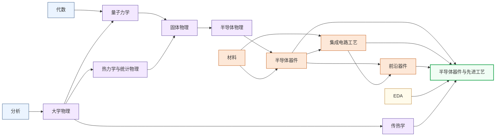

---
hide:
  - navigation
---
研究硅基半导体从材料到器件再到工艺的完整链条，涵盖 FinFET、GAA 等先进晶体管结构，RRAM、PCM、FeRAM 等新型非易失存储器件，以及 EUV 光刻等量产工艺的物理极限挑战。

<svg viewBox="0 0 1140 532" xmlns="http://www.w3.org/2000/svg" style="width:100%;max-width:1140px;display:block;margin:1.5rem auto;font-family:system-ui,-apple-system,sans-serif;">
  <rect width="1140" height="532" rx="10" fill="#FFFFFF" stroke="#CBD5E1" stroke-width="1.5"/>
  <text x="570" y="26" text-anchor="middle" font-size="17" font-weight="bold" fill="#1E293B">集成电路科研方向全景图</text>
  <text x="250" y="54" text-anchor="middle" font-size="13.5" font-weight="bold" fill="#0E7490">← 计算媒介更奇异</text>
  <text x="1000" y="54" text-anchor="middle" font-size="13.5" font-weight="bold" fill="#16A34A">更贴近物理世界 →</text>
  <defs><filter id="loc-b" x="-5%" y="-5%" width="110%" height="110%"><feGaussianBlur stdDeviation="1.4"/></filter></defs>
  <rect x="88" y="88" width="147" height="298" rx="6" fill="#ECFEFF"/>
  <rect x="239" y="88" width="147" height="298" rx="6" fill="#F8FAFC"/>
  <rect x="390" y="88" width="147" height="298" rx="6" fill="#FEF2F2"/>
  <rect x="541" y="88" width="289" height="298" rx="6" fill="#EFF6FF"/>
  <rect x="834" y="88" width="76" height="298" rx="6" fill="#FFFBEB"/>
  <rect x="914" y="88" width="218" height="298" rx="6" fill="#F0FDF4"/>
  <text x="161" y="82" text-anchor="middle" font-size="12" font-weight="bold" fill="#0E7490">量子 · 光子</text>
  <text x="312" y="82" text-anchor="middle" font-size="12" font-weight="bold" fill="#64748B">存算 · 类脑</text>
  <text x="463" y="82" text-anchor="middle" font-size="12" font-weight="bold" fill="#DC2626">模拟 · 射频</text>
  <text x="685" y="82" text-anchor="middle" font-size="13" font-weight="bold" fill="#1D4ED8">数字计算</text>
  <text x="872" y="82" text-anchor="middle" font-size="12" font-weight="bold" fill="#D97706">功率电子</text>
  <text x="1023" y="82" text-anchor="middle" font-size="12" font-weight="bold" fill="#16A34A">传感 · 生物 · 机械</text>
  <line x1="86" y1="92" x2="1132" y2="92" stroke="#E2E8F0" stroke-width="1"/>
  <line x1="86" y1="150" x2="1132" y2="150" stroke="#EEF2F6" stroke-width="1"/>
  <line x1="86" y1="208" x2="1132" y2="208" stroke="#EEF2F6" stroke-width="1"/>
  <line x1="86" y1="266" x2="1132" y2="266" stroke="#EEF2F6" stroke-width="1"/>
  <line x1="86" y1="324" x2="1132" y2="324" stroke="#EEF2F6" stroke-width="1"/>
  <line x1="86" y1="382" x2="1132" y2="382" stroke="#E2E8F0" stroke-width="1"/>
  <line x1="86" y1="92" x2="86" y2="382" stroke="#CBD5E1" stroke-width="1"/>
  <text x="81" y="124" text-anchor="end" font-size="10.5" fill="#475569">算法 / 应用</text>
  <text x="81" y="182" text-anchor="end" font-size="10.5" fill="#475569">系统 / 软件</text>
  <text x="81" y="240" text-anchor="end" font-size="10.5" fill="#475569">体系结构</text>
  <text x="81" y="298" text-anchor="end" font-size="10.5" fill="#475569">电路</text>
  <text x="81" y="356" text-anchor="end" font-size="10.5" fill="#475569">器件</text>
  <g filter="url(#loc-b)" opacity="0.42">
  <rect x="92" y="92" width="68" height="290" rx="5" fill="#CFFAFE" stroke="#0E7490" stroke-width="1.2"/>
  <text x="126" y="231" text-anchor="middle" font-size="10.5" font-weight="bold" fill="#0E7490">量子计算</text>
  <text x="126" y="246" text-anchor="middle" font-size="10.5" font-weight="bold" fill="#0E7490">与量子芯片</text>
  <rect x="163" y="92" width="68" height="290" rx="5" fill="#CFFAFE" stroke="#0E7490" stroke-width="1.2"/>
  <text x="197" y="231" text-anchor="middle" font-size="10.5" font-weight="bold" fill="#0E7490">光电子</text>
  <text x="197" y="246" text-anchor="middle" font-size="10.5" font-weight="bold" fill="#0E7490">与硅光集成</text>
  <rect x="394" y="266" width="68" height="116" rx="5" fill="#FEE2E2" stroke="#DC2626" stroke-width="1.2"/>
  <text x="428" y="317" text-anchor="middle" font-size="10.5" font-weight="bold" fill="#DC2626">模拟与</text>
  <text x="428" y="332" text-anchor="middle" font-size="10.5" font-weight="bold" fill="#DC2626">混合信号IC</text>
  <rect x="465" y="266" width="68" height="116" rx="5" fill="#FEE2E2" stroke="#DC2626" stroke-width="1.2"/>
  <text x="499" y="317" text-anchor="middle" font-size="10.5" font-weight="bold" fill="#DC2626">射频与</text>
  <text x="499" y="332" text-anchor="middle" font-size="10.5" font-weight="bold" fill="#DC2626">毫米波IC</text>
  <rect x="243" y="92" width="68" height="290" rx="5" fill="#FEE2E2" stroke="#DC2626" stroke-width="1.2"/>
  <text x="277" y="239" text-anchor="middle" font-size="11.5" font-weight="bold" fill="#DC2626">类脑芯片</text>
  <rect x="314" y="92" width="68" height="290" rx="5" fill="#EDE9FE" stroke="#7C3AED" stroke-width="1.2"/>
  <text x="348" y="231" text-anchor="middle" font-size="10.5" font-weight="bold" fill="#7C3AED">存算一体</text>
  <text x="348" y="246" text-anchor="middle" font-size="10.5" font-weight="bold" fill="#7C3AED">与近存计算</text>
  <rect x="545" y="92" width="68" height="290" rx="5" fill="#EDE9FE" stroke="#7C3AED" stroke-width="1.2"/>
  <text x="579" y="231" text-anchor="middle" font-size="10.5" font-weight="bold" fill="#7C3AED">硬件安全</text>
  <text x="579" y="246" text-anchor="middle" font-size="10.5" font-weight="bold" fill="#7C3AED">与可信计算</text>
  <rect x="616" y="92" width="68" height="174" rx="5" fill="#DBEAFE" stroke="#1D4ED8" stroke-width="1.2"/>
  <text x="650" y="172" text-anchor="middle" font-size="10.5" font-weight="bold" fill="#1D4ED8">AI 算法</text>
  <text x="650" y="187" text-anchor="middle" font-size="10.5" font-weight="bold" fill="#1D4ED8">与系统</text>
  <rect x="687" y="150" width="68" height="116" rx="5" fill="#DBEAFE" stroke="#1D4ED8" stroke-width="1.2"/>
  <text x="721" y="201" text-anchor="middle" font-size="10.5" font-weight="bold" fill="#1D4ED8">处理器架构</text>
  <text x="721" y="216" text-anchor="middle" font-size="10.5" font-weight="bold" fill="#1D4ED8">与编译系统</text>
  <rect x="758" y="208" width="68" height="116" rx="5" fill="#DBEAFE" stroke="#1D4ED8" stroke-width="1.2"/>
  <text x="792" y="259" text-anchor="middle" font-size="10.5" font-weight="bold" fill="#1D4ED8">可重构计算</text>
  <text x="792" y="274" text-anchor="middle" font-size="10.5" font-weight="bold" fill="#1D4ED8">与 FPGA</text>
  <rect x="838" y="266" width="68" height="116" rx="5" fill="#FEF3C7" stroke="#D97706" stroke-width="1.2"/>
  <text x="872" y="317" text-anchor="middle" font-size="10.5" font-weight="bold" fill="#B45309">功率半导体</text>
  <text x="872" y="332" text-anchor="middle" font-size="10" font-weight="bold" fill="#B45309">与宽禁带器件</text>
  <rect x="918" y="92" width="68" height="290" rx="5" fill="#ECFCCB" stroke="#65A30D" stroke-width="1.2"/>
  <text x="952" y="239" text-anchor="middle" font-size="11.5" font-weight="bold" fill="#4D7C0F">具身智能</text>
  <rect x="989" y="266" width="68" height="116" rx="5" fill="#D1FAE5" stroke="#059669" stroke-width="1.2"/>
  <text x="1023" y="317" text-anchor="middle" font-size="10.5" font-weight="bold" fill="#047857">生物电子</text>
  <text x="1023" y="332" text-anchor="middle" font-size="10.5" font-weight="bold" fill="#047857">与脑机接口</text>
  <rect x="1060" y="266" width="68" height="116" rx="5" fill="#DCFCE7" stroke="#16A34A" stroke-width="1.2"/>
  <text x="1094" y="317" text-anchor="middle" font-size="10.5" font-weight="bold" fill="#15803D">MEMS 与</text>
  <text x="1094" y="332" text-anchor="middle" font-size="10.5" font-weight="bold" fill="#15803D">微纳传感器</text>
  </g>
  <text x="81" y="450" text-anchor="end" font-size="10.5" fill="#475569">各方向通用</text>
  <g filter="url(#loc-b)" opacity="0.42">
  <rect x="92" y="408" width="1040" height="28" rx="5" fill="#F1F5F9" stroke="#64748B" stroke-width="1.1"/>
  <text x="612" y="426" text-anchor="middle" font-size="12" font-weight="bold" fill="#475569">EDA 与设计自动化</text>
  <rect x="92" y="440" width="1040" height="28" rx="5" fill="#EEF2F6" stroke="#64748B" stroke-width="1.1"/>
  <text x="612" y="458" text-anchor="middle" font-size="12" font-weight="bold" fill="#475569">先进封装与系统集成</text>
  <rect x="92" y="472" width="1040" height="30" rx="5" fill="#E2E8F0" stroke="#475569" stroke-width="1.2"/>
  <text x="612" y="491" text-anchor="middle" font-size="12" font-weight="bold" fill="#334155">半导体器件与先进工艺</text>
  </g>
  <rect x="92" y="512" width="13" height="13" rx="2" fill="#DBEAFE" stroke="#1D4ED8" stroke-width="1.1"/>
  <text x="110" y="522" text-anchor="start" font-size="10.5" fill="#475569">数字</text>
  <rect x="160" y="512" width="13" height="13" rx="2" fill="#FEE2E2" stroke="#DC2626" stroke-width="1.1"/>
  <text x="178" y="522" text-anchor="start" font-size="10.5" fill="#475569">模拟</text>
  <rect x="228" y="512" width="13" height="13" rx="2" fill="#EDE9FE" stroke="#7C3AED" stroke-width="1.1"/>
  <text x="246" y="522" text-anchor="start" font-size="10.5" fill="#475569">数字 / 模拟 交叉</text>
  <rect x="92" y="474" width="1040" height="40" rx="6" fill="#0F172A" opacity="0.12"/>
  <rect x="92" y="470" width="1040" height="40" rx="6" fill="#F8FAFC" stroke="#334155" stroke-width="2.6"/>
  <text x="612" y="496" text-anchor="middle" font-size="14.5" font-weight="bold" fill="#1E293B">半导体器件与先进工艺</text>
</svg>

## 这个方向在研究什么

芯片制造的本质是一套极其精密的印刷术。电路图案用光刻转移到硅片上，再经过离子注入、薄膜沉积、化学蚀刻等数百道工序，垒出三维的晶体管和金属连线。过去五十年摩尔定律（Moore's Law）的延续，靠的是制程工程师每隔几年把光刻分辨率推高一档、把晶体管尺寸再缩一半。走到 2025 年第四季度，台积电 N2 节点开始量产，关键尺寸进入 2 纳米量级，大致是十几个硅原子排成一列的宽度。代价也同步上去，ASML 单台 high-NA EUV（Extreme Ultraviolet，极紫外）光刻机约 3.5 亿美元，全球只有这一家供应商。但 3.5 亿美元的机器解决不了物理层面的尺度极限。<u>很多原本支撑摩尔定律的物理机制，在这个尺度上已经失效。</u>逻辑晶体管沟道缩到几纳米，漏极电场侵入栅极的控制区，栅极还没打开，电子已经从源极滑过去了；存储单元能保住的电荷量降到几十个，随机统计涨落足以自发翻转存储值。计算所需要的两类器件都在与物理斡旋。逻辑晶体管的缓解方式是先改形状，再换材料；存储器件那边则是考虑用另外的方式来存储信息。

先看逻辑晶体管这个战场。MOSFET（Metal-Oxide-Semiconductor Field-Effect Transistor，金属-氧化物-半导体场效应晶体管）的工作原理是栅极用电场控住源极和漏极之间硅沟道里的电子流动，电压打开就是 1，关闭就是 0。但沟道里有两股电场在拉锯。栅极从顶部往下压的纵向电场把电子按住，源极到漏极之间的水平电场把电子拉过去。沟道足够长时栅极占主导，能从源到漏整段守住；一旦沟道缩短、源漏挨得更近，漏极的水平电场就侵入栅极的管控区域，把源极一侧的能量势垒提前拉低，栅极还说“关”的时候，电子已经被漏极拉过去了。这就是 **DIBL**（Drain-Induced Barrier Lowering，漏致势垒降低），短沟道效应（short-channel effect）里最致命的一种。栅极只贴一面，控制力本来就有限，沟道一短就守不住。第一刀下在形状上。**FinFET**（Fin Field-Effect Transistor，鳍式晶体管）把沟道立起来变成一片“鳍”，栅极三面包，撑住了从台积电 16/14 到 5 纳米的几代节点；**GAA**（Gate-All-Around，全环绕栅）再进一步，把沟道做成水平的纳米片，栅极四面环绕，这是 N2 这一代的新结构。下一步是 **CFET**（Complementary Field-Effect Transistor，互补场效应晶体管），N 型和 P 型晶体管垂直堆叠到同一根栅极上，让单位面积密度再翻倍。

这条线上的兵器是 EUV 光刻。13.5 纳米波长的光，光子数稀少到要“数着用”，每条线的边缘都有不可避免的随机起伏（stochastic effects），版图阶段就得把这种统计量考虑进去。最新的 high-NA EUV 把数值孔径（Numerical Aperture, NA）从 0.33 推到 0.55，分辨率提升约 1.7 倍，晶体管密度因此提高约 2.9 倍。但形状和分辨率救不了所有问题。除了短，沟道还得薄。

为什么薄？栅极的电场只能渗进沟道很薄的一层，沟道再厚，下面的电子照样从源极漏到漏极，所以晶体管做小，沟道厚度也得跟着降。第二刀于是切向材料，因为<u>硅无法做到这个厚度</u>。硅是 3D 体相晶体，每个原子四个共价键四面体伸出，切到 1-2 纳米时表面那层硅原子的键找不到对象，长满**悬挂键**（dangling bonds），缺陷成主导，迁移率塌掉。**二维半导体**就是为这条边界准备的答案。"二维"不是说几何上没有厚度，单层仍有 0.6 纳米，而是晶体结构本身只有一层平面厚。一片单层在化学键上自洽闭合，不是从 3D 体相切下来的薄片，所以没有悬挂键。以 MoS₂、WSe₂ 为代表的**过渡金属硫化物**（Transition Metal Dichalcogenides, TMD）天然层状，层内强共价键、层间弱范德华力，像剥石墨一样一层层剥下来，每一层都是完整稳定的晶体，迁移率不因薄而崩。石墨烯迁移率漂亮但零带隙，做逻辑器件没有"关"的那一档。不过这片前沿离量产至少还有一段时间，晶圆级长不出均匀单晶、生长温度太高和 CMOS 后端工艺合不来、欧姆接触电阻又大，每一项都是开放问题。

<svg viewBox="0 0 860 280" xmlns="http://www.w3.org/2000/svg" style="width:100%;max-width:860px;display:block;margin:1.5rem auto;font-family:system-ui,-apple-system,sans-serif">
  <rect x="14" y="14" width="409" height="220" rx="8" fill="#F8FAFC" stroke="#94A3B8" stroke-width="1.3"/>
  <text x="218" y="36" text-anchor="middle" font-size="14" font-weight="600" fill="#334155">① 硅: 3D 体相,切薄到 1–2 nm</text>
  <line x1="70" y1="74" x2="96" y2="74" stroke="#475569" stroke-width="1"/>
  <line x1="64" y1="80" x2="64" y2="92" stroke="#475569" stroke-width="1"/>
  <line x1="108" y1="74" x2="134" y2="74" stroke="#475569" stroke-width="1"/>
  <line x1="102" y1="80" x2="102" y2="92" stroke="#475569" stroke-width="1"/>
  <line x1="146" y1="74" x2="172" y2="74" stroke="#475569" stroke-width="1"/>
  <line x1="140" y1="80" x2="140" y2="92" stroke="#475569" stroke-width="1"/>
  <line x1="184" y1="74" x2="210" y2="74" stroke="#475569" stroke-width="1"/>
  <line x1="178" y1="80" x2="178" y2="92" stroke="#475569" stroke-width="1"/>
  <line x1="222" y1="74" x2="248" y2="74" stroke="#475569" stroke-width="1"/>
  <line x1="216" y1="80" x2="216" y2="92" stroke="#475569" stroke-width="1"/>
  <line x1="254" y1="80" x2="254" y2="92" stroke="#475569" stroke-width="1"/>
  <line x1="70" y1="98" x2="96" y2="98" stroke="#475569" stroke-width="1"/>
  <line x1="64" y1="104" x2="64" y2="116" stroke="#475569" stroke-width="1"/>
  <line x1="108" y1="98" x2="134" y2="98" stroke="#475569" stroke-width="1"/>
  <line x1="102" y1="104" x2="102" y2="116" stroke="#475569" stroke-width="1"/>
  <line x1="146" y1="98" x2="172" y2="98" stroke="#475569" stroke-width="1"/>
  <line x1="140" y1="104" x2="140" y2="116" stroke="#475569" stroke-width="1"/>
  <line x1="184" y1="98" x2="210" y2="98" stroke="#475569" stroke-width="1"/>
  <line x1="178" y1="104" x2="178" y2="116" stroke="#475569" stroke-width="1"/>
  <line x1="222" y1="98" x2="248" y2="98" stroke="#475569" stroke-width="1"/>
  <line x1="216" y1="104" x2="216" y2="116" stroke="#475569" stroke-width="1"/>
  <line x1="254" y1="104" x2="254" y2="116" stroke="#475569" stroke-width="1"/>
  <line x1="70" y1="122" x2="96" y2="122" stroke="#475569" stroke-width="1"/>
  <line x1="64" y1="128" x2="64" y2="140" stroke="#475569" stroke-width="1"/>
  <line x1="108" y1="122" x2="134" y2="122" stroke="#475569" stroke-width="1"/>
  <line x1="102" y1="128" x2="102" y2="140" stroke="#475569" stroke-width="1"/>
  <line x1="146" y1="122" x2="172" y2="122" stroke="#475569" stroke-width="1"/>
  <line x1="140" y1="128" x2="140" y2="140" stroke="#475569" stroke-width="1"/>
  <line x1="184" y1="122" x2="210" y2="122" stroke="#475569" stroke-width="1"/>
  <line x1="178" y1="128" x2="178" y2="140" stroke="#475569" stroke-width="1"/>
  <line x1="222" y1="122" x2="248" y2="122" stroke="#475569" stroke-width="1"/>
  <line x1="216" y1="128" x2="216" y2="140" stroke="#475569" stroke-width="1"/>
  <line x1="254" y1="128" x2="254" y2="140" stroke="#475569" stroke-width="1"/>
  <line x1="70" y1="146" x2="96" y2="146" stroke="#475569" stroke-width="1"/>
  <line x1="64" y1="152" x2="64" y2="164" stroke="#475569" stroke-width="1"/>
  <line x1="108" y1="146" x2="134" y2="146" stroke="#475569" stroke-width="1"/>
  <line x1="102" y1="152" x2="102" y2="164" stroke="#475569" stroke-width="1"/>
  <line x1="146" y1="146" x2="172" y2="146" stroke="#475569" stroke-width="1"/>
  <line x1="140" y1="152" x2="140" y2="164" stroke="#475569" stroke-width="1"/>
  <line x1="184" y1="146" x2="210" y2="146" stroke="#475569" stroke-width="1"/>
  <line x1="178" y1="152" x2="178" y2="164" stroke="#475569" stroke-width="1"/>
  <line x1="222" y1="146" x2="248" y2="146" stroke="#475569" stroke-width="1"/>
  <line x1="216" y1="152" x2="216" y2="164" stroke="#475569" stroke-width="1"/>
  <line x1="254" y1="152" x2="254" y2="164" stroke="#475569" stroke-width="1"/>
  <line x1="70" y1="170" x2="96" y2="170" stroke="#475569" stroke-width="1"/>
  <line x1="108" y1="170" x2="134" y2="170" stroke="#475569" stroke-width="1"/>
  <line x1="146" y1="170" x2="172" y2="170" stroke="#475569" stroke-width="1"/>
  <line x1="184" y1="170" x2="210" y2="170" stroke="#475569" stroke-width="1"/>
  <line x1="222" y1="170" x2="248" y2="170" stroke="#475569" stroke-width="1"/>
  <line x1="64" y1="68" x2="64" y2="60" stroke="#DC2626" stroke-width="1.6"/>
  <line x1="61" y1="62" x2="67" y2="60" stroke="#DC2626" stroke-width="1.4"/>
  <line x1="102" y1="68" x2="102" y2="60" stroke="#DC2626" stroke-width="1.6"/>
  <line x1="99" y1="62" x2="105" y2="60" stroke="#DC2626" stroke-width="1.4"/>
  <line x1="140" y1="68" x2="140" y2="60" stroke="#DC2626" stroke-width="1.6"/>
  <line x1="137" y1="62" x2="143" y2="60" stroke="#DC2626" stroke-width="1.4"/>
  <line x1="178" y1="68" x2="178" y2="60" stroke="#DC2626" stroke-width="1.6"/>
  <line x1="175" y1="62" x2="181" y2="60" stroke="#DC2626" stroke-width="1.4"/>
  <line x1="216" y1="68" x2="216" y2="60" stroke="#DC2626" stroke-width="1.6"/>
  <line x1="213" y1="62" x2="219" y2="60" stroke="#DC2626" stroke-width="1.4"/>
  <line x1="254" y1="68" x2="254" y2="60" stroke="#DC2626" stroke-width="1.6"/>
  <line x1="251" y1="62" x2="257" y2="60" stroke="#DC2626" stroke-width="1.4"/>
  <line x1="64" y1="104" x2="64" y2="112" stroke="#DC2626" stroke-width="1.6"/>
  <line x1="102" y1="104" x2="102" y2="112" stroke="#DC2626" stroke-width="1.6"/>
  <line x1="140" y1="104" x2="140" y2="112" stroke="#DC2626" stroke-width="1.6"/>
  <line x1="178" y1="104" x2="178" y2="112" stroke="#DC2626" stroke-width="1.6"/>
  <line x1="216" y1="104" x2="216" y2="112" stroke="#DC2626" stroke-width="1.6"/>
  <line x1="254" y1="104" x2="254" y2="112" stroke="#DC2626" stroke-width="1.6"/>
  <circle cx="64" cy="74" r="6" fill="#94A3B8" stroke="#475569" stroke-width="0.8"/>
  <circle cx="102" cy="74" r="6" fill="#94A3B8" stroke="#475569" stroke-width="0.8"/>
  <circle cx="140" cy="74" r="6" fill="#94A3B8" stroke="#475569" stroke-width="0.8"/>
  <circle cx="178" cy="74" r="6" fill="#94A3B8" stroke="#475569" stroke-width="0.8"/>
  <circle cx="216" cy="74" r="6" fill="#94A3B8" stroke="#475569" stroke-width="0.8"/>
  <circle cx="254" cy="74" r="6" fill="#94A3B8" stroke="#475569" stroke-width="0.8"/>
  <circle cx="64" cy="98" r="6" fill="#94A3B8" stroke="#475569" stroke-width="0.8"/>
  <circle cx="102" cy="98" r="6" fill="#94A3B8" stroke="#475569" stroke-width="0.8"/>
  <circle cx="140" cy="98" r="6" fill="#94A3B8" stroke="#475569" stroke-width="0.8"/>
  <circle cx="178" cy="98" r="6" fill="#94A3B8" stroke="#475569" stroke-width="0.8"/>
  <circle cx="216" cy="98" r="6" fill="#94A3B8" stroke="#475569" stroke-width="0.8"/>
  <circle cx="254" cy="98" r="6" fill="#94A3B8" stroke="#475569" stroke-width="0.8"/>
  <circle cx="64" cy="122" r="6" fill="#94A3B8" stroke="#475569" stroke-width="0.8"/>
  <circle cx="102" cy="122" r="6" fill="#94A3B8" stroke="#475569" stroke-width="0.8"/>
  <circle cx="140" cy="122" r="6" fill="#94A3B8" stroke="#475569" stroke-width="0.8"/>
  <circle cx="178" cy="122" r="6" fill="#94A3B8" stroke="#475569" stroke-width="0.8"/>
  <circle cx="216" cy="122" r="6" fill="#94A3B8" stroke="#475569" stroke-width="0.8"/>
  <circle cx="254" cy="122" r="6" fill="#94A3B8" stroke="#475569" stroke-width="0.8"/>
  <circle cx="64" cy="146" r="6" fill="#94A3B8" stroke="#475569" stroke-width="0.8"/>
  <circle cx="102" cy="146" r="6" fill="#94A3B8" stroke="#475569" stroke-width="0.8"/>
  <circle cx="140" cy="146" r="6" fill="#94A3B8" stroke="#475569" stroke-width="0.8"/>
  <circle cx="178" cy="146" r="6" fill="#94A3B8" stroke="#475569" stroke-width="0.8"/>
  <circle cx="216" cy="146" r="6" fill="#94A3B8" stroke="#475569" stroke-width="0.8"/>
  <circle cx="254" cy="146" r="6" fill="#94A3B8" stroke="#475569" stroke-width="0.8"/>
  <circle cx="64" cy="170" r="6" fill="#94A3B8" stroke="#475569" stroke-width="0.8"/>
  <circle cx="102" cy="170" r="6" fill="#94A3B8" stroke="#475569" stroke-width="0.8"/>
  <circle cx="140" cy="170" r="6" fill="#94A3B8" stroke="#475569" stroke-width="0.8"/>
  <circle cx="178" cy="170" r="6" fill="#94A3B8" stroke="#475569" stroke-width="0.8"/>
  <circle cx="216" cy="170" r="6" fill="#94A3B8" stroke="#475569" stroke-width="0.8"/>
  <circle cx="254" cy="170" r="6" fill="#94A3B8" stroke="#475569" stroke-width="0.8"/>
  <line x1="44" y1="110" x2="274" y2="110" stroke="#DC2626" stroke-width="1.5" stroke-dasharray="6,3"/>
  <text x="280" y="114" font-size="10" fill="#DC2626" font-weight="600">切薄</text>
  <text x="32" y="90" font-size="10" fill="#DC2626" font-style="italic" text-anchor="middle">2 nm 薄层</text>
  <line x1="333" y1="184" x2="343" y2="184" stroke="#DC2626" stroke-width="1.6"/>
  <text x="347" y="187" font-size="10" fill="#DC2626">悬挂键</text>
  <text x="218" y="214" text-anchor="middle" font-size="12" fill="#334155">表面缺陷成主导 → 迁移率塌</text>
  <rect x="437" y="14" width="409" height="220" rx="8" fill="#FAF5FF" stroke="#7C3AED" stroke-width="1.3"/>
  <text x="641" y="36" text-anchor="middle" font-size="14" font-weight="600" fill="#334155">② MoS₂: 天然层状,单层 0.6 nm 完整</text>
  <line x1="537" y1="92" x2="537" y2="100" stroke="#5B21B6" stroke-width="1.4" opacity="1.0"/>
  <line x1="537" y1="100" x2="537" y2="108" stroke="#5B21B6" stroke-width="1.4" opacity="1.0"/>
  <line x1="541" y1="92" x2="565" y2="92" stroke="#5B21B6" stroke-width="1.0" opacity="0.7"/>
  <line x1="543" y1="100" x2="563" y2="100" stroke="#5B21B6" stroke-width="1.0" opacity="0.7"/>
  <line x1="541" y1="108" x2="565" y2="108" stroke="#5B21B6" stroke-width="1.0" opacity="0.7"/>
  <line x1="569" y1="92" x2="569" y2="100" stroke="#5B21B6" stroke-width="1.4" opacity="1.0"/>
  <line x1="569" y1="100" x2="569" y2="108" stroke="#5B21B6" stroke-width="1.4" opacity="1.0"/>
  <line x1="573" y1="92" x2="597" y2="92" stroke="#5B21B6" stroke-width="1.0" opacity="0.7"/>
  <line x1="575" y1="100" x2="595" y2="100" stroke="#5B21B6" stroke-width="1.0" opacity="0.7"/>
  <line x1="573" y1="108" x2="597" y2="108" stroke="#5B21B6" stroke-width="1.0" opacity="0.7"/>
  <line x1="601" y1="92" x2="601" y2="100" stroke="#5B21B6" stroke-width="1.4" opacity="1.0"/>
  <line x1="601" y1="100" x2="601" y2="108" stroke="#5B21B6" stroke-width="1.4" opacity="1.0"/>
  <line x1="605" y1="92" x2="629" y2="92" stroke="#5B21B6" stroke-width="1.0" opacity="0.7"/>
  <line x1="607" y1="100" x2="627" y2="100" stroke="#5B21B6" stroke-width="1.0" opacity="0.7"/>
  <line x1="605" y1="108" x2="629" y2="108" stroke="#5B21B6" stroke-width="1.0" opacity="0.7"/>
  <line x1="633" y1="92" x2="633" y2="100" stroke="#5B21B6" stroke-width="1.4" opacity="1.0"/>
  <line x1="633" y1="100" x2="633" y2="108" stroke="#5B21B6" stroke-width="1.4" opacity="1.0"/>
  <line x1="637" y1="92" x2="661" y2="92" stroke="#5B21B6" stroke-width="1.0" opacity="0.7"/>
  <line x1="639" y1="100" x2="659" y2="100" stroke="#5B21B6" stroke-width="1.0" opacity="0.7"/>
  <line x1="637" y1="108" x2="661" y2="108" stroke="#5B21B6" stroke-width="1.0" opacity="0.7"/>
  <line x1="665" y1="92" x2="665" y2="100" stroke="#5B21B6" stroke-width="1.4" opacity="1.0"/>
  <line x1="665" y1="100" x2="665" y2="108" stroke="#5B21B6" stroke-width="1.4" opacity="1.0"/>
  <circle cx="537" cy="92" r="4" fill="#F59E0B" stroke="#92400E" stroke-width="0.7" opacity="1.0"/>
  <circle cx="537" cy="100" r="6" fill="#7C3AED" stroke="#3B0764" stroke-width="0.7" opacity="1.0"/>
  <circle cx="537" cy="108" r="4" fill="#F59E0B" stroke="#92400E" stroke-width="0.7" opacity="1.0"/>
  <circle cx="569" cy="92" r="4" fill="#F59E0B" stroke="#92400E" stroke-width="0.7" opacity="1.0"/>
  <circle cx="569" cy="100" r="6" fill="#7C3AED" stroke="#3B0764" stroke-width="0.7" opacity="1.0"/>
  <circle cx="569" cy="108" r="4" fill="#F59E0B" stroke="#92400E" stroke-width="0.7" opacity="1.0"/>
  <circle cx="601" cy="92" r="4" fill="#F59E0B" stroke="#92400E" stroke-width="0.7" opacity="1.0"/>
  <circle cx="601" cy="100" r="6" fill="#7C3AED" stroke="#3B0764" stroke-width="0.7" opacity="1.0"/>
  <circle cx="601" cy="108" r="4" fill="#F59E0B" stroke="#92400E" stroke-width="0.7" opacity="1.0"/>
  <circle cx="633" cy="92" r="4" fill="#F59E0B" stroke="#92400E" stroke-width="0.7" opacity="1.0"/>
  <circle cx="633" cy="100" r="6" fill="#7C3AED" stroke="#3B0764" stroke-width="0.7" opacity="1.0"/>
  <circle cx="633" cy="108" r="4" fill="#F59E0B" stroke="#92400E" stroke-width="0.7" opacity="1.0"/>
  <circle cx="665" cy="92" r="4" fill="#F59E0B" stroke="#92400E" stroke-width="0.7" opacity="1.0"/>
  <circle cx="665" cy="100" r="6" fill="#7C3AED" stroke="#3B0764" stroke-width="0.7" opacity="1.0"/>
  <circle cx="665" cy="108" r="4" fill="#F59E0B" stroke="#92400E" stroke-width="0.7" opacity="1.0"/>
  <line x1="537" y1="112" x2="537" y2="115" stroke="#A78BFA" stroke-width="1" stroke-dasharray="2,2"/>
  <line x1="569" y1="112" x2="569" y2="115" stroke="#A78BFA" stroke-width="1" stroke-dasharray="2,2"/>
  <line x1="601" y1="112" x2="601" y2="115" stroke="#A78BFA" stroke-width="1" stroke-dasharray="2,2"/>
  <line x1="633" y1="112" x2="633" y2="115" stroke="#A78BFA" stroke-width="1" stroke-dasharray="2,2"/>
  <line x1="665" y1="112" x2="665" y2="115" stroke="#A78BFA" stroke-width="1" stroke-dasharray="2,2"/>
  <line x1="537" y1="119" x2="537" y2="127" stroke="#5B21B6" stroke-width="1.4" opacity="1.0"/>
  <line x1="537" y1="127" x2="537" y2="135" stroke="#5B21B6" stroke-width="1.4" opacity="1.0"/>
  <line x1="541" y1="119" x2="565" y2="119" stroke="#5B21B6" stroke-width="1.0" opacity="0.7"/>
  <line x1="543" y1="127" x2="563" y2="127" stroke="#5B21B6" stroke-width="1.0" opacity="0.7"/>
  <line x1="541" y1="135" x2="565" y2="135" stroke="#5B21B6" stroke-width="1.0" opacity="0.7"/>
  <line x1="569" y1="119" x2="569" y2="127" stroke="#5B21B6" stroke-width="1.4" opacity="1.0"/>
  <line x1="569" y1="127" x2="569" y2="135" stroke="#5B21B6" stroke-width="1.4" opacity="1.0"/>
  <line x1="573" y1="119" x2="597" y2="119" stroke="#5B21B6" stroke-width="1.0" opacity="0.7"/>
  <line x1="575" y1="127" x2="595" y2="127" stroke="#5B21B6" stroke-width="1.0" opacity="0.7"/>
  <line x1="573" y1="135" x2="597" y2="135" stroke="#5B21B6" stroke-width="1.0" opacity="0.7"/>
  <line x1="601" y1="119" x2="601" y2="127" stroke="#5B21B6" stroke-width="1.4" opacity="1.0"/>
  <line x1="601" y1="127" x2="601" y2="135" stroke="#5B21B6" stroke-width="1.4" opacity="1.0"/>
  <line x1="605" y1="119" x2="629" y2="119" stroke="#5B21B6" stroke-width="1.0" opacity="0.7"/>
  <line x1="607" y1="127" x2="627" y2="127" stroke="#5B21B6" stroke-width="1.0" opacity="0.7"/>
  <line x1="605" y1="135" x2="629" y2="135" stroke="#5B21B6" stroke-width="1.0" opacity="0.7"/>
  <line x1="633" y1="119" x2="633" y2="127" stroke="#5B21B6" stroke-width="1.4" opacity="1.0"/>
  <line x1="633" y1="127" x2="633" y2="135" stroke="#5B21B6" stroke-width="1.4" opacity="1.0"/>
  <line x1="637" y1="119" x2="661" y2="119" stroke="#5B21B6" stroke-width="1.0" opacity="0.7"/>
  <line x1="639" y1="127" x2="659" y2="127" stroke="#5B21B6" stroke-width="1.0" opacity="0.7"/>
  <line x1="637" y1="135" x2="661" y2="135" stroke="#5B21B6" stroke-width="1.0" opacity="0.7"/>
  <line x1="665" y1="119" x2="665" y2="127" stroke="#5B21B6" stroke-width="1.4" opacity="1.0"/>
  <line x1="665" y1="127" x2="665" y2="135" stroke="#5B21B6" stroke-width="1.4" opacity="1.0"/>
  <circle cx="537" cy="119" r="4" fill="#F59E0B" stroke="#92400E" stroke-width="0.7" opacity="1.0"/>
  <circle cx="537" cy="127" r="6" fill="#7C3AED" stroke="#3B0764" stroke-width="0.7" opacity="1.0"/>
  <circle cx="537" cy="135" r="4" fill="#F59E0B" stroke="#92400E" stroke-width="0.7" opacity="1.0"/>
  <circle cx="569" cy="119" r="4" fill="#F59E0B" stroke="#92400E" stroke-width="0.7" opacity="1.0"/>
  <circle cx="569" cy="127" r="6" fill="#7C3AED" stroke="#3B0764" stroke-width="0.7" opacity="1.0"/>
  <circle cx="569" cy="135" r="4" fill="#F59E0B" stroke="#92400E" stroke-width="0.7" opacity="1.0"/>
  <circle cx="601" cy="119" r="4" fill="#F59E0B" stroke="#92400E" stroke-width="0.7" opacity="1.0"/>
  <circle cx="601" cy="127" r="6" fill="#7C3AED" stroke="#3B0764" stroke-width="0.7" opacity="1.0"/>
  <circle cx="601" cy="135" r="4" fill="#F59E0B" stroke="#92400E" stroke-width="0.7" opacity="1.0"/>
  <circle cx="633" cy="119" r="4" fill="#F59E0B" stroke="#92400E" stroke-width="0.7" opacity="1.0"/>
  <circle cx="633" cy="127" r="6" fill="#7C3AED" stroke="#3B0764" stroke-width="0.7" opacity="1.0"/>
  <circle cx="633" cy="135" r="4" fill="#F59E0B" stroke="#92400E" stroke-width="0.7" opacity="1.0"/>
  <circle cx="665" cy="119" r="4" fill="#F59E0B" stroke="#92400E" stroke-width="0.7" opacity="1.0"/>
  <circle cx="665" cy="127" r="6" fill="#7C3AED" stroke="#3B0764" stroke-width="0.7" opacity="1.0"/>
  <circle cx="665" cy="135" r="4" fill="#F59E0B" stroke="#92400E" stroke-width="0.7" opacity="1.0"/>
  <line x1="537" y1="139" x2="537" y2="142" stroke="#A78BFA" stroke-width="1" stroke-dasharray="2,2"/>
  <line x1="569" y1="139" x2="569" y2="142" stroke="#A78BFA" stroke-width="1" stroke-dasharray="2,2"/>
  <line x1="601" y1="139" x2="601" y2="142" stroke="#A78BFA" stroke-width="1" stroke-dasharray="2,2"/>
  <line x1="633" y1="139" x2="633" y2="142" stroke="#A78BFA" stroke-width="1" stroke-dasharray="2,2"/>
  <line x1="665" y1="139" x2="665" y2="142" stroke="#A78BFA" stroke-width="1" stroke-dasharray="2,2"/>
  <line x1="537" y1="146" x2="537" y2="154" stroke="#5B21B6" stroke-width="1.4" opacity="1.0"/>
  <line x1="537" y1="154" x2="537" y2="162" stroke="#5B21B6" stroke-width="1.4" opacity="1.0"/>
  <line x1="541" y1="146" x2="565" y2="146" stroke="#5B21B6" stroke-width="1.0" opacity="0.7"/>
  <line x1="543" y1="154" x2="563" y2="154" stroke="#5B21B6" stroke-width="1.0" opacity="0.7"/>
  <line x1="541" y1="162" x2="565" y2="162" stroke="#5B21B6" stroke-width="1.0" opacity="0.7"/>
  <line x1="569" y1="146" x2="569" y2="154" stroke="#5B21B6" stroke-width="1.4" opacity="1.0"/>
  <line x1="569" y1="154" x2="569" y2="162" stroke="#5B21B6" stroke-width="1.4" opacity="1.0"/>
  <line x1="573" y1="146" x2="597" y2="146" stroke="#5B21B6" stroke-width="1.0" opacity="0.7"/>
  <line x1="575" y1="154" x2="595" y2="154" stroke="#5B21B6" stroke-width="1.0" opacity="0.7"/>
  <line x1="573" y1="162" x2="597" y2="162" stroke="#5B21B6" stroke-width="1.0" opacity="0.7"/>
  <line x1="601" y1="146" x2="601" y2="154" stroke="#5B21B6" stroke-width="1.4" opacity="1.0"/>
  <line x1="601" y1="154" x2="601" y2="162" stroke="#5B21B6" stroke-width="1.4" opacity="1.0"/>
  <line x1="605" y1="146" x2="629" y2="146" stroke="#5B21B6" stroke-width="1.0" opacity="0.7"/>
  <line x1="607" y1="154" x2="627" y2="154" stroke="#5B21B6" stroke-width="1.0" opacity="0.7"/>
  <line x1="605" y1="162" x2="629" y2="162" stroke="#5B21B6" stroke-width="1.0" opacity="0.7"/>
  <line x1="633" y1="146" x2="633" y2="154" stroke="#5B21B6" stroke-width="1.4" opacity="1.0"/>
  <line x1="633" y1="154" x2="633" y2="162" stroke="#5B21B6" stroke-width="1.4" opacity="1.0"/>
  <line x1="637" y1="146" x2="661" y2="146" stroke="#5B21B6" stroke-width="1.0" opacity="0.7"/>
  <line x1="639" y1="154" x2="659" y2="154" stroke="#5B21B6" stroke-width="1.0" opacity="0.7"/>
  <line x1="637" y1="162" x2="661" y2="162" stroke="#5B21B6" stroke-width="1.0" opacity="0.7"/>
  <line x1="665" y1="146" x2="665" y2="154" stroke="#5B21B6" stroke-width="1.4" opacity="1.0"/>
  <line x1="665" y1="154" x2="665" y2="162" stroke="#5B21B6" stroke-width="1.4" opacity="1.0"/>
  <circle cx="537" cy="146" r="4" fill="#F59E0B" stroke="#92400E" stroke-width="0.7" opacity="1.0"/>
  <circle cx="537" cy="154" r="6" fill="#7C3AED" stroke="#3B0764" stroke-width="0.7" opacity="1.0"/>
  <circle cx="537" cy="162" r="4" fill="#F59E0B" stroke="#92400E" stroke-width="0.7" opacity="1.0"/>
  <circle cx="569" cy="146" r="4" fill="#F59E0B" stroke="#92400E" stroke-width="0.7" opacity="1.0"/>
  <circle cx="569" cy="154" r="6" fill="#7C3AED" stroke="#3B0764" stroke-width="0.7" opacity="1.0"/>
  <circle cx="569" cy="162" r="4" fill="#F59E0B" stroke="#92400E" stroke-width="0.7" opacity="1.0"/>
  <circle cx="601" cy="146" r="4" fill="#F59E0B" stroke="#92400E" stroke-width="0.7" opacity="1.0"/>
  <circle cx="601" cy="154" r="6" fill="#7C3AED" stroke="#3B0764" stroke-width="0.7" opacity="1.0"/>
  <circle cx="601" cy="162" r="4" fill="#F59E0B" stroke="#92400E" stroke-width="0.7" opacity="1.0"/>
  <circle cx="633" cy="146" r="4" fill="#F59E0B" stroke="#92400E" stroke-width="0.7" opacity="1.0"/>
  <circle cx="633" cy="154" r="6" fill="#7C3AED" stroke="#3B0764" stroke-width="0.7" opacity="1.0"/>
  <circle cx="633" cy="162" r="4" fill="#F59E0B" stroke="#92400E" stroke-width="0.7" opacity="1.0"/>
  <circle cx="665" cy="146" r="4" fill="#F59E0B" stroke="#92400E" stroke-width="0.7" opacity="1.0"/>
  <circle cx="665" cy="154" r="6" fill="#7C3AED" stroke="#3B0764" stroke-width="0.7" opacity="1.0"/>
  <circle cx="665" cy="162" r="4" fill="#F59E0B" stroke="#92400E" stroke-width="0.7" opacity="1.0"/>
  <text x="677" y="116" font-size="9" fill="#A78BFA" font-weight="600">范德华力</text>
  <text x="677" y="127" font-size="8" fill="#A78BFA">(弱,可剥)</text>
  <defs><marker id="peel-arrow" markerWidth="6" markerHeight="6" refX="5" refY="3" orient="auto"><path d="M0,0 L0,6 L6,3 z" fill="#16A34A"/></marker></defs>
  <line x1="449" y1="62" x2="449" y2="70" stroke="#5B21B6" stroke-width="1.4" opacity="1.0"/>
  <line x1="449" y1="70" x2="449" y2="78" stroke="#5B21B6" stroke-width="1.4" opacity="1.0"/>
  <line x1="453" y1="62" x2="477" y2="62" stroke="#5B21B6" stroke-width="1.0" opacity="0.7"/>
  <line x1="455" y1="70" x2="475" y2="70" stroke="#5B21B6" stroke-width="1.0" opacity="0.7"/>
  <line x1="453" y1="78" x2="477" y2="78" stroke="#5B21B6" stroke-width="1.0" opacity="0.7"/>
  <line x1="481" y1="62" x2="481" y2="70" stroke="#5B21B6" stroke-width="1.4" opacity="1.0"/>
  <line x1="481" y1="70" x2="481" y2="78" stroke="#5B21B6" stroke-width="1.4" opacity="1.0"/>
  <circle cx="449" cy="62" r="4" fill="#F59E0B" stroke="#92400E" stroke-width="0.7" opacity="1.0"/>
  <circle cx="449" cy="70" r="6" fill="#7C3AED" stroke="#3B0764" stroke-width="0.7" opacity="1.0"/>
  <circle cx="449" cy="78" r="4" fill="#F59E0B" stroke="#92400E" stroke-width="0.7" opacity="1.0"/>
  <circle cx="481" cy="62" r="4" fill="#F59E0B" stroke="#92400E" stroke-width="0.7" opacity="1.0"/>
  <circle cx="481" cy="70" r="6" fill="#7C3AED" stroke="#3B0764" stroke-width="0.7" opacity="1.0"/>
  <circle cx="481" cy="78" r="4" fill="#F59E0B" stroke="#92400E" stroke-width="0.7" opacity="1.0"/>
  <text x="481" y="54" text-anchor="middle" font-size="11" fill="#15803D" font-weight="600">剥下来的单层</text>
  <text x="481" y="90" text-anchor="middle" font-size="11" fill="#64748B">0.6 nm 完整</text>
  <circle cx="449" cy="184" r="4" fill="#F59E0B" stroke="#92400E" stroke-width="0.7"/>
  <text x="457" y="187" font-size="11" fill="#334155">S</text>
  <circle cx="477" cy="184" r="6" fill="#7C3AED" stroke="#3B0764" stroke-width="0.7"/>
  <text x="487" y="187" font-size="11" fill="#334155">Mo</text>
  <text x="509" y="187" font-size="11" fill="#5B21B6" font-weight="600">─ 共价键(强)</text>
  <text x="641" y="214" text-anchor="middle" font-size="12" fill="#334155">每一层都是完整晶体 → 迁移率不塌</text>
  <text x="430" y="262" text-anchor="middle" font-size="12" fill="#334155">硅的 3D 体相做不到原子级薄度 · MoS₂ 之类二维半导体天生薄,这是它进入"1 nm 以下沟道"的物理入场券</text>
</svg>

另一个战场在存储器件。DRAM（Dynamic Random-Access Memory，动态随机存取存储器）用一颗电容里的电荷量代表 0 和 1，电容做小到一定程度，漏电和扰动让电荷再也存不住；Flash 靠 3D NAND 一层层堆维持密度，堆过 200 层之后键合应力压不住，继续堆要付出指数级的工艺代价。两根支柱在物理上同时撞墙，新型存储的思路是<u>不要再"用电荷数存信息"，换一种物理量来记录</u>。**RRAM**（Resistive Random-Access Memory，阻变存储器）不存电荷，存的是一段几纳米厚氧化物薄膜的电阻状态。施加正向电压，薄膜里的氧空位沿电场排成一根**导电细丝**，电阻陡降到低阻态，读作 1；反向电压把细丝打散，电阻回到高阻态，读作 0。结构简单到极致，两层电极夹一层介质，能堆成三维高密度阵列；电阻还能在中间连续调，同一颗器件既是存储单元也是模拟乘法器，天然衔接存算一体。最大的难点是**变异性**。细丝在每颗器件里的成形位置带着随机性，放进阵列就成了良率分布问题，工业界和学术界都在想办法把这个分布压窄。其他几条路线做的是同样的事，只是物理量不同，**PCM**（Phase-Change Memory，相变存储器）用结晶和非晶的相态，**MRAM**（Magnetoresistive RAM，磁阻存储器）用磁化方向，**FeRAM**（Ferroelectric RAM，铁电存储器）用铁电极化的翻转，共同点都是不再数电荷。

<svg viewBox="0 0 880 250" style="width:100%;max-width:860px;display:block;margin:1.5em auto;font-family:system-ui,-apple-system,sans-serif">
  <!-- Panel 1: RRAM 原理 -->
  <rect x="10" y="10" width="520" height="230" rx="8" fill="#F8FAFC" stroke="#CBD5E1" stroke-width="1.5"/>
  <text x="270" y="32" text-anchor="middle" font-size="13" font-weight="700" fill="#1E293B">RRAM：用电阻状态存信息</text>
  <!-- SET 低阻态 -->
  <text x="140" y="50" text-anchor="middle" font-size="9" fill="#7C3AED">+V 正向电压</text>
  <rect x="70" y="56" width="140" height="18" rx="2" fill="#94A3B8" stroke="#64748B" stroke-width="1.5"/>
  <text x="140" y="69" text-anchor="middle" font-size="9" fill="#F8FAFC">顶电极</text>
  <rect x="70" y="74" width="140" height="62" fill="#FFF7ED" stroke="#D97706" stroke-width="1"/>
  <circle cx="140" cy="82" r="5" fill="#FBBF24" stroke="#D97706" stroke-width="1"/>
  <circle cx="140" cy="94" r="5" fill="#FBBF24" stroke="#D97706" stroke-width="1"/>
  <circle cx="140" cy="106" r="5" fill="#FBBF24" stroke="#D97706" stroke-width="1"/>
  <circle cx="140" cy="118" r="5" fill="#FBBF24" stroke="#D97706" stroke-width="1"/>
  <circle cx="140" cy="129" r="5" fill="#FBBF24" stroke="#D97706" stroke-width="1"/>
  <rect x="70" y="136" width="140" height="18" rx="2" fill="#94A3B8" stroke="#64748B" stroke-width="1.5"/>
  <text x="140" y="149" text-anchor="middle" font-size="9" fill="#F8FAFC">底电极</text>
  <text x="140" y="174" text-anchor="middle" font-size="10" fill="#475569">细丝连通 · 低阻态</text>
  <text x="140" y="190" text-anchor="middle" font-size="10" font-weight="600" fill="#166534">读作 1</text>
  <!-- RESET 高阻态 -->
  <text x="380" y="50" text-anchor="middle" font-size="9" fill="#7C3AED">−V 反向电压</text>
  <rect x="310" y="56" width="140" height="18" rx="2" fill="#94A3B8" stroke="#64748B" stroke-width="1.5"/>
  <text x="380" y="69" text-anchor="middle" font-size="9" fill="#F8FAFC">顶电极</text>
  <rect x="310" y="74" width="140" height="62" fill="#FFF7ED" stroke="#D97706" stroke-width="1"/>
  <circle cx="380" cy="82" r="5" fill="#FBBF24" stroke="#D97706" stroke-width="1"/>
  <circle cx="380" cy="94" r="5" fill="#FBBF24" stroke="#D97706" stroke-width="1"/>
  <circle cx="362" cy="108" r="3.5" fill="#FBBF24" stroke="#D97706" stroke-width="1" opacity="0.7"/>
  <circle cx="396" cy="112" r="3.5" fill="#FBBF24" stroke="#D97706" stroke-width="1" opacity="0.7"/>
  <circle cx="380" cy="129" r="5" fill="#FBBF24" stroke="#D97706" stroke-width="1"/>
  <rect x="310" y="136" width="140" height="18" rx="2" fill="#94A3B8" stroke="#64748B" stroke-width="1.5"/>
  <text x="380" y="149" text-anchor="middle" font-size="9" fill="#F8FAFC">底电极</text>
  <text x="380" y="174" text-anchor="middle" font-size="10" fill="#475569">细丝打散 · 高阻态</text>
  <text x="380" y="190" text-anchor="middle" font-size="10" font-weight="600" fill="#92400E">读作 0</text>
  <!-- Captions -->
  <text x="270" y="212" text-anchor="middle" font-size="10" fill="#475569">氧空位排成细丝就导通，打散就断开</text>
  <text x="270" y="228" text-anchor="middle" font-size="10" fill="#94A3B8">细丝成形位置随机，变异性是最大难点</text>
  <!-- Panel 2: 新型存储的状态变量 -->
  <rect x="540" y="10" width="330" height="230" rx="8" fill="#F8FAFC" stroke="#CBD5E1" stroke-width="1.5"/>
  <text x="705" y="32" text-anchor="middle" font-size="13" font-weight="700" fill="#1E293B">四种新型非易失存储的状态变量</text>
  <rect x="552" y="46" width="150" height="72" rx="5" fill="#EFF6FF" stroke="#3B82F6" stroke-width="1.5"/>
  <text x="627" y="62" text-anchor="middle" font-size="10" font-weight="700" fill="#1E40AF">RRAM · 电阻</text>
  <polyline points="592,84 602,76 612,92 622,76 632,92 642,76 652,84" fill="none" stroke="#3B82F6" stroke-width="2" stroke-linejoin="round"/>
  <text x="627" y="108" text-anchor="middle" font-size="9" fill="#3B82F6">细丝通断改变电阻</text>
  <rect x="712" y="46" width="150" height="72" rx="5" fill="#FEF3C7" stroke="#D97706" stroke-width="1.5"/>
  <text x="787" y="62" text-anchor="middle" font-size="10" font-weight="700" fill="#92400E">PCM · 相态</text>
  <circle cx="747" cy="80" r="2.5" fill="#D97706"/>
  <circle cx="757" cy="80" r="2.5" fill="#D97706"/>
  <circle cx="767" cy="80" r="2.5" fill="#D97706"/>
  <circle cx="747" cy="90" r="2.5" fill="#D97706"/>
  <circle cx="757" cy="90" r="2.5" fill="#D97706"/>
  <circle cx="767" cy="90" r="2.5" fill="#D97706"/>
  <line x1="784" y1="74" x2="784" y2="96" stroke="#FBBF24" stroke-width="1" stroke-dasharray="3,2"/>
  <circle cx="801" cy="78" r="2.5" fill="#D97706" opacity="0.7"/>
  <circle cx="815" cy="86" r="2.5" fill="#D97706" opacity="0.7"/>
  <circle cx="804" cy="92" r="2.5" fill="#D97706" opacity="0.7"/>
  <circle cx="822" cy="77" r="2.5" fill="#D97706" opacity="0.7"/>
  <circle cx="812" cy="74" r="2.5" fill="#D97706" opacity="0.7"/>
  <text x="787" y="108" text-anchor="middle" font-size="9" fill="#92400E">结晶 ↔ 非晶</text>
  <rect x="552" y="126" width="150" height="72" rx="5" fill="#DCFCE7" stroke="#16A34A" stroke-width="1.5"/>
  <text x="627" y="142" text-anchor="middle" font-size="10" font-weight="700" fill="#166534">MRAM · 磁化</text>
  <text x="605" y="172" text-anchor="middle" font-size="16" fill="#16A34A">↑↑</text>
  <text x="650" y="172" text-anchor="middle" font-size="16" fill="#16A34A">↑↓</text>
  <text x="627" y="190" text-anchor="middle" font-size="9" fill="#166534">平行 ↔ 反平行</text>
  <rect x="712" y="126" width="150" height="72" rx="5" fill="#EDE9FE" stroke="#7C3AED" stroke-width="1.5"/>
  <text x="787" y="142" text-anchor="middle" font-size="10" font-weight="700" fill="#5B21B6">FeRAM · 铁电极化</text>
  <text x="772" y="172" text-anchor="middle" font-size="16" fill="#7C3AED">↑</text>
  <text x="802" y="172" text-anchor="middle" font-size="16" fill="#7C3AED">↓</text>
  <text x="787" y="190" text-anchor="middle" font-size="9" fill="#5B21B6">极化向上 ↔ 向下</text>
  <text x="705" y="222" text-anchor="middle" font-size="10" fill="#475569">以双稳态的状态变量编码 0 和 1，替代电荷存储</text>
  <text x="705" y="236" text-anchor="middle" font-size="10" fill="#94A3B8">速度、功耗、耐久性各有取舍，尚无全面胜出者</text>
</svg>

### 核心研究问题

- **二维半导体沟道材料**：硅做到 1-2 nm 表面长满悬挂键、迁移率塌掉，MoS₂、WSe₂ 这类天生单层的材料不塌，但晶圆级单晶生长、CMOS 后端兼容、欧姆接触，每一项都仍是开放问题。
- **新型非易失存储器件**：DRAM 的电容存不住电荷，3D NAND 堆过 200 层压不住应力。RRAM 用电阻态、PCM 用相态、MRAM 用磁化、FeRAM 用极化翻转，谁能在速度、功耗、耐久之间打平还没有答案。
- **器件变异性及其利用**：RRAM 的导电细丝在哪成形带着随机性。做存储，这是良率问题；做存算一体和神经形态，这点随机反而是可用的物理资源。
- **先进晶体管结构**：沟道一短，漏极电场就提前拉低势垒（DIBL）。FinFET 三面包栅、GAA 四面环绕、CFET 垂直堆叠，都是在用几何结构换栅极控制力。
- **先进工艺与可靠性**：FeFET（Ferroelectric FET，铁电晶体管）、高κ 金属栅、二维材料接触、铜互连各有各的失效机制，要靠 ALD（Atomic Layer Deposition，原子层沉积）这类原子层级工艺把界面缺陷压下去。

### 知识路径

物理线逐级深入（分析→大学物理→量子力学→固体物理→半导体物理），数学是这条链的地基，材料线与器件线在先进工艺汇合，最终延伸至前沿器件。节点对应[学习地图](../学习地图/index.md)里的目录：

- 数学：[分析](../学习地图/数学/分析/index.md)（微积分） · [代数](../学习地图/数学/代数/index.md)（线性代数，量子力学的语言）
- 物理：[大学物理](../学习地图/物理/大学物理/index.md) · [量子力学](../学习地图/物理/量子力学/index.md) · [热力学与统计物理](../学习地图/物理/热力学与统计物理/index.md)（待建，载流子统计的来源） · [固体物理](../学习地图/物理/固体物理/index.md) · [半导体物理](../学习地图/物理/半导体物理/index.md) · [传热学](../学习地图/物理/传热学/index.md)（自热效应与散热）
- 器件与工艺：[半导体器件](../学习地图/器件与工艺/半导体器件/index.md) · [材料](../学习地图/器件与工艺/材料/index.md) · [集成电路工艺](../学习地图/器件与工艺/集成电路工艺/index.md) · [前沿器件](../学习地图/器件与工艺/前沿器件/index.md)
- 电路：[EDA](../学习地图/电路/EDA/index.md)（TCAD 仿真、DRC/LVS 工具链）

## 这个方向适合谁

适合真心喜欢物理的人。量子力学、固体物理、半导体物理这条线学得扎实是基础，因为这个方向做的就是在物理机制层面找出路。日常分两种，做实验的泡超净间和探针台，长薄膜、做器件、量曲线，一轮工艺几周起步；做仿真的用 TCAD（Technology Computer-Aided Design）跑器件、建模型，不用进超净间。共同点是慢，成果以年计，它奖励把一个机制深入钻研的耐心，喜欢即时反馈的人会很难受。

## 学术界

### 课题组

**境内**

-   **[高伟民](https://www.ime.tsinghua.edu.cn/info/1015/2281.htm)** 清华

    EUV光刻工艺 | 计算光刻与OPC | 设计工艺协同优化

-   **[潘立阳](https://www.ime.tsinghua.edu.cn/info/1015/1802.htm)** 清华

    嵌入式非挥发闪存 | ULSI制造工艺 | 图像传感器件

-   **[曲伟峰](https://www.ime.tsinghua.edu.cn/info/1015/2144.htm)** 清华

    先进制程硅衬底 | 超宽禁带半导体材料 | 晶圆制备工艺

-   **[谢丹](https://www.ime.tsinghua.edu.cn/info/1013/1783.htm)** 清华

    二维材料FET器件 | 光电与X射线探测 | 气体与生物传感

-   **[任天令](https://www.sic.tsinghua.edu.cn/info/1033/1545.htm)** 清华

    亚纳米栅极晶体管 | 二维材料逻辑与存储 | 柔性智能传感系统

-   **[田禾](https://www.sic.tsinghua.edu.cn/info/1035/1553.htm)** 清华

    二维材料晶体管 | 忆阻器存算一体 | 神经形态感知系统

-   **[吴华强](https://www.sic.tsinghua.edu.cn/info/1015/1787.htm)** 清华

    忆阻器存算一体 | 新型存储器件 | 神经形态芯片

-   **[唐建石](https://www.ime.tsinghua.edu.cn/info/1035/1595.htm)** 清华

    RRAM 新型存储器件 | 单片三维异质集成 | 碳基逻辑器件

-   **[张卫](https://sme.fudan.edu.cn/60/d4/c31133a352468/page.htm)** 复旦

    铁电存储器阵列 | FinFET 工艺优化 | 二维材料晶体管

-   **[孙清清](https://sme.fudan.edu.cn/60/20/c31153a352288/page.htm)** 复旦

    ALD 先进工艺 | 二维半导体晶圆集成 | 阻变/铁电存储器

-   **[包文中](https://sme.fudan.edu.cn/60/be/c31153a352510/page.htm)** 复旦

    晶圆级二维半导体生长 | 逻辑 / 存储 / 光电多类集成 | 二维神经网络芯片

-   **[刘明](https://fics.fudan.edu.cn/36/80/c22618a276096/page.htm)** 复旦 

    阻变存储器物理机制 | 新型非易失存储器 | 高密度存储集成

-   **[刘春森](https://fics.fudan.edu.cn/b3/35/c22620a242485/page.htm)** 复旦

    超快二维闪存器件 | 后硅晶体管工程 | 存算一体芯片

-   **[王水源](https://icmne.fudan.edu.cn/2d/46/c48925a732486/page.htm)** 复旦

    高性能二维晶体管 | 铁电存储器件 | 神经形态仿生器件

-   **[周鹏](https://icmne.fudan.edu.cn/2d/61/c48925a732513/page.htm)** 复旦

    二维半导体晶体管 | 闪存与非易失存储 | 二维-硅异构集成

-   **[陈琳](https://icmne.fudan.edu.cn/2c/a6/c48925a732326/page.htm)** 复旦

    铁电存储器芯片 | 忆阻器与神经形态器件 | 三维集成互连

-   **[蒋玉龙](https://icmne.fudan.edu.cn/2d/1f/c48925a732447/page.htm)** 复旦

    先进 CMOS 工艺与器件 | 源漏栅欧姆接触技术 | 铜互连与功率器件

-   **[孙正宗](https://icmne.fudan.edu.cn/2d/37/c48925a732471/page.htm)** 复旦

    二维半导体规模化生长 | 二维电子器件

-   **[陈时友](https://icmne.fudan.edu.cn/2c/a7/c48925a732327/page.htm)** 复旦

    半导体器件 TCAD 仿真 | 第一性原理计算 | 器件可靠性物理

-   **[万景](https://icmne.fudan.edu.cn/2d/3d/c48925a732477/page.htm)** 复旦

    新型半导体器件物理 | AI 驱动工艺优化

-   **[王竞立](https://icmne.fudan.edu.cn/2d/42/c48925a732482/page.htm)** 复旦

    新型沟道晶体管 | 铁电负电容器件

-   **[江安全](https://icmne.fudan.edu.cn/2d/1b/c48925a732443/page.htm)** 复旦

    铁电集成器件 | 非易失铁电存储

-   **[魏莹芬](https://icmne.fudan.edu.cn/2d/48/c48925a732488/page.htm)** 复旦

    CMOS 兼容铁电存储 | 铁电薄膜材料物理

-   **[黄如](https://ic.pku.edu.cn/szdw/ysfc/hr/index.htm)** 北大 

    GAA 逻辑器件 | 铪基铁电存储 | 神经形态器件

-   **[张兴](https://ic.pku.edu.cn/szdw/zzjs/jcwndzx1/zx/index.htm)** 北大

    FinFET/GAAFET 结构 | 先进 CMOS 工艺 | 器件建模与仿真

-   **[康晋锋](https://ic.pku.edu.cn/szdw/zzjs/K1/kjf/index.htm)** 北大

    RRAM 存储器件 | 铁电存储器 | 存算一体系统

-   **[蔡一茂](https://ic.pku.edu.cn/szdw/zzjs/jcwndzx1/cym/index.htm)** 北大

    高密度高可靠 RRAM | 存算一体智能芯片 | 神经形态器件

-   **[龙世兵](https://sme.ustc.edu.cn/2022/0601/c30996a556910/page.htm)** 中科大

    阻变存储器（RRAM） | 超宽禁带功率与探测器件 | 微纳加工与存储电路

-   **[石媛媛](https://sme.ustc.edu.cn/2022/0718/c30996a562795/page.htm)** 中科大 

    晶圆级二维半导体外延 | 二维材料逻辑晶体管 | 神经形态存储器件

-   **[赵超](https://semi.cas.cn/rcdw/yjyjrc/rc_gtgd/202310/t20231010_6892274.html)** 中科院

    III-V/Si 异质外延工艺 | 硅基光电集成 | AI 辅助半导体生长

-   **[纪志罡](https://icisee.sjtu.edu.cn/jiaoshiml/jizhigang.html)** 交大

    新兴存储器可靠性物理 | 器件变异与硬件安全 | 工艺-电路协同设计

-   **[缪峰](https://physics.nju.edu.cn/szdw/qbmd/20240321/i261985.html)** 南大

    二维材料忆阻器 | 铁电类脑计算器件 | 传感存储一体芯片

-   **[王欣然](https://ic.nju.edu.cn/af/8a/c56672a634762/page.htm)** 南大

    晶圆级二维半导体单晶外延 | 二维半导体晶体管与集成电路 | DTCO 工艺协同

-   **[马忠元](https://ese.nju.edu.cn/mzy/list.htm)** 南大

    硅基阻变存储器 | 浮栅闪存与三维集成 | 神经形态器件阵列

-   **[施毅](https://ese.nju.edu.cn/sy/list.htm)** 南大

    二维半导体材料与晶体管 | 量子极限接触工程 | 二维 IC 与新型显示器件

-   **[赵昱达](https://person.zju.edu.cn/yudazhao)** 浙大

    二维材料晶体管与存储 | 低功耗阻变存储器 | 感存算一体器件

-   **[程然](https://person.zju.edu.cn/chengran)** 浙大

    FeFET 铁电存储器件与可靠性 | 新型非易失存储工艺 | 低温逻辑器件

<button class="prof-show-all">显示全部 ↓</button>

**境外**

-   **[Mansun Chan（陳文新）](https://ece.hkust.edu.hk/mchan)** 港科大

    先进逻辑器件（CFET | 2nm 以下） | 2D 材料器件与建模 | BSIM SPICE 工业标准模型

-   **[H.-S. Philip Wong（黃漢森）](https://web.stanford.edu/~hspwong/)** Stanford

    新型非易失存储器件 | 氧化物碳管逻辑晶体管 | 单片3D存算一体

-   **[Tsu-Jae King Liu（劉金智潔）](https://people.eecs.berkeley.edu/~tking/)** UC Berkeley 

    FinFET 与纳米片器件 | 新型逻辑 / 非易失存储器件 | NEM 开关与超低功耗电路

-   **[Shimeng Yu（余诗孟）](https://shimeng.ece.gatech.edu)** Georgia Tech

    RRAM/FeFET/MRAM 存储器件 | 存算一体芯片设计 | 器件可靠性建模

-   **[Mark Lundstrom](https://engineering.purdue.edu/ECE/People/ptProfile?resource_id=3140)** Purdue

    纳米尺度晶体管物理极限 | MOSFET 缩放与载流子输运 | 计算电子学与仿真工具

<button class="prof-show-all">显示全部 ↓</button>

### 学术会议与期刊

  
会议
    IEDM
    VLSI Symposium
    IMW
    DRC
  

  
期刊
    IEEE T-ED
    IEEE EDL
    Nature Electronics
    Nature Nanotechnology
    IEEE T-Semiconductor Manufacturing
  

## 毕业去向

### 企业

  
国内
    <a href="https://www.smics.com">中芯国际</a> 
    <a href="https://www.huahonggrace.com">华虹半导体</a> 
    <a class="dm-chip" href="https://www.ymtc.com">长江存储 YMTC</a>
    <a class="dm-chip" href="https://www.cxmt.com">长鑫存储 CXMT</a>
    <a href="https://www.naura.com">北方华创</a>
    <a href="https://www.amec-inc.com">中微公司 AMEC</a>
  

  
国外
    <a href="https://www.tsmc.com">TSMC 台积电</a>
    <a href="https://www.samsung.com">Samsung 三星电子</a>
    <a href="https://www.intel.com">Intel 英特尔</a>
    <a href="https://www.micron.com">Micron 美光</a>
    <a href="https://www.asml.com">ASML</a>
    <a href="https://www.appliedmaterials.com">Applied Materials 应用材料</a>
    <a href="https://www.weebit-nano.com">Weebit Nano</a>
    <a class="dm-chip" href="https://www.tetramem.com">TetraMem</a>
    <a class="dm-chip" href="https://www.cdimension.com">CDimension</a>
  

### 科研院所

  
国内
    <a class="dm-chip" href="https://www.ime.cas.cn">中科院微电子研究所</a>
    <a class="dm-chip" href="https://semi.cas.cn">中科院半导体研究所</a>
    <a class="dm-chip" href="https://www.zhejianglab.org">之江实验室</a>
  

  
国外
    <a class="dm-chip" href="https://www.imec-int.com/en">imec</a>
    <a class="dm-chip" href="https://www.iisb.fraunhofer.de/">Fraunhofer IISB</a>
    <a class="dm-chip" href="https://www.a-star.edu.sg/ime">A*STAR IME（新加坡微电子所）</a>
  

## 相关科普

  <a class="vc-card" href="https://www.bilibili.com/video/BV1A7V36BEc9" target="_blank" rel="noopener">
    
      
      B站
    
    
      内存暴涨，谁在哭？谁在笑？
      小Lin说 · 159万播放
    
  </a>
  <a class="vc-card" href="https://www.bilibili.com/video/BV16eiuBmEFz" target="_blank" rel="noopener">
    
      
      B站
    
    
      中国EUV，何时登场？【阳阳你好ORZ】
      阳阳你好ORZ · 23.9万播放
    
  </a>
  <a class="vc-card" href="https://www.youtube.com/watch?v=jJIO7aRXUCg" target="_blank" rel="noopener">
    
      
      YouTube
    
    
      How ASML Became the World's Most Indispensable Tech Company
      Asianometry
    
  </a>

## 论文推荐

!!! note "待补充"
    欢迎推荐该方向的入门综述或经典论文，[参与建设 →](../参与建设.md)
