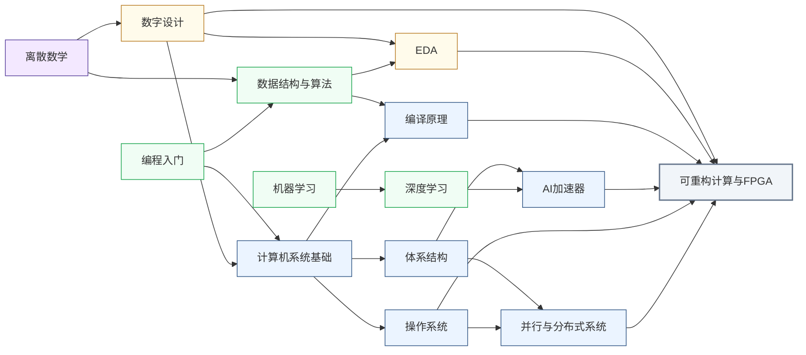

---
hide:
  - navigation
---
在软件的灵活性和专用硬件的性能之间寻找最优平衡。FPGA 既是芯片设计的验证平台，也是数据中心和边缘计算的可编程加速器；可重构计算研究的是如何让这套机制更高效、更易用。

<svg viewBox="0 0 1140 532" xmlns="http://www.w3.org/2000/svg" style="width:100%;max-width:1140px;display:block;margin:1.5rem auto;font-family:system-ui,-apple-system,sans-serif;">
  <rect width="1140" height="532" rx="10" fill="#FFFFFF" stroke="#CBD5E1" stroke-width="1.5"/>
  <text x="570" y="26" text-anchor="middle" font-size="17" font-weight="bold" fill="#1E293B">集成电路科研方向全景图</text>
  <text x="250" y="54" text-anchor="middle" font-size="13.5" font-weight="bold" fill="#0E7490">← 计算媒介更奇异</text>
  <text x="1000" y="54" text-anchor="middle" font-size="13.5" font-weight="bold" fill="#16A34A">更贴近物理世界 →</text>
  <defs><filter id="loc-b" x="-5%" y="-5%" width="110%" height="110%"><feGaussianBlur stdDeviation="1.4"/></filter></defs>
  <rect x="88" y="88" width="147" height="298" rx="6" fill="#ECFEFF"/>
  <rect x="239" y="88" width="147" height="298" rx="6" fill="#F8FAFC"/>
  <rect x="390" y="88" width="147" height="298" rx="6" fill="#FEF2F2"/>
  <rect x="541" y="88" width="289" height="298" rx="6" fill="#EFF6FF"/>
  <rect x="834" y="88" width="76" height="298" rx="6" fill="#FFFBEB"/>
  <rect x="914" y="88" width="218" height="298" rx="6" fill="#F0FDF4"/>
  <text x="161" y="82" text-anchor="middle" font-size="12" font-weight="bold" fill="#0E7490">量子 · 光子</text>
  <text x="312" y="82" text-anchor="middle" font-size="12" font-weight="bold" fill="#64748B">存算 · 类脑</text>
  <text x="463" y="82" text-anchor="middle" font-size="12" font-weight="bold" fill="#DC2626">模拟 · 射频</text>
  <text x="685" y="82" text-anchor="middle" font-size="13" font-weight="bold" fill="#1D4ED8">数字计算</text>
  <text x="872" y="82" text-anchor="middle" font-size="12" font-weight="bold" fill="#D97706">功率电子</text>
  <text x="1023" y="82" text-anchor="middle" font-size="12" font-weight="bold" fill="#16A34A">传感 · 生物 · 机械</text>
  <line x1="86" y1="92" x2="1132" y2="92" stroke="#E2E8F0" stroke-width="1"/>
  <line x1="86" y1="150" x2="1132" y2="150" stroke="#EEF2F6" stroke-width="1"/>
  <line x1="86" y1="208" x2="1132" y2="208" stroke="#EEF2F6" stroke-width="1"/>
  <line x1="86" y1="266" x2="1132" y2="266" stroke="#EEF2F6" stroke-width="1"/>
  <line x1="86" y1="324" x2="1132" y2="324" stroke="#EEF2F6" stroke-width="1"/>
  <line x1="86" y1="382" x2="1132" y2="382" stroke="#E2E8F0" stroke-width="1"/>
  <line x1="86" y1="92" x2="86" y2="382" stroke="#CBD5E1" stroke-width="1"/>
  <text x="81" y="124" text-anchor="end" font-size="10.5" fill="#475569">算法 / 应用</text>
  <text x="81" y="182" text-anchor="end" font-size="10.5" fill="#475569">系统 / 软件</text>
  <text x="81" y="240" text-anchor="end" font-size="10.5" fill="#475569">体系结构</text>
  <text x="81" y="298" text-anchor="end" font-size="10.5" fill="#475569">电路</text>
  <text x="81" y="356" text-anchor="end" font-size="10.5" fill="#475569">器件</text>
  <g filter="url(#loc-b)" opacity="0.42">
  <rect x="92" y="92" width="68" height="290" rx="5" fill="#CFFAFE" stroke="#0E7490" stroke-width="1.2"/>
  <text x="126" y="231" text-anchor="middle" font-size="10.5" font-weight="bold" fill="#0E7490">量子计算</text>
  <text x="126" y="246" text-anchor="middle" font-size="10.5" font-weight="bold" fill="#0E7490">与量子芯片</text>
  <rect x="163" y="92" width="68" height="290" rx="5" fill="#CFFAFE" stroke="#0E7490" stroke-width="1.2"/>
  <text x="197" y="231" text-anchor="middle" font-size="10.5" font-weight="bold" fill="#0E7490">光电子</text>
  <text x="197" y="246" text-anchor="middle" font-size="10.5" font-weight="bold" fill="#0E7490">与硅光集成</text>
  <rect x="394" y="266" width="68" height="116" rx="5" fill="#FEE2E2" stroke="#DC2626" stroke-width="1.2"/>
  <text x="428" y="317" text-anchor="middle" font-size="10.5" font-weight="bold" fill="#DC2626">模拟与</text>
  <text x="428" y="332" text-anchor="middle" font-size="10.5" font-weight="bold" fill="#DC2626">混合信号IC</text>
  <rect x="465" y="266" width="68" height="116" rx="5" fill="#FEE2E2" stroke="#DC2626" stroke-width="1.2"/>
  <text x="499" y="317" text-anchor="middle" font-size="10.5" font-weight="bold" fill="#DC2626">射频与</text>
  <text x="499" y="332" text-anchor="middle" font-size="10.5" font-weight="bold" fill="#DC2626">毫米波IC</text>
  <rect x="243" y="92" width="68" height="290" rx="5" fill="#FEE2E2" stroke="#DC2626" stroke-width="1.2"/>
  <text x="277" y="239" text-anchor="middle" font-size="11.5" font-weight="bold" fill="#DC2626">类脑芯片</text>
  <rect x="314" y="92" width="68" height="290" rx="5" fill="#EDE9FE" stroke="#7C3AED" stroke-width="1.2"/>
  <text x="348" y="231" text-anchor="middle" font-size="10.5" font-weight="bold" fill="#7C3AED">存算一体</text>
  <text x="348" y="246" text-anchor="middle" font-size="10.5" font-weight="bold" fill="#7C3AED">与近存计算</text>
  <rect x="545" y="92" width="68" height="290" rx="5" fill="#EDE9FE" stroke="#7C3AED" stroke-width="1.2"/>
  <text x="579" y="231" text-anchor="middle" font-size="10.5" font-weight="bold" fill="#7C3AED">硬件安全</text>
  <text x="579" y="246" text-anchor="middle" font-size="10.5" font-weight="bold" fill="#7C3AED">与可信计算</text>
  <rect x="616" y="92" width="68" height="174" rx="5" fill="#DBEAFE" stroke="#1D4ED8" stroke-width="1.2"/>
  <text x="650" y="172" text-anchor="middle" font-size="10.5" font-weight="bold" fill="#1D4ED8">AI 算法</text>
  <text x="650" y="187" text-anchor="middle" font-size="10.5" font-weight="bold" fill="#1D4ED8">与系统</text>
  <rect x="687" y="150" width="68" height="116" rx="5" fill="#DBEAFE" stroke="#1D4ED8" stroke-width="1.2"/>
  <text x="721" y="201" text-anchor="middle" font-size="10.5" font-weight="bold" fill="#1D4ED8">处理器架构</text>
  <text x="721" y="216" text-anchor="middle" font-size="10.5" font-weight="bold" fill="#1D4ED8">与编译系统</text>
  <rect x="758" y="208" width="68" height="116" rx="5" fill="#DBEAFE" stroke="#1D4ED8" stroke-width="1.2"/>
  <text x="792" y="259" text-anchor="middle" font-size="10.5" font-weight="bold" fill="#1D4ED8">可重构计算</text>
  <text x="792" y="274" text-anchor="middle" font-size="10.5" font-weight="bold" fill="#1D4ED8">与 FPGA</text>
  <rect x="838" y="266" width="68" height="116" rx="5" fill="#FEF3C7" stroke="#D97706" stroke-width="1.2"/>
  <text x="872" y="317" text-anchor="middle" font-size="10.5" font-weight="bold" fill="#B45309">功率半导体</text>
  <text x="872" y="332" text-anchor="middle" font-size="10" font-weight="bold" fill="#B45309">与宽禁带器件</text>
  <rect x="918" y="92" width="68" height="290" rx="5" fill="#ECFCCB" stroke="#65A30D" stroke-width="1.2"/>
  <text x="952" y="239" text-anchor="middle" font-size="11.5" font-weight="bold" fill="#4D7C0F">具身智能</text>
  <rect x="989" y="266" width="68" height="116" rx="5" fill="#D1FAE5" stroke="#059669" stroke-width="1.2"/>
  <text x="1023" y="317" text-anchor="middle" font-size="10.5" font-weight="bold" fill="#047857">生物电子</text>
  <text x="1023" y="332" text-anchor="middle" font-size="10.5" font-weight="bold" fill="#047857">与脑机接口</text>
  <rect x="1060" y="266" width="68" height="116" rx="5" fill="#DCFCE7" stroke="#16A34A" stroke-width="1.2"/>
  <text x="1094" y="317" text-anchor="middle" font-size="10.5" font-weight="bold" fill="#15803D">MEMS 与</text>
  <text x="1094" y="332" text-anchor="middle" font-size="10.5" font-weight="bold" fill="#15803D">微纳传感器</text>
  </g>
  <text x="81" y="450" text-anchor="end" font-size="10.5" fill="#475569">各方向通用</text>
  <g filter="url(#loc-b)" opacity="0.42">
  <rect x="92" y="408" width="1040" height="28" rx="5" fill="#F1F5F9" stroke="#64748B" stroke-width="1.1"/>
  <text x="612" y="426" text-anchor="middle" font-size="12" font-weight="bold" fill="#475569">EDA 与设计自动化</text>
  <rect x="92" y="440" width="1040" height="28" rx="5" fill="#EEF2F6" stroke="#64748B" stroke-width="1.1"/>
  <text x="612" y="458" text-anchor="middle" font-size="12" font-weight="bold" fill="#475569">先进封装与系统集成</text>
  <rect x="92" y="472" width="1040" height="30" rx="5" fill="#E2E8F0" stroke="#475569" stroke-width="1.2"/>
  <text x="612" y="491" text-anchor="middle" font-size="12" font-weight="bold" fill="#334155">半导体器件与先进工艺</text>
  </g>
  <rect x="92" y="512" width="13" height="13" rx="2" fill="#DBEAFE" stroke="#1D4ED8" stroke-width="1.1"/>
  <text x="110" y="522" text-anchor="start" font-size="10.5" fill="#475569">数字</text>
  <rect x="160" y="512" width="13" height="13" rx="2" fill="#FEE2E2" stroke="#DC2626" stroke-width="1.1"/>
  <text x="178" y="522" text-anchor="start" font-size="10.5" fill="#475569">模拟</text>
  <rect x="228" y="512" width="13" height="13" rx="2" fill="#EDE9FE" stroke="#7C3AED" stroke-width="1.1"/>
  <text x="246" y="522" text-anchor="start" font-size="10.5" fill="#475569">数字 / 模拟 交叉</text>
  <rect x="742" y="211" width="104" height="116" rx="9" fill="#1E293B" opacity="0.16"/>
  <rect x="740" y="208" width="104" height="116" rx="9" fill="#DBEAFE" stroke="#1D4ED8" stroke-width="2.6"/>
  <text x="792" y="259" text-anchor="middle" font-size="13" font-weight="bold" fill="#1D4ED8">可重构计算</text>
  <text x="792" y="274" text-anchor="middle" font-size="13" font-weight="bold" fill="#1D4ED8">与 FPGA</text>
</svg>

## 这个方向在研究什么

一支芯片团队设计出一种新的处理器架构，在仿真器里跑了三个月，确信逻辑没错，可要真正验证它在硬件上的表现，按常规就得流片——等上几个月，花掉几百万元，一旦做错还得全部推倒重来。但他们还有另一条路：把这套设计灌进一块 FPGA，不过两周，新架构就以接近真实芯片的速度在板子上跑了起来。

<svg viewBox="0 0 680 500" xmlns="http://www.w3.org/2000/svg" role="img" style="width:100%;max-width:680px;display:block;margin:1.5rem auto;" font-family="'Noto Sans CJK SC','PingFang SC','Microsoft YaHei',-apple-system,sans-serif">
  <title>灵活性（硬件可重构）vs 性能/能效</title>
  <desc>二维散点：横轴性能/能效，纵轴硬件可重构灵活性。CPU、DSP、FPGA、ASIC 各为一点；FPGA 灵活性最高，ASIC 性能最高、灵活性最低。</desc>
  <defs>
    <marker id="ah" markerWidth="9" markerHeight="9" refX="7" refY="3" orient="auto"><path d="M0,0 L7,3 L0,6 Z" fill="#9c9a92"/></marker>
  </defs>
  <rect x="0" y="0" width="680" height="500" rx="14" fill="#ffffff"/>
  <text x="40" y="40" font-size="17" font-weight="500" fill="#1f1f1d">灵活性（按硬件可重构）⇄ 性能 / 能效</text>
  <!-- axes -->
  <line x1="120" y1="400" x2="120" y2="80" stroke="#9c9a92" stroke-width="1" marker-end="url(#ah)"/>
  <line x1="120" y1="400" x2="640" y2="400" stroke="#9c9a92" stroke-width="1" marker-end="url(#ah)"/>
  <text transform="translate(70,250) rotate(-90)" font-size="13" fill="#3d3d3a" text-anchor="middle">灵活性 / 硬件可重构性 →</text>
  <text x="640" y="425" font-size="13" fill="#3d3d3a" text-anchor="end">性能 / 能效 →</text>
  <text x="112" y="95" font-size="11" fill="#9c9a92" text-anchor="end">高</text>
  <text x="112" y="398" font-size="11" fill="#9c9a92" text-anchor="end">低</text>
  <!-- classic inverse trend (excludes FPGA) -->
  <path d="M165 150 C 300 205, 390 255, 560 350" fill="none" stroke="#c8c6bf" stroke-width="1.6" stroke-dasharray="5 5"/>
  <text x="455" y="300" font-size="11.5" fill="#a7a59d" transform="rotate(20 455 300)">传统反相关趋势</text>
  <!-- points -->
  <circle cx="165" cy="150" r="6" fill="#378ADD"/>
  <text x="178" y="146" font-size="14" font-weight="500" fill="#1f1f1d">CPU / GPP</text>
  <text x="178" y="163" font-size="11" fill="#73726c">软件最通用、能效最低</text>
  <circle cx="275" cy="208" r="6" fill="#1D9E75"/>
  <text x="288" y="204" font-size="14" font-weight="500" fill="#1f1f1d">DSP</text>
  <text x="288" y="221" font-size="11" fill="#73726c">可编程、面向信号处理</text>
  <circle cx="372" cy="116" r="7.5" fill="#D85A30"/>
  <circle cx="372" cy="116" r="12" fill="none" stroke="#D85A30" stroke-width="1.2" opacity="0.5"/>
  <text x="388" y="112" font-size="14" font-weight="600" fill="#1f1f1d">FPGA</text>
  <text x="388" y="129" font-size="11" fill="#73726c">可重构硬件，灵活性最高</text>
  <circle cx="565" cy="350" r="6" fill="#7F77DD"/>
  <text x="555" y="345" font-size="14" font-weight="500" fill="#1f1f1d" text-anchor="end">ASIC</text>
  <text x="555" y="362" font-size="11" fill="#73726c" text-anchor="end">定制固定，性能/能效最高</text>
  <!-- annotation for FPGA off-trend -->
  <text x="120" y="455" font-size="12" fill="#3d3d3a">注：FPGA 位于趋势线上方——在不大幅牺牲性能的前提下保留高可重构性，</text>
  <text x="120" y="473" font-size="12" fill="#3d3d3a">这正是它作为"可重构硬件"的价值所在。纵轴为定性相对值，无绝对刻度。</text>
</svg>

这块芯片之所以能做到，是因为它出厂时本是一张空白的画布。通用处理器（CPU、GPU）什么代码都能跑，可为了通用，效率注定上不去；专用芯片（ASIC）把电路为某个任务焊死，性能做到极致，代价却是功能再难改动，重新流片一次又动辄数月，耗费数百万元。FPGA（Field-Programmable Gate Array），也就是现场可编程门阵列，正卡在这两极中间：它是一块出厂后还能反复重画的硬件，重新配置内部的逻辑单元和连线，<u>同一块芯片就能今天跑图像处理、明天跑加密、后天跑神经网络推理</u>。

然而，这种高度的灵活性是有代价的。要让一块芯片能实现任意逻辑、把任意两点连起来，它就得把大量硅片面积留给“可配置”本身。FPGA 的内部是一张网格，密密麻麻铺着可编程的**查找表**（Look-Up Table, LUT）和可编程的连线。查找表是个有意思的东西。它会预先把每种输入对应的结果填进一张表，用时直接查表取数。遇到一些复杂的函数计算时，这种方式可以节省大量延时和功耗。因为 LUT 本质上是“背答案”，而不是像加法器、乘法器那样真去做运算。理论上，只要 LUT 足够大，它可以映射任何函数。改写表里存的内容，就能拟合任意逻辑。不过这种方式只在做几位输入（如 INT4、INT8）的小逻辑判断时划算。可像 FP32 乘法这种输入组合海量的运算根本列不成表，只能用一大片查找表硬拼，反倒比一个专门的乘法器又慢又费电。这也正是 FPGA 后来要专门做硬乘法器（DSP 块）的原因。

在 FPGA 上，真正干活的逻辑只占一小块，面积和延迟的一半以上都耗在那些可编程的连线和开关上——信号从一个逻辑单元走到另一个，要穿过一长串多路选择器和缓冲器。代价有多大？只用查找表去拼，同一个电路在 FPGA 上平均比 ASIC 大三十多倍、慢四倍；后文会讲到把部分 LUT 替换为专用的硬件，那种方法能把差距收窄到二十倍上下，但终究差一截。

<svg viewBox="0 0 820 330" xmlns="http://www.w3.org/2000/svg" style="width:100%;max-width:820px;display:block;margin:1.5rem auto;">
  <defs>
    <marker id="lutArr" markerWidth="8" markerHeight="8" refX="6" refY="3" orient="auto"><path d="M0,0 L0,6 L8,3 z" fill="#475569"/></marker>
  </defs>
  <rect width="820" height="330" rx="10" fill="#F8FAFC" stroke="#CBD5E1" stroke-width="1.5"/>
  <text x="410" y="28" text-anchor="middle" font-size="16" font-weight="bold" fill="#1E293B">查找表（LUT）：一块「能查任意真值表」的硬件</text>
  <text x="120" y="64" text-anchor="middle" font-size="12.5" fill="#9A3412">配置 SRAM（开机写入）</text>
  <text x="74" y="84" text-anchor="end" font-size="11" fill="#64748B">地址 ab</text>
  <rect x="92" y="76" width="56" height="30" rx="4" fill="#FEF3C7" stroke="#D97706" stroke-width="1.4"/>
  <text x="120" y="96" text-anchor="middle" font-size="14" font-weight="bold" fill="#92400E">0</text>
  <text x="84" y="96" text-anchor="end" font-size="11" fill="#64748B">00</text>
  <rect x="92" y="112" width="56" height="30" rx="4" fill="#FEF3C7" stroke="#D97706" stroke-width="1.4"/>
  <text x="120" y="132" text-anchor="middle" font-size="14" font-weight="bold" fill="#92400E">1</text>
  <text x="84" y="132" text-anchor="end" font-size="11" fill="#64748B">01</text>
  <rect x="92" y="148" width="56" height="30" rx="4" fill="#DBEAFE" stroke="#1D4ED8" stroke-width="2"/>
  <text x="120" y="168" text-anchor="middle" font-size="14" font-weight="bold" fill="#1E40AF">1</text>
  <text x="84" y="168" text-anchor="end" font-size="11" fill="#1E40AF">10</text>
  <rect x="92" y="184" width="56" height="30" rx="4" fill="#FEF3C7" stroke="#D97706" stroke-width="1.4"/>
  <text x="120" y="204" text-anchor="middle" font-size="14" font-weight="bold" fill="#92400E">0</text>
  <text x="84" y="204" text-anchor="end" font-size="11" fill="#64748B">11</text>
  <line x1="148" y1="91" x2="300" y2="96" stroke="#475569" stroke-width="1.3"/>
  <line x1="148" y1="127" x2="300" y2="120" stroke="#475569" stroke-width="1.3"/>
  <line x1="148" y1="163" x2="300" y2="150" stroke="#1D4ED8" stroke-width="2"/>
  <line x1="148" y1="199" x2="300" y2="174" stroke="#475569" stroke-width="1.3"/>
  <polygon points="300,80 300,190 360,160 360,110" fill="#E2E8F0" stroke="#475569" stroke-width="1.6"/>
  <text x="326" y="139" text-anchor="middle" font-size="12" font-weight="bold" fill="#334155">MUX</text>
  <line x1="318" y1="208" x2="318" y2="178" stroke="#475569" stroke-width="1.3" marker-end="url(#lutArr)"/>
  <line x1="342" y1="208" x2="342" y2="166" stroke="#475569" stroke-width="1.3" marker-end="url(#lutArr)"/>
  <text x="330" y="224" text-anchor="middle" font-size="11" fill="#334155">输入 a、b（当地址）</text>
  <line x1="360" y1="135" x2="424" y2="135" stroke="#1D4ED8" stroke-width="2" marker-end="url(#lutArr)"/>
  <rect x="426" y="120" width="34" height="30" rx="4" fill="#DBEAFE" stroke="#1D4ED8" stroke-width="1.6"/>
  <text x="443" y="140" text-anchor="middle" font-size="13" font-weight="bold" fill="#1E40AF">O</text>
  <text x="392" y="124" text-anchor="middle" font-size="11" fill="#1E40AF">读出 SRAM[ab]</text>
  <text x="620" y="64" text-anchor="middle" font-size="12.5" fill="#334155">此刻这张表 = XOR</text>
  <rect x="540" y="74" width="160" height="132" rx="5" fill="#FFFFFF" stroke="#CBD5E1" stroke-width="1.2"/>
  <line x1="540" y1="100" x2="700" y2="100" stroke="#CBD5E1" stroke-width="1"/>
  <line x1="593" y1="74" x2="593" y2="206" stroke="#CBD5E1" stroke-width="1"/>
  <line x1="647" y1="74" x2="647" y2="206" stroke="#CBD5E1" stroke-width="1"/>
  <text x="566" y="93" text-anchor="middle" font-size="12" font-weight="bold" fill="#475569">a</text>
  <text x="620" y="93" text-anchor="middle" font-size="12" font-weight="bold" fill="#475569">b</text>
  <text x="673" y="93" text-anchor="middle" font-size="12" font-weight="bold" fill="#475569">O</text>
  <text x="566" y="119" text-anchor="middle" font-size="13" fill="#334155">0</text><text x="620" y="119" text-anchor="middle" font-size="13" fill="#334155">0</text><text x="673" y="119" text-anchor="middle" font-size="13" fill="#334155">0</text>
  <text x="566" y="144" text-anchor="middle" font-size="13" fill="#334155">0</text><text x="620" y="144" text-anchor="middle" font-size="13" fill="#334155">1</text><text x="673" y="144" text-anchor="middle" font-size="13" fill="#334155">1</text>
  <text x="566" y="169" text-anchor="middle" font-size="13" fill="#1E40AF" font-weight="bold">1</text><text x="620" y="169" text-anchor="middle" font-size="13" fill="#1E40AF" font-weight="bold">0</text><text x="673" y="169" text-anchor="middle" font-size="13" fill="#1E40AF" font-weight="bold">1</text>
  <text x="566" y="194" text-anchor="middle" font-size="13" fill="#334155">1</text><text x="620" y="194" text-anchor="middle" font-size="13" fill="#334155">1</text><text x="673" y="194" text-anchor="middle" font-size="13" fill="#334155">0</text>
  <text x="410" y="262" text-anchor="middle" font-size="12.5" fill="#475569">改写这 4 个 SRAM 位 = 换一张真值表，同一块硬件立刻能变成 AND、OR 或任意 2 输入逻辑。</text>
  <text x="410" y="286" text-anchor="middle" font-size="12.5" fill="#9A3412">代价：每个 LUT 都附带一串配置 SRAM —— 灵活性以硅面积为代价换得。</text>
</svg>

既然面积的大头花在连线上，怎么把逻辑摆放到位、让信号走最短的路，就成了 FPGA 一大研究热点。把设计灌进芯片，要先用 Verilog 描述电路，再经工具综合、布局、布线，生成一份比特流烧进去。其中**布局布线**（Place-and-Route, P&R）最难：哪个逻辑该落在哪个单元、哪根线该走哪条通道，是一个货真价实的 NP-Hard 问题。设计规模越大，时序就越来越难收敛，一个大型设计的 P&R 跑上几十个小时是常事，跑完还得看随机种子的运气。工业界的 Vivado、Quartus 背后是几十年攒下的启发式算法，学术界则把多伦多大学的开源工具 VTR 当作试验新算法的公共平台。近年兴起的 **ML for EDA**，目标是把 P&R 的运行时间和结果方差同时压下来。

P&R 是替专家省时间，HLS 则想把门槛本身拆掉。写 RTL 是个力气活，得一个时钟周期一个时钟周期地抠；**高层次综合**（High-Level Synthesis, HLS）许诺的是另一幅图景：你用 C 或 C++ 把算法写出来，工具自动替你变成电路。但 HLS 性能也没那么好。同一段算法，HLS 生成的电路时钟频率常常比手写低 20% 到 50%，面积也更大，因为工具在决定循环怎么展开、流水线怎么插、数据怎么摆进片上存储时，比较笨拙。大多数时候仍要靠工程师手工写一大堆 pragma 去指点，而这些选择的组合空间是指数级的。于是怎么让工具可以媲美一个经验老道的工程师，不再靠人堆 pragma，也成了一大研究热点。

代价压下去，FPGA 的优势是低延迟和可重构，而不是峰值算力。微软把 FPGA 插进数据中心的每一台服务器，先用来加速 Bing 搜索的网页排序，后来又接管了网络数据包的处理，让流量绕开 CPU 直接在硬件上转发。边缘侧的 AI 推理是FPGA的另一个舒适区。这里看重的不是高吞吐，而是每一帧都准时出结果——自动驾驶、机器人、工业质检都得逐帧实时响应。GPU 为了充分利用算力，通常将一批样本累积后一起计算，单帧延迟因此偏高又不稳定；FPGA 却能把整个网络铺成一条定制流水线，数据流过即出结果，单帧延迟低到毫秒以下还很确定。再加上模型量化到 int8、int4 时，FPGA 能照着这个精度量身搭电路，每个查找表和 DSP 都得到充分利用，在紧巴巴的功耗预算里把能效做得比 GPU 更高。于是怎么把神经网络的算子高效铺到 DSP 和 LUT 上，就成了一个专门的研究方向。

<svg viewBox="0 0 860 340" xmlns="http://www.w3.org/2000/svg" style="width:100%;max-width:860px;display:block;margin:1.5rem auto;">
  <defs>
    <marker id="latArr" markerWidth="8" markerHeight="8" refX="4" refY="3" orient="auto"><path d="M0,0 L8,3 L0,6 Z" fill="#475569"/></marker>
  </defs>
  <rect width="860" height="340" rx="10" fill="#F8FAFC" stroke="#CBD5E1" stroke-width="1.5"/>
  <text x="430" y="30" text-anchor="middle" font-size="16" font-weight="bold" fill="#1E293B">为什么 FPGA 适合边缘实时推理：批处理 vs 数据流流水线</text>
  <line x1="210" y1="72" x2="210" y2="266" stroke="#94A3B8" stroke-width="1" stroke-dasharray="4,3"/>
  <text x="210" y="64" text-anchor="middle" font-size="11" fill="#475569">帧 1 到达</text>
  <text x="58" y="116" font-size="14" font-weight="bold" fill="#1E40AF">GPU</text>
  <text x="58" y="132" font-size="12" fill="#64748B">批量累积后计算</text>
  <text x="270" y="90" text-anchor="middle" font-size="11" fill="#64748B">帧2</text>
  <text x="320" y="90" text-anchor="middle" font-size="11" fill="#64748B">帧3</text>
  <text x="370" y="90" text-anchor="middle" font-size="11" fill="#64748B">帧4</text>
  <line x1="270" y1="94" x2="270" y2="104" stroke="#94A3B8" stroke-width="1"/>
  <line x1="320" y1="94" x2="320" y2="104" stroke="#94A3B8" stroke-width="1"/>
  <line x1="370" y1="94" x2="370" y2="104" stroke="#94A3B8" stroke-width="1"/>
  <rect x="210" y="104" width="250" height="26" fill="#E2E8F0" stroke="#94A3B8" stroke-width="1"/>
  <text x="335" y="121" text-anchor="middle" font-size="12" fill="#475569">等待凑满批（帧2/3/4 仍在传输）</text>
  <rect x="460" y="104" width="150" height="26" fill="#3B82F6"/>
  <text x="535" y="121" text-anchor="middle" font-size="12" fill="#ffffff">批量计算</text>
  <circle cx="612" cy="117" r="4" fill="#B91C1C"/>
  <text x="620" y="121" font-size="11" fill="#B91C1C">帧1 结果</text>
  <line x1="210" y1="146" x2="612" y2="146" stroke="#475569" stroke-width="1" marker-start="url(#latArr)" marker-end="url(#latArr)"/>
  <text x="411" y="160" text-anchor="middle" font-size="11.5" fill="#B91C1C">GPU 单帧延迟：长，且随批大小波动</text>
  <text x="58" y="216" font-size="14" font-weight="bold" fill="#15803D">FPGA</text>
  <text x="58" y="232" font-size="12" fill="#64748B">定制流水线</text>
  <rect x="210" y="204" width="44" height="26" fill="#DCFCE7" stroke="#16A34A" stroke-width="1.2"/>
  <text x="232" y="221" text-anchor="middle" font-size="11" fill="#166534">层1</text>
  <rect x="256" y="204" width="44" height="26" fill="#DCFCE7" stroke="#16A34A" stroke-width="1.2"/>
  <text x="278" y="221" text-anchor="middle" font-size="11" fill="#166534">层2</text>
  <rect x="302" y="204" width="44" height="26" fill="#DCFCE7" stroke="#16A34A" stroke-width="1.2"/>
  <text x="324" y="221" text-anchor="middle" font-size="11" fill="#166534">层3</text>
  <circle cx="352" cy="217" r="4" fill="#15803D"/>
  <text x="360" y="221" font-size="11" fill="#15803D">帧1 结果</text>
  <text x="430" y="216" font-size="11" fill="#64748B">帧1 在层2 时，帧2 已进层1，逐帧流过无需等批</text>
  <line x1="210" y1="246" x2="352" y2="246" stroke="#475569" stroke-width="1" marker-start="url(#latArr)" marker-end="url(#latArr)"/>
  <text x="281" y="260" text-anchor="middle" font-size="11.5" fill="#15803D">FPGA 单帧延迟：短，且固定</text>
  <text x="430" y="300" text-anchor="middle" font-size="12" fill="#475569">边缘要的是每帧准时出结果。GPU 以批量积累换吞吐，单帧延迟高；FPGA 把网络铺成流水线，</text>
  <text x="430" y="320" text-anchor="middle" font-size="12" fill="#475569">数据流过即出结果，延迟低而确定，还能按模型精度（int8/int4）量身定制每一级。</text>
</svg>

FPGA 一旦进了机架，要同时服务多个租户、应付多变的负载，**部分重构**就成了关键，即在不停机的前提下，只把芯片的一块区域换成另一个加速器。这才把“可重构”从一次性的编译能力，变成了运行时随需应变的真本事。

在既定的硅片上，软件层面的优化空间有限，那一半以上的连线浪费是 fabric 本身决定的。要再往下压，就只能修改硬件了。FPGA 架构师面临的核心问题是：<u>哪些功能该硬化成专用电路，硬到什么程度，占多少芯片面积？</u> 这是一个权衡：把一个功能焊进硅里，用得上它的应用立刻更小更快更省电；可一旦某块芯片碰上的应用根本用不到它，这部分硅面积就被浪费，挤占了本该留给通用逻辑的资源。

FPGA 这三十年的演化，可以看作一系列反复验证后固化下来的硬件决策。最早的芯片只有查找表和连线，之后才一样样往里加硬块。人们发现几乎每个设计都在做加法，就把进位链硬化进逻辑块；信号处理和 AI 离不开乘累加，于是有了专门的 **DSP 块**（Digital Signal Processing，数字信号处理）；数据总要在片上缓存，**BRAM**（Block RAM，块状随机存取存储器）也嵌了进来。到了深度学习时代，DSP 又长出按 int8、int4 拆分的张量模式。连接线的开销也开始被硬核化——长线延迟既然不随工艺改善，新一代器件干脆把一张**硬核片上网络**（Network-on-Chip, NoC）做进芯片，比用可编程逻辑搭出来的软 NoC 省 23 倍面积、快 6 倍；单块芯片大到良率扛不住，就用 **interposer**（中介层）把好几块裸片拼进一个封装。今天的高端器件（如 AMD Versal）已经是「可编程逻辑 + AI 引擎 + ARM 处理器 + 硬核 NoC」的异构平台，纯查找表只剩其中一小块。

<svg viewBox="0 0 900 360" xmlns="http://www.w3.org/2000/svg" style="width:100%;max-width:900px;display:block;margin:1.5rem auto;">
  <rect width="900" height="360" rx="10" fill="#F8FAFC" stroke="#CBD5E1" stroke-width="1.5"/>
  <text x="450" y="28" text-anchor="middle" font-size="17" font-weight="bold" fill="#1E293B">FPGA 的进化：从纯查找表阵列，到异构平台</text>
  <line x1="450" y1="46" x2="450" y2="320" stroke="#CBD5E1" stroke-width="1.2" stroke-dasharray="4,4"/>
  <text x="225" y="64" text-anchor="middle" font-size="14" font-weight="bold" fill="#1E40AF">早期 FPGA（1990 年代）</text>
  <rect x="95" y="86" width="260" height="180" rx="4" fill="#EFF6FF" stroke="#93C5FD" stroke-width="1.4"/>
  <line x1="138" y1="86" x2="138" y2="266" stroke="#BFDBFE" stroke-width="1"/>
  <line x1="181" y1="86" x2="181" y2="266" stroke="#BFDBFE" stroke-width="1"/>
  <line x1="224" y1="86" x2="224" y2="266" stroke="#BFDBFE" stroke-width="1"/>
  <line x1="267" y1="86" x2="267" y2="266" stroke="#BFDBFE" stroke-width="1"/>
  <line x1="310" y1="86" x2="310" y2="266" stroke="#BFDBFE" stroke-width="1"/>
  <line x1="95" y1="126" x2="355" y2="126" stroke="#BFDBFE" stroke-width="1"/>
  <line x1="95" y1="166" x2="355" y2="166" stroke="#BFDBFE" stroke-width="1"/>
  <line x1="95" y1="206" x2="355" y2="206" stroke="#BFDBFE" stroke-width="1"/>
  <line x1="95" y1="246" x2="355" y2="246" stroke="#BFDBFE" stroke-width="1"/>
  <rect x="106" y="96" width="20" height="20" rx="3" fill="#DBEAFE" stroke="#3B82F6" stroke-width="1.2"/>
  <rect x="192" y="176" width="20" height="20" rx="3" fill="#DBEAFE" stroke="#3B82F6" stroke-width="1.2"/>
  <rect x="278" y="216" width="20" height="20" rx="3" fill="#DBEAFE" stroke="#3B82F6" stroke-width="1.2"/>
  <text x="225" y="150" text-anchor="middle" font-size="12" fill="#3B82F6" opacity="0.75">逻辑块（LUT）阵列</text>
  <rect x="130" y="74" width="16" height="8" rx="2" fill="#94A3B8"/>
  <rect x="190" y="74" width="16" height="8" rx="2" fill="#94A3B8"/>
  <rect x="250" y="74" width="16" height="8" rx="2" fill="#94A3B8"/>
  <rect x="83" y="120" width="8" height="16" rx="2" fill="#94A3B8"/>
  <rect x="83" y="170" width="8" height="16" rx="2" fill="#94A3B8"/>
  <rect x="83" y="220" width="8" height="16" rx="2" fill="#94A3B8"/>
  <text x="70" y="100" text-anchor="end" font-size="11" fill="#64748B">IO</text>
  <text x="225" y="292" text-anchor="middle" font-size="12" fill="#475569">全部为逻辑块（LUT）+ IO + 可编程连线</text>
  <text x="675" y="64" text-anchor="middle" font-size="14" font-weight="bold" fill="#9A3412">今天的 FPGA（异构平台）</text>
  <rect x="525" y="86" width="290" height="180" rx="4" fill="#EFF6FF" stroke="#93C5FD" stroke-width="1.4"/>
  <line x1="525" y1="126" x2="815" y2="126" stroke="#BFDBFE" stroke-width="1"/>
  <line x1="525" y1="206" x2="815" y2="206" stroke="#BFDBFE" stroke-width="1"/>
  <rect x="565" y="92" width="22" height="168" rx="3" fill="#DCFCE7" stroke="#16A34A" stroke-width="1.3"/>
  <text x="576" y="178" text-anchor="middle" font-size="12" fill="#166534" transform="rotate(-90 576 178)">BRAM</text>
  <rect x="645" y="92" width="22" height="168" rx="3" fill="#FEF3C7" stroke="#D97706" stroke-width="1.3"/>
  <text x="656" y="178" text-anchor="middle" font-size="12" fill="#92400E" transform="rotate(-90 656 178)">DSP</text>
  <rect x="602" y="98" width="18" height="18" rx="3" fill="#DBEAFE" stroke="#3B82F6" stroke-width="1.1"/>
  <rect x="730" y="100" width="18" height="18" rx="3" fill="#DBEAFE" stroke="#3B82F6" stroke-width="1.1"/>
  <rect x="690" y="214" width="118" height="44" rx="4" fill="#E2E8F0" stroke="#475569" stroke-width="1.4"/>
  <text x="749" y="240" text-anchor="middle" font-size="11.5" fill="#334155">ARM 处理器子系统</text>
  <line x1="525" y1="166" x2="815" y2="166" stroke="#B91C1C" stroke-width="2.4"/>
  <line x1="708" y1="86" x2="708" y2="214" stroke="#B91C1C" stroke-width="2.4"/>
  <circle cx="708" cy="166" r="3.2" fill="#B91C1C"/>
  <text x="812" y="160" text-anchor="end" font-size="11" fill="#B91C1C">硬核 NoC</text>
  <rect x="560" y="74" width="18" height="8" rx="2" fill="#64748B"/>
  <rect x="600" y="74" width="18" height="8" rx="2" fill="#64748B"/>
  <rect x="640" y="74" width="18" height="8" rx="2" fill="#64748B"/>
  <text x="688" y="81" text-anchor="start" font-size="11" fill="#475569">← 高速收发器</text>
  <text x="675" y="292" text-anchor="middle" font-size="12" fill="#9A3412">逻辑 + DSP + BRAM + 硬核 NoC + ARM…每种硬块都是一次成功的硬化</text>
</svg>

可即便如此，FPGA 还不是可重构的终点。它的灵活来自 **bit 级**的细粒度可配置，每一个查找表、每一段连线都能单独设定，灵活到了极致，连线的代价也大到了极致。再往前一步是**粗粒度**的思路：与其让人摆弄每一根线，不如把可重构的颗粒做大，让一个个完整的运算单元按需连成数据通路，这就是 **CGRA**（Coarse-Grained Reconfigurable Array，粗粒度可重构阵列）与“软件定义芯片”。粒度一粗，配置开销骤降，效率随之向 ASIC 靠拢，代价是不再像 FPGA 那样什么都能配。从 FPGA 到软件定义芯片，核心矛盾始终是灵活性与效率的权衡。

<svg viewBox="0 0 820 300" xmlns="http://www.w3.org/2000/svg" style="width:100%;max-width:820px;display:block;margin:1.5rem auto;">
  <rect width="820" height="300" rx="10" fill="#F8FAFC" stroke="#CBD5E1" stroke-width="1.5"/>
  <text x="410" y="28" text-anchor="middle" font-size="16" font-weight="bold" fill="#1E293B">可重构的颗粒：bit 级 vs word 级</text>
  <line x1="410" y1="46" x2="410" y2="258" stroke="#CBD5E1" stroke-width="1.2" stroke-dasharray="4,4"/>
  <text x="205" y="64" text-anchor="middle" font-size="14" font-weight="bold" fill="#1E40AF">FPGA · bit 级（细粒度）</text>
  <line x1="120" y1="92" x2="120" y2="218" stroke="#94A3B8" stroke-width="1"/>
  <line x1="160" y1="92" x2="160" y2="218" stroke="#94A3B8" stroke-width="1"/>
  <line x1="200" y1="92" x2="200" y2="218" stroke="#94A3B8" stroke-width="1"/>
  <line x1="240" y1="92" x2="240" y2="218" stroke="#94A3B8" stroke-width="1"/>
  <line x1="280" y1="92" x2="280" y2="218" stroke="#94A3B8" stroke-width="1"/>
  <line x1="100" y1="110" x2="300" y2="110" stroke="#94A3B8" stroke-width="1"/>
  <line x1="100" y1="150" x2="300" y2="150" stroke="#94A3B8" stroke-width="1"/>
  <line x1="100" y1="190" x2="300" y2="190" stroke="#94A3B8" stroke-width="1"/>
  <rect x="125" y="115" width="12" height="12" rx="2" fill="#DBEAFE" stroke="#3B82F6" stroke-width="1"/>
  <rect x="205" y="115" width="12" height="12" rx="2" fill="#DBEAFE" stroke="#3B82F6" stroke-width="1"/>
  <rect x="165" y="155" width="12" height="12" rx="2" fill="#DBEAFE" stroke="#3B82F6" stroke-width="1"/>
  <rect x="245" y="155" width="12" height="12" rx="2" fill="#DBEAFE" stroke="#3B82F6" stroke-width="1"/>
  <rect x="125" y="195" width="12" height="12" rx="2" fill="#DBEAFE" stroke="#3B82F6" stroke-width="1"/>
  <rect x="285" y="195" width="12" height="12" rx="2" fill="#DBEAFE" stroke="#3B82F6" stroke-width="1"/>
  <circle cx="160" cy="110" r="2.4" fill="#D97706"/><circle cx="200" cy="110" r="2.4" fill="#D97706"/><circle cx="240" cy="110" r="2.4" fill="#D97706"/>
  <circle cx="120" cy="150" r="2.4" fill="#D97706"/><circle cx="200" cy="150" r="2.4" fill="#D97706"/><circle cx="280" cy="150" r="2.4" fill="#D97706"/>
  <circle cx="160" cy="190" r="2.4" fill="#D97706"/><circle cx="240" cy="190" r="2.4" fill="#D97706"/>
  <text x="205" y="244" text-anchor="middle" font-size="12" fill="#475569">每根线、每个查找表都能单独配 → 最灵活，连线开销最大</text>
  <text x="615" y="64" text-anchor="middle" font-size="14" font-weight="bold" fill="#9A3412">CGRA · word 级（粗粒度）</text>
  <line x1="510" y1="135" x2="720" y2="135" stroke="#475569" stroke-width="4"/>
  <line x1="510" y1="185" x2="720" y2="185" stroke="#475569" stroke-width="4"/>
  <line x1="560" y1="115" x2="560" y2="205" stroke="#475569" stroke-width="4"/>
  <line x1="670" y1="115" x2="670" y2="205" stroke="#475569" stroke-width="4"/>
  <rect x="500" y="112" width="60" height="44" rx="5" fill="#FEF3C7" stroke="#D97706" stroke-width="1.6"/>
  <text x="530" y="139" text-anchor="middle" font-size="14" font-weight="bold" fill="#92400E">ALU</text>
  <rect x="640" y="112" width="60" height="44" rx="5" fill="#FEF3C7" stroke="#D97706" stroke-width="1.6"/>
  <text x="670" y="139" text-anchor="middle" font-size="15" font-weight="bold" fill="#92400E">×</text>
  <rect x="500" y="166" width="60" height="44" rx="5" fill="#FEF3C7" stroke="#D97706" stroke-width="1.6"/>
  <text x="530" y="193" text-anchor="middle" font-size="15" font-weight="bold" fill="#92400E">+</text>
  <rect x="640" y="166" width="60" height="44" rx="5" fill="#FEF3C7" stroke="#D97706" stroke-width="1.6"/>
  <text x="670" y="193" text-anchor="middle" font-size="14" font-weight="bold" fill="#92400E">ALU</text>
  <circle cx="560" cy="135" r="3.6" fill="#1D4ED8"/><circle cx="670" cy="135" r="3.6" fill="#1D4ED8"/>
  <circle cx="560" cy="185" r="3.6" fill="#1D4ED8"/><circle cx="670" cy="185" r="3.6" fill="#1D4ED8"/>
  <text x="615" y="244" text-anchor="middle" font-size="12" fill="#9A3412">以运算单元为颗粒、整字总线相连 → 配置开销骤降，效率逼近 ASIC</text>
  <text x="410" y="280" text-anchor="middle" font-size="12" fill="#334155">颗粒做粗，可配项变少，省下大量连线，代价是不再什么都能配。</text>
</svg>

### 核心研究问题

- **FPGA 架构与硬化取舍**：路由开销让 FPGA 面积的七八成都耗在连线上，哪些功能该硬化成 DSP、BRAM、硬核 NoC、AI 引擎、各占多大面积是一场赌博，这套异构资源怎么协同是架构的根本问题。
- **布局布线算法**：P&R 是 NP 难组合优化，大型设计动辄跑几十小时还受随机种子影响，新启发式和机器学习都在试着把时间和方差压下来，让工具替专家做决策。
- **高层次综合（HLS）**：HLS 用 C/C++ 自动生成 RTL，频率却常比手写低两到五成，循环展开、流水线、数据流调度还要靠人堆 pragma，难在让工具自动逼近熟练工程师的手写质量。
- **神经网络到 FPGA 的映射**：把量化到 4 位甚至 2 位的 DNN 算子高效铺到 DSP/LUT/BRAM 上、最大化数据局部性、最小化片外访存，决定低延迟边缘推理能不能打过 GPU。
- **CGRA 与软件定义芯片**：把可重构颗粒从 bit 级做粗到 word 级，配置开销骤降、效率向 ASIC 靠拢，但运算单元怎么连成数据通路、应用怎么映射上去，两头都还没有成型的方法。
- **数据中心 FPGA 与异构平台**：FPGA 进机架做网络加速、SmartNIC、多租户服务，要和 CPU/GPU 组成异构平台，运行时还要用部分重构调度多个加速器。
- **安全、可靠与抗辐射**：比特流不加密就能被复制，多租户要隔离防侧信道，航天场景要抗辐射加固，这些约束贯穿从器件到系统的每一层。

### 知识路径

离散数学和编程打底，数字设计（含 HDL 和 FPGA 本体）是入口，EDA 是工具链，编译原理支撑 HLS，体系结构决定加速器设计空间，深度学习提供算法需求，操作系统和并行系统支撑运行时管理。节点对应[学习地图](../学习地图/index.md)里的目录：

- 数学：[离散数学](../学习地图/数学/离散数学/index.md)（布尔代数、图论，FPGA 布局布线的算法语言）
- 算法编程：[编程入门](../学习地图/算法编程/编程入门/index.md)（C/C++） · [数据结构与算法](../学习地图/算法编程/数据结构与算法/index.md)
- 电路：[数字设计](../学习地图/电路/数字设计/index.md)（数字逻辑→HDL→FPGA 是本方向的主干） · [EDA](../学习地图/电路/EDA/index.md)
- 系统架构：[计算机系统基础](../学习地图/系统架构/计算机系统基础/index.md) · [体系结构](../学习地图/系统架构/体系结构/index.md) · [操作系统](../学习地图/系统架构/操作系统/index.md)（运行时与虚拟化） · [编译原理](../学习地图/系统架构/编译原理/index.md)（HLS 高层次综合） · [并行与分布式系统](../学习地图/系统架构/并行与分布式系统/index.md) · [AI加速器](../学习地图/系统架构/AI加速器/index.md)
- 人工智能：[机器学习](../学习地图/人工智能/机器学习/index.md) · [深度学习](../学习地图/人工智能/深度学习/index.md)

## 这个方向适合谁

适合想做硬件但等不起流片的人。一个架构改动几小时就能上板看到结果，一块几百块的开发板就能开工，本科生积累第一段硬件科研经历，常常就从这里起步。数字逻辑和 Verilog 打好基础即可入手，想往工具侧走再补算法，布局布线本质是组合优化。日常主要围绕板子，写 RTL、等综合布线、上板抓波形。要认清 FPGA 比 ASIC 慢四倍、大三十倍，它的价值在灵活和低延迟，用它追求峰值算力是用错了方向。

## 学术界

### 课题组

**境内**

-   **[方华军](https://www.ime.tsinghua.edu.cn/info/1014/1822.htm)** 清华

    可重构处理器架构 | 密码芯片设计 | 低功耗模数混合IC

-   **[张春](https://www.ime.tsinghua.edu.cn/info/1014/1774.htm)** 清华

    FPGA深度学习加速 | 视觉SLAM协同设计 | 机器人实时计算

-   **[尹首一](https://www.sic.tsinghua.edu.cn/info/1040/1567.htm) & [魏少军](https://www.sic.tsinghua.edu.cn/en/info/1083/1444.htm)** 清华

    软件定义芯片 | 可重构计算架构 | 神经网络加速器

-   **[刘雷波](https://www.sic.tsinghua.edu.cn/info/1014/1807.htm)** 清华

    CGRA 可重构架构 | 密码硬件加速器 | 硬件安全芯片

-   **[王伶俐](https://icmne.fudan.edu.cn/2d/43/c48925a732483/page.htm)** 复旦

    FPGA 架构设计 | CGRA 设计空间探索 | 可重构计算 EDA

-   **[王堃](https://sme.fudan.edu.cn/60/2f/c31155a352303/page.htm)** 复旦

    FPGA 加速器编译器 | 稀疏神经网络加速 | EDA 自动化工具

-   **[曾璇](https://asic-skl.fudan.edu.cn/d2/0c/c29516a315916/page.htm)** 复旦 

    模拟电路 EDA | 互连仿真与时序分析 | 并行 EDA 算法

-   **[来金梅](https://icmne.fudan.edu.cn/2d/21/c48925a732449/page.htm)** 复旦

    FPGA 神经网络加速器 | 可编程深度学习平台

-   **[梁云](https://ericlyun.me/)** 北大

    FPGA HLS 编译优化 | 张量加速器自动生成 | 硬件软件协同设计

-   **[周学海](https://cs.ustc.edu.cn/2020/0827/c23235a460092/page.htm)** 中科大

    可重构系统与 FPGA 加速 | 面向应用的硬件定制 | 异构多核体系结构

-   **[王超](https://faculty.ustc.edu.cn/cswang/zh_CN/index.htm)** 中科大

    FPGA 可重构计算 | 深度学习加速系统 | 智能处理器架构

-   **[戴国浩](https://dai.sjtu.edu.cn/)** 交大

    FPGA LLM 推理加速 | 稀疏计算硬件映射 | 多 FPGA 异构系统

-   **[张宸](https://chenzhangsjtu.github.io/)** 交大

    FPGA 深度学习加速器 | 稀疏 AI 计算架构 | GPU 多节点系统设计

-   **[赵杰茹](https://zjru.github.io/)** 交大 

    高层次综合 HLS | 编译器与硬件协同设计 | LLM 自动生成硬件代码

-   **[李丽](https://ese.nju.edu.cn/74/10/c22629a357392/page.psp)** 南大 

    可重构计算 | 众核处理器体系结构 | 三维片上网络（3D NoC）

-   **[王则可](https://wangzeke.github.io/)** 浙大

    FPGA 加速器设计 | SmartNIC 网络卸载 | FPGA/P4/GPU 异构平台

-   **[卢丽强](https://person.zju.edu.cn/liqianglu)** 浙大

    FPGA 神经网络加速器 | 注意力机制与低精度计算 | AI 芯片软硬件协同

<button class="prof-show-all">显示全部 ↓</button>

**境外**

-   **[Hayden Kwok-Hay So（蘇國曦）](https://www.eee.hku.hk/~hso/)** 港大

    异构可重构计算 | 稀疏加速器设计 | 事件驱动视觉处理

-   **[Wei Zhang（张薇）](https://ece.hkust.edu.hk/eeweiz)** 港科大 

    FPGA 敏捷设计流程 | 高层次综合（HLS）与功耗优化 | LLM 与 DNN 硬件加速

-   **[Peipei Zhou（周佩佩）](https://peipeizhou-eecs.github.io/)** Brown 

    异构加速器编译 | FPGA Transformer 加速 | AI 引擎 MLIR 框架

-   **[Zhiru Zhang（张志汝）](https://zhang.ece.cornell.edu/)** Cornell

    HLS 编译器设计 | FPGA 数据流加速 | 硬件加速器自动生成

-   **[Mohamed Abdelfattah](https://www.abdelfattah-lab.com/)** Cornell

    FPGA 架构创新 | AI 推理硬件设计 | DNN 稀疏混合精度

-   **[Lana Josipović](https://dynamo.ethz.ch/)** ETH Zürich 

    动态调度 HLS | 数据流电路综合 | 编译器硬件协同

-   **[Cong Hao（郝聪）](https://haocong.ece.gatech.edu/)** Georgia Tech 

    FPGA 神经网络加速 | ML for EDA 布线 | 3D FPGA 架构生成

-   **[Andre DeHon](https://www.seas.upenn.edu/faculty-directory/andre-dehon/)** U Penn

    FPGA 架构与互连 | 高层次综合 HLS | 增量编译与局部重配置

-   **[Vaughn Betz](https://www.eecg.utoronto.ca/~vaughn/)** U Toronto

    FPGA 架构与 CAD | 3D 堆叠 FPGA | 深度学习硬件映射

-   **[Jason Anderson](https://www.ece.utoronto.ca/people/anderson-j-h/)** U Toronto

    FPGA 与 CGRA 架构 | HLS 编译优化 | RL 驱动逻辑综合

-   **[Jason Cong（丛京生）](https://vast.cs.ucla.edu/people/faculty/jason-cong)** UCLA

    FPGA 设计自动化 | HLS 数据流加速 | 领域专用计算

-   **[Deming Chen（陈德铭）](https://dchen.ece.illinois.edu/)** UIUC

    HLS 到 AI 加速器 | LLM 推理加速 | FPGA 异构计算

<button class="prof-show-all">显示全部 ↓</button>

### 学术会议与期刊

  
会议
    FPGA
    FCCM
    FPL
    DAC
    ICCAD
    MICRO
    ASPLOS
  

  
期刊
    IEEE TCAD
    IEEE TVLSI
    ACM TRETS
    IEEE TC
  

## 毕业去向

### 企业

  
国内
    <a href="https://www.fmsh.com/">复旦微电子（FMSH）</a>
    <a href="https://www.anlogic.com/">安路科技 Anlogic</a>
    <a class="dm-chip" href="https://www.gowinsemi.com/">高云半导体 Gowin</a>
    <a class="dm-chip" href="https://hercules-micro.com/">京微齐力 Hercules</a>
    <a class="dm-chip" href="https://www.pangomicro.com/">紫光同创 Pango</a>
  

  
国外
    <a href="https://www.amd.com/">AMD（原 Xilinx）</a>
    <a class="dm-chip" href="https://www.altera.com/">Altera</a>
    <a href="https://www.latticesemi.com/">Lattice Semiconductor</a>
    <a class="dm-chip" href="https://www.achronix.com/">Achronix</a>
    <a href="https://www.quicklogic.com/">QuickLogic</a>
    <a href="https://www.microsoft.com/">Microsoft</a>
    <a href="https://aws.amazon.com/ec2/instance-types/f1/">AWS（Amazon）</a>
  

### 科研院所

  
国内
    <a class="dm-chip" href="http://www.ict.ac.cn/">中科院计算所</a>
  

  
国外
    <a class="dm-chip" href="https://vast.cs.ucla.edu/">UCLA VAST 实验室</a>
  

## 相关科普

  <a class="vc-card" href="https://www.youtube.com/watch?v=lLg1AgA2Xoo" target="_blank" rel="noopener">
    
      
      YouTube
    
    
      FPGAs Are Changing Everything
      Digi-Key
    
  </a>

## 论文推荐

!!! note "待补充"
    欢迎推荐该方向的入门综述或经典论文，[参与建设 →](../参与建设.md)
