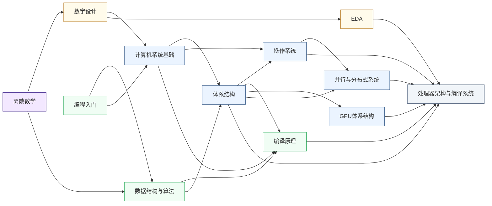

---
hide:
  - navigation
---
设计让计算机算得更快、更省电的核心硬件与软件栈，涵盖通用 CPU、神经网络加速器，以及将算法高效映射到硬件的编译器。

<svg viewBox="0 0 1140 532" xmlns="http://www.w3.org/2000/svg" style="width:100%;max-width:1140px;display:block;margin:1.5rem auto;font-family:system-ui,-apple-system,sans-serif;">
  <rect width="1140" height="532" rx="10" fill="#FFFFFF" stroke="#CBD5E1" stroke-width="1.5"/>
  <text x="570" y="26" text-anchor="middle" font-size="17" font-weight="bold" fill="#1E293B">集成电路科研方向全景图</text>
  <text x="250" y="54" text-anchor="middle" font-size="13.5" font-weight="bold" fill="#0E7490">← 计算媒介更奇异</text>
  <text x="1000" y="54" text-anchor="middle" font-size="13.5" font-weight="bold" fill="#16A34A">更贴近物理世界 →</text>
  <defs><filter id="loc-b" x="-5%" y="-5%" width="110%" height="110%"><feGaussianBlur stdDeviation="1.4"/></filter></defs>
  <rect x="88" y="88" width="147" height="298" rx="6" fill="#ECFEFF"/>
  <rect x="239" y="88" width="147" height="298" rx="6" fill="#F8FAFC"/>
  <rect x="390" y="88" width="147" height="298" rx="6" fill="#FEF2F2"/>
  <rect x="541" y="88" width="289" height="298" rx="6" fill="#EFF6FF"/>
  <rect x="834" y="88" width="76" height="298" rx="6" fill="#FFFBEB"/>
  <rect x="914" y="88" width="218" height="298" rx="6" fill="#F0FDF4"/>
  <text x="161" y="82" text-anchor="middle" font-size="12" font-weight="bold" fill="#0E7490">量子 · 光子</text>
  <text x="312" y="82" text-anchor="middle" font-size="12" font-weight="bold" fill="#64748B">存算 · 类脑</text>
  <text x="463" y="82" text-anchor="middle" font-size="12" font-weight="bold" fill="#DC2626">模拟 · 射频</text>
  <text x="685" y="82" text-anchor="middle" font-size="13" font-weight="bold" fill="#1D4ED8">数字计算</text>
  <text x="872" y="82" text-anchor="middle" font-size="12" font-weight="bold" fill="#D97706">功率电子</text>
  <text x="1023" y="82" text-anchor="middle" font-size="12" font-weight="bold" fill="#16A34A">传感 · 生物 · 机械</text>
  <line x1="86" y1="92" x2="1132" y2="92" stroke="#E2E8F0" stroke-width="1"/>
  <line x1="86" y1="150" x2="1132" y2="150" stroke="#EEF2F6" stroke-width="1"/>
  <line x1="86" y1="208" x2="1132" y2="208" stroke="#EEF2F6" stroke-width="1"/>
  <line x1="86" y1="266" x2="1132" y2="266" stroke="#EEF2F6" stroke-width="1"/>
  <line x1="86" y1="324" x2="1132" y2="324" stroke="#EEF2F6" stroke-width="1"/>
  <line x1="86" y1="382" x2="1132" y2="382" stroke="#E2E8F0" stroke-width="1"/>
  <line x1="86" y1="92" x2="86" y2="382" stroke="#CBD5E1" stroke-width="1"/>
  <text x="81" y="124" text-anchor="end" font-size="10.5" fill="#475569">算法 / 应用</text>
  <text x="81" y="182" text-anchor="end" font-size="10.5" fill="#475569">系统 / 软件</text>
  <text x="81" y="240" text-anchor="end" font-size="10.5" fill="#475569">体系结构</text>
  <text x="81" y="298" text-anchor="end" font-size="10.5" fill="#475569">电路</text>
  <text x="81" y="356" text-anchor="end" font-size="10.5" fill="#475569">器件</text>
  <g filter="url(#loc-b)" opacity="0.42">
  <rect x="92" y="92" width="68" height="290" rx="5" fill="#CFFAFE" stroke="#0E7490" stroke-width="1.2"/>
  <text x="126" y="231" text-anchor="middle" font-size="10.5" font-weight="bold" fill="#0E7490">量子计算</text>
  <text x="126" y="246" text-anchor="middle" font-size="10.5" font-weight="bold" fill="#0E7490">与量子芯片</text>
  <rect x="163" y="92" width="68" height="290" rx="5" fill="#CFFAFE" stroke="#0E7490" stroke-width="1.2"/>
  <text x="197" y="231" text-anchor="middle" font-size="10.5" font-weight="bold" fill="#0E7490">光电子</text>
  <text x="197" y="246" text-anchor="middle" font-size="10.5" font-weight="bold" fill="#0E7490">与硅光集成</text>
  <rect x="394" y="266" width="68" height="116" rx="5" fill="#FEE2E2" stroke="#DC2626" stroke-width="1.2"/>
  <text x="428" y="317" text-anchor="middle" font-size="10.5" font-weight="bold" fill="#DC2626">模拟与</text>
  <text x="428" y="332" text-anchor="middle" font-size="10.5" font-weight="bold" fill="#DC2626">混合信号IC</text>
  <rect x="465" y="266" width="68" height="116" rx="5" fill="#FEE2E2" stroke="#DC2626" stroke-width="1.2"/>
  <text x="499" y="317" text-anchor="middle" font-size="10.5" font-weight="bold" fill="#DC2626">射频与</text>
  <text x="499" y="332" text-anchor="middle" font-size="10.5" font-weight="bold" fill="#DC2626">毫米波IC</text>
  <rect x="243" y="92" width="68" height="290" rx="5" fill="#FEE2E2" stroke="#DC2626" stroke-width="1.2"/>
  <text x="277" y="239" text-anchor="middle" font-size="11.5" font-weight="bold" fill="#DC2626">类脑芯片</text>
  <rect x="314" y="92" width="68" height="290" rx="5" fill="#EDE9FE" stroke="#7C3AED" stroke-width="1.2"/>
  <text x="348" y="231" text-anchor="middle" font-size="10.5" font-weight="bold" fill="#7C3AED">存算一体</text>
  <text x="348" y="246" text-anchor="middle" font-size="10.5" font-weight="bold" fill="#7C3AED">与近存计算</text>
  <rect x="545" y="92" width="68" height="290" rx="5" fill="#EDE9FE" stroke="#7C3AED" stroke-width="1.2"/>
  <text x="579" y="231" text-anchor="middle" font-size="10.5" font-weight="bold" fill="#7C3AED">硬件安全</text>
  <text x="579" y="246" text-anchor="middle" font-size="10.5" font-weight="bold" fill="#7C3AED">与可信计算</text>
  <rect x="616" y="92" width="68" height="174" rx="5" fill="#DBEAFE" stroke="#1D4ED8" stroke-width="1.2"/>
  <text x="650" y="172" text-anchor="middle" font-size="10.5" font-weight="bold" fill="#1D4ED8">AI 算法</text>
  <text x="650" y="187" text-anchor="middle" font-size="10.5" font-weight="bold" fill="#1D4ED8">与系统</text>
  <rect x="687" y="150" width="68" height="116" rx="5" fill="#DBEAFE" stroke="#1D4ED8" stroke-width="1.2"/>
  <text x="721" y="201" text-anchor="middle" font-size="10.5" font-weight="bold" fill="#1D4ED8">处理器架构</text>
  <text x="721" y="216" text-anchor="middle" font-size="10.5" font-weight="bold" fill="#1D4ED8">与编译系统</text>
  <rect x="758" y="208" width="68" height="116" rx="5" fill="#DBEAFE" stroke="#1D4ED8" stroke-width="1.2"/>
  <text x="792" y="259" text-anchor="middle" font-size="10.5" font-weight="bold" fill="#1D4ED8">可重构计算</text>
  <text x="792" y="274" text-anchor="middle" font-size="10.5" font-weight="bold" fill="#1D4ED8">与 FPGA</text>
  <rect x="838" y="266" width="68" height="116" rx="5" fill="#FEF3C7" stroke="#D97706" stroke-width="1.2"/>
  <text x="872" y="317" text-anchor="middle" font-size="10.5" font-weight="bold" fill="#B45309">功率半导体</text>
  <text x="872" y="332" text-anchor="middle" font-size="10" font-weight="bold" fill="#B45309">与宽禁带器件</text>
  <rect x="918" y="92" width="68" height="290" rx="5" fill="#ECFCCB" stroke="#65A30D" stroke-width="1.2"/>
  <text x="952" y="239" text-anchor="middle" font-size="11.5" font-weight="bold" fill="#4D7C0F">具身智能</text>
  <rect x="989" y="266" width="68" height="116" rx="5" fill="#D1FAE5" stroke="#059669" stroke-width="1.2"/>
  <text x="1023" y="317" text-anchor="middle" font-size="10.5" font-weight="bold" fill="#047857">生物电子</text>
  <text x="1023" y="332" text-anchor="middle" font-size="10.5" font-weight="bold" fill="#047857">与脑机接口</text>
  <rect x="1060" y="266" width="68" height="116" rx="5" fill="#DCFCE7" stroke="#16A34A" stroke-width="1.2"/>
  <text x="1094" y="317" text-anchor="middle" font-size="10.5" font-weight="bold" fill="#15803D">MEMS 与</text>
  <text x="1094" y="332" text-anchor="middle" font-size="10.5" font-weight="bold" fill="#15803D">微纳传感器</text>
  </g>
  <text x="81" y="450" text-anchor="end" font-size="10.5" fill="#475569">各方向通用</text>
  <g filter="url(#loc-b)" opacity="0.42">
  <rect x="92" y="408" width="1040" height="28" rx="5" fill="#F1F5F9" stroke="#64748B" stroke-width="1.1"/>
  <text x="612" y="426" text-anchor="middle" font-size="12" font-weight="bold" fill="#475569">EDA 与设计自动化</text>
  <rect x="92" y="440" width="1040" height="28" rx="5" fill="#EEF2F6" stroke="#64748B" stroke-width="1.1"/>
  <text x="612" y="458" text-anchor="middle" font-size="12" font-weight="bold" fill="#475569">先进封装与系统集成</text>
  <rect x="92" y="472" width="1040" height="30" rx="5" fill="#E2E8F0" stroke="#475569" stroke-width="1.2"/>
  <text x="612" y="491" text-anchor="middle" font-size="12" font-weight="bold" fill="#334155">半导体器件与先进工艺</text>
  </g>
  <rect x="92" y="512" width="13" height="13" rx="2" fill="#DBEAFE" stroke="#1D4ED8" stroke-width="1.1"/>
  <text x="110" y="522" text-anchor="start" font-size="10.5" fill="#475569">数字</text>
  <rect x="160" y="512" width="13" height="13" rx="2" fill="#FEE2E2" stroke="#DC2626" stroke-width="1.1"/>
  <text x="178" y="522" text-anchor="start" font-size="10.5" fill="#475569">模拟</text>
  <rect x="228" y="512" width="13" height="13" rx="2" fill="#EDE9FE" stroke="#7C3AED" stroke-width="1.1"/>
  <text x="246" y="522" text-anchor="start" font-size="10.5" fill="#475569">数字 / 模拟 交叉</text>
  <rect x="671" y="153" width="104" height="116" rx="9" fill="#1E293B" opacity="0.16"/>
  <rect x="669" y="150" width="104" height="116" rx="9" fill="#DBEAFE" stroke="#1D4ED8" stroke-width="2.6"/>
  <text x="721" y="201" text-anchor="middle" font-size="13" font-weight="bold" fill="#1D4ED8">处理器架构</text>
  <text x="721" y="216" text-anchor="middle" font-size="13" font-weight="bold" fill="#1D4ED8">与编译系统</text>
</svg>

## 这个方向在研究什么

手机用面容解锁时，干活的不是 CPU（Central Processing Unit，中央处理器），是一颗专用神经引擎。它用不到一瓦的功耗，几毫秒跑完整个神经网络推理；同一个模型扔回 CPU 上，慢二十倍，耗电多十倍。<u>算法没变，参数没变，变的只是计算单元怎么组织、数据走什么路径、中间结果存在哪</u>。这就是处理器架构要回答的问题。给你一批晶体管，怎么排成一台计算机，才能在物理约束下算得最快、耗电最少。

<svg viewBox="0 0 860 330" style="width:100%;max-width:860px;display:block;margin:1.5em auto;font-family:system-ui,-apple-system,sans-serif">
  <rect x="10" y="10" width="840" height="310" rx="8" fill="#F8FAFC" stroke="#CBD5E1" stroke-width="1.5"/>
  <text x="430" y="34" text-anchor="middle" font-size="13" font-weight="700" fill="#1E293B">计算机系统的抽象层次</text>
  <rect x="170" y="50" width="330" height="26" rx="4" fill="#E2E8F0" stroke="#94A3B8" stroke-width="1.2"/>
  <text x="335" y="67" text-anchor="middle" font-size="11" fill="#475569">应用程序</text>
  <text x="515" y="67" font-size="10" fill="#94A3B8">ChatGPT · 浏览器 · 游戏</text>
  <rect x="170" y="82" width="330" height="26" rx="4" fill="#E2E8F0" stroke="#94A3B8" stroke-width="1.2"/>
  <text x="335" y="99" text-anchor="middle" font-size="11" fill="#475569">算法</text>
  <text x="515" y="99" font-size="10" fill="#94A3B8">Transformer · 快速排序</text>
  <rect x="170" y="114" width="330" height="26" rx="4" fill="#E2E8F0" stroke="#94A3B8" stroke-width="1.2"/>
  <text x="335" y="131" text-anchor="middle" font-size="11" fill="#475569">编程语言</text>
  <text x="515" y="131" font-size="10" fill="#94A3B8">C++ · Python · CUDA</text>
  <rect x="170" y="146" width="330" height="26" rx="4" fill="#BFDBFE" stroke="#3B82F6" stroke-width="1.5"/>
  <text x="335" y="163" text-anchor="middle" font-size="11" font-weight="600" fill="#1E40AF">编译器</text>
  <text x="515" y="163" font-size="10" fill="#3B82F6">LLVM · MLIR · TVM</text>
  <rect x="170" y="178" width="330" height="26" rx="4" fill="#93C5FD" stroke="#1E40AF" stroke-width="2"/>
  <text x="335" y="195" text-anchor="middle" font-size="11" font-weight="700" fill="#1E3A8A">指令集架构（ISA）</text>
  <text x="515" y="195" font-size="10" fill="#3B82F6">x86 · ARM · RISC-V</text>
  <rect x="170" y="210" width="330" height="26" rx="4" fill="#BFDBFE" stroke="#3B82F6" stroke-width="1.5"/>
  <text x="335" y="227" text-anchor="middle" font-size="11" font-weight="600" fill="#1E40AF">微架构</text>
  <text x="515" y="227" font-size="10" fill="#3B82F6">流水线 · 分支预测 · 缓存层次</text>
  <rect x="170" y="242" width="330" height="26" rx="4" fill="#E2E8F0" stroke="#94A3B8" stroke-width="1.2"/>
  <text x="335" y="259" text-anchor="middle" font-size="11" fill="#475569">逻辑电路</text>
  <text x="515" y="259" font-size="10" fill="#94A3B8">RTL · 门级网表</text>
  <rect x="170" y="274" width="330" height="26" rx="4" fill="#E2E8F0" stroke="#94A3B8" stroke-width="1.2"/>
  <text x="335" y="291" text-anchor="middle" font-size="11" fill="#475569">器件与工艺</text>
  <text x="515" y="291" font-size="10" fill="#94A3B8">晶体管 · 制程节点</text>
  <line x1="732" y1="146" x2="732" y2="236" stroke="#3B82F6" stroke-width="2"/>
  <line x1="732" y1="146" x2="724" y2="146" stroke="#3B82F6" stroke-width="2"/>
  <line x1="732" y1="236" x2="724" y2="236" stroke="#3B82F6" stroke-width="2"/>
  <text x="742" y="186" font-size="11" font-weight="700" fill="#1E40AF">本方向</text>
  <text x="430" y="313" text-anchor="middle" font-size="10" fill="#94A3B8">上层归算法与软件，最底层归器件与工艺，中间三层是处理器架构与编译系统的研究对象</text>
</svg>

这个问题曾经不重要。**摩尔定律**（Moore's Law）让晶体管数量每两年翻倍，**Dennard 缩放定律**（Dennard scaling）保证晶体管越小跑得越快还不多耗电，两条定律一叠加，同一个设计隔两年换个新制程重新流片，性能自动翻倍，力大砖飞就是主旋律。2005 年前后 Dennard 缩放先撑不住了，晶体管小到一定程度漏电压不下去，功耗密度顶到散热极限，主频从此钉死在 4 GHz 附近将近二十年。摩尔定律也在 2015 年之后明显放缓，每一代制程更贵、更慢、红利更薄。偏偏这时候大语言模型把算力需求推上了陡得多的曲线，训练 GPT-4 的算力比五年前的 GPT-2 多了近一万倍。<u>工艺红利基本耗尽，但算力需求仍在持续增长，缺口只能靠架构设计填补</u>。Hennessy 和 Patterson 说这是计算机架构的新黄金时代，就是这个意思。

<svg viewBox="0 0 860 235" xmlns="http://www.w3.org/2000/svg" style="width:100%;max-width:860px;display:block;margin:1.5rem auto;font-family:system-ui,sans-serif;">
  <rect x="0" y="0" width="860" height="235" rx="10" fill="#F8FAFC" stroke="#CBD5E1" stroke-width="1.5"/>
  <text x="430" y="16" text-anchor="middle" font-size="14" fill="#64748B">处理器单线程性能演进（1993=1×，纵轴对数坐标）</text>
  <rect x="80" y="22" width="287" height="173" fill="#EFF6FF" opacity="0.8"/>
  <rect x="367" y="22" width="453" height="173" fill="#FFFBEB" opacity="0.8"/>
  <text x="172" y="38" text-anchor="middle" font-size="13" font-weight="700" fill="#1D4ED8">制程时代</text>
  <text x="172" y="51" text-anchor="middle" font-size="11" fill="#3B82F6">年均性能 +50%，随制程提升即可</text>
  <text x="578" y="38" text-anchor="middle" font-size="13" font-weight="700" fill="#D97706">架构时代</text>
  <text x="578" y="51" text-anchor="middle" font-size="11" fill="#D97706">制程红利衰减，年均性能 +8%</text>
  <line x1="80" y1="195" x2="822" y2="195" stroke="#94A3B8" stroke-width="1"/>
  <line x1="80" y1="156" x2="822" y2="156" stroke="#E2E8F0" stroke-width="1"/>
  <line x1="80" y1="117" x2="822" y2="117" stroke="#E2E8F0" stroke-width="1"/>
  <line x1="80" y1="79" x2="822" y2="79" stroke="#E2E8F0" stroke-width="1"/>
  <line x1="80" y1="40" x2="822" y2="40" stroke="#E2E8F0" stroke-width="1"/>
  <text x="74" y="199" text-anchor="end" font-size="11.5" fill="#94A3B8">1×</text>
  <text x="74" y="160" text-anchor="end" font-size="11.5" fill="#94A3B8">4×</text>
  <text x="74" y="121" text-anchor="end" font-size="11.5" fill="#94A3B8">16×</text>
  <text x="74" y="83" text-anchor="end" font-size="11.5" fill="#94A3B8">64×</text>
  <text x="74" y="44" text-anchor="end" font-size="11.5" fill="#94A3B8">256×</text>
  <text x="80" y="212" text-anchor="middle" font-size="11.5" fill="#64748B">1993</text>
  <text x="199" y="212" text-anchor="middle" font-size="11.5" fill="#64748B">1998</text>
  <text x="319" y="212" text-anchor="middle" font-size="11.5" fill="#64748B">2003</text>
  <text x="439" y="212" text-anchor="middle" font-size="11.5" fill="#64748B">2008</text>
  <text x="558" y="212" text-anchor="middle" font-size="11.5" fill="#64748B">2013</text>
  <text x="677" y="212" text-anchor="middle" font-size="11.5" fill="#64748B">2018</text>
  <text x="797" y="212" text-anchor="middle" font-size="11.5" fill="#64748B">2023</text>
  <line x1="80" y1="22" x2="80" y2="195" stroke="#94A3B8" stroke-width="1"/>
  <line x1="367" y1="22" x2="367" y2="195" stroke="#F59E0B" stroke-width="1.5" stroke-dasharray="4,3"/>
  <text x="367" y="222" text-anchor="middle" font-size="10.5" fill="#D97706">功耗墙</text>
  <polyline points="80,195 128,169 176,143 223,117 271,91 319,65 367,40" fill="none" stroke="#CBD5E1" stroke-width="1.5" stroke-dasharray="7,4"/>
  <line x1="367" y1="40" x2="355" y2="26" stroke="#CBD5E1" stroke-width="1.5" stroke-dasharray="4,3"/>
  <polygon points="352,28 356,20 360,28" fill="#CBD5E1"/>
  <text x="390" y="36" font-size="10.5" fill="#94A3B8">理想：每18个月翻倍</text>
  <polyline points="80,195 128,176 176,157 223,138 271,119 319,100 343,91 367,84 415,78 486,70 558,65 630,61 701,56 773,50 821,47" fill="none" stroke="#1D4ED8" stroke-width="2.5" stroke-linejoin="round"/>
  <circle cx="80" cy="195" r="3.5" fill="#1D4ED8"/>
  <circle cx="367" cy="84" r="4" fill="#D97706" stroke="#fff" stroke-width="1"/>
  <circle cx="821" cy="47" r="3.5" fill="#1D4ED8"/>
  <text x="373" y="81" font-size="10.5" fill="#D97706">2005年转折</text>
  <line x1="660" y1="175" x2="690" y2="175" stroke="#CBD5E1" stroke-width="1.5" stroke-dasharray="7,4"/>
  <text x="696" y="179" font-size="10.5" fill="#94A3B8">理想摩尔定律</text>
  <line x1="660" y1="188" x2="690" y2="188" stroke="#1D4ED8" stroke-width="2.5"/>
  <text x="696" y="192" font-size="10.5" fill="#1D4ED8">实际单线程性能</text>
</svg>

架构设计真正要斗的，第一个是**内存墙**（memory wall）。处理器每秒能做几百万亿次浮点乘加，从主内存搬数据的速度却远远跟不上，访问一次内存的时间够做几百次乘法，芯片大部分时间不在算，在等。GPU（Graphics Processing Unit，图形处理器）的对策是人海战术，同时养着几万个线程，谁在等内存就把谁挂起，换下一批接着算，计算单元永远不空转。Google TPU（Tensor Processing Unit，张量处理器）的**脉动阵列**（systolic array）反过来在数据复用上下功夫，权重钉在计算单元里不动，输入像波浪一样流过，每个权重从内存只取一次。第二个要斗的是专用和通用的取舍。通用 CPU 要能跑任意程序，塞满了分支预测器、乱序执行引擎和大缓存，这些机构跑神经网络推理时几乎全在空转。Apple Neural Engine 把它们全拆了，只留矩阵乘法的电路，能效高出一两个数量级。这类芯片统称**领域专用架构**（Domain-Specific Architecture, DSA），代价是算法一变，芯片可能就得重做，这个权衡随算法迭代持续移动。第三个没那么显眼，软件和硬件的边界本身是活的。什么固化进电路、什么让编译器提前排好、什么留给运行时现场调度，这条边界放在哪里本身就是研究对象。同一块 GPU，换一套内存调度策略，LLM 推理的吞吐量能差十倍。

<svg viewBox="0 0 860 256" xmlns="http://www.w3.org/2000/svg" style="width:100%;max-width:860px;display:block;margin:1.5rem auto;font-family:system-ui,sans-serif;">
  <rect x="8" y="8" width="844" height="240" rx="10" fill="#F8FAFC" stroke="#CBD5E1" stroke-width="1.5"/>
  <text x="148" y="32" text-anchor="middle" font-size="15" font-weight="700" fill="#1D4ED8">CPU</text>
  <text x="148" y="47" text-anchor="middle" font-size="11" fill="#64748B">少数复杂核 · 为低延迟而生</text>
  <rect x="36" y="56" width="100" height="50" rx="5" fill="#DBEAFE" stroke="#3B82F6" stroke-width="1.5"/>
  <text x="86" y="75" text-anchor="middle" font-size="11" fill="#1E40AF">乱序执行引擎</text>
  <text x="86" y="88" text-anchor="middle" font-size="11" fill="#1E40AF">分支预测器</text>
  <text x="86" y="101" text-anchor="middle" font-size="11" fill="#1E40AF">L1/L2 Cache</text>
  <rect x="160" y="56" width="100" height="50" rx="5" fill="#DBEAFE" stroke="#3B82F6" stroke-width="1.5"/>
  <text x="210" y="75" text-anchor="middle" font-size="11" fill="#1E40AF">乱序执行引擎</text>
  <text x="210" y="88" text-anchor="middle" font-size="11" fill="#1E40AF">分支预测器</text>
  <text x="210" y="101" text-anchor="middle" font-size="11" fill="#1E40AF">L1/L2 Cache</text>
  <rect x="36" y="114" width="100" height="50" rx="5" fill="#DBEAFE" stroke="#3B82F6" stroke-width="1.5"/>
  <text x="86" y="133" text-anchor="middle" font-size="11" fill="#1E40AF">乱序执行引擎</text>
  <text x="86" y="146" text-anchor="middle" font-size="11" fill="#1E40AF">分支预测器</text>
  <text x="86" y="159" text-anchor="middle" font-size="11" fill="#1E40AF">L1/L2 Cache</text>
  <rect x="160" y="114" width="100" height="50" rx="5" fill="#DBEAFE" stroke="#3B82F6" stroke-width="1.5"/>
  <text x="210" y="133" text-anchor="middle" font-size="11" fill="#1E40AF">乱序执行引擎</text>
  <text x="210" y="146" text-anchor="middle" font-size="11" fill="#1E40AF">分支预测器</text>
  <text x="210" y="159" text-anchor="middle" font-size="11" fill="#1E40AF">L1/L2 Cache</text>
  <rect x="36" y="172" width="224" height="20" rx="4" fill="#BFDBFE" stroke="#3B82F6" stroke-width="1"/>
  <text x="148" y="186" text-anchor="middle" font-size="11.5" fill="#1D4ED8">共享 L3 Cache（数十 MB）</text>
  <text x="148" y="220" text-anchor="middle" font-size="13" font-weight="600" fill="#1D4ED8">4–64 核</text>
  <text x="148" y="236" text-anchor="middle" font-size="12" fill="#64748B">通用程序，单线程延迟低</text>
  <line x1="290" y1="18" x2="290" y2="242" stroke="#E2E8F0" stroke-width="1.5"/>
  <text x="438" y="32" text-anchor="middle" font-size="15" font-weight="700" fill="#7C3AED">GPU</text>
  <text x="438" y="47" text-anchor="middle" font-size="11" fill="#64748B">海量简单核 · 靠切换线程隐藏延迟</text>
  <rect x="300" y="56" width="276" height="136" rx="6" fill="#F5F3FF" stroke="#7C3AED" stroke-width="1.5"/>
  <text x="438" y="72" text-anchor="middle" font-size="11" fill="#6D28D9">流式多处理器（SM）× 132</text>
  <rect x="311" y="79" width="17" height="13" rx="2" fill="#C4B5FD"/>
  <rect x="333" y="79" width="17" height="13" rx="2" fill="#C4B5FD"/>
  <rect x="355" y="79" width="17" height="13" rx="2" fill="#C4B5FD"/>
  <rect x="377" y="79" width="17" height="13" rx="2" fill="#C4B5FD"/>
  <rect x="399" y="79" width="17" height="13" rx="2" fill="#C4B5FD"/>
  <rect x="421" y="79" width="17" height="13" rx="2" fill="#C4B5FD"/>
  <rect x="443" y="79" width="17" height="13" rx="2" fill="#C4B5FD"/>
  <rect x="465" y="79" width="17" height="13" rx="2" fill="#C4B5FD"/>
  <rect x="487" y="79" width="17" height="13" rx="2" fill="#C4B5FD"/>
  <rect x="509" y="79" width="17" height="13" rx="2" fill="#C4B5FD"/>
  <rect x="531" y="79" width="17" height="13" rx="2" fill="#C4B5FD"/>
  <rect x="553" y="79" width="17" height="13" rx="2" fill="#C4B5FD"/>
  <rect x="311" y="98" width="17" height="13" rx="2" fill="#C4B5FD"/>
  <rect x="333" y="98" width="17" height="13" rx="2" fill="#C4B5FD"/>
  <rect x="355" y="98" width="17" height="13" rx="2" fill="#C4B5FD"/>
  <rect x="377" y="98" width="17" height="13" rx="2" fill="#C4B5FD"/>
  <rect x="399" y="98" width="17" height="13" rx="2" fill="#C4B5FD"/>
  <rect x="421" y="98" width="17" height="13" rx="2" fill="#C4B5FD"/>
  <rect x="443" y="98" width="17" height="13" rx="2" fill="#C4B5FD"/>
  <rect x="465" y="98" width="17" height="13" rx="2" fill="#C4B5FD"/>
  <rect x="487" y="98" width="17" height="13" rx="2" fill="#C4B5FD"/>
  <rect x="509" y="98" width="17" height="13" rx="2" fill="#C4B5FD"/>
  <rect x="531" y="98" width="17" height="13" rx="2" fill="#C4B5FD"/>
  <rect x="553" y="98" width="17" height="13" rx="2" fill="#C4B5FD"/>
  <rect x="311" y="117" width="17" height="13" rx="2" fill="#A78BFA"/>
  <rect x="333" y="117" width="17" height="13" rx="2" fill="#A78BFA"/>
  <rect x="355" y="117" width="17" height="13" rx="2" fill="#A78BFA"/>
  <rect x="377" y="117" width="17" height="13" rx="2" fill="#A78BFA"/>
  <rect x="399" y="117" width="17" height="13" rx="2" fill="#A78BFA"/>
  <rect x="421" y="117" width="17" height="13" rx="2" fill="#A78BFA"/>
  <rect x="443" y="117" width="17" height="13" rx="2" fill="#A78BFA"/>
  <rect x="465" y="117" width="17" height="13" rx="2" fill="#A78BFA"/>
  <rect x="487" y="117" width="17" height="13" rx="2" fill="#A78BFA"/>
  <rect x="509" y="117" width="17" height="13" rx="2" fill="#A78BFA"/>
  <rect x="531" y="117" width="17" height="13" rx="2" fill="#A78BFA"/>
  <rect x="553" y="117" width="17" height="13" rx="2" fill="#A78BFA"/>
  <rect x="311" y="136" width="17" height="13" rx="2" fill="#A78BFA"/>
  <rect x="333" y="136" width="17" height="13" rx="2" fill="#A78BFA"/>
  <rect x="355" y="136" width="17" height="13" rx="2" fill="#A78BFA"/>
  <rect x="377" y="136" width="17" height="13" rx="2" fill="#A78BFA"/>
  <rect x="399" y="136" width="17" height="13" rx="2" fill="#A78BFA"/>
  <rect x="421" y="136" width="17" height="13" rx="2" fill="#A78BFA"/>
  <rect x="443" y="136" width="17" height="13" rx="2" fill="#A78BFA"/>
  <rect x="465" y="136" width="17" height="13" rx="2" fill="#A78BFA"/>
  <rect x="487" y="136" width="17" height="13" rx="2" fill="#A78BFA"/>
  <rect x="509" y="136" width="17" height="13" rx="2" fill="#A78BFA"/>
  <rect x="531" y="136" width="17" height="13" rx="2" fill="#A78BFA"/>
  <rect x="553" y="136" width="17" height="13" rx="2" fill="#A78BFA"/>
  <rect x="311" y="155" width="17" height="13" rx="2" fill="#8B5CF6"/>
  <rect x="333" y="155" width="17" height="13" rx="2" fill="#8B5CF6"/>
  <rect x="355" y="155" width="17" height="13" rx="2" fill="#8B5CF6"/>
  <rect x="377" y="155" width="17" height="13" rx="2" fill="#8B5CF6"/>
  <rect x="399" y="155" width="17" height="13" rx="2" fill="#8B5CF6"/>
  <rect x="421" y="155" width="17" height="13" rx="2" fill="#8B5CF6"/>
  <rect x="443" y="155" width="17" height="13" rx="2" fill="#8B5CF6"/>
  <rect x="465" y="155" width="17" height="13" rx="2" fill="#8B5CF6"/>
  <rect x="487" y="155" width="17" height="13" rx="2" fill="#8B5CF6"/>
  <rect x="509" y="155" width="17" height="13" rx="2" fill="#8B5CF6"/>
  <rect x="531" y="155" width="17" height="13" rx="2" fill="#8B5CF6"/>
  <rect x="553" y="155" width="17" height="13" rx="2" fill="#8B5CF6"/>
  <text x="438" y="220" text-anchor="middle" font-size="13" font-weight="600" fill="#7C3AED">~17,000 核</text>
  <text x="438" y="236" text-anchor="middle" font-size="11" fill="#64748B">并行规则计算，吞吐量极高</text>
  <line x1="584" y1="18" x2="584" y2="242" stroke="#E2E8F0" stroke-width="1.5"/>
  <text x="722" y="32" text-anchor="middle" font-size="15" font-weight="700" fill="#15803D">DSA（以 TPU 为例）</text>
  <text x="722" y="47" text-anchor="middle" font-size="11" fill="#64748B">脉动阵列 · 权重只读一次</text>
  <text x="596" y="73" text-anchor="start" font-size="11" fill="#15803D">输入行→</text>
  <rect x="648" y="62" width="26" height="20" rx="3" fill="#BBF7D0" stroke="#16A34A" stroke-width="1.2"/>
  <text x="661" y="76" text-anchor="middle" font-size="10" fill="#166534">MAC</text>
  <rect x="688" y="62" width="26" height="20" rx="3" fill="#BBF7D0" stroke="#16A34A" stroke-width="1.2"/>
  <text x="701" y="76" text-anchor="middle" font-size="10" fill="#166534">MAC</text>
  <rect x="728" y="62" width="26" height="20" rx="3" fill="#BBF7D0" stroke="#16A34A" stroke-width="1.2"/>
  <text x="741" y="76" text-anchor="middle" font-size="10" fill="#166534">MAC</text>
  <rect x="768" y="62" width="26" height="20" rx="3" fill="#BBF7D0" stroke="#16A34A" stroke-width="1.2"/>
  <text x="781" y="76" text-anchor="middle" font-size="10" fill="#166534">MAC</text>
  <text x="596" y="103" text-anchor="start" font-size="11" fill="#15803D">输入行→</text>
  <rect x="648" y="92" width="26" height="20" rx="3" fill="#BBF7D0" stroke="#16A34A" stroke-width="1.2"/>
  <text x="661" y="106" text-anchor="middle" font-size="10" fill="#166534">MAC</text>
  <rect x="688" y="92" width="26" height="20" rx="3" fill="#BBF7D0" stroke="#16A34A" stroke-width="1.2"/>
  <text x="701" y="106" text-anchor="middle" font-size="10" fill="#166534">MAC</text>
  <rect x="728" y="92" width="26" height="20" rx="3" fill="#BBF7D0" stroke="#16A34A" stroke-width="1.2"/>
  <text x="741" y="106" text-anchor="middle" font-size="10" fill="#166534">MAC</text>
  <rect x="768" y="92" width="26" height="20" rx="3" fill="#BBF7D0" stroke="#16A34A" stroke-width="1.2"/>
  <text x="781" y="106" text-anchor="middle" font-size="10" fill="#166534">MAC</text>
  <text x="596" y="133" text-anchor="start" font-size="11" fill="#15803D">输入行→</text>
  <rect x="648" y="122" width="26" height="20" rx="3" fill="#86EFAC" stroke="#16A34A" stroke-width="1.2"/>
  <text x="661" y="136" text-anchor="middle" font-size="10" fill="#166534">MAC</text>
  <rect x="688" y="122" width="26" height="20" rx="3" fill="#86EFAC" stroke="#16A34A" stroke-width="1.2"/>
  <text x="701" y="136" text-anchor="middle" font-size="10" fill="#166534">MAC</text>
  <rect x="728" y="122" width="26" height="20" rx="3" fill="#86EFAC" stroke="#16A34A" stroke-width="1.2"/>
  <text x="741" y="136" text-anchor="middle" font-size="10" fill="#166534">MAC</text>
  <rect x="768" y="122" width="26" height="20" rx="3" fill="#86EFAC" stroke="#16A34A" stroke-width="1.2"/>
  <text x="781" y="136" text-anchor="middle" font-size="10" fill="#166534">MAC</text>
  <text x="596" y="163" text-anchor="start" font-size="11" fill="#15803D">输入行→</text>
  <rect x="648" y="152" width="26" height="20" rx="3" fill="#86EFAC" stroke="#16A34A" stroke-width="1.2"/>
  <text x="661" y="166" text-anchor="middle" font-size="10" fill="#166534">MAC</text>
  <rect x="688" y="152" width="26" height="20" rx="3" fill="#86EFAC" stroke="#16A34A" stroke-width="1.2"/>
  <text x="701" y="166" text-anchor="middle" font-size="10" fill="#166534">MAC</text>
  <rect x="728" y="152" width="26" height="20" rx="3" fill="#86EFAC" stroke="#16A34A" stroke-width="1.2"/>
  <text x="741" y="166" text-anchor="middle" font-size="10" fill="#166534">MAC</text>
  <rect x="768" y="152" width="26" height="20" rx="3" fill="#86EFAC" stroke="#16A34A" stroke-width="1.2"/>
  <text x="781" y="166" text-anchor="middle" font-size="10" fill="#166534">MAC</text>
  <text x="661" y="185" text-anchor="middle" font-size="11" fill="#15803D">↓结果</text>
  <text x="701" y="185" text-anchor="middle" font-size="11" fill="#15803D">↓结果</text>
  <text x="741" y="185" text-anchor="middle" font-size="11" fill="#15803D">↓结果</text>
  <text x="781" y="185" text-anchor="middle" font-size="11" fill="#15803D">↓结果</text>
  <text x="722" y="220" text-anchor="middle" font-size="13" font-weight="600" fill="#15803D">256 × 256 MAC阵列</text>
  <text x="722" y="236" text-anchor="middle" font-size="12" fill="#64748B">只做矩阵乘，能效极高</text>
</svg>

设计一块处理器，首先要确定的是**指令集**（Instruction Set Architecture, ISA），也就是软件能看到、硬件必须实现的那层接口。**x86** 走的是“指令越丰富越好”的路，几十年向后兼容积累了大量包袱，光解码电路就要烧掉不少功耗；**ARM** 用精简指令集换来更低的实现成本，在移动端大获全胜；**RISC-V** 干脆把指令集开源，不交授权费就能自己设计和修改。Hennessy 与 Patterson 把开源 ISA 列为新黄金时代的结构性条件，它把芯片创新的门槛从亿级资本降到了学术组玩得起的范围。

指令集之下是**微架构**，同一套 ISA 可以有无数种不同的电路实现。同样是 x86，Intel Raptor Lake 和 AMD Zen 4 的流水线级数、乱序执行宽度、分支预测算法完全不同，性能和功耗能差 30%。微架构是架构研究发表最密集的地方。分支预测命中率多高、预取器提前几步取数据、缓存替换选 LRU 还是 RRIP，每一个细节都是独立的研究课题。贯穿其中的是**存储层次**这条暗线。L1 缓存命中四拍，L3 要四十拍，DRAM 等两百拍，每一级的大小、替换算法、与相邻层的预取协议都压在真实性能上。<u>内存墙的影响体现在每一个缓存设计决策上。</u>

以上这些研究全部在**冯·诺依曼架构**的框架之内进行。计算与存储分离、指令顺序取来执行，是 1945 年以来所有主流处理器共同遵守的基本假设。近年来研究者开始正面质疑这个假设本身。神经形态计算用脉冲信号取代精确数值，数据流架构让计算随数据到来自动触发，**近存计算**（Near-Memory Processing, NMP）把处理单元挪到内存旁边，**存算一体**（Computing-in-Memory, CIM）直接在存储阵列内部完成乘加运算。这些非冯方向的动机是同一个，数据搬运的成本已经大到不得不从根本上重新考虑计算与存储的关系。其中存算一体和近存计算热度最高，已经自成一个方向，见[存算一体与近存计算](存算一体与近存计算.md)。

编译器是架构研究的必要组成部分，新芯片没有配套软件栈，应用就无法运行。编译器的核心工作是**调度**，决定指令以什么顺序执行、数据从哪里取、什么时候取。调度有两种基本哲学。**静态调度**在编译期把一切安排好，生成的指令序列运行时无需硬件再做决策，是 **VLIW**（Very Long Instruction Word，超长指令字）这类架构的基础；**动态调度**把决策权留给硬件，处理器在运行时按实际情况乱序执行，能应对编译期无法预知的变化，是现代高性能 CPU 的标配。

<svg viewBox="0 0 880 240" style="width:100%;max-width:860px;display:block;margin:1.5em auto;font-family:system-ui,-apple-system,sans-serif">
  <!-- Panel 1: 静态调度 -->
  <rect x="10" y="10" width="420" height="220" rx="8" fill="#F8FAFC" stroke="#CBD5E1" stroke-width="1.5"/>
  <text x="220" y="32" text-anchor="middle" font-size="13" font-weight="700" fill="#1E293B">静态调度</text>
  <text x="220" y="54" text-anchor="middle" font-size="9" fill="#94A3B8">程序顺序</text>
  <rect x="152" y="60" width="28" height="28" rx="4" fill="#BFDBFE" stroke="#3B82F6" stroke-width="1.5"/>
  <text x="166" y="79" text-anchor="middle" font-size="12" font-weight="700" fill="#1E40AF">1</text>
  <rect x="188" y="60" width="28" height="28" rx="4" fill="#FEF3C7" stroke="#D97706" stroke-width="1.5"/>
  <text x="202" y="79" text-anchor="middle" font-size="12" font-weight="700" fill="#92400E">2</text>
  <rect x="224" y="60" width="28" height="28" rx="4" fill="#DCFCE7" stroke="#16A34A" stroke-width="1.5"/>
  <text x="238" y="79" text-anchor="middle" font-size="12" font-weight="700" fill="#166534">3</text>
  <rect x="260" y="60" width="28" height="28" rx="4" fill="#EDE9FE" stroke="#7C3AED" stroke-width="1.5"/>
  <text x="274" y="79" text-anchor="middle" font-size="12" font-weight="700" fill="#5B21B6">4</text>
  <line x1="220" y1="92" x2="220" y2="100" stroke="#64748B" stroke-width="1.5"/>
  <path d="M216,100 L224,100 L220,106 z" fill="#64748B"/>
  <rect x="120" y="108" width="200" height="30" rx="5" fill="#DCFCE7" stroke="#16A34A" stroke-width="1.5"/>
  <text x="220" y="127" text-anchor="middle" font-size="11" font-weight="600" fill="#166534">编译器在编译期排定顺序</text>
  <line x1="220" y1="142" x2="220" y2="150" stroke="#64748B" stroke-width="1.5"/>
  <path d="M216,150 L224,150 L220,156 z" fill="#64748B"/>
  <rect x="152" y="160" width="28" height="28" rx="4" fill="#BFDBFE" stroke="#3B82F6" stroke-width="1.5"/>
  <text x="166" y="179" text-anchor="middle" font-size="12" font-weight="700" fill="#1E40AF">1</text>
  <rect x="188" y="160" width="28" height="28" rx="4" fill="#FEF3C7" stroke="#D97706" stroke-width="1.5"/>
  <text x="202" y="179" text-anchor="middle" font-size="12" font-weight="700" fill="#92400E">2</text>
  <rect x="224" y="160" width="28" height="28" rx="4" fill="#DCFCE7" stroke="#16A34A" stroke-width="1.5"/>
  <text x="238" y="179" text-anchor="middle" font-size="12" font-weight="700" fill="#166534">3</text>
  <rect x="260" y="160" width="28" height="28" rx="4" fill="#EDE9FE" stroke="#7C3AED" stroke-width="1.5"/>
  <text x="274" y="179" text-anchor="middle" font-size="12" font-weight="700" fill="#5B21B6">4</text>
  <text x="220" y="206" text-anchor="middle" font-size="10" fill="#475569">运行时不再改变顺序，硬件照单执行</text>
  <text x="220" y="221" text-anchor="middle" font-size="10" fill="#94A3B8">硬件简单省电 · 代表：VLIW</text>
  <!-- Panel 2: 动态调度 -->
  <rect x="450" y="10" width="420" height="220" rx="8" fill="#F8FAFC" stroke="#CBD5E1" stroke-width="1.5"/>
  <text x="660" y="32" text-anchor="middle" font-size="13" font-weight="700" fill="#1E293B">动态调度</text>
  <text x="660" y="54" text-anchor="middle" font-size="9" fill="#94A3B8">程序顺序</text>
  <rect x="592" y="60" width="28" height="28" rx="4" fill="#BFDBFE" stroke="#3B82F6" stroke-width="1.5"/>
  <text x="606" y="79" text-anchor="middle" font-size="12" font-weight="700" fill="#1E40AF">1</text>
  <rect x="628" y="60" width="28" height="28" rx="4" fill="#FEF3C7" stroke="#D97706" stroke-width="1.5"/>
  <text x="642" y="79" text-anchor="middle" font-size="12" font-weight="700" fill="#92400E">2</text>
  <rect x="664" y="60" width="28" height="28" rx="4" fill="#DCFCE7" stroke="#16A34A" stroke-width="1.5"/>
  <text x="678" y="79" text-anchor="middle" font-size="12" font-weight="700" fill="#166534">3</text>
  <rect x="700" y="60" width="28" height="28" rx="4" fill="#EDE9FE" stroke="#7C3AED" stroke-width="1.5"/>
  <text x="714" y="79" text-anchor="middle" font-size="12" font-weight="700" fill="#5B21B6">4</text>
  <line x1="660" y1="92" x2="660" y2="100" stroke="#64748B" stroke-width="1.5"/>
  <path d="M656,100 L664,100 L660,106 z" fill="#64748B"/>
  <rect x="560" y="108" width="200" height="30" rx="5" fill="#FEF3C7" stroke="#D97706" stroke-width="1.5"/>
  <text x="660" y="127" text-anchor="middle" font-size="11" font-weight="600" fill="#92400E">乱序执行引擎在运行时重排</text>
  <line x1="660" y1="142" x2="660" y2="150" stroke="#64748B" stroke-width="1.5"/>
  <path d="M656,150 L664,150 L660,156 z" fill="#64748B"/>
  <rect x="592" y="160" width="28" height="28" rx="4" fill="#BFDBFE" stroke="#3B82F6" stroke-width="1.5"/>
  <text x="606" y="179" text-anchor="middle" font-size="12" font-weight="700" fill="#1E40AF">1</text>
  <rect x="628" y="160" width="28" height="28" rx="4" fill="#DCFCE7" stroke="#16A34A" stroke-width="1.5"/>
  <text x="642" y="179" text-anchor="middle" font-size="12" font-weight="700" fill="#166534">3</text>
  <rect x="664" y="160" width="28" height="28" rx="4" fill="#FEF3C7" stroke="#D97706" stroke-width="1.5"/>
  <text x="678" y="179" text-anchor="middle" font-size="12" font-weight="700" fill="#92400E">2</text>
  <rect x="700" y="160" width="28" height="28" rx="4" fill="#EDE9FE" stroke="#7C3AED" stroke-width="1.5"/>
  <text x="714" y="179" text-anchor="middle" font-size="12" font-weight="700" fill="#5B21B6">4</text>
  <text x="660" y="206" text-anchor="middle" font-size="10" fill="#475569">指令 2 在等数据，就绪的指令 3 先执行</text>
  <text x="660" y="221" text-anchor="middle" font-size="10" fill="#94A3B8">硬件复杂但灵活 · 代表：现代高性能 CPU</text>
</svg>

**LLVM** 系统化地解决了不同硬件后端与不同语言前端之间的适配问题；**MLIR** 把这套思路延伸到张量运算，在“矩阵乘法”和“硬件寄存器”之间架起多个中间层；**TVM** 再加上自动调优，用搜索在数百万种循环分块方案里找最优配置。

<svg viewBox="0 0 880 250" style="width:100%;max-width:860px;display:block;margin:1.5em auto;font-family:system-ui,-apple-system,sans-serif">
  <!-- Panel 1: 没有 IR -->
  <rect x="10" y="10" width="420" height="230" rx="8" fill="#F8FAFC" stroke="#CBD5E1" stroke-width="1.5"/>
  <text x="220" y="32" text-anchor="middle" font-size="13" font-weight="700" fill="#1E293B">没有中间表示</text>
  <rect x="40" y="64" width="90" height="28" rx="4" fill="#E2E8F0" stroke="#94A3B8" stroke-width="1.2"/>
  <text x="85" y="82" text-anchor="middle" font-size="10" fill="#475569">C++</text>
  <rect x="40" y="114" width="90" height="28" rx="4" fill="#E2E8F0" stroke="#94A3B8" stroke-width="1.2"/>
  <text x="85" y="132" text-anchor="middle" font-size="10" fill="#475569">Python</text>
  <rect x="40" y="164" width="90" height="28" rx="4" fill="#E2E8F0" stroke="#94A3B8" stroke-width="1.2"/>
  <text x="85" y="182" text-anchor="middle" font-size="10" fill="#475569">Rust</text>
  <line x1="130" y1="78" x2="300" y2="65" stroke="#CBD5E1" stroke-width="1.2"/>
  <line x1="130" y1="78" x2="300" y2="111" stroke="#CBD5E1" stroke-width="1.2"/>
  <line x1="130" y1="78" x2="300" y2="157" stroke="#CBD5E1" stroke-width="1.2"/>
  <line x1="130" y1="78" x2="300" y2="203" stroke="#CBD5E1" stroke-width="1.2"/>
  <line x1="130" y1="128" x2="300" y2="65" stroke="#CBD5E1" stroke-width="1.2"/>
  <line x1="130" y1="128" x2="300" y2="111" stroke="#CBD5E1" stroke-width="1.2"/>
  <line x1="130" y1="128" x2="300" y2="157" stroke="#CBD5E1" stroke-width="1.2"/>
  <line x1="130" y1="128" x2="300" y2="203" stroke="#CBD5E1" stroke-width="1.2"/>
  <line x1="130" y1="178" x2="300" y2="65" stroke="#CBD5E1" stroke-width="1.2"/>
  <line x1="130" y1="178" x2="300" y2="111" stroke="#CBD5E1" stroke-width="1.2"/>
  <line x1="130" y1="178" x2="300" y2="157" stroke="#CBD5E1" stroke-width="1.2"/>
  <line x1="130" y1="178" x2="300" y2="203" stroke="#CBD5E1" stroke-width="1.2"/>
  <rect x="300" y="52" width="100" height="26" rx="4" fill="#E2E8F0" stroke="#94A3B8" stroke-width="1.2"/>
  <text x="350" y="69" text-anchor="middle" font-size="10" fill="#475569">x86 CPU</text>
  <rect x="300" y="98" width="100" height="26" rx="4" fill="#E2E8F0" stroke="#94A3B8" stroke-width="1.2"/>
  <text x="350" y="115" text-anchor="middle" font-size="10" fill="#475569">ARM</text>
  <rect x="300" y="144" width="100" height="26" rx="4" fill="#E2E8F0" stroke="#94A3B8" stroke-width="1.2"/>
  <text x="350" y="161" text-anchor="middle" font-size="10" fill="#475569">GPU</text>
  <rect x="300" y="190" width="100" height="26" rx="4" fill="#E2E8F0" stroke="#94A3B8" stroke-width="1.2"/>
  <text x="350" y="207" text-anchor="middle" font-size="10" fill="#475569">NPU</text>
  <text x="220" y="232" text-anchor="middle" font-size="10" fill="#475569">3 种语言 × 4 种硬件 = 12 个翻译器，每个都要单独开发</text>
  <!-- Panel 2: 有 IR -->
  <rect x="450" y="10" width="420" height="230" rx="8" fill="#F8FAFC" stroke="#CBD5E1" stroke-width="1.5"/>
  <text x="660" y="32" text-anchor="middle" font-size="13" font-weight="700" fill="#1E293B">有了中间表示（LLVM 的做法）</text>
  <rect x="480" y="64" width="90" height="28" rx="4" fill="#E2E8F0" stroke="#94A3B8" stroke-width="1.2"/>
  <text x="525" y="82" text-anchor="middle" font-size="10" fill="#475569">C++</text>
  <rect x="480" y="114" width="90" height="28" rx="4" fill="#E2E8F0" stroke="#94A3B8" stroke-width="1.2"/>
  <text x="525" y="132" text-anchor="middle" font-size="10" fill="#475569">Python</text>
  <rect x="480" y="164" width="90" height="28" rx="4" fill="#E2E8F0" stroke="#94A3B8" stroke-width="1.2"/>
  <text x="525" y="182" text-anchor="middle" font-size="10" fill="#475569">Rust</text>
  <line x1="570" y1="78" x2="620" y2="120" stroke="#3B82F6" stroke-width="1.5"/>
  <line x1="570" y1="128" x2="620" y2="128" stroke="#3B82F6" stroke-width="1.5"/>
  <line x1="570" y1="178" x2="620" y2="136" stroke="#3B82F6" stroke-width="1.5"/>
  <rect x="620" y="105" width="90" height="46" rx="6" fill="#BFDBFE" stroke="#3B82F6" stroke-width="2"/>
  <text x="665" y="124" text-anchor="middle" font-size="10" font-weight="700" fill="#1E40AF">中间表示</text>
  <text x="665" y="140" text-anchor="middle" font-size="9" fill="#1E40AF">IR</text>
  <line x1="710" y1="120" x2="755" y2="65" stroke="#3B82F6" stroke-width="1.5"/>
  <line x1="710" y1="125" x2="755" y2="111" stroke="#3B82F6" stroke-width="1.5"/>
  <line x1="710" y1="131" x2="755" y2="157" stroke="#3B82F6" stroke-width="1.5"/>
  <line x1="710" y1="136" x2="755" y2="203" stroke="#3B82F6" stroke-width="1.5"/>
  <rect x="755" y="52" width="100" height="26" rx="4" fill="#E2E8F0" stroke="#94A3B8" stroke-width="1.2"/>
  <text x="805" y="69" text-anchor="middle" font-size="10" fill="#475569">x86 CPU</text>
  <rect x="755" y="98" width="100" height="26" rx="4" fill="#E2E8F0" stroke="#94A3B8" stroke-width="1.2"/>
  <text x="805" y="115" text-anchor="middle" font-size="10" fill="#475569">ARM</text>
  <rect x="755" y="144" width="100" height="26" rx="4" fill="#E2E8F0" stroke="#94A3B8" stroke-width="1.2"/>
  <text x="805" y="161" text-anchor="middle" font-size="10" fill="#475569">GPU</text>
  <rect x="755" y="190" width="100" height="26" rx="4" fill="#E2E8F0" stroke="#94A3B8" stroke-width="1.2"/>
  <text x="805" y="207" text-anchor="middle" font-size="10" fill="#475569">NPU</text>
  <text x="660" y="232" text-anchor="middle" font-size="10" fill="#475569">3 + 4 = 7 个接口，优化在 IR 上做一次、所有硬件共享</text>
</svg>

<svg viewBox="0 0 880 270" style="width:100%;max-width:860px;display:block;margin:1.5em auto;font-family:system-ui,-apple-system,sans-serif">
  <rect x="10" y="10" width="860" height="250" rx="8" fill="#F8FAFC" stroke="#CBD5E1" stroke-width="1.5"/>
  <text x="440" y="32" text-anchor="middle" font-size="13" font-weight="700" fill="#1E293B">一次矩阵乘法的编译过程</text>
  <rect x="240" y="48" width="360" height="36" rx="5" fill="#EDE9FE" stroke="#7C3AED" stroke-width="1.5"/>
  <text x="420" y="71" text-anchor="middle" font-size="11" font-weight="600" fill="#5B21B6">y = Wx（矩阵乘法）</text>
  <text x="612" y="71" font-size="9" fill="#94A3B8">← 程序员写下的一行</text>
  <line x1="420" y1="88" x2="420" y2="96" stroke="#64748B" stroke-width="1.5"/>
  <path d="M416,96 L424,96 L420,102 z" fill="#64748B"/>
  <text x="432" y="97" font-size="9" fill="#7C3AED">MLIR 逐层下降</text>
  <rect x="240" y="104" width="360" height="36" rx="5" fill="#BFDBFE" stroke="#3B82F6" stroke-width="1.5"/>
  <text x="420" y="127" text-anchor="middle" font-size="11" font-weight="600" fill="#1E40AF">三重循环，按块计算</text>
  <text x="612" y="127" font-size="9" fill="#94A3B8">← TVM 在数百万种分块方案里搜索最快的</text>
  <line x1="420" y1="144" x2="420" y2="152" stroke="#64748B" stroke-width="1.5"/>
  <path d="M416,152 L424,152 L420,158 z" fill="#64748B"/>
  <rect x="240" y="160" width="360" height="36" rx="5" fill="#DCFCE7" stroke="#16A34A" stroke-width="1.5"/>
  <text x="420" y="183" text-anchor="middle" font-size="11" font-weight="600" fill="#166534">向量指令 · 寄存器分配</text>
  <text x="612" y="183" font-size="9" fill="#94A3B8">← 硬件能直接执行的形式</text>
  <line x1="420" y1="200" x2="420" y2="208" stroke="#64748B" stroke-width="1.5"/>
  <path d="M416,208 L424,208 L420,214 z" fill="#64748B"/>
  <rect x="340" y="218" width="160" height="28" rx="5" fill="#E2E8F0" stroke="#64748B" stroke-width="1.5"/>
  <text x="420" y="236" text-anchor="middle" font-size="11" fill="#475569">GPU / NPU 执行</text>
  <text x="440" y="256" text-anchor="middle" font-size="10" fill="#94A3B8">每往下一层离硬件更近，每一层都有自己的优化空间</text>
</svg>

调度的思想还在往运行时延伸。**vLLM** 把操作系统虚拟内存的分页思路拿来管理 LLM 的 KV Cache（Key-Value Cache，键值缓存），同一块 GPU 上的推理吞吐量提了二十余倍，硬件没有任何改动。架构与编译器的研究问题深度交织，**ASPLOS** 这个顶会的名字里同时带着 Architecture、Programming Languages 和 Operating Systems，正因如此。

### 核心研究问题

- **AI 加速器与领域专用架构**：通用 CPU 塞满分支预测、乱序引擎、大缓存，跑神经网络时几乎全空转；DSA 只留算法需要的电路，能效高一两个数量级，代价是算法一变架构就要重做。
- **GPU 体系结构与多卡互连**：大模型训练对 GPU 微架构、多卡通信、稀疏与低比特推理同时提出新要求，吞吐量和互连带宽要协同优化。
- **面向加速器的编译与调度**：从 LLVM 到 MLIR 的多层中间表示、TVM 自动调优、vLLM 式 KV Cache 调度，要在保证语义等价的前提下把算法高效映射到新硬件上，同一块 GPU 换套调度吞吐量就差十倍。
- **非冯·诺依曼架构**：搬一次主内存的时间够做几百次乘法，存算一体、近存计算、可重构与数据流架构都想从根上消解数据搬运的成本。
- **开源处理器与微架构**：RISC-V 把指令集开源后，学术组也能造芯片，从香山这样的高性能核到流水线、分支预测、缓存层次，每个微架构细节都是独立课题。

### 知识路径

离散数学和编程是两条线共同的地基，硬件线走数字设计→计算机系统基础→体系结构，软件线走数据结构与算法→编译原理，操作系统、GPU、并行系统从体系结构向上延伸，EDA 负责把架构落成芯片。节点对应[学习地图](../学习地图/index.md)里的目录：

- 数学：[离散数学](../学习地图/数学/离散数学/index.md)（布尔代数、图论、自动机的共同语言）
- 算法编程：[编程入门](../学习地图/算法编程/编程入门/index.md)（C/C++） · [数据结构与算法](../学习地图/算法编程/数据结构与算法/index.md)
- 电路：[数字设计](../学习地图/电路/数字设计/index.md) · [EDA](../学习地图/电路/EDA/index.md)（RTL 综合、时序分析）
- 系统架构：[计算机系统基础](../学习地图/系统架构/计算机系统基础/index.md) · [体系结构](../学习地图/系统架构/体系结构/index.md) · [操作系统](../学习地图/系统架构/操作系统/index.md) · [编译原理](../学习地图/系统架构/编译原理/index.md) · [GPU体系结构](../学习地图/系统架构/GPU体系结构/index.md) · [并行与分布式系统](../学习地图/系统架构/并行与分布式系统/index.md)

## 这个方向适合谁

适合喜欢写代码、又不满足于只调 API 的人。这个方向的日常和程序员几乎没有区别，写 RTL、跑仿真、给编译器写 pass，改完代码当天就有数据，不用等流片。课程上数字逻辑和计算机组成是底子，学到流水线和缓存觉得有意思而不是负担的人合适。另外要有读大代码库的耐心，gem5、LLVM 都是百万行的开源工程，进组第一件事常是在别人的代码里花几个月。这个领域看重实现，想法再好，也需要先复现 baseline 才能做有效对比。

## 学术界

### 课题组

**境内**

-   **[马恺声](http://group.iiis.tsinghua.edu.cn/~maks/)** 清华

    DNN/LLM 推理加速器 | 算法架构协同设计 | Chiplet 片上网络

-   **[高鸣宇](https://people.iiis.tsinghua.edu.cn/~gaomy/)** 清华

    近数据处理与存内计算 | 稀疏张量加速器 | AI 负载内存优化

-   **[何虎](https://www.ime.tsinghua.edu.cn/info/1014/1817.htm)** 清华

    DSP处理器架构 | RISC-V与GPGPU | 指令级并行编译

-   **[胡杨](https://www.ime.tsinghua.edu.cn/info/1014/1816.htm)** 清华

    晶圆级AI芯片架构 | 编译工具链 | 大模型推训加速

-   **[汪玉](https://web.ee.tsinghua.edu.cn/wangyu/zh_CN/index.htm)** 清华

    LLM 推理加速器 | FPGA 异构计算 | 软硬件协同优化

-   **[尹首一](https://www.sic.tsinghua.edu.cn/info/1040/1567.htm) & [魏少军](https://www.sic.tsinghua.edu.cn/en/info/1083/1444.htm)** 清华

    神经网络加速器 | 软件定义芯片 | 可重构计算架构

-   **[翟季冬](https://pacman.cs.tsinghua.edu.cn/~zjd/)** 清华

    张量编译器优化 | LLM 推理与训练系统 | GPU 并行编程模型

-   **[刘雷波](https://www.sic.tsinghua.edu.cn/info/1014/1807.htm)** 清华

    可重构处理器架构 | 编译器硬件协同设计 | 加速器芯片

-   **[张悠慧](https://www.cs.tsinghua.edu.cn/info/1107/3506.htm)** 清华

    高性能处理器微架构 | 神经形态芯片与稀疏计算 | 类脑计算编译系统

-   **[陈文光](https://pacman.cs.tsinghua.edu.cn/~cwg/)** 清华

    并行与分布式系统 | 编译器与编程模型 | 图计算与高性能计算

-   **[曾晓洋](https://icmne.fudan.edu.cn/2d/58/c48925a732504/page.htm)** 复旦

    高能效 SoC 设计 | AI 推理加速芯片 | 智能集成系统

-   **[韩军](https://icmne.fudan.edu.cn/2c/af/c48925a732335/page.htm)** 复旦

    RISC-V 处理器扩展 | 领域专用架构 | LLM 加速与编译优化

-   **[范益波](https://icmne.fudan.edu.cn/2c/ad/c48925a732333/page.htm)** 复旦

    视频/图像处理器架构 | NPU 多媒体加速 | 近存异构计算

-   **[陈迟晓](https://fics.fudan.edu.cn/4c/e6/c39908a412902/page.htm)** 复旦

    算法-架构协同 AI 芯片 | 存内计算（CIM） | Chiplet 与 3DIC 系统

-   **[李炎](https://icmne.fudan.edu.cn/2d/25/c48925a732453/page.htm)** 复旦

    鲁棒 AI 推理芯片 | 低温数据中心芯片

-   **[郭子钰](https://icmne.fudan.edu.cn/2c/ae/c48925a732334/page.htm)** 复旦

    基带信号处理 | 领域专用加速芯片

-   **[孙广宇](https://ic.pku.edu.cn/szdw/zzjs/sjzdhyjsxtx1/sgy/index.htm)** 北大

    领域定制体系架构 | 存内计算加速器 | 芯片互连系统

-   **[叶乐](https://ic.pku.edu.cn/szdw/zzjs/jcdlsjx1/yl/index.htm)** 北大

    存算一体 AI 芯片 | 3D 堆叠芯片架构 | AIoT 边缘推理

-   **[罗国杰](http://ceca.pku.edu.cn/en/people_/faculty_/guojie_luo/)** 北大

    FPGA 加速器设计 | 芯片布局布线自动化 | 深度学习加速

-   **[程旭](https://cs.pku.edu.cn/info/1062/1607.htm)** 北大

    CPU 微架构设计 | 国产处理器（众志）· 计算机体系结构

-   **[娄鑫](https://sist.shanghaitech.edu.cn/louxin/main.htm)** 上科大

    神经渲染专用芯片 | 领域专用加速器 | 数字 VLSI 设计

-   **[王超](https://faculty.ustc.edu.cn/cswang/zh_CN/index.htm)** 中科大

    FPGA 可重构计算 | AI 推理加速器 | 智能处理器设计

-   **[安虹](https://faculty.ustc.edu.cn/anhong/zh_CN/index.htm)** 中科大 

    高性能并行计算 | 片上多处理器 | 超算系统软件

-   **[周学海](https://faculty.ustc.edu.cn/zhouxuehai/zh_CN/index.htm)** 中科大

    FPGA 神经网络加速 | 异构可重构计算 | 边缘 AI 推理

-   **[陈云霁](https://novel.ict.ac.cn/ychen_cn/)** 中科院

    深度学习处理器（DianNao）· Cambricon 神经网络 ISA | AI 芯片体系结构

-   **[赵永威](https://www.ict.ac.cn/sourcedb/cn/jssrck/202210/t20221021_6537615.html)** 中科院

    智能处理器体系结构 | Cambricon 机器学习计算机 | 函数指令集架构

-   **[包云岗](https://acs.ict.ac.cn/baoyg/)** 中科院

    开源 RISC-V 处理器（香山） | 处理器敏捷验证 | 数据中心推理系统

-   **[陈晓明](https://people.ucas.edu.cn/~chenxm)** 中科院

    存算一体架构 | 稀疏矩阵计算加速 | AI 加速器设计

-   **[李超](https://www.cs.sjtu.edu.cn/~lichao/cn/index-cn.html)** 交大

    AI 芯片与集群系统 | 软硬件协同跨栈优化 | 可持续计算架构

-   **[张宸](https://icisee.sjtu.edu.cn/jiaoshiml/zhangchen.html)** 交大

    多 GPU 互连与大模型通信加速 | GPU 微架构与稀疏低比特推理 | AI 加速器自动化设计

-   **[梁晓峣](https://www.cs.sjtu.edu.cn/jiaoshiml/liangxiaoyao.html)** 交大

    GPU 微架构设计 | 视觉模型硬件加速 | DNN 量化推理加速

-   **[蒋力](https://www.cs.sjtu.edu.cn/jiaoshiml/jiangli.html)** 交大

    存算一体架构 | 稀疏神经网络加速 | LLM 量化推理芯片

-   **[冷静文](https://www.cs.sjtu.edu.cn/jiaoshiml/lengjingwen.html)** 交大

    LLM 推理硬件优化 | GPU 算子融合与内存管理 | 神经渲染加速器

-   **[左志强](https://cs.nju.edu.cn/96/42/c2641a235074/page.htm)** 南大

    编译器与程序分析 | 大规模数据流分析 | 运行时系统优化

-   **[潘红兵](https://ese.nju.edu.cn/phb/list.htm)** 南大

    存算一体芯片 | 可重构计算 | AI 推理加速芯片

-   **[司鑫](https://ic.seu.edu.cn/sixin/main.htm)** 东南大学

    PIM/CIM 加速器架构 | 数据流与任务映射 | 架构级 IR-drop 优化

-   **[冯新宇](https://cs.nju.edu.cn/xyfeng/)** 南大

    编译器正确性证明 | 并发程序形式化验证 | 系统软件认证

-   **[卢丽强](https://person.zju.edu.cn/liqianglu)** 浙大

    张量编译与数据流优化 | AI 加速器硬件映射 | 量子计算系统软件

-   **[卓成](https://person.zju.edu.cn/chengzhuo)** 浙大

    存算一体宏单元设计 | EDA 与 HLS 自动化 | 低功耗 AI 芯片

-   **[何水兵](https://person.zju.edu.cn/heshuibing)** 浙大

    存算一体架构 | GPU 内存系统 | 大模型训练加速

-   **[王忆文](https://faculty.uestc.edu.cn/wangyiwen/zh_CN/index.htm)** 成电

    RISC-V SoC | 网络芯片技术 | 数模混合与 AI 电路

-   **[黄乐天](https://faculty.uestc.edu.cn/huangletian/zh_CN/index.htm)** 成电

    专用处理器与领域 SoC | 片上并行/异构计算 | 芯粒桥接互连
  
-   **[黄嘉逸](https://jyhuang91.github.io/)** 港科广

    计算机体系结构 | 片上互连与数据移动 | 机器学习系统
  
-   **[陈鑫宇](https://soldierchen.github.io/)** 港科广

    AI 加速器与大模型推理 | FPGA/GPU/NPU 异构计算 | 数据密集型体系结构

<button class="prof-show-all">显示全部 ↓</button>

**境外**

-   **[谢源](https://ece.hkust.edu.hk/yuanxie)** 港科大

    处理器体系结构 | AI 加速器 | 3D IC 集成

-   **[涂锋斌](https://ece.hkust.edu.hk/fengbintu)** 港科大

    AI 芯片设计 | 存算一体（CIM） | LLM 推理加速

-   **[Nathan Beckmann](https://www.cs.cmu.edu/~beckmann/)** CMU

    空间数据流架构 | 可重构架构编译器 | 超低功耗处理器设计

-   **[Tianqi Chen（陈天奇）](https://tqchen.com/)** CMU

    深度学习编译器（TVM） | LLM 推理引擎（FlashInfer） | 端侧与浏览器部署

-   **[Zhiru Zhang（张志汝）](https://zhang.ece.cornell.edu/)** Cornell

    高层次综合（HLS） | 加速器编译器设计 | FPGA 与 GPU 协同优化

-   **[Christopher Batten](https://www.csl.cornell.edu/~cbatten/)** Cornell

    可编程加速器 | 计算存储一体（CiM） | AI 辅助 RTL 设计

-   **[Vijay Janapa Reddi](https://scholar.harvard.edu/vijay-janapa-reddi)** Harvard

    边缘 AI 推理系统 | MLPerf 基准测试 | 极端边缘硬件设计

-   **[Gu-Yeon Wei（魏裕炎）](https://seas.harvard.edu/person/gu-yeon-wei)** Harvard

    AI 加速器 | 数模混合 IC | 高能效计算系统

-   **[Song Han（韩松）](https://hanlab.mit.edu/songhan)** MIT

    LLM 量化与压缩 | 高效视觉生成 | 硬件感知推理系统

-   **[Vivienne Sze（施）](https://eems.mit.edu/)** MIT 

    深度学习推理芯片 | 稀疏加速与数据流 | 神经网络视频压缩

-   **[Joel Emer](https://people.csail.mit.edu/emer/)** MIT

    稀疏张量加速器 | 深度学习硬件架构 | 编译器映射优化

-   **[Daniel Sanchez](https://people.csail.mit.edu/sanchez/)** MIT

    多核稀疏加速器 | 张量编译与 FHE | 不规则应用硬件优化

-   **[Priyanka Raina](https://priyanka-raina.github.io/)** Stanford 

    可重构阵列（CGRA） | 硬件编译器协同设计 | 域专用加速器

-   **[Yakun Sophia Shao](https://people.eecs.berkeley.edu/~ysshao/)** UC Berkeley 

    领域专用加速器 | 敏捷硬件设计 | 异构多核 SoC

-   **[Hai (Helen) Li (李海) & Yiran Chen (陈怡然)](https://ece.duke.edu/people/yiran-chen/)** Duke

    NVM/STT-MRAM | AI 硬件协同 | DNN 压缩与加速

-   **[Onur Mutlu](https://people.inf.ethz.ch/omutlu/)** ETH Zürich

    近存计算（PIM） | 微架构与内存系统 | 基因组序列加速

-   **[Luca Benini](https://ee.ethz.ch/the-department/people-a-z/person-detail.luca-benini.html)** ETH Zürich

    开源 RISC-V 处理器 | 边缘生成式 AI 加速 | 超低功耗 SoC

-   **[Tushar Krishna](https://www.tushar-krishna.com/)** Georgia Tech

    DNN 加速器互联 | 脉动阵列与数据流映射 | 片上网络（NoC）

-   **[Hyesoon Kim](https://hyesoon-kim.com/)** Georgia Tech 

    GPU 编译器设计 | GPU / CPU 架构协同 | 硬件-软件协同优化

-   **[Jangwoo Kim](https://hpcs.snu.ac.kr/~jangwoo/)** SNU

    处理器微架构设计 | AI/神经形态加速芯片 | 专用计算系统架构

-   **[Tony Nowatzki](https://web.cs.ucla.edu/~nowatzki/)** UCLA

    近存计算（PIM）· 空间数据流加速器 | HW/SW 协同设计

-   **[Karu Sankaralingam](https://karu.sites.cs.wisc.edu/wiki/)** UW-Madison

    数据流架构 | GPU 空间流水线 | LLM 推理加速

<button class="prof-show-all">显示全部 ↓</button>

### 学术会议与期刊

  
会议
    ISCA
    MICRO
    HPCA
    ASPLOS
    PLDI
    CGO
    OOPSLA
    Hot Chips
  

  
期刊
    JSSC
    TC
    TCAD
    TACO
    TOPLAS
  

## 毕业去向

### 企业

  
国内
    <a class="dm-chip" href="https://www.bjxxtech.net/">北极雄芯 Polar Bear Tech</a>
    <a class="dm-chip" href="https://www.hisilicon.com/cn">华为海思（HiSilicon）</a>
    <a href="https://www.cambricon.com">寒武纪</a>
    <a href="https://www.mthreads.com">摩尔线程</a>
    <a href="https://www.horizon.auto">地平线</a>
    <a href="https://www.hygon.cn">海光信息</a>
    <a href="https://www.loongson.cn">龙芯中科</a>
  

  
国外
    <a href="https://www.nvidia.com">NVIDIA</a>
    <a href="https://www.apple.com">Apple</a>
    <a href="https://cloud.google.com/tpu">Google</a>
    <a href="https://www.amd.com">AMD</a>
    <a href="https://www.qualcomm.com">Qualcomm</a>
    <a href="https://www.intel.com">Intel</a>
    <a href="https://cerebras.ai">Cerebras Systems</a>
    <a class="dm-chip" href="https://www.sifive.com">SiFive</a>
    <a class="dm-chip" href="https://tenstorrent.com">Tenstorrent</a>
  

### 科研院所

  
国内
    <a class="dm-chip" href="https://www.ict.ac.cn">中科院计算技术研究所</a>
    <a class="dm-chip" href="https://www.pcl.ac.cn">鹏城实验室</a>
  

  
国外
    <a class="dm-chip" href="https://www.csail.mit.edu">MIT CSAIL</a>
    <a class="dm-chip" href="https://bar.eecs.berkeley.edu">UC Berkeley（Chipyard/Gemmini）</a>
    <a class="dm-chip" href="https://pulp-platform.org">ETH Zürich（PULP 平台）</a>
  

## 相关科普

  <a class="vc-card" href="https://www.bilibili.com/video/BV1AB4y1p7ax" target="_blank" rel="noopener">
    
      
      B站
    
    
      【硬核科普】带你认识CPU第05期——CPU是怎么计算乘法的
      硬件茶谈 · 30万播放
    
  </a>
  <a class="vc-card" href="https://www.youtube.com/watch?v=16zrEPOsIcI" target="_blank" rel="noopener">
    
      
      YouTube
    
    
      How CPUs are Made & How They Work
      Branch Education
    
  </a>

## 论文推荐

!!! note "待补充"
    欢迎推荐该方向的入门综述或经典论文，[参与建设 →](../参与建设.md)
