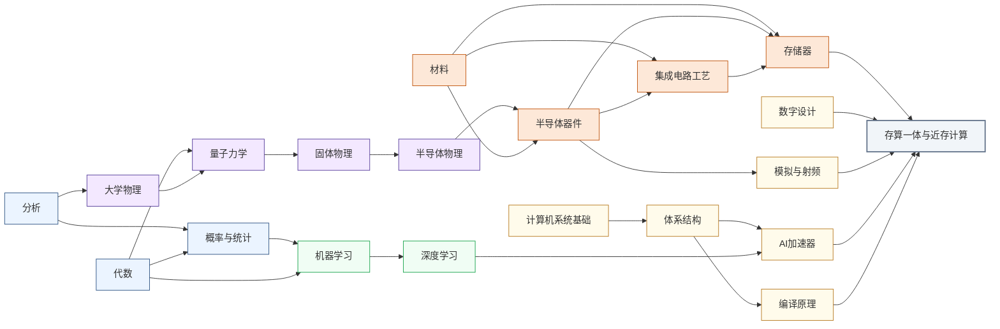

---
hide:
  - navigation
---

大模型推理时，数据搬运消耗的能量常常超过矩阵乘法本身。存算一体（CIM / PIM）与近存计算（NMC / NMP）研究的，是能不能让计算直接在数据所在的地方发生。

<svg viewBox="0 0 1140 532" xmlns="http://www.w3.org/2000/svg" style="width:100%;max-width:1140px;display:block;margin:1.5rem auto;font-family:system-ui,-apple-system,sans-serif;">
  <rect width="1140" height="532" rx="10" fill="#FFFFFF" stroke="#CBD5E1" stroke-width="1.5"/>
  <text x="570" y="26" text-anchor="middle" font-size="17" font-weight="bold" fill="#1E293B">集成电路科研方向全景图</text>
  <text x="250" y="54" text-anchor="middle" font-size="13.5" font-weight="bold" fill="#0E7490">← 计算媒介更奇异</text>
  <text x="1000" y="54" text-anchor="middle" font-size="13.5" font-weight="bold" fill="#16A34A">更贴近物理世界 →</text>
  <defs><filter id="loc-b" x="-5%" y="-5%" width="110%" height="110%"><feGaussianBlur stdDeviation="1.4"/></filter></defs>
  <rect x="88" y="88" width="147" height="298" rx="6" fill="#ECFEFF"/>
  <rect x="239" y="88" width="147" height="298" rx="6" fill="#F8FAFC"/>
  <rect x="390" y="88" width="147" height="298" rx="6" fill="#FEF2F2"/>
  <rect x="541" y="88" width="289" height="298" rx="6" fill="#EFF6FF"/>
  <rect x="834" y="88" width="76" height="298" rx="6" fill="#FFFBEB"/>
  <rect x="914" y="88" width="218" height="298" rx="6" fill="#F0FDF4"/>
  <text x="161" y="82" text-anchor="middle" font-size="12" font-weight="bold" fill="#0E7490">量子 · 光子</text>
  <text x="312" y="82" text-anchor="middle" font-size="12" font-weight="bold" fill="#64748B">存算 · 类脑</text>
  <text x="463" y="82" text-anchor="middle" font-size="12" font-weight="bold" fill="#DC2626">模拟 · 射频</text>
  <text x="685" y="82" text-anchor="middle" font-size="13" font-weight="bold" fill="#1D4ED8">数字计算</text>
  <text x="872" y="82" text-anchor="middle" font-size="12" font-weight="bold" fill="#D97706">功率电子</text>
  <text x="1023" y="82" text-anchor="middle" font-size="12" font-weight="bold" fill="#16A34A">传感 · 生物 · 机械</text>
  <line x1="86" y1="92" x2="1132" y2="92" stroke="#E2E8F0" stroke-width="1"/>
  <line x1="86" y1="150" x2="1132" y2="150" stroke="#EEF2F6" stroke-width="1"/>
  <line x1="86" y1="208" x2="1132" y2="208" stroke="#EEF2F6" stroke-width="1"/>
  <line x1="86" y1="266" x2="1132" y2="266" stroke="#EEF2F6" stroke-width="1"/>
  <line x1="86" y1="324" x2="1132" y2="324" stroke="#EEF2F6" stroke-width="1"/>
  <line x1="86" y1="382" x2="1132" y2="382" stroke="#E2E8F0" stroke-width="1"/>
  <line x1="86" y1="92" x2="86" y2="382" stroke="#CBD5E1" stroke-width="1"/>
  <text x="81" y="124" text-anchor="end" font-size="10.5" fill="#475569">算法 / 应用</text>
  <text x="81" y="182" text-anchor="end" font-size="10.5" fill="#475569">系统 / 软件</text>
  <text x="81" y="240" text-anchor="end" font-size="10.5" fill="#475569">体系结构</text>
  <text x="81" y="298" text-anchor="end" font-size="10.5" fill="#475569">电路</text>
  <text x="81" y="356" text-anchor="end" font-size="10.5" fill="#475569">器件</text>
  <g filter="url(#loc-b)" opacity="0.42">
  <rect x="92" y="92" width="68" height="290" rx="5" fill="#CFFAFE" stroke="#0E7490" stroke-width="1.2"/>
  <text x="126" y="231" text-anchor="middle" font-size="10.5" font-weight="bold" fill="#0E7490">量子计算</text>
  <text x="126" y="246" text-anchor="middle" font-size="10.5" font-weight="bold" fill="#0E7490">与量子芯片</text>
  <rect x="163" y="92" width="68" height="290" rx="5" fill="#CFFAFE" stroke="#0E7490" stroke-width="1.2"/>
  <text x="197" y="231" text-anchor="middle" font-size="10.5" font-weight="bold" fill="#0E7490">光电子</text>
  <text x="197" y="246" text-anchor="middle" font-size="10.5" font-weight="bold" fill="#0E7490">与硅光集成</text>
  <rect x="394" y="266" width="68" height="116" rx="5" fill="#FEE2E2" stroke="#DC2626" stroke-width="1.2"/>
  <text x="428" y="317" text-anchor="middle" font-size="10.5" font-weight="bold" fill="#DC2626">模拟与</text>
  <text x="428" y="332" text-anchor="middle" font-size="10.5" font-weight="bold" fill="#DC2626">混合信号IC</text>
  <rect x="465" y="266" width="68" height="116" rx="5" fill="#FEE2E2" stroke="#DC2626" stroke-width="1.2"/>
  <text x="499" y="317" text-anchor="middle" font-size="10.5" font-weight="bold" fill="#DC2626">射频与</text>
  <text x="499" y="332" text-anchor="middle" font-size="10.5" font-weight="bold" fill="#DC2626">毫米波IC</text>
  <rect x="243" y="92" width="68" height="290" rx="5" fill="#FEE2E2" stroke="#DC2626" stroke-width="1.2"/>
  <text x="277" y="239" text-anchor="middle" font-size="11.5" font-weight="bold" fill="#DC2626">类脑芯片</text>
  <rect x="314" y="92" width="68" height="290" rx="5" fill="#EDE9FE" stroke="#7C3AED" stroke-width="1.2"/>
  <text x="348" y="231" text-anchor="middle" font-size="10.5" font-weight="bold" fill="#7C3AED">存算一体</text>
  <text x="348" y="246" text-anchor="middle" font-size="10.5" font-weight="bold" fill="#7C3AED">与近存计算</text>
  <rect x="545" y="92" width="68" height="290" rx="5" fill="#EDE9FE" stroke="#7C3AED" stroke-width="1.2"/>
  <text x="579" y="231" text-anchor="middle" font-size="10.5" font-weight="bold" fill="#7C3AED">硬件安全</text>
  <text x="579" y="246" text-anchor="middle" font-size="10.5" font-weight="bold" fill="#7C3AED">与可信计算</text>
  <rect x="616" y="92" width="68" height="174" rx="5" fill="#DBEAFE" stroke="#1D4ED8" stroke-width="1.2"/>
  <text x="650" y="172" text-anchor="middle" font-size="10.5" font-weight="bold" fill="#1D4ED8">AI 算法</text>
  <text x="650" y="187" text-anchor="middle" font-size="10.5" font-weight="bold" fill="#1D4ED8">与系统</text>
  <rect x="687" y="150" width="68" height="116" rx="5" fill="#DBEAFE" stroke="#1D4ED8" stroke-width="1.2"/>
  <text x="721" y="201" text-anchor="middle" font-size="10.5" font-weight="bold" fill="#1D4ED8">处理器架构</text>
  <text x="721" y="216" text-anchor="middle" font-size="10.5" font-weight="bold" fill="#1D4ED8">与编译系统</text>
  <rect x="758" y="208" width="68" height="116" rx="5" fill="#DBEAFE" stroke="#1D4ED8" stroke-width="1.2"/>
  <text x="792" y="259" text-anchor="middle" font-size="10.5" font-weight="bold" fill="#1D4ED8">可重构计算</text>
  <text x="792" y="274" text-anchor="middle" font-size="10.5" font-weight="bold" fill="#1D4ED8">与 FPGA</text>
  <rect x="838" y="266" width="68" height="116" rx="5" fill="#FEF3C7" stroke="#D97706" stroke-width="1.2"/>
  <text x="872" y="317" text-anchor="middle" font-size="10.5" font-weight="bold" fill="#B45309">功率半导体</text>
  <text x="872" y="332" text-anchor="middle" font-size="10" font-weight="bold" fill="#B45309">与宽禁带器件</text>
  <rect x="918" y="92" width="68" height="290" rx="5" fill="#ECFCCB" stroke="#65A30D" stroke-width="1.2"/>
  <text x="952" y="239" text-anchor="middle" font-size="11.5" font-weight="bold" fill="#4D7C0F">具身智能</text>
  <rect x="989" y="266" width="68" height="116" rx="5" fill="#D1FAE5" stroke="#059669" stroke-width="1.2"/>
  <text x="1023" y="317" text-anchor="middle" font-size="10.5" font-weight="bold" fill="#047857">生物电子</text>
  <text x="1023" y="332" text-anchor="middle" font-size="10.5" font-weight="bold" fill="#047857">与脑机接口</text>
  <rect x="1060" y="266" width="68" height="116" rx="5" fill="#DCFCE7" stroke="#16A34A" stroke-width="1.2"/>
  <text x="1094" y="317" text-anchor="middle" font-size="10.5" font-weight="bold" fill="#15803D">MEMS 与</text>
  <text x="1094" y="332" text-anchor="middle" font-size="10.5" font-weight="bold" fill="#15803D">微纳传感器</text>
  </g>
  <text x="81" y="450" text-anchor="end" font-size="10.5" fill="#475569">各方向通用</text>
  <g filter="url(#loc-b)" opacity="0.42">
  <rect x="92" y="408" width="1040" height="28" rx="5" fill="#F1F5F9" stroke="#64748B" stroke-width="1.1"/>
  <text x="612" y="426" text-anchor="middle" font-size="12" font-weight="bold" fill="#475569">EDA 与设计自动化</text>
  <rect x="92" y="440" width="1040" height="28" rx="5" fill="#EEF2F6" stroke="#64748B" stroke-width="1.1"/>
  <text x="612" y="458" text-anchor="middle" font-size="12" font-weight="bold" fill="#475569">先进封装与系统集成</text>
  <rect x="92" y="472" width="1040" height="30" rx="5" fill="#E2E8F0" stroke="#475569" stroke-width="1.2"/>
  <text x="612" y="491" text-anchor="middle" font-size="12" font-weight="bold" fill="#334155">半导体器件与先进工艺</text>
  </g>
  <rect x="92" y="512" width="13" height="13" rx="2" fill="#DBEAFE" stroke="#1D4ED8" stroke-width="1.1"/>
  <text x="110" y="522" text-anchor="start" font-size="10.5" fill="#475569">数字</text>
  <rect x="160" y="512" width="13" height="13" rx="2" fill="#FEE2E2" stroke="#DC2626" stroke-width="1.1"/>
  <text x="178" y="522" text-anchor="start" font-size="10.5" fill="#475569">模拟</text>
  <rect x="228" y="512" width="13" height="13" rx="2" fill="#EDE9FE" stroke="#7C3AED" stroke-width="1.1"/>
  <text x="246" y="522" text-anchor="start" font-size="10.5" fill="#475569">数字 / 模拟 交叉</text>
  <rect x="298" y="95" width="104" height="290" rx="9" fill="#1E293B" opacity="0.16"/>
  <rect x="296" y="92" width="104" height="290" rx="9" fill="#EDE9FE" stroke="#7C3AED" stroke-width="2.6"/>
  <text x="348" y="231" text-anchor="middle" font-size="13" font-weight="bold" fill="#7C3AED">存算一体</text>
  <text x="348" y="246" text-anchor="middle" font-size="13" font-weight="bold" fill="#7C3AED">与近存计算</text>
</svg>

## 这个方向在研究什么

**冯·诺依曼架构**（von Neumann architecture）在 1945 年把"计算单元和存储单元分开"定下来时，这是个优雅的设计，让两者各做各的专项。可它也埋下一个代价。<u>数据得在存储和计算之间来回搬运，这件事本身就耗能量、耗时间</u>。规模不大时代价不显眼，等 AI 把模型推到数百亿参数，它就藏不住了。一块 NVIDIA H100 的理论算力是每秒 990 TFLOPS（Tera Floating-Point Operations Per Second，每秒万亿次浮点运算；FP16 精度），片外内存带宽却只有约 3.35 TB/s。芯片大量时间不是在算，而是在等数据从内存传来。大模型推理时这道差距尤其刺眼，权重矩阵巨大、每个却只用一次，有效算力利用率有时不到三成。更突出的是能耗。有测量表明，H100 跑推理时，数据搬运消耗的能量比矩阵乘法本身还多。这不是工程师没优化好，而是冯·诺依曼架构埋下的物理代价。随着模型规模暴涨，它从一个学术话题变成了横在整个产业面前的根本瓶颈。出路其实只有一个方向，让计算离数据更近。而"近到什么程度"，拉出一条从保守到激进的谱系。

<svg viewBox="0 0 880 470" xmlns="http://www.w3.org/2000/svg" style="width:100%;max-width:880px;display:block;margin:1.5em auto;font-family:system-ui,-apple-system,sans-serif;">
  <defs>
    <marker id="cimAx" markerWidth="9" markerHeight="9" refX="6" refY="3" orient="auto"><path d="M0,0 L0,6 L8,3 z" fill="#94A3B8"/></marker>
    <marker id="cimEff" markerWidth="9" markerHeight="9" refX="6" refY="3" orient="auto"><path d="M0,0 L0,6 L8,3 z" fill="#16A34A"/></marker>
    <marker id="cimCost" markerWidth="9" markerHeight="9" refX="6" refY="3" orient="auto"><path d="M0,0 L0,6 L8,3 z" fill="#DC2626"/></marker>
  </defs>
  <rect width="880" height="470" rx="10" fill="#F8FAFC" stroke="#CBD5E1" stroke-width="1.5"/>
  <text x="440" y="28" text-anchor="middle" font-size="16" font-weight="bold" fill="#1E293B">能效与代价随融合程度同步上升</text>
  <text x="440" y="50" text-anchor="middle" font-size="12" fill="#475569">横轴：计算与存储的融合程度递增（能效相对 GPU + HBM 系统）</text>
  <line x1="24" y1="62" x2="856" y2="62" stroke="#94A3B8" stroke-width="1.4" marker-end="url(#cimAx)"/>
  <rect x="18" y="74" width="200" height="6" rx="2" fill="#64748B"/>
  <rect x="18" y="80" width="200" height="300" rx="8" fill="#F1F5F9" stroke="#94A3B8" stroke-width="1.3"/>
  <text x="118" y="104" text-anchor="middle" font-size="15" font-weight="bold" fill="#334155">GPU + HBM</text>
  <text x="118" y="122" text-anchor="middle" font-size="10" fill="#94A3B8">传统系统 · 冯·诺依曼</text>
  <rect x="33" y="146" width="46" height="30" rx="4" fill="#E2E8F0" stroke="#94A3B8" stroke-width="1"/>
  <text x="56" y="165" text-anchor="middle" font-size="9.5" fill="#475569">GPU</text>
  <rect x="157" y="146" width="46" height="30" rx="4" fill="#DCFCE7" stroke="#16A34A" stroke-width="1"/>
  <text x="180" y="165" text-anchor="middle" font-size="9.5" fill="#15803D">HBM</text>
  <line x1="81" y1="161" x2="153" y2="161" stroke="#DC2626" stroke-width="2" marker-end="url(#cimCost)"/>
  <text x="117" y="186" text-anchor="middle" font-size="8.5" fill="#DC2626">长数据通路</text>
  <text x="118" y="210" text-anchor="middle" font-size="11" fill="#475569">计算与存储分离</text>
  <text x="118" y="230" text-anchor="middle" font-size="10" fill="#94A3B8">相对能效</text>
  <text x="118" y="258" text-anchor="middle" font-size="24" font-weight="bold" fill="#64748B">1×</text>
  <line x1="38" y1="274" x2="198" y2="274" stroke="#CBD5E1" stroke-width="1"/>
  <text x="118" y="296" text-anchor="middle" font-size="11.5" fill="#475569">基准系统</text>
  <text x="118" y="316" text-anchor="middle" font-size="10.5" fill="#64748B">数据搬运是瓶颈</text>
  <rect x="233" y="74" width="200" height="6" rx="2" fill="#2563EB"/>
  <rect x="233" y="80" width="200" height="300" rx="8" fill="#EFF6FF" stroke="#60A5FA" stroke-width="1.3"/>
  <text x="333" y="104" text-anchor="middle" font-size="15" font-weight="bold" fill="#1D4ED8">近存计算</text>
  <text x="333" y="122" text-anchor="middle" font-size="10.5" fill="#2563EB">NMC / NMP</text>
  <rect x="283" y="139" width="100" height="22" rx="4" fill="#DCFCE7" stroke="#16A34A" stroke-width="1"/>
  <text x="333" y="154" text-anchor="middle" font-size="10" fill="#15803D">DRAM 存储</text>
  <line x1="303" y1="161" x2="303" y2="166" stroke="#94A3B8" stroke-width="1"/>
  <line x1="333" y1="161" x2="333" y2="166" stroke="#94A3B8" stroke-width="1"/>
  <line x1="363" y1="161" x2="363" y2="166" stroke="#94A3B8" stroke-width="1"/>
  <rect x="283" y="166" width="100" height="22" rx="4" fill="#DBEAFE" stroke="#2563EB" stroke-width="1.2"/>
  <text x="333" y="181" text-anchor="middle" font-size="9" fill="#1D4ED8">计算逻辑层</text>
  <text x="333" y="210" text-anchor="middle" font-size="11" fill="#475569">逻辑紧贴存储</text>
  <text x="333" y="230" text-anchor="middle" font-size="10" fill="#94A3B8">相对能效</text>
  <text x="333" y="258" text-anchor="middle" font-size="24" font-weight="bold" fill="#2563EB">~2×</text>
  <line x1="253" y1="274" x2="413" y2="274" stroke="#BFDBFE" stroke-width="1"/>
  <text x="333" y="296" text-anchor="middle" font-size="11.5" fill="#475569">已量产 · 风险低</text>
  <text x="333" y="316" text-anchor="middle" font-size="10.5" fill="#1E40AF">三星 HBM-PIM</text>
  <rect x="448" y="74" width="200" height="6" rx="2" fill="#D97706"/>
  <rect x="448" y="80" width="200" height="300" rx="8" fill="#FFFBEB" stroke="#FBBF24" stroke-width="1.3"/>
  <text x="548" y="104" text-anchor="middle" font-size="15" font-weight="bold" fill="#B45309">数字存内</text>
  <text x="548" y="122" text-anchor="middle" font-size="10.5" fill="#D97706">CIM / PIM</text>
  <rect x="472" y="144" width="152" height="42" rx="5" fill="#FEF9E7" stroke="#D97706" stroke-width="1.2"/>
  <line x1="510" y1="146" x2="510" y2="184" stroke="#FCD34D" stroke-width="0.8"/>
  <line x1="548" y1="146" x2="548" y2="184" stroke="#FCD34D" stroke-width="0.8"/>
  <line x1="586" y1="146" x2="586" y2="184" stroke="#FCD34D" stroke-width="0.8"/>
  <line x1="474" y1="165" x2="622" y2="165" stroke="#FCD34D" stroke-width="0.8"/>
  <rect x="488" y="150" width="10" height="10" rx="1" fill="#F59E0B"/>
  <rect x="560" y="150" width="10" height="10" rx="1" fill="#F59E0B"/>
  <rect x="524" y="168" width="10" height="10" rx="1" fill="#F59E0B"/>
  <rect x="596" y="168" width="10" height="10" rx="1" fill="#F59E0B"/>
  <text x="548" y="210" text-anchor="middle" font-size="11" fill="#475569">SRAM 阵列做数字 MAC</text>
  <text x="548" y="230" text-anchor="middle" font-size="10" fill="#94A3B8">相对能效</text>
  <text x="548" y="258" text-anchor="middle" font-size="23" font-weight="bold" fill="#D97706">3–5×</text>
  <line x1="468" y1="274" x2="628" y2="274" stroke="#FDE68A" stroke-width="1"/>
  <text x="548" y="296" text-anchor="middle" font-size="11.5" fill="#475569">精度可控</text>
  <text x="548" y="316" text-anchor="middle" font-size="10.5" fill="#92400E">ISSCC 完整流片</text>
  <rect x="663" y="74" width="200" height="6" rx="2" fill="#DC2626"/>
  <rect x="663" y="80" width="200" height="300" rx="8" fill="#FEF2F2" stroke="#F87171" stroke-width="1.3"/>
  <text x="763" y="104" text-anchor="middle" font-size="15" font-weight="bold" fill="#B91C1C">模拟存内</text>
  <text x="763" y="122" text-anchor="middle" font-size="10.5" fill="#DC2626">CIM / PIM</text>
  <line x1="706" y1="148" x2="820" y2="148" stroke="#DC2626" stroke-width="1.2"/>
  <line x1="706" y1="162" x2="820" y2="162" stroke="#DC2626" stroke-width="1.2"/>
  <line x1="706" y1="176" x2="820" y2="176" stroke="#DC2626" stroke-width="1.2"/>
  <line x1="716" y1="142" x2="716" y2="182" stroke="#DC2626" stroke-width="1.2"/>
  <line x1="744" y1="142" x2="744" y2="182" stroke="#DC2626" stroke-width="1.2"/>
  <line x1="772" y1="142" x2="772" y2="182" stroke="#DC2626" stroke-width="1.2"/>
  <line x1="800" y1="142" x2="800" y2="182" stroke="#DC2626" stroke-width="1.2"/>
  <circle cx="716" cy="148" r="2.6" fill="#B91C1C"/>
  <circle cx="744" cy="148" r="2.6" fill="#B91C1C"/>
  <circle cx="772" cy="148" r="2.6" fill="#B91C1C"/>
  <circle cx="800" cy="148" r="2.6" fill="#B91C1C"/>
  <circle cx="716" cy="162" r="2.6" fill="#B91C1C"/>
  <circle cx="744" cy="162" r="2.6" fill="#B91C1C"/>
  <circle cx="772" cy="162" r="2.6" fill="#B91C1C"/>
  <circle cx="800" cy="162" r="2.6" fill="#B91C1C"/>
  <circle cx="716" cy="176" r="2.6" fill="#B91C1C"/>
  <circle cx="744" cy="176" r="2.6" fill="#B91C1C"/>
  <circle cx="772" cy="176" r="2.6" fill="#B91C1C"/>
  <circle cx="800" cy="176" r="2.6" fill="#B91C1C"/>
  <line x1="688" y1="162" x2="704" y2="162" stroke="#94A3B8" stroke-width="1.2" marker-end="url(#cimAx)"/>
  <text x="763" y="195" text-anchor="middle" font-size="8.5" fill="#B91C1C">交叉阵列 · 电流即乘加</text>
  <text x="763" y="212" text-anchor="middle" font-size="11" fill="#475569">器件物理直接乘加</text>
  <text x="763" y="230" text-anchor="middle" font-size="10" fill="#94A3B8">理论峰值</text>
  <text x="763" y="258" text-anchor="middle" font-size="21" font-weight="bold" fill="#DC2626">10–100×</text>
  <line x1="683" y1="274" x2="843" y2="274" stroke="#FECACA" stroke-width="1"/>
  <text x="763" y="296" text-anchor="middle" font-size="11.5" fill="#475569">尚在研究阶段</text>
  <text x="763" y="316" text-anchor="middle" font-size="10.5" fill="#B91C1C">精度·ADC·器件成熟度</text>
  <text x="34" y="405" text-anchor="start" font-size="12.5" font-weight="bold" fill="#15803D">能效 ↗</text>
  <line x1="96" y1="402" x2="845" y2="402" stroke="#16A34A" stroke-width="2" marker-end="url(#cimEff)"/>
  <text x="470" y="395" text-anchor="middle" font-size="10" fill="#15803D">1× → 10–100×</text>
  <text x="34" y="432" text-anchor="start" font-size="12.5" font-weight="bold" fill="#B91C1C">代价 ↗</text>
  <line x1="96" y1="429" x2="845" y2="429" stroke="#DC2626" stroke-width="2" marker-end="url(#cimCost)"/>
  <text x="470" y="422" text-anchor="middle" font-size="10" fill="#B91C1C">器件与 ADC 制约同步加剧</text>
  <text x="440" y="458" text-anchor="middle" font-size="10" fill="#94A3B8">能效为相对 GPU + HBM 系统的量级示意，随精度与负载而变</text>
</svg>

先说最保守的一步，**近存计算**（Near-Memory Computing, NMC；又称 Near-Memory Processing, NMP）。它不动存储阵列本身，只把计算逻辑紧贴着存储放，让数据少走几步路。其实把计算并进内存的想法 1970 年代就有，只是长期卡在逻辑和 DRAM 工艺不兼容，做不出又好又便宜的芯片。直到 3D 堆叠成熟，近存这条务实路线才真正量产落地。三星 2021 年的 HBM-PIM 就是这么干的，把计算单元集成进 HBM 的逻辑层，相对上一代拿到两倍以上吞吐、七成以上的能耗下降。SK Hynix 的 AiM 走的是同一条路。这些已经是能量产的产品，证明近存计算不只是实验室概念。它代价小、风险低，可收益也最有限，毕竟计算和存储还是分开的两家。

再往里走一步，把计算直接搬进存储阵列内部，这就是**存算一体**（Compute-in-Memory, CIM；又称 Process-in-Memory, PIM）。先看稳妥的数字路线 SRAM-CIM（Static RAM Compute-in-Memory）。在标准 SRAM 宏里加上计算逻辑，输入以电压注入整列，所有单元同时做乘法，列末端自然累加成一次向量内积。它用的是常规数字电路，精度可控，还能复用成熟的 EDA 流程，量产风险不大，能效比 GPU 提升大约三到五倍。2018 年前后，台湾清华大学张孟凡团队等就在 ISSCC 上发表了完整流片的 SRAM-CIM 芯片，把每次乘加的能耗从 GPU 的数十皮焦压到亚皮焦级。

最激进的是干脆让器件物理自己来算，这就是模拟路线，代表是用**忆阻器**（memristor；如 RRAM 阻变存储器、PCM 相变存储器）搭的存算阵列。这种器件的电阻能调、断电还记得住，正好拿来存神经网络的权重。给它加一个输入电压，流过的电流就是电压乘以电导，等于天然做了一次乘法，整列电流一汇合，基尔霍夫定律就替你把累加也做完了。一个器件同时管存储和计算，理论能效能比 GPU 高一两个数量级。代价也最高，主要有三个挑战。一是模拟量天生不准，器件制造偏差、电源噪声、温度漂移都会污染结果，稳下来的有效精度常常只有 4 到 6 位。二是阵列算出的是模拟电流，最后还得用 ADC 读回数字域，而高精度 ADC 又大又费电，常常把阵列省下的能量重新吃掉一大半。三是 RRAM、PCM 这些器件本身的成熟度和良率还不过关，难以放大成可量产的大阵列。

三条路激进程度不同，但都绕不开算法与硬件的联合设计。最典型的就是量化，让网络的精度需求主动去迁就电路的物理约束，能省多少电、精度掉几位，都在这里博弈。这是当前研究集中的地带，器件、电路、架构三种背景的人都能参与。至于最激进的模拟存内到底能不能成，不取决于架构，而取决于器件制造工艺能否成熟，ADDA 转换开销能否压下来。

### 核心研究问题

- **忆阻器器件的非理想性**：RRAM、PCM、铁电这些可调电阻器件天然适合做模拟突触，但电阻的变异、漂移、可重复性卡在材料和器件层，难以放大成可流片的大阵列。
- **模拟与数字两条路线**：模拟阵列用电流和基尔霍夫求和换来近百倍能效，但有效位常只有 4-6 位；数字 SRAM-CIM 精度可控、能复用成熟 EDA、量产风险低，却只省下几倍，两边都还拿不出压倒对方的证据。
- **ADC 与混合信号接口**：模拟阵列算得再省，结果终归要被 ADC 读回数字域，高精度 ADC 的面积和功耗常反客为主，把阵列省下的能量重新吃掉。
- **近存计算的架构与编程模型**：NMC/NMP 硬件已经量产，却缺编译器和运行时让上层应用透明用上这份近存算力，稀疏负载怎么映射也没有好办法。
- **量化算法与硬件协同**：让存储阵列拓扑和电路物理约束反过来指导量化策略与网络结构，器件、电路、架构三种背景都能从这里进场。
- **三维异质集成**：单层阵列容量有限，要把存算阵列与逻辑层垂直堆叠、用先进封装把存储贴到计算近旁，单元级的能效收益才能放大到系统规模。
- **感存算一体**：让传感、存储、计算在同一阵列里合一，信号刚被感知就地处理，免去从传感器到芯片的搬运，仿视网膜的事件视觉是典型应用。

### 知识路径

器件线（物理→存储器）提供存储单元，数字/模拟电路实现原位计算，AI 和体系结构线提供算法需求，编译器把网络映射到阵列上，几路在方向本体汇合。节点对应[学习地图](../学习地图/index.md)里的目录：

- 数学：[分析](../学习地图/数学/分析/index.md) · [代数](../学习地图/数学/代数/index.md)（线性代数，量子力学和矩阵运算共同的语言） · [概率与统计](../学习地图/数学/概率与统计/index.md)
- 物理：[大学物理](../学习地图/物理/大学物理/index.md) · [量子力学](../学习地图/物理/量子力学/index.md) · [固体物理](../学习地图/物理/固体物理/index.md) · [半导体物理](../学习地图/物理/半导体物理/index.md)
- 器件与工艺：[半导体器件](../学习地图/器件与工艺/半导体器件/index.md) · [材料](../学习地图/器件与工艺/材料/index.md) · [集成电路工艺](../学习地图/器件与工艺/集成电路工艺/index.md) · [存储器](../学习地图/器件与工艺/存储器/index.md)
- 电路：[模拟与射频](../学习地图/电路/模拟与射频/index.md)（读出电路、模拟 MAC） · [数字设计](../学习地图/电路/数字设计/index.md)
- 系统架构：[计算机系统基础](../学习地图/系统架构/计算机系统基础/index.md) · [体系结构](../学习地图/系统架构/体系结构/index.md) · [编译原理](../学习地图/系统架构/编译原理/index.md)（网络到阵列的映射工具链） · [AI加速器](../学习地图/系统架构/AI加速器/index.md)
- 人工智能：[机器学习](../学习地图/人工智能/机器学习/index.md) · [深度学习](../学习地图/人工智能/深度学习/index.md)

## 这个方向适合谁

这个方向天然跨层，器件、电路、架构、算法相互牵制，适合愿意同时兼顾多个层面的人。几条技术路线对应不同的专长。偏体系结构与系统的，可以研究近存计算的架构与编程模型，让上层应用高效利用近存算力；擅长数字电路与 EDA 的，适合数字存内（SRAM-CIM），在精度可控的前提下提升能效；对模拟电路与器件感兴趣的，可以做 RRAM 交叉阵列，处理其中的噪声、ADC 开销与温度漂移。微电子本科在计算机组成、数字电路、模拟电路、器件物理中任意一门有扎实基础，都能找到对应的切入点。需要提醒的是，真正的难点常在跨层协同而非单一层面，更适合愿意理解相邻层约束、不排斥系统与物理工程细节的人。

## 学术界

### 课题组

**境内**

-   **[马恺声](http://group.iiis.tsinghua.edu.cn/~maks/)** 清华

    存算融合系统架构 | DNN 加速器片上通信 | AI 编译与硬件映射协同

-   **[高鸣宇](https://people.iiis.tsinghua.edu.cn/~gaomy/)** 清华

    近存计算架构 | 稀疏 AI 推理加速 | 安全计算硬件

-   **[邓宁](https://www.ime.tsinghua.edu.cn/info/1015/1824.htm)** 清华

    自旋转移矩存储器 | 阻变存储器件 | 新型非易失计算

-   **[尹首一](https://www.ime.tsinghua.edu.cn/info/1040/1567.htm)** 清华

    晶圆级芯片 | 3D近存计算架构 | AI存内计算

-   **[南天翔](https://www.ime.tsinghua.edu.cn/info/1015/1803.htm)** 清华

    MRAM存内计算 | 自旋轨道矩器件 | 磁电多铁异质结

-   **[吴华强](https://www.ime.tsinghua.edu.cn/info/1015/1787.htm)** 清华

    忆阻器 RRAM 存内计算 | 模拟 CIM 芯片全栈设计 | 物理神经网络训练

-   **[钱鹤](https://www.sic.tsinghua.edu.cn/info/1032/1588.htm)** 清华

    SRAM/eDRAM 存算一体宏 | 通用神经网络推理芯片 | 多存储器混合 CIM 架构

-   **[唐建石](https://www.ime.tsinghua.edu.cn/info/1035/1595.htm)** 清华

    RRAM 模拟存算一体芯片 | 储备池计算与神经形态 | 单片三维异质集成

-   **[高滨](https://www.sic.tsinghua.edu.cn/info/1015/1819.htm)** 清华

    忆阻器 CIM 芯片设计方法学 | 神经网络结构-硬件联合搜索 | RRAM 编程精度优化

-   **[薛晓勇](https://sme.fudan.edu.cn/60/46/c31133a352326/page.htm)** 复旦

    存算一体数模混合 IC | 近存计算软硬件协同 | DRAM/SSD 大容量存储

-   **[刘琦](https://icmne.fudan.edu.cn/2d/2a/c48925a732458/page.htm)** 复旦

    ReRAM 存内计算加速器 | RRAM-SRAM 协同推理 | 类脑神经形态芯片

-   **[周鹏](https://icmne.fudan.edu.cn/2d/61/c48925a732513/page.htm)** 复旦

    二维半导体超快闪存 | 存内计算与感存算集成 | 仿视网膜感知芯片

-   **[蒋昊](https://fics.fudan.edu.cn/8e/8a/c22620a429706/page.htm)** 复旦

    忆阻器与铁电 HZO 器件 | 存内计算与类脑计算 | 硬件安全 PUF/TRNG

-   **[黄张成](https://icmne.fudan.edu.cn/2d/19/c48925a732441/page.htm)** 复旦

    感算融合专用芯片 | 深低温电路设计

-   **[王明宇](https://icmne.fudan.edu.cn/2d/45/c48925a732485/page.htm)** 复旦

    智能感知处理芯片

-   **[解玉凤](https://icmne.fudan.edu.cn/2d/4b/c48925a732491/page.htm)** 复旦

    存算一体芯片设计 | 阻变存储与计算加速

-   **[黄鹏](https://ic.pku.edu.cn/szdw/zzjs/sjzdhyjsxtx1/hp/index.htm)** 北大

    RRAM 存算一体芯片 | 感知-存储-计算融合 | CNN 与注意力推理加速

-   **[叶乐](https://ic.pku.edu.cn/szdw/zzjs/jcdlsjx1/yl/index.htm)** 北大

    存算一体 AI 芯片 | 3D 近存架构设计 | 模拟混合信号电路

-   **[孙仲](http://scholar.pku.edu.cn/zhong_sun/home)** 北大

    RRAM 模拟矩阵运算 | 无线通信信号处理 | 高精度存算一体

-   **[蔡一茂](https://ic.pku.edu.cn/en/Faculty/Facultys/DepartmentofMicroNanoelectronics/CaiYimao/index.htm)** 北大

    RRAM 忆阻器件 | 神经形态计算芯片 | 存算一体芯片设计

-   **[王宗巍](https://ic.pku.edu.cn/szdw/zzjs/jcwndzx1/wzw/index.htm)** 北大

    RRAM 存内计算宏 | 稀疏 AI 推理加速 | 神经形态芯片

-   **[杨玉超](https://ic.pku.edu.cn/szdw/zzjs/jcwndzx1/yyc/index.htm)** 北大

    忆阻器存算一体阵列 | 大规模 AI 推理芯片 | 神经形态计算

-   **[康一](https://faculty.ustc.edu.cn/kangyi)** 中科大

    SRAM/非易失存内计算电路 | 模拟混合信号 CIM 宏 | AI 推理低功耗芯片

-   **[陈松](https://sme.ustc.edu.cn/2022/0601/c31000a556942/page.htm)** 中科大

    PIM 加速器架构设计 | 位稀疏模型硬件协同 | 存算芯片 EDA 编译

-   **[李鹏](https://sme.ustc.edu.cn/2022/0601/c30996a556941/page.htm)** 中科大

    自旋器件存算一体 | 神经形态电路芯片 | 量子传感器件

-   **[陈晓明](https://people.ucas.edu.cn/~chenxm)** 中科院

    RRAM/FeFET 交叉阵列架构 | PIM 编译与自动生成 | 稀疏矩阵存内加速

-   **[窦春萌](https://people.ucas.ac.cn/~douchunmeng)** 中科院

    RRAM 存算一体芯片 | 混合信号 AI 推理宏 | 近阈值低功耗计算

-   **[蒋力](https://www.cs.sjtu.edu.cn/jiaoshiml/jiangli.html)** 交大

    RRAM/SRAM 存内计算加速器 | DRAM 近存计算架构 | 稀疏算法-架构协同

-   **[何卫锋](https://icisee.sjtu.edu.cn/jiaoshiml/heweifeng.html)** 交大

    SRAM 存内计算/近存计算芯片 | 高能效 AI 推理芯片 | 超低功耗亚阈值设计

-   **[孙亚男](https://icisee.sjtu.edu.cn/jiaoshiml/sunyanan.html)** 交大 

    ReRAM/SRAM 混合存内计算 | 三维集成 CIM 架构 | Transformer/CNN 边缘加速器

-   **[缪峰](https://physics.nju.edu.cn/szdw/qbmd/20240321/i261985.html)** 南大

    二维材料忆阻器器件 | 传感器内动态存内计算 | 铁电类脑神经形态芯片

-   **[王宇宣](https://is.nju.edu.cn/wyx/main.htm)** 南大

    器件级存算一体加速 | 光电存算融合芯片 | 类脑神经网络硬件

-   **[司鑫](https://ic.seu.edu.cn/sixin/main.htm)** 东南大学

    SRAM CIM/PIM 宏 | 存储器计算电路 | AI 边缘/推理芯片

-   **[张亦舒](https://ic.zju.edu.cn/2024/0604/c81879a2928352/page.htm)** 浙大

    RRAM/FeRAM 存算一体芯片 | 忆阻器安全加密原语 | 神经形态计算

<button class="prof-show-all">显示全部 ↓</button>

**境外**

-   **[Ngai Wong（黃毅）](https://www.eee.hku.hk/~nwong/)** 港大

    忆阻器存算一体芯片 | 大模型推理加速 | 神经网络硬件量化

-   **[Can Li（李灿）](https://ece.hku.hk/people/canl/)** 港大

    忆阻器阵列 AI 芯片 | 神经形态组合优化 | 近存模拟计算

-   **[José Martínez](https://www.csl.cornell.edu/~martinez/)** Cornell

    近存计算架构 | 存储层次设计 | 处理器-内存协同

-   **[Naveen Verma](https://ece.princeton.edu/people/naveen-verma)** Princeton

    SRAM 存算一体 | ML 加速器效率 | 计算-存储协同分析

-   **[H.-S. Philip Wong（黃漢森）](https://nano.stanford.edu)** Stanford

    PCM/RRAM 存算一体 | 3D 异构集成芯片 | 非易失存储 AI 推理

-   **[Hai (Helen) Li (李海) & Yiran Chen (陈怡然)](https://cei.pratt.duke.edu/)** Duke 

    新型 NVM 存储器电路 | 存算一体系统 | DNN 压缩与 AI 硬件协同

-   **[Onur Mutlu](https://people.inf.ethz.ch/omutlu/)** ETH Zürich

    近存计算架构 | DRAM/SSD 内处理 | 基因组加速

-   **[Shimeng Yu（余诗孟）](https://shimeng.ece.gatech.edu)** Georgia Tech

    RRAM/FeFET 存算器件 | 模拟存内计算 | 3D 集成 AI 推理

-   **[Kaushik Roy](https://engineering.purdue.edu/NRL)** Purdue

    模拟 CIM 加速器 | 脉冲神经网络 | 低功耗边缘 AI

-   **[Boris Murmann](https://murmann-group.org/)** U Hawaii

    阻变存储器 IMC | 边缘 AI 推理 | 混合信号接口设计

-   **[Tony Nowatzki](https://web.cs.ucla.edu/~nowatzki/)** UCLA

    近存计算 | 空间数据流架构 | 芯粒近数据协同

<button class="prof-show-all">显示全部 ↓</button>

### 学术会议与期刊

  
会议
    ISSCC
    IEDM
    VLSI Symposium
    ISCA
    MICRO
    HPCA
    DAC
  

  
期刊
    IEEE JSSC
    IEEE TED
    IEEE TCAS-I/II
    Nature Electronics
    Nature Nanotechnology
  

## 毕业去向

### 企业

  
国内
    <a class="dm-chip" href="https://www.bjxxtech.net/">北极雄芯 Polar Bear Tech</a>
    <a class="dm-chip" href="https://www.cxmt.com/">长鑫存储 CXMT</a>
    <a class="dm-chip" href="https://www.ymtc.com/">长江存储 YMTC</a>
    <a class="dm-chip" href="https://www.witmem.com/">知存科技 Witmem</a>
    <a class="dm-chip" href="https://www.houmoai.com/">后摩智能 Houmo.AI</a>
    <a class="dm-chip" href="https://www.yizhu-tech.com/">亿铸科技 Yizhu</a>
    <a class="dm-chip" href="https://pimchip.cn/">苹芯科技 PIMCHIP</a>
    <a class="dm-chip" href="https://reexen.com/">九天睿芯 Reexen</a>
    <a href="https://www.zbitsemi.com/">恒烁股份</a>
  

  
国外
    <a href="https://www.samsung.com/">Samsung 三星电子</a>
    <a href="https://www.skhynix.com/">SK Hynix</a>
    <a href="https://www.micron.com/">Micron 美光</a>
    <a href="https://www.ibm.com/">IBM</a>
    <a class="dm-chip" href="https://mythic.ai/">Mythic</a>
    <a class="dm-chip" href="https://www.upmem.com/">UPMEM</a>
  

### 科研院所

  
国内
    <a class="dm-chip" href="https://www.ime.ac.cn/">中科院微电子所</a>
    <a class="dm-chip" href="https://www.zhejianglab.org/">之江实验室</a>
  

  
国外
    <a class="dm-chip" href="https://www.zurich.ibm.com/sto/memory/">IBM Research–Zurich（神经形态与存内计算组）</a>
    <a class="dm-chip" href="https://www.imec-int.com/en">imec</a>
    <a class="dm-chip" href="https://www.aist.go.jp/index_en.html">AIST（日本产综研）</a>
  

## 相关科普

  <a class="vc-card" href="https://www.bilibili.com/video/BV1Bz9aBsE5E" target="_blank" rel="noopener">
    
      
      B站
    
    
      秘密研发三年！安克这颗存算一体芯片，如何违背了所有「祖宗的决定」？
      老石谈芯
    
  </a>
  <a class="vc-card" href="https://www.bilibili.com/video/BV1ehEg6qEZb" target="_blank" rel="noopener">
    
      
      B站
    
    
      告别算力焦虑！中国AI不再靠英伟达，华为做对了什么？
      老石谈芯
    
  </a>

## 论文推荐

!!! note "待补充"
    欢迎推荐该方向的入门综述或经典论文，[参与建设 →](../参与建设.md)
