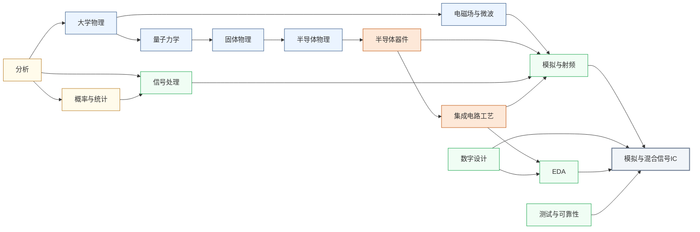

---
hide:
  - navigation
---

设计让模拟世界与数字世界高速转换的“接口芯片”，ADC、DAC、锁相环、SerDes 是每块现代 SoC 都不可或缺的混合信号基础模块。

<svg viewBox="0 0 1140 532" xmlns="http://www.w3.org/2000/svg" style="width:100%;max-width:1140px;display:block;margin:1.5rem auto;font-family:system-ui,-apple-system,sans-serif;">
  <rect width="1140" height="532" rx="10" fill="#FFFFFF" stroke="#CBD5E1" stroke-width="1.5"/>
  <text x="570" y="26" text-anchor="middle" font-size="17" font-weight="bold" fill="#1E293B">集成电路科研方向全景图</text>
  <text x="250" y="54" text-anchor="middle" font-size="13.5" font-weight="bold" fill="#0E7490">← 计算媒介更奇异</text>
  <text x="1000" y="54" text-anchor="middle" font-size="13.5" font-weight="bold" fill="#16A34A">更贴近物理世界 →</text>
  <defs><filter id="loc-b" x="-5%" y="-5%" width="110%" height="110%"><feGaussianBlur stdDeviation="1.4"/></filter></defs>
  <rect x="88" y="88" width="147" height="298" rx="6" fill="#ECFEFF"/>
  <rect x="239" y="88" width="147" height="298" rx="6" fill="#F8FAFC"/>
  <rect x="390" y="88" width="147" height="298" rx="6" fill="#FEF2F2"/>
  <rect x="541" y="88" width="289" height="298" rx="6" fill="#EFF6FF"/>
  <rect x="834" y="88" width="76" height="298" rx="6" fill="#FFFBEB"/>
  <rect x="914" y="88" width="218" height="298" rx="6" fill="#F0FDF4"/>
  <text x="161" y="82" text-anchor="middle" font-size="12" font-weight="bold" fill="#0E7490">量子 · 光子</text>
  <text x="312" y="82" text-anchor="middle" font-size="12" font-weight="bold" fill="#64748B">存算 · 类脑</text>
  <text x="463" y="82" text-anchor="middle" font-size="12" font-weight="bold" fill="#DC2626">模拟 · 射频</text>
  <text x="685" y="82" text-anchor="middle" font-size="13" font-weight="bold" fill="#1D4ED8">数字计算</text>
  <text x="872" y="82" text-anchor="middle" font-size="12" font-weight="bold" fill="#D97706">功率电子</text>
  <text x="1023" y="82" text-anchor="middle" font-size="12" font-weight="bold" fill="#16A34A">传感 · 生物 · 机械</text>
  <line x1="86" y1="92" x2="1132" y2="92" stroke="#E2E8F0" stroke-width="1"/>
  <line x1="86" y1="150" x2="1132" y2="150" stroke="#EEF2F6" stroke-width="1"/>
  <line x1="86" y1="208" x2="1132" y2="208" stroke="#EEF2F6" stroke-width="1"/>
  <line x1="86" y1="266" x2="1132" y2="266" stroke="#EEF2F6" stroke-width="1"/>
  <line x1="86" y1="324" x2="1132" y2="324" stroke="#EEF2F6" stroke-width="1"/>
  <line x1="86" y1="382" x2="1132" y2="382" stroke="#E2E8F0" stroke-width="1"/>
  <line x1="86" y1="92" x2="86" y2="382" stroke="#CBD5E1" stroke-width="1"/>
  <text x="81" y="124" text-anchor="end" font-size="10.5" fill="#475569">算法 / 应用</text>
  <text x="81" y="182" text-anchor="end" font-size="10.5" fill="#475569">系统 / 软件</text>
  <text x="81" y="240" text-anchor="end" font-size="10.5" fill="#475569">体系结构</text>
  <text x="81" y="298" text-anchor="end" font-size="10.5" fill="#475569">电路</text>
  <text x="81" y="356" text-anchor="end" font-size="10.5" fill="#475569">器件</text>
  <g filter="url(#loc-b)" opacity="0.42">
  <rect x="92" y="92" width="68" height="290" rx="5" fill="#CFFAFE" stroke="#0E7490" stroke-width="1.2"/>
  <text x="126" y="231" text-anchor="middle" font-size="10.5" font-weight="bold" fill="#0E7490">量子计算</text>
  <text x="126" y="246" text-anchor="middle" font-size="10.5" font-weight="bold" fill="#0E7490">与量子芯片</text>
  <rect x="163" y="92" width="68" height="290" rx="5" fill="#CFFAFE" stroke="#0E7490" stroke-width="1.2"/>
  <text x="197" y="231" text-anchor="middle" font-size="10.5" font-weight="bold" fill="#0E7490">光电子</text>
  <text x="197" y="246" text-anchor="middle" font-size="10.5" font-weight="bold" fill="#0E7490">与硅光集成</text>
  <rect x="394" y="266" width="68" height="116" rx="5" fill="#FEE2E2" stroke="#DC2626" stroke-width="1.2"/>
  <text x="428" y="317" text-anchor="middle" font-size="10.5" font-weight="bold" fill="#DC2626">模拟与</text>
  <text x="428" y="332" text-anchor="middle" font-size="10.5" font-weight="bold" fill="#DC2626">混合信号IC</text>
  <rect x="465" y="266" width="68" height="116" rx="5" fill="#FEE2E2" stroke="#DC2626" stroke-width="1.2"/>
  <text x="499" y="317" text-anchor="middle" font-size="10.5" font-weight="bold" fill="#DC2626">射频与</text>
  <text x="499" y="332" text-anchor="middle" font-size="10.5" font-weight="bold" fill="#DC2626">毫米波IC</text>
  <rect x="243" y="92" width="68" height="290" rx="5" fill="#FEE2E2" stroke="#DC2626" stroke-width="1.2"/>
  <text x="277" y="239" text-anchor="middle" font-size="11.5" font-weight="bold" fill="#DC2626">类脑芯片</text>
  <rect x="314" y="92" width="68" height="290" rx="5" fill="#EDE9FE" stroke="#7C3AED" stroke-width="1.2"/>
  <text x="348" y="231" text-anchor="middle" font-size="10.5" font-weight="bold" fill="#7C3AED">存算一体</text>
  <text x="348" y="246" text-anchor="middle" font-size="10.5" font-weight="bold" fill="#7C3AED">与近存计算</text>
  <rect x="545" y="92" width="68" height="290" rx="5" fill="#EDE9FE" stroke="#7C3AED" stroke-width="1.2"/>
  <text x="579" y="231" text-anchor="middle" font-size="10.5" font-weight="bold" fill="#7C3AED">硬件安全</text>
  <text x="579" y="246" text-anchor="middle" font-size="10.5" font-weight="bold" fill="#7C3AED">与可信计算</text>
  <rect x="616" y="92" width="68" height="174" rx="5" fill="#DBEAFE" stroke="#1D4ED8" stroke-width="1.2"/>
  <text x="650" y="172" text-anchor="middle" font-size="10.5" font-weight="bold" fill="#1D4ED8">AI 算法</text>
  <text x="650" y="187" text-anchor="middle" font-size="10.5" font-weight="bold" fill="#1D4ED8">与系统</text>
  <rect x="687" y="150" width="68" height="116" rx="5" fill="#DBEAFE" stroke="#1D4ED8" stroke-width="1.2"/>
  <text x="721" y="201" text-anchor="middle" font-size="10.5" font-weight="bold" fill="#1D4ED8">处理器架构</text>
  <text x="721" y="216" text-anchor="middle" font-size="10.5" font-weight="bold" fill="#1D4ED8">与编译系统</text>
  <rect x="758" y="208" width="68" height="116" rx="5" fill="#DBEAFE" stroke="#1D4ED8" stroke-width="1.2"/>
  <text x="792" y="259" text-anchor="middle" font-size="10.5" font-weight="bold" fill="#1D4ED8">可重构计算</text>
  <text x="792" y="274" text-anchor="middle" font-size="10.5" font-weight="bold" fill="#1D4ED8">与 FPGA</text>
  <rect x="838" y="266" width="68" height="116" rx="5" fill="#FEF3C7" stroke="#D97706" stroke-width="1.2"/>
  <text x="872" y="317" text-anchor="middle" font-size="10.5" font-weight="bold" fill="#B45309">功率半导体</text>
  <text x="872" y="332" text-anchor="middle" font-size="10" font-weight="bold" fill="#B45309">与宽禁带器件</text>
  <rect x="918" y="92" width="68" height="290" rx="5" fill="#ECFCCB" stroke="#65A30D" stroke-width="1.2"/>
  <text x="952" y="239" text-anchor="middle" font-size="11.5" font-weight="bold" fill="#4D7C0F">具身智能</text>
  <rect x="989" y="266" width="68" height="116" rx="5" fill="#D1FAE5" stroke="#059669" stroke-width="1.2"/>
  <text x="1023" y="317" text-anchor="middle" font-size="10.5" font-weight="bold" fill="#047857">生物电子</text>
  <text x="1023" y="332" text-anchor="middle" font-size="10.5" font-weight="bold" fill="#047857">与脑机接口</text>
  <rect x="1060" y="266" width="68" height="116" rx="5" fill="#DCFCE7" stroke="#16A34A" stroke-width="1.2"/>
  <text x="1094" y="317" text-anchor="middle" font-size="10.5" font-weight="bold" fill="#15803D">MEMS 与</text>
  <text x="1094" y="332" text-anchor="middle" font-size="10.5" font-weight="bold" fill="#15803D">微纳传感器</text>
  </g>
  <text x="81" y="450" text-anchor="end" font-size="10.5" fill="#475569">各方向通用</text>
  <g filter="url(#loc-b)" opacity="0.42">
  <rect x="92" y="408" width="1040" height="28" rx="5" fill="#F1F5F9" stroke="#64748B" stroke-width="1.1"/>
  <text x="612" y="426" text-anchor="middle" font-size="12" font-weight="bold" fill="#475569">EDA 与设计自动化</text>
  <rect x="92" y="440" width="1040" height="28" rx="5" fill="#EEF2F6" stroke="#64748B" stroke-width="1.1"/>
  <text x="612" y="458" text-anchor="middle" font-size="12" font-weight="bold" fill="#475569">先进封装与系统集成</text>
  <rect x="92" y="472" width="1040" height="30" rx="5" fill="#E2E8F0" stroke="#475569" stroke-width="1.2"/>
  <text x="612" y="491" text-anchor="middle" font-size="12" font-weight="bold" fill="#334155">半导体器件与先进工艺</text>
  </g>
  <rect x="92" y="512" width="13" height="13" rx="2" fill="#DBEAFE" stroke="#1D4ED8" stroke-width="1.1"/>
  <text x="110" y="522" text-anchor="start" font-size="10.5" fill="#475569">数字</text>
  <rect x="160" y="512" width="13" height="13" rx="2" fill="#FEE2E2" stroke="#DC2626" stroke-width="1.1"/>
  <text x="178" y="522" text-anchor="start" font-size="10.5" fill="#475569">模拟</text>
  <rect x="228" y="512" width="13" height="13" rx="2" fill="#EDE9FE" stroke="#7C3AED" stroke-width="1.1"/>
  <text x="246" y="522" text-anchor="start" font-size="10.5" fill="#475569">数字 / 模拟 交叉</text>
  <rect x="378" y="269" width="104" height="116" rx="9" fill="#1E293B" opacity="0.16"/>
  <rect x="376" y="266" width="104" height="116" rx="9" fill="#FEE2E2" stroke="#DC2626" stroke-width="2.6"/>
  <text x="428" y="317" text-anchor="middle" font-size="13" font-weight="bold" fill="#DC2626">模拟与</text>
  <text x="428" y="332" text-anchor="middle" font-size="13" font-weight="bold" fill="#DC2626">混合信号IC</text>
</svg>

## 这个方向在研究什么

<svg viewBox="0 0 760 380" xmlns="http://www.w3.org/2000/svg" style="width:100%;max-width:760px;display:block;margin:1.5rem auto;">
  <rect width="760" height="380" rx="10" fill="#F8FAFC" stroke="#CBD5E1" stroke-width="1.5"/>
  <text x="380" y="30" text-anchor="middle" font-size="15" font-weight="bold" fill="#1E293B">你和外界打交道的每个出入口，都是一颗混合信号芯片</text>
  <rect x="300" y="58" width="170" height="296" rx="22" fill="#F1F5F9" stroke="#475569" stroke-width="2"/>
  <rect x="312" y="84" width="146" height="244" rx="6" fill="#EAF1F9" stroke="#CBD5E1" stroke-width="0.8"/>
  <circle cx="385" cy="71" r="3" fill="#94A3B8"/>
  <rect x="356" y="186" width="58" height="40" rx="4" fill="#E2E8F0" stroke="#475569" stroke-width="1.4"/>
  <text x="385" y="203" text-anchor="middle" font-size="11" font-weight="bold" fill="#334155">AP</text>
  <text x="385" y="217" text-anchor="middle" font-size="8" fill="#64748B">数字内核 0/1</text>
  <rect x="320" y="108" width="38" height="22" rx="3" fill="#DBEAFE" stroke="#1E40AF" stroke-width="1.3"/>
  <text x="339" y="123" text-anchor="middle" font-size="9" font-weight="bold" fill="#1E40AF">PMIC</text>
  <rect x="320" y="296" width="44" height="22" rx="3" fill="#DBEAFE" stroke="#1E40AF" stroke-width="1.3"/>
  <text x="342" y="311" text-anchor="middle" font-size="9" font-weight="bold" fill="#1E40AF">Codec</text>
  <rect x="408" y="108" width="46" height="22" rx="3" fill="#DBEAFE" stroke="#1E40AF" stroke-width="1.3"/>
  <text x="431" y="123" text-anchor="middle" font-size="9" font-weight="bold" fill="#1E40AF">图像读出</text>
  <rect x="406" y="296" width="48" height="22" rx="3" fill="#DBEAFE" stroke="#1E40AF" stroke-width="1.3"/>
  <text x="430" y="311" text-anchor="middle" font-size="9" font-weight="bold" fill="#1E40AF">SerDes</text>
  <line x1="320" y1="119" x2="258" y2="119" stroke="#94A3B8" stroke-width="0.8" stroke-dasharray="3,2"/>
  <text x="252" y="116" text-anchor="end" font-size="12" fill="#1E40AF" font-weight="500">电源管理 PMIC</text>
  <text x="252" y="130" text-anchor="end" font-size="10" fill="#64748B">把电池电压稳成各路供电</text>
  <line x1="320" y1="307" x2="258" y2="307" stroke="#94A3B8" stroke-width="0.8" stroke-dasharray="3,2"/>
  <text x="252" y="304" text-anchor="end" font-size="12" fill="#1E40AF" font-weight="500">音频 Codec（ADC/DAC）</text>
  <text x="252" y="318" text-anchor="end" font-size="10" fill="#64748B">声音 ↔ 比特</text>
  <line x1="454" y1="119" x2="516" y2="119" stroke="#94A3B8" stroke-width="0.8" stroke-dasharray="3,2"/>
  <text x="522" y="116" text-anchor="start" font-size="12" fill="#1E40AF" font-weight="500">图像传感器读出</text>
  <text x="522" y="130" text-anchor="start" font-size="10" fill="#64748B">每个像素的电荷 → 数字</text>
  <line x1="454" y1="307" x2="516" y2="307" stroke="#94A3B8" stroke-width="0.8" stroke-dasharray="3,2"/>
  <text x="522" y="304" text-anchor="start" font-size="12" fill="#1E40AF" font-weight="500">高速接口 SerDes</text>
  <text x="522" y="318" text-anchor="start" font-size="10" fill="#64748B">和电脑每秒几十 Gb 对拷</text>
  <text x="380" y="362" text-anchor="middle" font-size="11" fill="#475569">数字内核只认 0/1，可它和外界的每一次交互，都得靠这些混合信号芯片来翻译。</text>
</svg>

现代 SoC 是两个世界并存的芯片。数字内核用 0/1 计算，而芯片跟外界打交道的那些信号，无论是声音、图像、射频还是高速串行总线，本质都是连续变化的模拟量。连接这两个世界的，就是**混合信号集成电路**（mixed-signal IC）。一块旗舰手机里的电源管理芯片（Power Management IC, PMIC）、音频编解码器（Codec）、图像传感器读出电路、USB/PCIe 的 SerDes（Serializer/Deserializer，串行器/解串器），每一个都是独立的混合信号子系统，也是整颗芯片里技术难度最高、最吃设计师物理直觉的一类电路。

<svg viewBox="0 0 860 200" xmlns="http://www.w3.org/2000/svg" style="width:100%;max-width:860px;display:block;margin:1.5rem auto;">
  <!-- Background -->
  <rect width="860" height="200" rx="10" fill="#F8FAFC" stroke="#CBD5E1" stroke-width="1.5"/>
  <!-- Analog World Zone -->
  <rect x="10" y="10" width="170" height="180" rx="8" fill="#DBEAFE" stroke="#3B82F6" stroke-width="1.5"/>
  <text x="95" y="32" text-anchor="middle" font-size="13" font-weight="bold" fill="#1E40AF">模拟世界</text>
  <!-- Sine wave left -->
  <path d="M 25 90 Q 40 60 55 90 Q 70 120 85 90 Q 100 60 115 90 Q 130 120 145 90 Q 155 72 165 90" stroke="#3B82F6" stroke-width="2" fill="none"/>
  <text x="95" y="125" text-anchor="middle" font-size="10.5" fill="#1D4ED8">温度 · 声音 · 射频</text>
  <text x="95" y="140" text-anchor="middle" font-size="10.5" fill="#1D4ED8">图像 · 传感器信号</text>
  <!-- Arrow: Analog -> ADC -->
  <line x1="180" y1="100" x2="210" y2="100" stroke="#64748B" stroke-width="2" marker-end="url(#arr)"/>
  <!-- ADC box -->
  <rect x="212" y="70" width="100" height="60" rx="6" fill="#DCFCE7" stroke="#16A34A" stroke-width="1.5"/>
  <text x="262" y="97" text-anchor="middle" font-size="13" font-weight="bold" fill="#15803D">ADC</text>
  <text x="262" y="113" text-anchor="middle" font-size="10.5" fill="#166534">模拟→数字</text>
  <text x="262" y="126" text-anchor="middle" font-size="9" fill="#166534">SAR · ΔΣ · Pipeline</text>
  <!-- Arrow: ADC -> DSP -->
  <line x1="312" y1="100" x2="345" y2="100" stroke="#64748B" stroke-width="2" marker-end="url(#arr)"/>
  <!-- Digital Processing box -->
  <rect x="347" y="65" width="120" height="70" rx="6" fill="#EDE9FE" stroke="#7C3AED" stroke-width="1.5"/>
  <text x="407" y="91" text-anchor="middle" font-size="13" font-weight="bold" fill="#6D28D9">数字处理</text>
  <text x="407" y="107" text-anchor="middle" font-size="9.5" fill="#5B21B6">CPU / DSP / AI Core</text>
  <text x="407" y="121" text-anchor="middle" font-size="9" fill="#5B21B6">0/1 逻辑域</text>
  <!-- Arrow: DSP -> DAC -->
  <line x1="467" y1="100" x2="500" y2="100" stroke="#64748B" stroke-width="2" marker-end="url(#arr)"/>
  <!-- DAC box -->
  <rect x="502" y="70" width="100" height="60" rx="6" fill="#DCFCE7" stroke="#16A34A" stroke-width="1.5"/>
  <text x="552" y="97" text-anchor="middle" font-size="13" font-weight="bold" fill="#15803D">DAC</text>
  <text x="552" y="113" text-anchor="middle" font-size="10.5" fill="#166534">数字→模拟</text>
  <text x="552" y="126" text-anchor="middle" font-size="9" fill="#166534">音频 · 射频发射</text>
  <!-- Arrow: DAC -> Output -->
  <line x1="602" y1="100" x2="635" y2="100" stroke="#64748B" stroke-width="2" marker-end="url(#arr)"/>
  <!-- Output Analog Zone -->
  <rect x="637" y="10" width="213" height="180" rx="8" fill="#DBEAFE" stroke="#3B82F6" stroke-width="1.5"/>
  <text x="743" y="32" text-anchor="middle" font-size="13" font-weight="bold" fill="#1E40AF">物理世界输出</text>
  <path d="M 650 90 Q 665 60 680 90 Q 695 120 710 90 Q 725 60 740 90 Q 755 120 770 90 Q 785 60 800 90 Q 810 72 820 90" stroke="#3B82F6" stroke-width="2" fill="none"/>
  <text x="743" y="125" text-anchor="middle" font-size="10.5" fill="#1D4ED8">扬声器 · 发射天线</text>
  <text x="743" y="140" text-anchor="middle" font-size="10.5" fill="#1D4ED8">驱动电机 · 显示屏</text>
  <!-- PLL circle below center -->
  <ellipse cx="340" cy="175" rx="42" ry="17" fill="#FEF3C7" stroke="#D97706" stroke-width="1.5"/>
  <text x="340" y="179" text-anchor="middle" font-size="11" font-weight="bold" fill="#92400E">PLL / VCO</text>
  <!-- SerDes box below right -->
  <rect x="440" y="158" width="80" height="34" rx="5" fill="#FEF3C7" stroke="#D97706" stroke-width="1.5"/>
  <text x="480" y="177" text-anchor="middle" font-size="11" font-weight="bold" fill="#92400E">SerDes</text>
  <!-- PLL upward arrow to center -->
  <line x1="340" y1="158" x2="380" y2="135" stroke="#D97706" stroke-width="1.5" stroke-dasharray="4,3" marker-end="url(#arrAmber)"/>
  <line x1="480" y1="158" x2="440" y2="135" stroke="#D97706" stroke-width="1.5" stroke-dasharray="4,3" marker-end="url(#arrAmber)"/>
  <!-- Arrow markers -->
  <defs>
    <marker id="arr" markerWidth="8" markerHeight="8" refX="6" refY="3" orient="auto">
      <path d="M0,0 L0,6 L8,3 z" fill="#64748B"/>
    </marker>
    <marker id="arrAmber" markerWidth="8" markerHeight="8" refX="6" refY="3" orient="auto">
      <path d="M0,0 L0,6 L8,3 z" fill="#D97706"/>
    </marker>
  </defs>
</svg>

<u>数字设计师有一个特权，可以假装世界上只有 0 和 1</u>。一个逻辑门输出 3.2V 还是 3.5V 无关紧要，只要超过门限就算逻辑 1，足够稳定就能传到下一级。这个抽象层让数字工程师在逻辑、架构、软件层面工作，完全不必管底层的物理细节。模拟电路设计师没有这个特权。ADC（Analog-to-Digital Converter，模数转换器）要分辨 1.0000V 和 1.0001V 的差别，PLL（Phase-Locked Loop，锁相环）要把时钟抖动（jitter）控制在皮秒量级，低噪声放大器（Low-Noise Amplifier, LNA）要在 -100 dBm 的微弱信号下不引入额外噪声。每一个晶体管的热噪声、每一对器件的随机失配（mismatch）、每一条走线的寄生电感，都是看得见的误差来源，没法"假装不存在"。

<u>模拟 IC 的核心问题是多个性能指标相互制约，难以同时优化。</u>Razavi 在那本“模电圣经”里把这件事画成一个八边形，八个指标分占八个角，谁也不让谁。热噪声（thermal noise）来自电阻和晶体管里电子的随机热运动，理论上没法消除。想降低噪声，就得用更大的偏置电流或更大的电容，也就意味着更多功耗、更大面积。速度和精度之间也有一对类似的矛盾。ADC 每次采样需要一定的建立时间，想更快就得接受更多误差，想更准就得放慢速度。设计者能做的，是在约束内用更聪明的架构去逼近理论极限。

<svg viewBox="0 0 720 320" xmlns="http://www.w3.org/2000/svg" style="width:100%;max-width:720px;display:block;margin:1.5rem auto;">
  <rect width="720" height="320" rx="10" fill="#F8FAFC" stroke="#CBD5E1" stroke-width="1.5"/>
  <text x="360" y="28" text-anchor="middle" font-size="15" font-weight="bold" fill="#1E293B">模拟IC设计的“不可能八角”（Razavi）</text>
  <line x1="360" y1="170" x2="360" y2="78" stroke="#EEF2F6" stroke-width="1"/>
  <line x1="360" y1="170" x2="452" y2="170" stroke="#EEF2F6" stroke-width="1"/>
  <line x1="360" y1="170" x2="360" y2="262" stroke="#EEF2F6" stroke-width="1"/>
  <line x1="360" y1="170" x2="268" y2="170" stroke="#EEF2F6" stroke-width="1"/>
  <polygon points="360,78 425,105 452,170 425,235 360,262 295,235 268,170 295,105" fill="none" stroke="#CBD5E1" stroke-width="1.5"/>
  <polygon points="360,87 415,115 397,170 399,209 360,207 321,209 286,170 337,147" fill="#3B82F6" fill-opacity="0.15" stroke="#1E40AF" stroke-width="1.6"/>
  <polygon points="360,119 406,124 397,170 406,216 360,207 327,203 273,170 314,124" fill="#F97316" fill-opacity="0.15" stroke="#C2410C" stroke-width="1.6"/>
  <polygon points="360,87 386,144 397,170 399,209 360,211 334,196 291,170 337,147" fill="#22C55E" fill-opacity="0.15" stroke="#15803D" stroke-width="1.6"/>
  <text x="360" y="66" text-anchor="middle" font-size="12" fill="#334155">噪声</text>
  <text x="438" y="100" text-anchor="start" font-size="12" fill="#334155">线性度</text>
  <text x="462" y="173" text-anchor="start" font-size="12" fill="#334155">增益</text>
  <text x="438" y="240" text-anchor="start" font-size="12" fill="#334155">功耗</text>
  <text x="360" y="280" text-anchor="middle" font-size="12" fill="#334155">电源电压</text>
  <text x="282" y="240" text-anchor="end" font-size="12" fill="#334155">电压摆幅</text>
  <text x="258" y="173" text-anchor="end" font-size="12" fill="#334155">速度</text>
  <text x="282" y="100" text-anchor="end" font-size="12" fill="#334155">输入/输出阻抗</text>
  <rect x="556" y="108" width="14" height="10" rx="2" fill="#3B82F6" fill-opacity="0.5" stroke="#1E40AF" stroke-width="1"/>
  <text x="575" y="117" text-anchor="start" font-size="11" fill="#1E40AF">ADC</text>
  <rect x="556" y="136" width="14" height="10" rx="2" fill="#F97316" fill-opacity="0.5" stroke="#C2410C" stroke-width="1"/>
  <text x="575" y="145" text-anchor="start" font-size="11" fill="#C2410C">SerDes</text>
  <rect x="556" y="164" width="14" height="10" rx="2" fill="#22C55E" fill-opacity="0.5" stroke="#15803D" stroke-width="1"/>
  <text x="575" y="173" text-anchor="start" font-size="11" fill="#15803D">PLL</text>
  <text x="360" y="304" text-anchor="middle" font-size="11" fill="#475569">每类电路把不同的角往外拉：ADC 重噪声/线性度/速度，SerDes 重速度，PLL 重相噪。示意，非定量。</text>
</svg>

当数据中心需要在芯片间每秒传输数百太比特，这些物理约束就直接成为产业瓶颈。一颗 224 Gbps 的 SerDes，要把信号从一台 GPU 送到几十厘米外的交换机，中间那段铜线损耗高达 40 dB，还到处是反射，信号传到对面早已严重失真。办法分两步。发送端先把信号“预先扭曲”一下，估计信道会怎么糟蹋它，提前做反向补偿。接收端再用一连串均衡和时钟恢复电路，把糊掉的波形一级一级还原回来。每一步设计的质量，取决于工程师对这段铜线物理特性的理解深度。SerDes 的速率每三年翻一倍，从 56 到 112 到 224，再往 448 去，可每次翻倍都不是把电路照搬放大，而是几乎每个节点都得推倒重来。

<svg viewBox="0 0 820 260" xmlns="http://www.w3.org/2000/svg" style="width:100%;max-width:820px;display:block;margin:1.5rem auto;">
  <defs>
    <marker id="sdArr" markerWidth="9" markerHeight="9" refX="6" refY="3" orient="auto"><path d="M0,0 L0,6 L8,3 z" fill="#475569"/></marker>
  </defs>
  <rect width="820" height="260" rx="10" fill="#F8FAFC" stroke="#CBD5E1" stroke-width="1.5"/>
  <text x="410" y="30" text-anchor="middle" font-size="15" font-weight="bold" fill="#1E293B">SerDes（高速串行收发器）：224 Gbps 信号在铜线上糊掉，再被一步步还原</text>
  <rect x="40" y="70" width="180" height="90" rx="6" fill="#FFFFFF" stroke="#16A34A" stroke-width="1.4"/>
  <line x1="70" y1="90" x2="190" y2="140" stroke="#16A34A" stroke-width="1.5"/>
  <line x1="70" y1="140" x2="190" y2="90" stroke="#16A34A" stroke-width="1.5"/>
  <polygon points="118,103 142,115 118,127 94,115" fill="none" stroke="#15803D" stroke-width="1"/>
  <text x="130" y="178" text-anchor="middle" font-size="12" font-weight="bold" fill="#15803D">① 发送端</text>
  <text x="130" y="194" text-anchor="middle" font-size="10" fill="#475569">按信道会怎么糟蹋它</text>
  <text x="130" y="207" text-anchor="middle" font-size="10" fill="#475569">预先反向补偿</text>
  <line x1="226" y1="115" x2="266" y2="115" stroke="#475569" stroke-width="2" marker-end="url(#sdArr)"/>
  <rect x="272" y="70" width="180" height="90" rx="6" fill="#FEF2F2" stroke="#DC2626" stroke-width="1.4"/>
  <path d="M292,90 Q330,150 362,95 Q392,150 432,98" fill="none" stroke="#B91C1C" stroke-width="1.2" opacity="0.7"/>
  <path d="M292,130 Q330,80 362,135 Q392,82 432,128" fill="none" stroke="#B91C1C" stroke-width="1.2" opacity="0.7"/>
  <path d="M292,110 Q335,140 365,108 Q398,138 432,112" fill="none" stroke="#94A3B8" stroke-width="1" opacity="0.7"/>
  <path d="M292,108 Q330,82 366,132 Q400,90 432,118" fill="none" stroke="#94A3B8" stroke-width="1" opacity="0.7"/>
  <text x="362" y="178" text-anchor="middle" font-size="12" font-weight="bold" fill="#B91C1C">② 铜线信道</text>
  <text x="362" y="194" text-anchor="middle" font-size="10" fill="#475569">40 dB 损耗 + 反射</text>
  <text x="362" y="207" text-anchor="middle" font-size="10" fill="#475569">眼图闭成一团</text>
  <line x1="458" y1="115" x2="498" y2="115" stroke="#475569" stroke-width="2" marker-end="url(#sdArr)"/>
  <rect x="504" y="70" width="180" height="90" rx="6" fill="#FFFFFF" stroke="#16A34A" stroke-width="1.4"/>
  <line x1="534" y1="90" x2="654" y2="140" stroke="#16A34A" stroke-width="1.5"/>
  <line x1="534" y1="140" x2="654" y2="90" stroke="#16A34A" stroke-width="1.5"/>
  <polygon points="582,103 606,115 582,127 558,115" fill="none" stroke="#15803D" stroke-width="1"/>
  <text x="594" y="178" text-anchor="middle" font-size="12" font-weight="bold" fill="#15803D">③ 接收端</text>
  <text x="594" y="194" text-anchor="middle" font-size="10" fill="#475569">逐级均衡 + 时钟恢复</text>
  <text x="594" y="207" text-anchor="middle" font-size="10" fill="#475569">眼图重新睁开</text>
  <text x="410" y="238" text-anchor="middle" font-size="11" fill="#475569">发送端预补偿，接收端逐级还原。两步都看你把这段铜线的物理摸得多透。</text>
</svg>

PLL 讲的是同一个故事，只不过搬到了时间轴上。每块数字芯片都需要一个又快又稳的节拍来同步，PLL 就负责把一个慢的参考时钟倍频成芯片用的 GHz 主频。可再好的时钟，每一下“嘀嗒”也不会卡得分毫不差，边沿总会忽早忽晚地抖一点，这种时间上的抖动就是**相位噪声**（phase noise）。它在两个地方都会直接限制性能。在数字芯片里，时钟一抖，留给每个信号稳定下来的余量就被压缩，主频就上不去；在 5G 收发机里，那个负责搬移频率的时钟一抖，发出去的信号符号就糊在一起，收错的概率跟着上升。说到底，想让时钟更稳，就得多花功耗。这还是 ADC 那个 noise-power 矛盾，只是把电压上的噪声换成了时间上的抖动，结构一模一样。

<svg viewBox="0 0 820 230" xmlns="http://www.w3.org/2000/svg" style="width:100%;max-width:820px;display:block;margin:1.5rem auto;">
  <defs>
    <marker id="plArr" markerWidth="9" markerHeight="9" refX="6" refY="3" orient="auto"><path d="M0,0 L0,6 L8,3 z" fill="#475569"/></marker>
  </defs>
  <rect width="820" height="230" rx="10" fill="#F8FAFC" stroke="#CBD5E1" stroke-width="1.5"/>
  <text x="410" y="28" text-anchor="middle" font-size="15" font-weight="bold" fill="#1E293B">PLL（锁相环）的结构：把输出锁定到参考 N 倍的负反馈环</text>
  <text x="55" y="92" text-anchor="middle" font-size="11" fill="#475569">参考时钟</text>
  <text x="55" y="106" text-anchor="middle" font-size="11" fill="#475569">f_ref</text>
  <line x1="92" y1="100" x2="128" y2="100" stroke="#475569" stroke-width="2" marker-end="url(#plArr)"/>
  <rect x="130" y="78" width="92" height="44" rx="5" fill="#DBEAFE" stroke="#1E40AF" stroke-width="1.4"/>
  <text x="176" y="98" text-anchor="middle" font-size="12" font-weight="bold" fill="#1E40AF">鉴相器</text>
  <text x="176" y="113" text-anchor="middle" font-size="10" fill="#1D4ED8">PFD 比相位</text>
  <line x1="222" y1="100" x2="256" y2="100" stroke="#475569" stroke-width="2" marker-end="url(#plArr)"/>
  <rect x="258" y="78" width="104" height="44" rx="5" fill="#DBEAFE" stroke="#1E40AF" stroke-width="1.4"/>
  <text x="310" y="98" text-anchor="middle" font-size="11.5" font-weight="bold" fill="#1E40AF">环路滤波器</text>
  <text x="310" y="113" text-anchor="middle" font-size="10" fill="#1D4ED8">相差变控制电压</text>
  <line x1="362" y1="100" x2="396" y2="100" stroke="#475569" stroke-width="2" marker-end="url(#plArr)"/>
  <rect x="398" y="78" width="104" height="44" rx="5" fill="#DCFCE7" stroke="#16A34A" stroke-width="1.4"/>
  <text x="450" y="98" text-anchor="middle" font-size="11.5" font-weight="bold" fill="#15803D">压控振荡器</text>
  <text x="450" y="113" text-anchor="middle" font-size="10" fill="#166534">VCO 生成时钟</text>
  <line x1="502" y1="100" x2="600" y2="100" stroke="#475569" stroke-width="2" marker-end="url(#plArr)"/>
  <text x="660" y="92" text-anchor="middle" font-size="11" fill="#475569">输出主频</text>
  <text x="660" y="107" text-anchor="middle" font-size="11" font-weight="bold" fill="#15803D">= N × f_ref</text>
  <line x1="550" y1="100" x2="550" y2="170" stroke="#475569" stroke-width="1.6"/>
  <line x1="551" y1="170" x2="406" y2="170" stroke="#475569" stroke-width="1.6"/>
  <rect x="316" y="153" width="90" height="34" rx="5" fill="#FEF3C7" stroke="#D97706" stroke-width="1.4"/>
  <text x="361" y="174" text-anchor="middle" font-size="11" font-weight="bold" fill="#92400E">÷N 分频器</text>
  <line x1="316" y1="170" x2="176" y2="170" stroke="#475569" stroke-width="1.6"/>
  <line x1="176" y1="170" x2="176" y2="124" stroke="#475569" stroke-width="1.6" marker-end="url(#plArr)"/>
  <text x="246" y="186" text-anchor="middle" font-size="10" fill="#9A3412">把输出分频后送回比较</text>
  <text x="410" y="214" text-anchor="middle" font-size="11" fill="#475569">鉴相器不停比较参考和反馈的相位差，用它微调 VCO，直到输出稳稳锁在参考的 N 倍上。这就叫"锁相"。</text>
</svg>

除了在模拟域和上述“不可能八角”死磕以外，用数字精度补偿模拟误差也是一条路。开机时先测出自身的误差，用数字逻辑做修正，模拟那一半可以适当降低精度要求。比如一颗高精度 ADC，开机时先测出自己电容的失配，存成一组修正系数，工作时把误差从输出里数字减掉。模拟那一半可以做得糙一点，脏活交给随工艺不断变便宜的数字去擦。

过往的模拟电路设计非常吃经验，模拟电路设计师属于“越老越吃香”的行业。近年随着 LLM 的爆发，AI 辅助模拟电路设计也应运而生。用 AI 帮着设计电路听上去诱人，真做起来却比数字 EDA 难得多。模拟设计本是一门慢手艺，调器件、跑仿真、再调，一轮一轮要花上几周。机器学习确实能在窄任务上搭把手，比如替一个已知拓扑自动调参数，或者用代理模型替掉慢吞吞的 SPICE（Simulation Program with Integrated Circuit Emphasis）仿真。可它一抬头就撞上三堵硬墙。模拟没有"满足时序"那样单一可优化的目标，而是前面那张八边形，八个角互相拉扯，AI 拿不到一个干净的分数去学。更要命的是 SPICE 仿真本身在高频下就不准，仿真和真实流片对不上，等于训练数据的标准答案都不可信。再加上每个设计都是孤例，每个数据点都要跑一次慢仿真甚至流一次片，数据少得可怜。所以 AI 眼下更像个加速器，能让逼近极限的脚步快一点，却远远谈不上替人把模拟电路设计出来。说到底，这两条路都只是让逼近极限走得更快，物理极限本身不随方法改变。

### 核心研究问题

- **数据转换器架构**：高分辨率 ADC 的能效几十年贴着 kT/C 极限挪不动，SAR、ΔΣ、流水线各靠新结构在噪声、精度、速度之间换出一点余量。
- **高速 SerDes 接口**：224 Gbps 信号要在损耗 40 dB、到处反射的铜线上传输，靠发送端预补偿和接收端逐级均衡还原，速率每三年翻倍，每代电路几乎都要推倒重来。
- **低相噪 PLL 与时钟生成**：PLL 倍频出芯片主频，可时钟边沿总忽早忽晚地抖，这点抖动在数字芯片里拉低主频、在收发机里让符号糊成一团，亚采样环和全数字环是两条主要的技术路线。
- **传感接口与电源管理**：精密 AFE（Analog Front-End，模拟前端） 要从微伏级生物电或电容差里取出信号、压住失配与漂移，PMIC 要在宽负载范围里稳压保效率，两类电路分别撑起传感读出和供电。
- **数字辅助与 AI 辅助设计**：把误差测出来再用便宜的数字逻辑算掉，模拟那一半可以做糙一点吃工艺缩放红利；但模拟设计没有单一的优化目标，SPICE 高频下又不准，AI 眼下更像加速器，替不了人。

### 知识路径

器件物理打底，分析和概率统计是信号与噪声分析的数学语言，电磁场与微波提供高频寄生效应认知，信号处理贯穿 ADC/DAC 和高速接口，混合信号还要懂数字设计，工艺、EDA 和测试形成完整链路。节点对应[学习地图](../学习地图/index.md)里的目录：

- 数学：[分析](../学习地图/数学/分析/index.md)（微积分、复变函数） · [概率与统计](../学习地图/数学/概率与统计/index.md)（噪声的统计描述）
- 物理：[大学物理](../学习地图/物理/大学物理/index.md) · [量子力学](../学习地图/物理/量子力学/index.md) · [固体物理](../学习地图/物理/固体物理/index.md) · [半导体物理](../学习地图/物理/半导体物理/index.md) · [电磁场与微波](../学习地图/物理/电磁场与微波/index.md)（待建）
- 器件与工艺：[半导体器件](../学习地图/器件与工艺/半导体器件/index.md) · [集成电路工艺](../学习地图/器件与工艺/集成电路工艺/index.md)
- 电路：[信号处理](../学习地图/电路/信号处理/index.md) · [模拟与射频](../学习地图/电路/模拟与射频/index.md)（电路分析→模电→模拟 IC→ADC/DAC 这条链是本方向的主干） · [数字设计](../学习地图/电路/数字设计/index.md)（混合信号的数字侧） · [EDA](../学习地图/电路/EDA/index.md) · [测试与可靠性](../学习地图/电路/测试与可靠性/index.md)（模拟电路测试）

## 这个方向适合谁

适合沉得住气、重经验的人。模拟电子线路和信号与系统是根基，对差分对和反馈环路有耐心、愿意反复调的人适合这个方向。日常就是在 Cadence 里调尺寸、跑仿真、画版图，一轮轮逼近物理极限，然后等流片、回片测试，论文的分量压在实测数据上。这一行经验积累的价值非常高，“越老越吃香”，资深工程师的市场需求稳定，AI 在模拟电路上的直觉目前还远远比不上一个老师傅的直觉。但成长曲线也慢，入行前几年最辛苦。

## 学术界

### 课题组

**境内**

-   **[揭路](https://www.ime.tsinghua.edu.cn/info/1014/1813.htm)** 清华

    高精度ADC设计 | 混合架构数模转换 | 可重构混合信号电路

-   **[潘思宁](https://www.ime.tsinghua.edu.cn/info/1014/1801.htm)** 清华

    精密传感器读出电路 | 频率基准电路 | 精密数据转换器

-   **[王自强](https://www.ime.tsinghua.edu.cn/info/1014/1790.htm)** 清华

    高速串行接口PHY | CMOS模拟集成电路 | 传感器检测电路

-   **[伍冬](https://www.ime.tsinghua.edu.cn/info/1015/1788.htm)** 清华

    图像传感器读出电路 | 非挥发存储阵列 | 模拟前端设计

-   **[孙楠](https://www.nansunlab.com/)** 清华

    VCO-based 新型 ADC 架构 | 低功耗噪声整形数据转换器 | 磁传感器读出电路

-   **[王志华](https://www.sic.tsinghua.edu.cn/info/1014/1791.htm)** 清华

    高速流水线 ADC | 混合信号 IC | RFID 芯片系统

-   **[李宇根](https://www.sic.tsinghua.edu.cn/info/1045/2240.htm)** 清华

    低压混合型 PLL | 小数分频频率合成 | BLE 射频收发前端

-   **[姜汉钧](https://www.sic.tsinghua.edu.cn/info/1014/1814.htm)** 清华

    超低功耗模拟 IC | 无线收发 SoC | 生物信号采集芯片

-   **[李福乐](https://www.sic.tsinghua.edu.cn/info/1014/1812.htm)** 清华

    高速高精度 ADC | 数据转换器架构 | 数模混合 IC

-   **[叶凡](https://sme.fudan.edu.cn/60/57/c31157a352343/page.htm)** 复旦

    流水线 ADC | 时间交织数据转换器 | 5G 基站高精度 ADC/DAC

-   **[倪熔华](https://sme.fudan.edu.cn/60/15/c31149a352277/page.htm)** 复旦

    低抖动分数 N PLL | 高速 SerDes 收发器 | 宽带 VCO 时钟生成

-   **[许灏](https://sme.fudan.edu.cn/6b/47/c31134a420679/page.htm)** 复旦

    SAR ADC | Sub-sampling PLL | 宽带射频收发前端

-   **[洪志良](https://icmne.fudan.edu.cn/3c/45/c48925a736325/page.htm)** 复旦

    增量 ΣΔ ADC | 模拟运放与电源管理 IC | 混合信号射频收发

-   **[殷韵](https://icmne.fudan.edu.cn/2d/56/c48925a732502/page.htm)** 复旦

    数字化射频发射机 | 宽带功率放大器

-   **[李硕](https://icmne.fudan.edu.cn/2d/22/c48925a732450/page.htm)** 复旦

    超低功耗物联网 SoC | 能量采集与电源管理

-   **[徐佳伟](https://icmne.fudan.edu.cn/2d/4c/c48925a732492/page.htm)** 复旦

    生物信号采集前端 | 生物阻抗测量接口 | 高精度 ADC

-   **[江文宁](https://icmne.fudan.edu.cn/2d/1e/c48925a732446/page.htm)** 复旦

    高速高精度 ADC | 流水线混合信号电路

-   **[李文宏](https://icmne.fudan.edu.cn/2d/24/c48925a732452/page.htm)** 复旦

    图像传感读出电路 | 电源管理 IC

-   **[叶乐](https://ic.pku.edu.cn/szdw/zzjs/Y1/yl/index.htm)** 北大

    混合信号 IC | AI 推理芯片 | 超低功耗 AIoT 传感器

-   **[沈林晓](https://ic.pku.edu.cn/szdw/zzjs/jcdlsjx1/slx/index.htm)** 北大

    高速流水线 SAR ADC | 噪声整形 ADC | 传感器读出与成像芯片

-   **[唐希源](https://ic.pku.edu.cn/szdw/zzjs/jcdlsjx1/txy/index.htm)** 北大

    增量 Zoom ADC | 噪声整形流水线 ADC | 传感器前端信号调理

-   **[胡诣哲](https://sme.ustc.edu.cn/2022/1012/c30996a575413/page.htm)** 中科大

    全数字锁相环 ADPLL | 低相噪振荡器 | 毫米波射频 IC

-   **[程林](https://sme.ustc.edu.cn/2022/0601/c30996a556909/page.htm)** 中科大

    高效率 DC-DC 转换器 | 无线充电芯片 | 生物电信号前端 AFE

-   **[赵雷](https://sme.ustc.edu.cn/2022/0601/c30996a556917/page.htm)** 中科大

    高速 ADC 与时间交错校准 | 超高精度 TDC | 粒子探测读出 ASIC

-   **[周健军](https://icisee.sjtu.edu.cn/jiaoshiml/zhoujianjun.html)** 交大

    模拟/射频/混合信号 IC | 高速 SerDes PHY | ADC/DAC 数据转换

-   **[金晶](https://icisee.sjtu.edu.cn/jiaoshiml/jinjing.html)** 交大 

    锁相环/频率综合器 | 数据转换器 ADC/DAC | 射频混合信号 IC

-   **[陈铭易](https://icisee.sjtu.edu.cn/jiaoshiml/chenmingyi.html)** 交大

    精密传感接口芯片 | 超高分辨率 ΔΣ/Zoom ADC | 能量采集与电源管理

-   **[王国兴](https://icisee.sjtu.edu.cn/jiaoshiml/wangguoxing.html)** 交大

    超低功耗神经信号读出 IC | 模拟前端与生物医疗 ADC | 可穿戴植入传感 SoC

-   **[李永福](https://icisee.sjtu.edu.cn/jiaoshiml/liyongfu.html)** 交大

    连续时间 ΔΣ 与时间交织 ADC | 亚采样 PLL 与数据转换器 | AI 辅助 EDA 与混合信号 IC

-   **[杜力](https://ese.nju.edu.cn/dl/list.htm)** 南大

    模拟 IC 设计 | AI 辅助敏捷设计 | 存算一体芯片

-   **[杜源](https://ese.nju.edu.cn/dy/list.htm)** 南大

    PLL / CDR 时钟恢复 | 高速混合信号 ADC/DAC | 光电融合互联

-   **[高翔](https://person.zju.edu.cn/xianggao)** 浙大

    亚采样 PLL（Sub-Sampling PLL 发明人）· 分数-N 频率综合与低抖动设计 | 毫米波射频模拟 IC

-   **[谭志超](https://person.zju.edu.cn/zctan)** 浙大

    噪声整形 SAR ADC 与 CT-DT ADC | 超低功耗混合信号电路 | 传感器接口与能量收集 IC

-   **[罗宇轩](https://person.zju.edu.cn/luoyx)** 浙大

    MEMS 与电化学传感器 ASIC | 高动态范围读出电路 | 无线无源生物医疗 SoC

-   **[赵梦恋](https://person.zju.edu.cn/zhaomenglian)** 浙大 

    数模混合 IC | 高精度噪声整形 ADC | 电源管理芯片

-   **[何乐年](https://person.zju.edu.cn/0099103)** 浙大

    模拟与混合信号 IC | 高精度 ADC 与隔离放大器 | 图像传感器读出

-   **[明鑫](https://icse.uestc.edu.cn/info/1812/6534.htm)** 电子科大

    电源管理 IC | 功率集成电路 | 模拟集成电路

-   **[张红帅](https://faculty.uestc.edu.cn/zhanghongshuai/zh_CN/index.htm)** 电子科大

    数据转换器 | 频率综合电路 | 高速接口电路

-   **[杨世恒](https://faculty.uestc.edu.cn/yangshiheng/zh_CN/index.htm)** 电子科大

    低功耗高性能锁相环 | 时钟生成电路 | 数模混合 IC

-   **[周泽坤](https://icse.uestc.edu.cn/info/1199/7297.htm)** 电子科大

    电源管理 IC | 功率集成电路 | 模拟集成电路

-   **[严颖怡](https://icse.uestc.edu.cn/info/1812/6563.htm)** 电子科大 

    电源管理 IC | 功率集成电路 | 模拟集成电路

-   **[乔明](https://yjsjy.uestc.edu.cn/gmis/jcsjgl/dsfc/dsgrjj/11047?yxsh=28)** 电子科大

    功率 IC 可靠性 | 高压功率集成电路 | 功率半导体器件

<button class="prof-show-all">显示全部 ↓</button>

**境外**

-   **[Howard Cam Luong（梁錦和）](https://ece.hkust.edu.hk/eeluong)** 港科大

    毫米波频率合成器 | PLL / VCO 设计 | 混合信号射频 IC

-   **[Wing-Hung Ki（暨永雄）](https://ece.hkust.edu.hk/eeki)** 港科大

    开关电源 | 开关电容功率转换器 | 电源管理 IC

-   **[Rui P. Martins](https://ime.um.edu.mo/people/rmartins/)** 澳门大学

    高精度 ADC 架构 | 运放与基准电路 | 低功耗混合信号 VLSI

-   **余成斌** 澳门大学

    模拟滤波器 | AD/DA | 无线模拟前端 IP

-   **[Pui-In Mak（麥沛然）](https://ime.um.edu.mo/people/pimak/)** 澳门大学

    Sub-Sampling PLL | 射频模拟混合信号 IC | 超低功耗数据转换

-   **[Naveen Verma](https://ee.princeton.edu/people/naveen-verma)** Princeton

    存内计算宏单元 | ADC 读出电路 | 机器学习芯片系统

-   **[Elad Alon](https://www2.eecs.berkeley.edu/Faculty/Homepages/elad.html)** UC Berkeley

    高速串行收发器 | 低抖动锁相环 | 混合信号接口 IC

-   **[Borivoje Nikolić](https://bwrc.eecs.berkeley.edu/people/borivoje-nikolic)** UC Berkeley

    SAR-VCO ADC | 多相时钟电路 | 自动化模拟版图生成

-   **[Shanthi Pavan](https://www.ee.iitm.ac.in/people/shanthi-pavan/)** IIT Madras

    连续时间 ΔΣ ADC | 滤波型数据转换器 | 高速模拟噪声分析

-   **[Boris Murmann](https://murmann-group.org/)** U Hawaii

    SAR ADC | 神经接口数据采集 IC | 模拟电路设计自动化

-   **[Michael Flynn](https://web.eecs.umich.edu/~mpflynn/)** U Michigan

    噪声整形 SAR ADC | 时间交织连续时间 ΔΣ ADC | VCO 基量化器

-   **[Behzad Razavi](https://www.ee.ucla.edu/behzad-razavi/)** UCLA

    SAR/流水线 ADC | 低噪声锁相环 | 毫米波收发机

-   **[Ian Galton](https://web.eng.ucsd.edu/~galton/)** UCSD

    ΔΣ 调制器 | 高速 DAC ISI 校准 | 数字辅助 PLL

-   **[Pavan Kumar Hanumolu](https://hanumolu.ece.illinois.edu/)** UIUC

    低抖动小数分频 PLL | 高速相干光 SerDes | 数字辅助模拟电路

<button class="prof-show-all">显示全部 ↓</button>

### 学术会议与期刊

  
会议
    ISSCC
    VLSI Symposium
    CICC
    ESSERC（原 ESSCIRC）
    A-SSCC
  

  
期刊
    JSSC
    TCAS-I/II
    TVLSI
  

## 毕业去向

### 企业

  
国内
    <a href="https://www.willsemi.com/">韦尔股份 / 豪威集团</a>
    <a href="https://www.montage-tech.com/">澜起科技</a>
    <a href="https://www.3peak.cn/">思瑞浦</a>
    <a href="https://www.sg-micro.com/">圣邦股份</a>
    <a href="https://www.novosns.com/">纳芯微</a>
    <a href="https://www.belling.com.cn/">上海贝岭</a>
    <a href="https://www.joulwatt.com/">杰华特（JoulWatt）</a>
    <a href="https://www.bpsemi.com/">晶丰明源</a>
  

  
国外
    <a href="https://www.ti.com/">Texas Instruments（德州仪器）</a>
    <a href="https://www.analog.com/">Analog Devices（ADI）</a>
    <a href="https://www.monolithicpower.com/">Monolithic Power Systems（MPS·电源管理）</a>
    <a href="https://www.broadcom.com/">Broadcom（SerDes / 高速接口）</a>
    <a href="https://www.marvell.com/">Marvell（数据中心高速互连）</a>
    <a href="https://credosemi.com/">Credo（224G SerDes / AEC 有源电缆）</a>
    <a href="https://www.asteralabs.com/">Astera Labs（PCIe/CXL Retimer · 互连）</a>
  

### 科研院所

  
国内
    <a class="dm-chip" href="https://www.ime.cas.cn/">中科院微电子所</a>
    <a class="dm-chip" href="https://www.pcl.ac.cn/">鹏城实验室·集成电路基础研究室</a>
  

  
国外
    <a class="dm-chip" href="https://www.imec-int.com/en">imec（比利时微电子研究中心）</a>
    <a class="dm-chip" href="https://bwrc.berkeley.edu/">UC Berkeley 无线研究中心（BWRC）</a>
    <a class="dm-chip" href="https://www.aist.go.jp/index_en.html">AIST（日本产业技术综合研究所）</a>
  

## 相关科普

  <a class="vc-card" href="https://www.bilibili.com/video/BV11r4y1Q7EJ" target="_blank" rel="noopener">
    
      
      B站
    
    
      【芯片硬核】学习模数转换芯片ADC？这些是你该掌握的知识
      老石谈芯 · 12.4万播放
    
  </a>

## 论文推荐

!!! note "待补充"
    欢迎推荐该方向的入门综述或经典论文，[参与建设 →](../参与建设.md)
