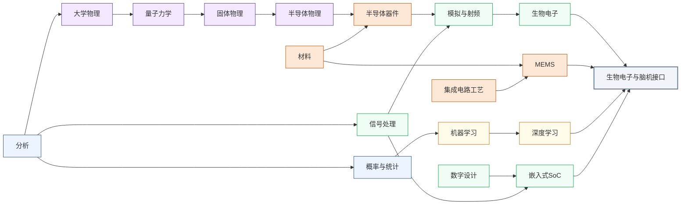

---
hide:
  - navigation
---
设计能与神经系统直接交互的芯片，记录大脑电信号、刺激神经元，最终实现人机之间的直接信息通路。

<svg viewBox="0 0 1140 532" xmlns="http://www.w3.org/2000/svg" style="width:100%;max-width:1140px;display:block;margin:1.5rem auto;font-family:system-ui,-apple-system,sans-serif;">
  <rect width="1140" height="532" rx="10" fill="#FFFFFF" stroke="#CBD5E1" stroke-width="1.5"/>
  <text x="570" y="26" text-anchor="middle" font-size="17" font-weight="bold" fill="#1E293B">集成电路科研方向全景图</text>
  <text x="250" y="54" text-anchor="middle" font-size="13.5" font-weight="bold" fill="#0E7490">← 计算媒介更奇异</text>
  <text x="1000" y="54" text-anchor="middle" font-size="13.5" font-weight="bold" fill="#16A34A">更贴近物理世界 →</text>
  <defs><filter id="loc-b" x="-5%" y="-5%" width="110%" height="110%"><feGaussianBlur stdDeviation="1.4"/></filter></defs>
  <rect x="88" y="88" width="147" height="298" rx="6" fill="#ECFEFF"/>
  <rect x="239" y="88" width="147" height="298" rx="6" fill="#F8FAFC"/>
  <rect x="390" y="88" width="147" height="298" rx="6" fill="#FEF2F2"/>
  <rect x="541" y="88" width="289" height="298" rx="6" fill="#EFF6FF"/>
  <rect x="834" y="88" width="76" height="298" rx="6" fill="#FFFBEB"/>
  <rect x="914" y="88" width="218" height="298" rx="6" fill="#F0FDF4"/>
  <text x="161" y="82" text-anchor="middle" font-size="12" font-weight="bold" fill="#0E7490">量子 · 光子</text>
  <text x="312" y="82" text-anchor="middle" font-size="12" font-weight="bold" fill="#64748B">存算 · 类脑</text>
  <text x="463" y="82" text-anchor="middle" font-size="12" font-weight="bold" fill="#DC2626">模拟 · 射频</text>
  <text x="685" y="82" text-anchor="middle" font-size="13" font-weight="bold" fill="#1D4ED8">数字计算</text>
  <text x="872" y="82" text-anchor="middle" font-size="12" font-weight="bold" fill="#D97706">功率电子</text>
  <text x="1023" y="82" text-anchor="middle" font-size="12" font-weight="bold" fill="#16A34A">传感 · 生物 · 机械</text>
  <line x1="86" y1="92" x2="1132" y2="92" stroke="#E2E8F0" stroke-width="1"/>
  <line x1="86" y1="150" x2="1132" y2="150" stroke="#EEF2F6" stroke-width="1"/>
  <line x1="86" y1="208" x2="1132" y2="208" stroke="#EEF2F6" stroke-width="1"/>
  <line x1="86" y1="266" x2="1132" y2="266" stroke="#EEF2F6" stroke-width="1"/>
  <line x1="86" y1="324" x2="1132" y2="324" stroke="#EEF2F6" stroke-width="1"/>
  <line x1="86" y1="382" x2="1132" y2="382" stroke="#E2E8F0" stroke-width="1"/>
  <line x1="86" y1="92" x2="86" y2="382" stroke="#CBD5E1" stroke-width="1"/>
  <text x="81" y="124" text-anchor="end" font-size="10.5" fill="#475569">算法 / 应用</text>
  <text x="81" y="182" text-anchor="end" font-size="10.5" fill="#475569">系统 / 软件</text>
  <text x="81" y="240" text-anchor="end" font-size="10.5" fill="#475569">体系结构</text>
  <text x="81" y="298" text-anchor="end" font-size="10.5" fill="#475569">电路</text>
  <text x="81" y="356" text-anchor="end" font-size="10.5" fill="#475569">器件</text>
  <g filter="url(#loc-b)" opacity="0.42">
  <rect x="92" y="92" width="68" height="290" rx="5" fill="#CFFAFE" stroke="#0E7490" stroke-width="1.2"/>
  <text x="126" y="231" text-anchor="middle" font-size="10.5" font-weight="bold" fill="#0E7490">量子计算</text>
  <text x="126" y="246" text-anchor="middle" font-size="10.5" font-weight="bold" fill="#0E7490">与量子芯片</text>
  <rect x="163" y="92" width="68" height="290" rx="5" fill="#CFFAFE" stroke="#0E7490" stroke-width="1.2"/>
  <text x="197" y="231" text-anchor="middle" font-size="10.5" font-weight="bold" fill="#0E7490">光电子</text>
  <text x="197" y="246" text-anchor="middle" font-size="10.5" font-weight="bold" fill="#0E7490">与硅光集成</text>
  <rect x="394" y="266" width="68" height="116" rx="5" fill="#FEE2E2" stroke="#DC2626" stroke-width="1.2"/>
  <text x="428" y="317" text-anchor="middle" font-size="10.5" font-weight="bold" fill="#DC2626">模拟与</text>
  <text x="428" y="332" text-anchor="middle" font-size="10.5" font-weight="bold" fill="#DC2626">混合信号IC</text>
  <rect x="465" y="266" width="68" height="116" rx="5" fill="#FEE2E2" stroke="#DC2626" stroke-width="1.2"/>
  <text x="499" y="317" text-anchor="middle" font-size="10.5" font-weight="bold" fill="#DC2626">射频与</text>
  <text x="499" y="332" text-anchor="middle" font-size="10.5" font-weight="bold" fill="#DC2626">毫米波IC</text>
  <rect x="243" y="92" width="68" height="290" rx="5" fill="#FEE2E2" stroke="#DC2626" stroke-width="1.2"/>
  <text x="277" y="239" text-anchor="middle" font-size="11.5" font-weight="bold" fill="#DC2626">类脑芯片</text>
  <rect x="314" y="92" width="68" height="290" rx="5" fill="#EDE9FE" stroke="#7C3AED" stroke-width="1.2"/>
  <text x="348" y="231" text-anchor="middle" font-size="10.5" font-weight="bold" fill="#7C3AED">存算一体</text>
  <text x="348" y="246" text-anchor="middle" font-size="10.5" font-weight="bold" fill="#7C3AED">与近存计算</text>
  <rect x="545" y="92" width="68" height="290" rx="5" fill="#EDE9FE" stroke="#7C3AED" stroke-width="1.2"/>
  <text x="579" y="231" text-anchor="middle" font-size="10.5" font-weight="bold" fill="#7C3AED">硬件安全</text>
  <text x="579" y="246" text-anchor="middle" font-size="10.5" font-weight="bold" fill="#7C3AED">与可信计算</text>
  <rect x="616" y="92" width="68" height="174" rx="5" fill="#DBEAFE" stroke="#1D4ED8" stroke-width="1.2"/>
  <text x="650" y="172" text-anchor="middle" font-size="10.5" font-weight="bold" fill="#1D4ED8">AI 算法</text>
  <text x="650" y="187" text-anchor="middle" font-size="10.5" font-weight="bold" fill="#1D4ED8">与系统</text>
  <rect x="687" y="150" width="68" height="116" rx="5" fill="#DBEAFE" stroke="#1D4ED8" stroke-width="1.2"/>
  <text x="721" y="201" text-anchor="middle" font-size="10.5" font-weight="bold" fill="#1D4ED8">处理器架构</text>
  <text x="721" y="216" text-anchor="middle" font-size="10.5" font-weight="bold" fill="#1D4ED8">与编译系统</text>
  <rect x="758" y="208" width="68" height="116" rx="5" fill="#DBEAFE" stroke="#1D4ED8" stroke-width="1.2"/>
  <text x="792" y="259" text-anchor="middle" font-size="10.5" font-weight="bold" fill="#1D4ED8">可重构计算</text>
  <text x="792" y="274" text-anchor="middle" font-size="10.5" font-weight="bold" fill="#1D4ED8">与 FPGA</text>
  <rect x="838" y="266" width="68" height="116" rx="5" fill="#FEF3C7" stroke="#D97706" stroke-width="1.2"/>
  <text x="872" y="317" text-anchor="middle" font-size="10.5" font-weight="bold" fill="#B45309">功率半导体</text>
  <text x="872" y="332" text-anchor="middle" font-size="10" font-weight="bold" fill="#B45309">与宽禁带器件</text>
  <rect x="918" y="92" width="68" height="290" rx="5" fill="#ECFCCB" stroke="#65A30D" stroke-width="1.2"/>
  <text x="952" y="239" text-anchor="middle" font-size="11.5" font-weight="bold" fill="#4D7C0F">具身智能</text>
  <rect x="989" y="266" width="68" height="116" rx="5" fill="#D1FAE5" stroke="#059669" stroke-width="1.2"/>
  <text x="1023" y="317" text-anchor="middle" font-size="10.5" font-weight="bold" fill="#047857">生物电子</text>
  <text x="1023" y="332" text-anchor="middle" font-size="10.5" font-weight="bold" fill="#047857">与脑机接口</text>
  <rect x="1060" y="266" width="68" height="116" rx="5" fill="#DCFCE7" stroke="#16A34A" stroke-width="1.2"/>
  <text x="1094" y="317" text-anchor="middle" font-size="10.5" font-weight="bold" fill="#15803D">MEMS 与</text>
  <text x="1094" y="332" text-anchor="middle" font-size="10.5" font-weight="bold" fill="#15803D">微纳传感器</text>
  </g>
  <text x="81" y="450" text-anchor="end" font-size="10.5" fill="#475569">各方向通用</text>
  <g filter="url(#loc-b)" opacity="0.42">
  <rect x="92" y="408" width="1040" height="28" rx="5" fill="#F1F5F9" stroke="#64748B" stroke-width="1.1"/>
  <text x="612" y="426" text-anchor="middle" font-size="12" font-weight="bold" fill="#475569">EDA 与设计自动化</text>
  <rect x="92" y="440" width="1040" height="28" rx="5" fill="#EEF2F6" stroke="#64748B" stroke-width="1.1"/>
  <text x="612" y="458" text-anchor="middle" font-size="12" font-weight="bold" fill="#475569">先进封装与系统集成</text>
  <rect x="92" y="472" width="1040" height="30" rx="5" fill="#E2E8F0" stroke="#475569" stroke-width="1.2"/>
  <text x="612" y="491" text-anchor="middle" font-size="12" font-weight="bold" fill="#334155">半导体器件与先进工艺</text>
  </g>
  <rect x="92" y="512" width="13" height="13" rx="2" fill="#DBEAFE" stroke="#1D4ED8" stroke-width="1.1"/>
  <text x="110" y="522" text-anchor="start" font-size="10.5" fill="#475569">数字</text>
  <rect x="160" y="512" width="13" height="13" rx="2" fill="#FEE2E2" stroke="#DC2626" stroke-width="1.1"/>
  <text x="178" y="522" text-anchor="start" font-size="10.5" fill="#475569">模拟</text>
  <rect x="228" y="512" width="13" height="13" rx="2" fill="#EDE9FE" stroke="#7C3AED" stroke-width="1.1"/>
  <text x="246" y="522" text-anchor="start" font-size="10.5" fill="#475569">数字 / 模拟 交叉</text>
  <rect x="973" y="269" width="104" height="116" rx="9" fill="#1E293B" opacity="0.16"/>
  <rect x="971" y="266" width="104" height="116" rx="9" fill="#D1FAE5" stroke="#059669" stroke-width="2.6"/>
  <text x="1023" y="317" text-anchor="middle" font-size="13" font-weight="bold" fill="#047857">生物电子</text>
  <text x="1023" y="332" text-anchor="middle" font-size="13" font-weight="bold" fill="#047857">与脑机接口</text>
</svg>

## 这个方向在研究什么

1985年，43岁的霍金因一场肺炎做了气管切开术，彻底失去了说话能力。此后他先用手里的开关逐字选词控制语音合成器。直到约二十年后手也瘫了，才换成大家熟悉的那招，靠脸颊一块还能动的肌肉轻微抽动来打字。可霍金其实是“幸运”的渐冻症（ALS）患者。这种病吞掉了他几乎所有的运动能力，偏偏给他留下了这块还能动的肌肉。一旦病情走到连脸颊都动不了的完全闭锁，这条窄路也会断掉。人还清醒，大脑照常发放电脉冲，却再也找不到一块肌肉把意图送出去。

一个前沿的解决方案是绕过所有肌肉，直接从大脑里把话读出来。2022 年，斯坦福团队把电极阵列植入渐冻症患者 Pat Bennett 的大脑皮层（成果 2023 年发表于 Nature），一块芯片实时解码她“尝试发音”时神经元的放电，在屏幕上打出 “I am thirsty”、“bring my glasses here”，速度逼近正常人说话的节奏，远超霍金靠脸颊肌肉打字所能达到的速度上限。把芯片直接接到神经系统上，让大脑和外部世界重新连通，这就是**生物电子与脑机接口**在做的事。

<svg viewBox="0 0 860 340" xmlns="http://www.w3.org/2000/svg" style="width:100%;max-width:860px;display:block;margin:1.5rem auto;font-family:system-ui,sans-serif;">
  <defs>
    <marker id="bci-rd" markerWidth="9" markerHeight="9" refX="6.5" refY="3" orient="auto"><path d="M0,0 L0,6 L8,3 z" fill="#475569"/></marker>
    <marker id="bci-wr" markerWidth="9" markerHeight="9" refX="6.5" refY="3" orient="auto"><path d="M0,0 L0,6 L8,3 z" fill="#DC2626"/></marker>
  </defs>
  <!-- 中心标题 -->
  <text x="400" y="166" text-anchor="middle" font-size="21" font-weight="700" fill="#475569">闭环</text>
  <text x="400" y="188" text-anchor="middle" font-size="13" fill="#64748B">边读 · 边判断 · 边刺激</text>
  <!-- 大脑节点 -->
  <ellipse cx="108" cy="170" rx="66" ry="54" fill="#DCFCE7" stroke="#16A34A" stroke-width="1.8"/>
  <text x="108" y="164" text-anchor="middle" font-size="13" font-weight="600" fill="#15803D">大脑 / 神经元</text>
  <text x="108" y="182" text-anchor="middle" font-size="11" fill="#166534">动作电位 ~几十μV</text>
  <!-- 上行：读 -->
  <rect x="206" y="56" width="92" height="52" rx="6" fill="#FEF3C7" stroke="#D97706" stroke-width="1.6"/>
  <text x="252" y="86" text-anchor="middle" font-size="13" font-weight="600" fill="#B45309">记录电极</text>
  <rect x="340" y="56" width="120" height="52" rx="6" fill="#DBEAFE" stroke="#3B82F6" stroke-width="1.6"/>
  <text x="400" y="80" text-anchor="middle" font-size="13" font-weight="600" fill="#1D4ED8">前端 IC</text>
  <text x="400" y="96" text-anchor="middle" font-size="11" fill="#1E40AF">LNA · ADC</text>
  <rect x="502" y="56" width="104" height="52" rx="6" fill="#EDE9FE" stroke="#7C3AED" stroke-width="1.6"/>
  <text x="554" y="80" text-anchor="middle" font-size="13" font-weight="600" fill="#6D28D9">神经解码</text>
  <text x="554" y="96" text-anchor="middle" font-size="11" fill="#5B21B6">对抗漂移</text>
  <rect x="648" y="56" width="160" height="52" rx="6" fill="#CFFAFE" stroke="#0891B2" stroke-width="1.6"/>
  <text x="728" y="80" text-anchor="middle" font-size="13" font-weight="600" fill="#0E7490">意图输出</text>
  <text x="728" y="96" text-anchor="middle" font-size="11" fill="#155E75">光标 · 语音 · 义肢</text>
  <!-- 下行：写 -->
  <rect x="620" y="232" width="188" height="52" rx="6" fill="#FEE2E2" stroke="#EF4444" stroke-width="1.6"/>
  <text x="714" y="256" text-anchor="middle" font-size="13" font-weight="600" fill="#DC2626">刺激控制器</text>
  <text x="714" y="272" text-anchor="middle" font-size="11" fill="#B91C1C">只在需要时出手</text>
  <rect x="406" y="232" width="104" height="52" rx="6" fill="#FEF3C7" stroke="#D97706" stroke-width="1.6"/>
  <text x="458" y="262" text-anchor="middle" font-size="13" font-weight="600" fill="#B45309">刺激电极</text>
  <!-- 读链箭头 -->
  <line x1="166" y1="146" x2="206" y2="92" stroke="#475569" stroke-width="1.5" marker-end="url(#bci-rd)"/>
  <line x1="298" y1="82" x2="338" y2="82" stroke="#475569" stroke-width="1.5" marker-end="url(#bci-rd)"/>
  <line x1="460" y1="82" x2="500" y2="82" stroke="#475569" stroke-width="1.5" marker-end="url(#bci-rd)"/>
  <line x1="606" y1="82" x2="646" y2="82" stroke="#475569" stroke-width="1.5" marker-end="url(#bci-rd)"/>
  <!-- 写链箭头（顺时针回环） -->
  <line x1="728" y1="110" x2="714" y2="230" stroke="#DC2626" stroke-width="1.5" marker-end="url(#bci-wr)"/>
  <line x1="620" y1="258" x2="512" y2="258" stroke="#DC2626" stroke-width="1.5" marker-end="url(#bci-wr)"/>
  <line x1="406" y1="258" x2="168" y2="200" stroke="#DC2626" stroke-width="1.5" marker-end="url(#bci-wr)"/>
  <!-- 图例 -->
  <text x="150" y="305" font-size="12" fill="#475569">读：神经 → 意图</text>
  <text x="150" y="322" font-size="12" fill="#DC2626">写：刺激 → 神经</text>
</svg>

生物电子按功能又可分为“读和写”两种。“读”指的是把大脑接出来，读取神经元的活动、解码成意图，去驱动光标、机械臂或合成语音，让瘫痪和闭锁的人重新和世界连上，这也是狭义的**脑机接口**。“写”则是把信号写回去，用电脉冲精确刺激神经元、修复受损的神经通路，这是**神经调控**。

无论是“读”还是“写”，都得先回答同一个问题：电极到底放在哪？这个问题目前分为两派：**非侵入式**和**侵入式**。非侵入式主张完全不开颅，把电极贴在头皮上记**脑电**（Electroencephalography, EEG）。戴上就能用、几乎零风险，代价是信号隔着颅骨和头皮被衰减、被抹平，空间分辨率粗到厘米级，分不清底下具体哪群神经元在放电。即便如此，巧妙的范式照样能压出可观的带宽。清华团队的 SSVEP 拼写器让人盯着以不同频率闪烁的字符，视觉皮层会产生同频的脑电响应，用这种方法在头皮电极上达到约 12 词/分，是非侵入路线目前的速度上限。但它的代价是范式被锁死，你只能从屏幕上一组预设的闪烁目标里挑，而不是真把任意念头读出来。侵入式一般要开颅，把微电极阵列直接插进大脑皮层，贴着神经元记录，能分辨到单个细胞、看到清清楚楚的 spike。霍金没能拥有的自由表达、Bennett 打出的整句话，走的都是这条侵入式的路。<u>侵入端的信号质量更高、意图解析更精细，但手术创伤和长期风险随之上升。</u>

<svg viewBox="0 0 860 320" xmlns="http://www.w3.org/2000/svg" style="width:100%;max-width:860px;display:block;margin:1.5rem auto;font-family:system-ui,sans-serif;">
  <defs>
    <marker id="bci-depth" markerWidth="9" markerHeight="9" refX="4" refY="7" orient="auto"><path d="M0,0 L6,0 L3,8 z" fill="#475569"/></marker>
  </defs>
  <!-- 分层剖面 -->
  <rect x="70" y="64" width="290" height="40" fill="#F6DCC4" stroke="#CDA176" stroke-width="1.2"/>
  <text x="80" y="88" font-size="13" fill="#8A5A2B">头皮</text>
  <rect x="70" y="104" width="290" height="26" fill="#ECECEC" stroke="#C8C8C8" stroke-width="1.2"/>
  <text x="80" y="121" font-size="13" fill="#777777">颅骨</text>
  <rect x="70" y="130" width="290" height="80" fill="#F1D4E1" stroke="#D89BB7" stroke-width="1.2"/>
  <text x="80" y="148" font-size="13" fill="#A04E78">大脑皮层</text>
  <rect x="70" y="210" width="290" height="58" fill="#DBD3EF" stroke="#B2A6DC" stroke-width="1.2"/>
  <text x="80" y="228" font-size="13" fill="#6B5BA8">皮层下</text>
  <!-- EEG 电极 -->
  <ellipse cx="160" cy="84" rx="18" ry="8" fill="#D4AF37" stroke="#9A7B16" stroke-width="1.2"/>
  <text x="160" y="58" text-anchor="middle" font-size="12" font-weight="600" fill="#9A7B16">EEG</text>
  <!-- ECoG 片 -->
  <rect x="150" y="132" width="120" height="9" rx="4" fill="#2563EB"/>
  <text x="210" y="126" text-anchor="middle" font-size="12" font-weight="600" fill="#1D4ED8">ECoG</text>
  <!-- 微电极阵列 -->
  <rect x="288" y="128" width="56" height="6" fill="#1D4ED8"/>
  <line x1="296" y1="134" x2="296" y2="192" stroke="#1D4ED8" stroke-width="2"/>
  <line x1="310" y1="134" x2="310" y2="198" stroke="#1D4ED8" stroke-width="2"/>
  <line x1="324" y1="134" x2="324" y2="192" stroke="#1D4ED8" stroke-width="2"/>
  <line x1="338" y1="134" x2="338" y2="196" stroke="#1D4ED8" stroke-width="2"/>
  <text x="316" y="252" text-anchor="middle" font-size="12" font-weight="600" fill="#1E40AF">微电极阵列</text>
  <!-- 深度轴 -->
  <line x1="384" y1="74" x2="384" y2="256" stroke="#475569" stroke-width="1.6" marker-end="url(#bci-depth)"/>
  <text x="384" y="58" text-anchor="middle" font-size="11" fill="#64748B">无创·糊</text>
  <text x="384" y="282" text-anchor="middle" font-size="11" fill="#64748B">有创·清晰</text>
  <!-- 右侧说明 -->
  <text x="430" y="84" font-size="15" font-weight="600" fill="#B45309">头皮 EEG · 非侵入</text>
  <text x="430" y="103" font-size="12" fill="#555555">戴上就能用、零风险。信号隔着颅骨被</text>
  <text x="430" y="119" font-size="12" fill="#555555">抹平到厘米级。清华 SSVEP 拼写器靠盯</text>
  <text x="430" y="135" font-size="12" fill="#555555">闪烁也能到约 12 词/分，但只能从预设</text>
  <text x="430" y="151" font-size="12" fill="#555555">目标里选。</text>
  <text x="430" y="184" font-size="15" font-weight="600" fill="#1D4ED8">ECoG · 半侵入</text>
  <text x="430" y="203" font-size="12" fill="#555555">开颅但贴在皮层表面，不插进去。</text>
  <text x="430" y="236" font-size="15" font-weight="600" fill="#1E40AF">皮层内微电极 · 侵入</text>
  <text x="430" y="255" font-size="12" fill="#555555">插进皮层、贴着神经元，分辨到单细胞</text>
  <text x="430" y="271" font-size="12" fill="#555555">的 spike，几十 μV。Utah array、</text>
  <text x="430" y="287" font-size="12" fill="#555555">Neuropixels、Neuralink N1 都走这条。</text>
</svg>

对于侵入式而言，芯片插进了皮层，挑战才正式开始。单个神经元发放的**动作电位**（action potential, spike），在电极尖端测到的电压只有几十到几百微伏，持续不到一毫秒，还叠在幅度大得多的局部场电位（Local Field Potential, LFP）和肌电、电源干扰上面。要从这种信号里干净地抠出单个神经元的活动，电极后面得紧跟一个输入噪声极低的放大器，把信号放大六七十分贝而几乎不添新噪声。这是模拟 IC 里最难的活之一。衡量它的指标叫**噪声效率因子**（Noise Efficiency Factor, NEF），有一条由物理决定的下限，真实电路既要逼近这条下限，又得把每通道功耗压到微瓦量级。功耗为什么这么要命？因为整块芯片只要多耗几毫瓦，发出的热就足以灼伤周围的脑组织，这是植入物碰都不能碰的红线。

读到干净的 spike，离“读懂”还隔着一座山。芯片采下来的不过是一串电压波形，要把它翻译成“她想说哪个词”“他想把光标往哪挪”，中间还差一层解码模型。这层模型是神经科学和 AI 的交叉地带。得先弄清大脑究竟用什么样的放电模式去编码一个动作的方向、一次发音的口型，再训练算法把这套编码反解回来。**Neuralink 的 N1** 把上千个电极扎进运动皮层，2024 年初第一位四肢瘫痪的患者 Noland Arbaugh 靠想象自己的手在动，就能移动光标、下国际象棋，到 2025 年底已经有十几个人装上；Pat Bennett 那边解码的则是尝试发音对应的神经活动。但更大的问题在于，这套映射并不稳定。同一个意图，今天和几周后在神经元里的“坐标”会悄悄漂移，一部分是因为电极相对脑组织有微米级位移，记录到的神经元在不断换班。结果是昨天还很准的解码器，今天就得重新校准。怎么让模型自己跟上漂移、不必天天让病人停下来重训，是眼下最活跃的研究问题之一。

除了“读”之外，“写”这条线也已经临床落地多年。**人工耳蜗**把声音拆成按频率分组的电刺激，绕过坏掉的毛细胞直接点亮听觉神经，帮全球上百万重度失聪的人重新听见声音，是整个领域最成熟的临床成功。视觉那头，**视网膜假体**把摄像头的画面转成电刺激送进残存的视网膜，替失明者重建一点光感，只是还远没有耳蜗那么成熟。治病这条线则有**深部脑刺激**（Deep Brain Stimulation, DBS），把电极送进大脑深处的丘脑底核持续放电，显著压住帕金森患者的震颤。这项技术已经造福全球几十万人，是植入式神经调控里最成熟的疗法之一。“写”的主要挑战在于神经信号的刺激控制。幅度、频率、脉宽都得卡得很准，太弱没疗效，太强会带来副作用甚至烧坏神经组织。

还有一个常被忽略的问题——电极寿命。把一根硬邦邦的硅探针插进柔软的大脑，身体会拿它当异物，周围慢慢长出胶质瘢痕把电极裹起来，几个月到几年后信号一点点变弱，直到什么都记不到。所以材料这一支专门在跟“长期”较劲。把电极做得越来越柔软、越来越细，让它在脑组织里几乎“隐形”以减轻排异；用纳米薄膜做出能贴合脑回沟壑的柔性阵列；或者像 Neuropixels 那样在一根探针上集成上千个记录点，用密度换取更多有效通道。

### 核心研究问题

- **低噪声神经记录前端**：前置放大器要把几十微伏的 spike 放大 60-80 dB 而几乎不添噪声，每通道功耗还得钉在微瓦量级，整块芯片多出几毫瓦的热就会灼伤脑组织。
- **spike 检测与分选**：不到一毫秒的动作电位叠在幅度大得多的场电位、肌电、电源干扰上，信噪比天然很差，前端要稳稳分离，再在片上把 spike 分选出来。
- **千通道集成与片上压缩**：上千路放大器加 ADC 塞进一块植入 SoC，面积功耗都被压死，海量采样还得片上压缩再无线送出。
- **无线供能与遥测**：植入物不能拖根线出颅，靠射频或超声隔着组织供电、把数据传出来，效率、热、体积三者互相挤压。
- **解码模型与神经漂移**：电极相对脑组织的微米级位移让记录到的神经元不断换班，昨天还准的解码器今天就失准，要让模型自己跟上漂移，而不必天天重新校准。
- **非侵入式范式的带宽极限**：头皮 EEG 隔着颅骨被抹平到厘米级，要靠 SSVEP、P300、运动想象这些范式从弱信号里压出可用带宽。
- **闭环刺激的实时判读与安全窗口**：神经调控要边记录边检测病理放电、毫秒级判断该不该出手，电流幅度、频率、脉宽还得卡在太弱没疗效、太强损伤神经的窄窗口里。
- **柔性电极与长期寿命**：硬硅探针插进软脑组织会被胶质瘢痕裹住、信号逐月衰减，出路是把电极做得更柔更细、用纳米薄膜贴合脑回。

### 知识路径

器件物理打底，模拟前端是核心，信号处理做链路，电极和植入器件走 MEMS 线，深度学习做神经解码，嵌入式 SoC 做边缘端集成。节点对应[学习地图](../学习地图/index.md)里的目录：

- 数学：[分析](../学习地图/数学/分析/index.md)（微积分、复变函数，信号处理的前置） · [概率与统计](../学习地图/数学/概率与统计/index.md)
- 物理：[大学物理](../学习地图/物理/大学物理/index.md) · [量子力学](../学习地图/物理/量子力学/index.md) · [固体物理](../学习地图/物理/固体物理/index.md) · [半导体物理](../学习地图/物理/半导体物理/index.md)
- 器件与工艺：[半导体器件](../学习地图/器件与工艺/半导体器件/index.md) · [材料](../学习地图/器件与工艺/材料/index.md)（生物相容性材料） · [集成电路工艺](../学习地图/器件与工艺/集成电路工艺/index.md) · [MEMS](../学习地图/器件与工艺/MEMS/index.md)（待建，神经电极与植入器件）
- 电路：[信号处理](../学习地图/电路/信号处理/index.md) · [模拟与射频](../学习地图/电路/模拟与射频/index.md) · [数字设计](../学习地图/电路/数字设计/index.md) · [嵌入式SoC](../学习地图/电路/嵌入式SoC/index.md) · [生物电子](../学习地图/电路/生物电子/index.md)（待建）
- 人工智能：[机器学习](../学习地图/人工智能/机器学习/index.md) · [深度学习](../学习地图/人工智能/深度学习/index.md)

## 这个方向适合谁

适合愿意跨界、有使命感的人。电路上这是一份把约束压到极限的工作，几十微伏的信号、每通道几微瓦的功耗，超了就灼伤脑组织，指标背后直接是人。但只懂电路走不远，神经科学的常识要自己学，解码要补机器学习，实验得跟医生合作，排期和审批都不在自己手里。反馈也很慢，从动物实验到人体试验通常隔好几年，光有好奇心难以坚持那么久。

## 学术界

### 课题组

**境内**

-   **[马恺声](http://group.iiis.tsinghua.edu.cn/~maks/)** 清华

    神经信号记录芯片 | 植入式无线传输 | BCI 系统架构

-   **[高小榕](https://brain.tsinghua.edu.cn/info/1010/1006.htm)** 清华

    脑电信号处理 | 耳内生物电子 BCI | 多模态脑成像融合

-   **[洪波](https://brain.tsinghua.edu.cn/info/1010/1008.htm)** 清华

    颅内电极记录 | 皮层信号解码 | 微创 BCI 系统

-   **[谢翔](https://www.ime.tsinghua.edu.cn/info/1039/1582.htm)** 清华

    低功耗神经接口芯片 | 存算一体电路 | 微型医疗电子

-   **[宋恩名](https://brain-interface.fudan.edu.cn/main.htm)** 复旦

    柔性可降解神经接口 | 无线植入式 BCI | 慢性神经记录与调控

-   **[段小洁](https://future.pku.edu.cn/en/js/Faculty/DeptBME/040a2fe7553b4cc0a00b38c1f1f42d9c.htm)** 北大 

    柔性植入神经电极 | 多模态神经记录与调控 | 视网膜 / 深脑信号采集

-   **[李志宏](https://ic.pku.edu.cn/szdw/zzjs/L1/lzh/index.htm)** 北大

    BioMEMS 微加工 | 植入式硅基神经探针 | 脑机接口系统

-   **[王国兴](https://bicasl.sjtu.edu.cn/info/1017/1080.htm)** 交大

    高能效神经记录 IC | 智能 BCI 芯片与系统 | 视网膜假体 / 植入式生物电子

-   **[陈铭易](https://icisee.sjtu.edu.cn/jiaoshiml/chenmingyi.html)** 交大

    模拟前端 | 低噪声 EEG 采集芯片 | 植入式无线供能与传输

-   **[刘彦](https://bicasl.sjtu.edu.cn/info/1017/1078.htm)** 交大

    神经记录前端 ASIC | 多通道 spike 分选 | 植入式生化传感芯片

-   **[郝耀耀](https://person.zju.edu.cn/yaoyaoh)** 浙大

    全植入 BCI 微系统 | 柔性神经电极阵列 | 脑机接口动物与临床实验

-   **[王跃明](https://person.zju.edu.cn/ymwang)** 浙大

    皮层内神经信号解码 | 侵入式多通道记录芯片 | 手部运动意图识别

-   **[潘纲](https://person.zju.edu.cn/gpan)** 浙大

    类脑计算芯片（达尔文系列） | 脉冲神经网络硬件映射 | 神经形态 BCI 解码

-   **[Mohamad Sawan](https://cenbrain.westlake.edu.cn/)** 西湖大学

    植入式神经接口 ASIC | 闭环神经调控芯片 | 多模态脑信号采集

<button class="prof-show-all">显示全部 ↓</button>

**境外**

-   **[Ni Zhao（赵铌）](https://www.ee.cuhk.edu.hk/~nzhao/)** 港中大 

    柔性可拉伸生物电子 | 钙钛矿光电探测器 | 表皮健康监测贴片

-   **[Shiming Zhang（张世明）](https://ece.hku.hk/people/smzhang/)** 港大

    有机电化学晶体管 | 柔性可穿戴生物传感 | 仿生 AI 感知器件

-   **[Rahul Sarpeshkar](https://engineering.dartmouth.edu/community/faculty/rahul-sarpeshkar)** Dartmouth

    超低功耗模拟电路 | 神经假体芯片 | 仿生计算

-   **[Michel Maharbiz](https://maharbizgroup.wordpress.com/)** UC Berkeley

    超声驱动神经尘埃 | 极微型植入式无线接口 | 外周神经调控器件

-   **[Rikky Muller](https://www.rikkymuller.com/)** UC Berkeley 

    低功耗神经记录刺激 IC | 无线超声神经植入网络 | 光学神经调控接口

-   **[Mahsa Shoaran](https://people.epfl.ch/mahsa.shoaran)** EPFL 

    闭环神经刺激 SoC | 多通道神经记录 ASIC | 片上机器学习癫痫/帕金森检测

-   **[Timothy Denison](https://www.oxfordmartin.ox.ac.uk/people/timothy-denison)** Oxford

    自适应深脑刺激 | 闭环植入式神经调控 | 可植入 BCI 与神经信号处理

<button class="prof-show-all">显示全部 ↓</button>

### 学术会议与期刊

  
会议
    ISSCC
    ESSCIRC
    VLSI Symposium
    IEEE EMBC
    IEEE BioCAS
  

  
期刊
    IEEE JSSC
    IEEE TBioCAS
    IEEE TBME
    IEEE TNSRE
    Nature Biomedical Engineering
  

## 毕业去向

### 企业

  
国内
    <a class="dm-chip" href="http://www.neuracle.cn/">博睿康 Neuracle</a>
    <a class="dm-chip" href="https://www.neuroxess.com/">脑虎科技 NeuroXess</a>
    <a class="dm-chip" href="https://we-linking.com/">微灵医疗 WE-LINKING</a>
    <a class="dm-chip" href="https://www.brainco.tech/">强脑科技 BrainCo</a>
    <a class="dm-chip" href="https://www.nurotron.com/">诺尔康 Nurotron</a>
  

  
国外
    <a class="dm-chip" href="https://neuralink.com/">Neuralink</a>
    <a class="dm-chip" href="https://synchron.com/">Synchron</a>
    <a class="dm-chip" href="https://blackrockneurotech.com/">Blackrock Neurotech</a>
    <a href="https://www.medtronic.com/">Medtronic</a>
    <a href="https://www.abbott.com/">Abbott</a>
    <a href="https://www.cochlear.com/">Cochlear</a>
    <a class="dm-chip" href="https://www.medel.com/">MED-EL</a>
    <a class="dm-chip" href="https://www.emotiv.com/">Emotiv</a>
  

### 科研院所

  
国内
    <a class="dm-chip" href="https://www.sim.cas.cn/">中科院上海微系统与信息技术研究所</a>
    <a class="dm-chip" href="http://fit.zju.edu.cn/">浙江大学脑机智能全国重点实验室</a>
    <a class="dm-chip" href="https://www.shibs.cn/">深港脑科学创新研究院</a>
    <a class="dm-chip" href="https://cenbrain.westlake.edu.cn/">西湖大学神经接口与脑机交互实验室</a>
  

  
国外
    <a class="dm-chip" href="https://www.braingate.org/">BrainGate 联盟</a>
    <a class="dm-chip" href="https://www.imec-int.com/en/expertise/health-technologies/neural-probes">imec 神经探针</a>
    <a class="dm-chip" href="https://neuro-x.epfl.ch/en/">EPFL Neuro·X</a>
    <a class="dm-chip" href="https://mcgovern.mit.edu/">MIT McGovern Institute</a>
  

## 相关科普

  <a class="vc-card" href="https://www.bilibili.com/video/BV1djrNB3Eby" target="_blank" rel="noopener">
    
      
      B站
    
    
      脑机接口大盘点：从科幻到现实，谁在引领这场「读心术」革命？
      硅谷101 · 168.2万播放
    
  </a>
  <a class="vc-card" href="https://www.youtube.com/watch?v=xMxJYhUg0pc" target="_blank" rel="noopener">
    
      
      YouTube
    
    
      Brain-Computer Interfaces — The Future of Humanity?
      Kurzgesagt
    
  </a>

## 论文推荐

!!! note "待补充"
    欢迎推荐该方向的入门综述或经典论文，[参与建设 →](../参与建设.md)
