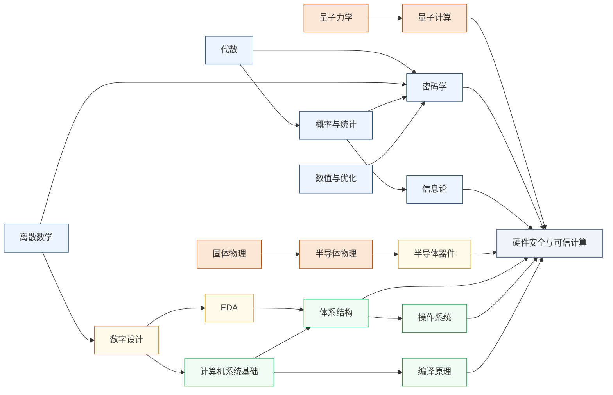

---
hide:
  - navigation
---
从芯片和硬件层面研究如何攻击计算系统，以及如何在设计阶段构建防御。这是网络安全中最底层、最难防御的战场。

<svg viewBox="0 0 1140 532" xmlns="http://www.w3.org/2000/svg" style="width:100%;max-width:1140px;display:block;margin:1.5rem auto;font-family:system-ui,-apple-system,sans-serif;">
  <rect width="1140" height="532" rx="10" fill="#FFFFFF" stroke="#CBD5E1" stroke-width="1.5"/>
  <text x="570" y="26" text-anchor="middle" font-size="17" font-weight="bold" fill="#1E293B">集成电路科研方向全景图</text>
  <text x="250" y="54" text-anchor="middle" font-size="13.5" font-weight="bold" fill="#0E7490">← 计算媒介更奇异</text>
  <text x="1000" y="54" text-anchor="middle" font-size="13.5" font-weight="bold" fill="#16A34A">更贴近物理世界 →</text>
  <defs><filter id="loc-b" x="-5%" y="-5%" width="110%" height="110%"><feGaussianBlur stdDeviation="1.4"/></filter></defs>
  <rect x="88" y="88" width="147" height="298" rx="6" fill="#ECFEFF"/>
  <rect x="239" y="88" width="147" height="298" rx="6" fill="#F8FAFC"/>
  <rect x="390" y="88" width="147" height="298" rx="6" fill="#FEF2F2"/>
  <rect x="541" y="88" width="289" height="298" rx="6" fill="#EFF6FF"/>
  <rect x="834" y="88" width="76" height="298" rx="6" fill="#FFFBEB"/>
  <rect x="914" y="88" width="218" height="298" rx="6" fill="#F0FDF4"/>
  <text x="161" y="82" text-anchor="middle" font-size="12" font-weight="bold" fill="#0E7490">量子 · 光子</text>
  <text x="312" y="82" text-anchor="middle" font-size="12" font-weight="bold" fill="#64748B">存算 · 类脑</text>
  <text x="463" y="82" text-anchor="middle" font-size="12" font-weight="bold" fill="#DC2626">模拟 · 射频</text>
  <text x="685" y="82" text-anchor="middle" font-size="13" font-weight="bold" fill="#1D4ED8">数字计算</text>
  <text x="872" y="82" text-anchor="middle" font-size="12" font-weight="bold" fill="#D97706">功率电子</text>
  <text x="1023" y="82" text-anchor="middle" font-size="12" font-weight="bold" fill="#16A34A">传感 · 生物 · 机械</text>
  <line x1="86" y1="92" x2="1132" y2="92" stroke="#E2E8F0" stroke-width="1"/>
  <line x1="86" y1="150" x2="1132" y2="150" stroke="#EEF2F6" stroke-width="1"/>
  <line x1="86" y1="208" x2="1132" y2="208" stroke="#EEF2F6" stroke-width="1"/>
  <line x1="86" y1="266" x2="1132" y2="266" stroke="#EEF2F6" stroke-width="1"/>
  <line x1="86" y1="324" x2="1132" y2="324" stroke="#EEF2F6" stroke-width="1"/>
  <line x1="86" y1="382" x2="1132" y2="382" stroke="#E2E8F0" stroke-width="1"/>
  <line x1="86" y1="92" x2="86" y2="382" stroke="#CBD5E1" stroke-width="1"/>
  <text x="81" y="124" text-anchor="end" font-size="10.5" fill="#475569">算法 / 应用</text>
  <text x="81" y="182" text-anchor="end" font-size="10.5" fill="#475569">系统 / 软件</text>
  <text x="81" y="240" text-anchor="end" font-size="10.5" fill="#475569">体系结构</text>
  <text x="81" y="298" text-anchor="end" font-size="10.5" fill="#475569">电路</text>
  <text x="81" y="356" text-anchor="end" font-size="10.5" fill="#475569">器件</text>
  <g filter="url(#loc-b)" opacity="0.42">
  <rect x="92" y="92" width="68" height="290" rx="5" fill="#CFFAFE" stroke="#0E7490" stroke-width="1.2"/>
  <text x="126" y="231" text-anchor="middle" font-size="10.5" font-weight="bold" fill="#0E7490">量子计算</text>
  <text x="126" y="246" text-anchor="middle" font-size="10.5" font-weight="bold" fill="#0E7490">与量子芯片</text>
  <rect x="163" y="92" width="68" height="290" rx="5" fill="#CFFAFE" stroke="#0E7490" stroke-width="1.2"/>
  <text x="197" y="231" text-anchor="middle" font-size="10.5" font-weight="bold" fill="#0E7490">光电子</text>
  <text x="197" y="246" text-anchor="middle" font-size="10.5" font-weight="bold" fill="#0E7490">与硅光集成</text>
  <rect x="394" y="266" width="68" height="116" rx="5" fill="#FEE2E2" stroke="#DC2626" stroke-width="1.2"/>
  <text x="428" y="317" text-anchor="middle" font-size="10.5" font-weight="bold" fill="#DC2626">模拟与</text>
  <text x="428" y="332" text-anchor="middle" font-size="10.5" font-weight="bold" fill="#DC2626">混合信号IC</text>
  <rect x="465" y="266" width="68" height="116" rx="5" fill="#FEE2E2" stroke="#DC2626" stroke-width="1.2"/>
  <text x="499" y="317" text-anchor="middle" font-size="10.5" font-weight="bold" fill="#DC2626">射频与</text>
  <text x="499" y="332" text-anchor="middle" font-size="10.5" font-weight="bold" fill="#DC2626">毫米波IC</text>
  <rect x="243" y="92" width="68" height="290" rx="5" fill="#FEE2E2" stroke="#DC2626" stroke-width="1.2"/>
  <text x="277" y="239" text-anchor="middle" font-size="11.5" font-weight="bold" fill="#DC2626">类脑芯片</text>
  <rect x="314" y="92" width="68" height="290" rx="5" fill="#EDE9FE" stroke="#7C3AED" stroke-width="1.2"/>
  <text x="348" y="231" text-anchor="middle" font-size="10.5" font-weight="bold" fill="#7C3AED">存算一体</text>
  <text x="348" y="246" text-anchor="middle" font-size="10.5" font-weight="bold" fill="#7C3AED">与近存计算</text>
  <rect x="545" y="92" width="68" height="290" rx="5" fill="#EDE9FE" stroke="#7C3AED" stroke-width="1.2"/>
  <text x="579" y="231" text-anchor="middle" font-size="10.5" font-weight="bold" fill="#7C3AED">硬件安全</text>
  <text x="579" y="246" text-anchor="middle" font-size="10.5" font-weight="bold" fill="#7C3AED">与可信计算</text>
  <rect x="616" y="92" width="68" height="174" rx="5" fill="#DBEAFE" stroke="#1D4ED8" stroke-width="1.2"/>
  <text x="650" y="172" text-anchor="middle" font-size="10.5" font-weight="bold" fill="#1D4ED8">AI 算法</text>
  <text x="650" y="187" text-anchor="middle" font-size="10.5" font-weight="bold" fill="#1D4ED8">与系统</text>
  <rect x="687" y="150" width="68" height="116" rx="5" fill="#DBEAFE" stroke="#1D4ED8" stroke-width="1.2"/>
  <text x="721" y="201" text-anchor="middle" font-size="10.5" font-weight="bold" fill="#1D4ED8">处理器架构</text>
  <text x="721" y="216" text-anchor="middle" font-size="10.5" font-weight="bold" fill="#1D4ED8">与编译系统</text>
  <rect x="758" y="208" width="68" height="116" rx="5" fill="#DBEAFE" stroke="#1D4ED8" stroke-width="1.2"/>
  <text x="792" y="259" text-anchor="middle" font-size="10.5" font-weight="bold" fill="#1D4ED8">可重构计算</text>
  <text x="792" y="274" text-anchor="middle" font-size="10.5" font-weight="bold" fill="#1D4ED8">与 FPGA</text>
  <rect x="838" y="266" width="68" height="116" rx="5" fill="#FEF3C7" stroke="#D97706" stroke-width="1.2"/>
  <text x="872" y="317" text-anchor="middle" font-size="10.5" font-weight="bold" fill="#B45309">功率半导体</text>
  <text x="872" y="332" text-anchor="middle" font-size="10" font-weight="bold" fill="#B45309">与宽禁带器件</text>
  <rect x="918" y="92" width="68" height="290" rx="5" fill="#ECFCCB" stroke="#65A30D" stroke-width="1.2"/>
  <text x="952" y="239" text-anchor="middle" font-size="11.5" font-weight="bold" fill="#4D7C0F">具身智能</text>
  <rect x="989" y="266" width="68" height="116" rx="5" fill="#D1FAE5" stroke="#059669" stroke-width="1.2"/>
  <text x="1023" y="317" text-anchor="middle" font-size="10.5" font-weight="bold" fill="#047857">生物电子</text>
  <text x="1023" y="332" text-anchor="middle" font-size="10.5" font-weight="bold" fill="#047857">与脑机接口</text>
  <rect x="1060" y="266" width="68" height="116" rx="5" fill="#DCFCE7" stroke="#16A34A" stroke-width="1.2"/>
  <text x="1094" y="317" text-anchor="middle" font-size="10.5" font-weight="bold" fill="#15803D">MEMS 与</text>
  <text x="1094" y="332" text-anchor="middle" font-size="10.5" font-weight="bold" fill="#15803D">微纳传感器</text>
  </g>
  <text x="81" y="450" text-anchor="end" font-size="10.5" fill="#475569">各方向通用</text>
  <g filter="url(#loc-b)" opacity="0.42">
  <rect x="92" y="408" width="1040" height="28" rx="5" fill="#F1F5F9" stroke="#64748B" stroke-width="1.1"/>
  <text x="612" y="426" text-anchor="middle" font-size="12" font-weight="bold" fill="#475569">EDA 与设计自动化</text>
  <rect x="92" y="440" width="1040" height="28" rx="5" fill="#EEF2F6" stroke="#64748B" stroke-width="1.1"/>
  <text x="612" y="458" text-anchor="middle" font-size="12" font-weight="bold" fill="#475569">先进封装与系统集成</text>
  <rect x="92" y="472" width="1040" height="30" rx="5" fill="#E2E8F0" stroke="#475569" stroke-width="1.2"/>
  <text x="612" y="491" text-anchor="middle" font-size="12" font-weight="bold" fill="#334155">半导体器件与先进工艺</text>
  </g>
  <rect x="92" y="512" width="13" height="13" rx="2" fill="#DBEAFE" stroke="#1D4ED8" stroke-width="1.1"/>
  <text x="110" y="522" text-anchor="start" font-size="10.5" fill="#475569">数字</text>
  <rect x="160" y="512" width="13" height="13" rx="2" fill="#FEE2E2" stroke="#DC2626" stroke-width="1.1"/>
  <text x="178" y="522" text-anchor="start" font-size="10.5" fill="#475569">模拟</text>
  <rect x="228" y="512" width="13" height="13" rx="2" fill="#EDE9FE" stroke="#7C3AED" stroke-width="1.1"/>
  <text x="246" y="522" text-anchor="start" font-size="10.5" fill="#475569">数字 / 模拟 交叉</text>
  <rect x="529" y="95" width="104" height="290" rx="9" fill="#1E293B" opacity="0.16"/>
  <rect x="527" y="92" width="104" height="290" rx="9" fill="#EDE9FE" stroke="#7C3AED" stroke-width="2.6"/>
  <text x="579" y="231" text-anchor="middle" font-size="13" font-weight="bold" fill="#7C3AED">硬件安全</text>
  <text x="579" y="246" text-anchor="middle" font-size="13" font-weight="bold" fill="#7C3AED">与可信计算</text>
</svg>

## 这个方向在研究什么

在软件安全领域，漏洞出现可以打补丁，CVE 一出就发版修复。<u>但硬件层面的漏洞是另一种样态</u>。它来自芯片的物理设计和制造过程，一旦出厂就刻在硅上、无从回收，影响的是所有跑在这块芯片上的软件，不管软件本身写得多么严谨。2018 年曝光的 **Spectre** 漏洞就是个极端案例。CPU 为了榨干性能引入了"投机执行"。处理器会预测程序接下来可能走哪条分支，提前算好结果，预测对了直接用，预测错了就撤销。问题在于，撤销操作虽然清理了寄存器，却没清理缓存留下的痕迹。攻击者可以构造特殊程序，诱导处理器投机执行一段本无权访问的内存读取，再通过测量缓存访问时序反推出那段内存的内容，包括其他进程的数据、操作系统内核的密钥，全部裸露。这个漏洞影响了几乎所有 1995 年以来出厂、用了投机执行的 Intel、AMD、ARM 处理器，"修复"只能靠禁用部分投机执行，性能代价 5%–30%。漏洞本身来自一个三十年前看起来天经地义的性能优化决策，没有"正确版本"可以升级。<u>这正是硬件安全和软件安全最根本的差别</u>。

硬件作为信任的根基，至少有三道关口会失守：出厂时的**供应链污染**、运行时的**物理泄漏**、部署时的**身份认证**；而当三道防线都让人不放心，还有一种方式是**直接让密码学接管计算**，让硬件不再需要被信任。这四条战线构成了硬件安全研究的整张地图。

第一道关在出厂之前。一颗现代芯片要经过设计公司、第三方 IP 提供商、代工厂、封装厂数家不同企业的手，链条上任何一环都可能被植入一段隐藏电路，这就是**硬件木马**（Hardware Trojan）。木马平时保持沉默，只在特定触发条件下激活：可能是某个特殊输入序列，也可能是一个特定日期。一旦触发，它能窃取密钥、伪造计算结果，或直接关停系统。检测它是个物理意义上的难题：一颗芯片上有几十亿个晶体管，木马只占其中极小一撮；功能仿真发现不了它（正常条件下不触发）；要靠物理手段，就得用电子显微镜逐层扫描，成本高得只有国安场景才用得起。研究者目前的武器是侧信道指纹比对、机器学习辅助的版图异常检测、以及 RTL 阶段的形式化验证，但还没有任何一种方法完全可靠，这也是这个方向被各国列入战略议程的原因。

就算芯片来源干净，运行时它依然会主动出卖自己。芯片在做加密运算时，物理世界正在持续地出卖它。功耗随时钟拍子起伏，电磁辐射随门翻转跳动，加密时间随密钥位变化。早在 1998 年，Paul Kocher 用一台示波器测量智能卡的功耗曲线，几千次测量就还原了 DES 密钥。这条路径之后扩展成功耗分析（Simple/Differential Power Analysis, SPA/DPA）、电磁分析（Electromagnetic Analysis, EMA）、时序攻击等一整套攻击技术族，目标也从智能卡蔓延到 FPGA、嵌入式 CPU，最近甚至打到了 AI 芯片身上：研究者通过测量 NPU 运行时的功耗曲线，反推出了神经网络的权重。防御的思路是从物理层消除信号，在电路里加随机化（掩码，masking）、把功耗设计成与数据无关、让代码执行时间恒定（constant-time）等。

<svg viewBox="0 0 860 220" xmlns="http://www.w3.org/2000/svg" style="width:100%;max-width:860px;display:block;margin:1.5rem auto;font-family:system-ui,sans-serif;">
  <defs>
    <marker id="hw-arrow" markerWidth="8" markerHeight="8" refX="6" refY="3" orient="auto">
      <path d="M0,0 L0,6 L8,3 z" fill="#64748B"/>
    </marker>
  </defs>
  <!-- Panel 1: 芯片正常运行 -->
  <rect x="20" y="20" width="230" height="180" rx="8" fill="#F8FAFC" stroke="#CBD5E1" stroke-width="1.5"/>
  <text x="135" y="44" text-anchor="middle" font-size="15" font-weight="600" fill="#334155">① 芯片正常运行</text>
  <rect x="55" y="58" width="160" height="90" rx="6" fill="#DBEAFE" stroke="#3B82F6" stroke-width="1.5"/>
  <text x="135" y="82" text-anchor="middle" font-size="13" font-weight="600" fill="#1D4ED8">AES 加密运算</text>
  <text x="135" y="100" text-anchor="middle" font-size="20" fill="#1D4ED8">🔒</text>
  <text x="135" y="124" text-anchor="middle" font-size="13" fill="#1E40AF">密钥安全存储</text>
  <text x="135" y="142" text-anchor="middle" font-size="13" fill="#1E40AF">在芯片内部</text>
  <text x="135" y="185" text-anchor="middle" font-size="13" fill="#64748B">正常功能：加密输出</text>
  <!-- Arrow 1→2 -->
  <line x1="250" y1="110" x2="298" y2="110" stroke="#64748B" stroke-width="1.5" marker-end="url(#hw-arrow)"/>
  <!-- Panel 2: 攻击者测量 -->
  <rect x="300" y="20" width="260" height="180" rx="8" fill="#F8FAFC" stroke="#CBD5E1" stroke-width="1.5"/>
  <text x="430" y="44" text-anchor="middle" font-size="15" font-weight="600" fill="#334155">② 攻击者测量</text>
  <rect x="330" y="58" width="140" height="80" rx="6" fill="#DBEAFE" stroke="#3B82F6" stroke-width="1.5"/>
  <text x="400" y="82" text-anchor="middle" font-size="13" font-weight="600" fill="#1D4ED8">AES 加密运算</text>
  <text x="400" y="100" text-anchor="middle" font-size="20" fill="#1D4ED8">🔒</text>
  <text x="400" y="120" text-anchor="middle" font-size="13" fill="#1E40AF">芯片运行中</text>
  <!-- Red probe wire -->
  <line x1="400" y1="138" x2="400" y2="158" stroke="#EF4444" stroke-width="2.5"/>
  <circle cx="400" cy="138" r="4" fill="#EF4444"/>
  <!-- Oscilloscope waves -->
  <polyline points="420,170 430,155 440,175 450,155 460,170 470,158 480,168 490,158 500,165 510,155 520,165 530,158 540,168" fill="none" stroke="#EF4444" stroke-width="1.5"/>
  <text x="430" y="198" text-anchor="middle" font-size="13" fill="#DC2626">功耗 / 电磁 / 时序测量</text>
  <!-- Arrow 2→3 -->
  <line x1="560" y1="110" x2="608" y2="110" stroke="#64748B" stroke-width="1.5" marker-end="url(#hw-arrow)"/>
  <!-- Panel 3: 密钥泄露 -->
  <rect x="610" y="20" width="230" height="180" rx="8" fill="#F8FAFC" stroke="#CBD5E1" stroke-width="1.5"/>
  <text x="725" y="44" text-anchor="middle" font-size="15" font-weight="600" fill="#334155">③ 密钥泄露</text>
  <rect x="645" y="58" width="160" height="80" rx="6" fill="#FEE2E2" stroke="#EF4444" stroke-width="1.5"/>
  <text x="725" y="80" text-anchor="middle" font-size="14" font-weight="600" fill="#DC2626">密钥暴露</text>
  <text x="725" y="100" text-anchor="middle" font-size="20" fill="#DC2626">🔓</text>
  <text x="725" y="120" text-anchor="middle" font-size="13" fill="#B91C1C">无需密码数学漏洞</text>
  <text x="725" y="160" text-anchor="middle" font-size="13" fill="#64748B">密钥恢复</text>
  <text x="725" y="178" text-anchor="middle" font-size="13" fill="#64748B">无需暴力破解</text>
</svg>

最后一道防线是身份的根基。即使设计干净、制造无毒、运行时不漏，怎么证明手里这块芯片就是你以为的那块？可以借用制造工艺里的随即偏差，因为这是**物理不可克隆函数**（Physical Unclonable Function, PUF）。同一份设计造出的两块芯片，在原子尺度上永远不可能完全相同；PUF 利用这种偏差，让每块芯片对相同激励产生独一无二、又每次都能稳定重现的响应，相当于硅片自带的生物指纹，既无法复制，也不需要存在任何可读内存里。研究的难点在两端：让指纹在温度变化、器件老化下依然稳定，以及抵抗机器学习建模攻击（攻击者用大量激励-响应对训练出 PUF 的数学复制品）。从单芯片再往上一层就是**可信执行环境**（Trusted Execution Environment, TEE）。ARM 的 **TrustZone**、RISC-V 的 **PMP**（Physical Memory Protection，物理内存保护）都属于这类机制，目标是在硬件里划出一块“安全飞地”，让里面运行的代码即使在操作系统被攻陷的情况下也不被外界窥探。一颗芯片要能证明自己并守住自己的领地，整个软件世界才有信任的支点。

以上三条战线都建立在“想办法信任硬件”的前提下。还有一条更激进的路，让数据从离开你电脑的那一刻起就处在密文中，硬件再不可信也无所谓。1982 年，**姚期智**老师 在论文里抛出了一道著名的“**百万富翁问题**”：两位富翁想比较谁更有钱，又都不愿告诉对方自己的财产数字，该怎么做？这个游戏开创了“**安全多方计算**”领域，让“在不暴露数据的前提下做计算”成为密码学的一大支柱。今天这条思路最受瞩目的两个分支是**同态加密**（Fully Homomorphic Encryption, FHE）和**零知识证明**（Zero-Knowledge Proof, ZKP）：FHE 让数据在密文上直接被计算、全程不解密；ZKP 则让一方向另一方证明某个陈述为真而不透露任何细节，区块链把 **zkSNARK / zkSTARK** 推成了显学。

<svg viewBox="0 0 860 290" xmlns="http://www.w3.org/2000/svg" style="width:100%;max-width:860px;display:block;margin:1.5rem auto;font-family:system-ui,sans-serif;">
  <defs>
    <marker id="hw-arr2" markerWidth="8" markerHeight="8" refX="6" refY="3" orient="auto">
      <path d="M0,0 L0,6 L8,3 z" fill="#475569"/>
    </marker>
  </defs>
  <!-- Panel 1: FHE -->
  <rect x="15" y="15" width="410" height="260" rx="10" fill="#F0F9FF" stroke="#0EA5E9" stroke-width="1.5"/>
  <text x="220" y="40" text-anchor="middle" font-size="16" font-weight="700" fill="#075985">同态加密（FHE）</text>
  <text x="220" y="58" text-anchor="middle" font-size="12" fill="#0369A1">服务器在密文上直接计算，从头到尾不解密</text>
  <rect x="30" y="80" width="80" height="70" rx="6" fill="#FFFFFF" stroke="#0EA5E9" stroke-width="1.5"/>
  <text x="70" y="100" text-anchor="middle" font-size="12" fill="#0369A1" font-weight="600">用户</text>
  <text x="70" y="122" text-anchor="middle" font-size="12" fill="#0F172A">x = 5</text>
  <text x="70" y="138" text-anchor="middle" font-size="12" fill="#0F172A">y = 3</text>
  <line x1="110" y1="115" x2="148" y2="115" stroke="#475569" stroke-width="1.5" marker-end="url(#hw-arr2)"/>
  <text x="129" y="108" text-anchor="middle" font-size="10.5" fill="#475569">🔒 加密</text>
  <rect x="153" y="78" width="180" height="120" rx="8" fill="#FEF3C7" stroke="#D97706" stroke-width="1.5" stroke-dasharray="5,3"/>
  <text x="243" y="98" text-anchor="middle" font-size="13" fill="#92400E" font-weight="600">服务器（盲算）</text>
  <rect x="170" y="118" width="42" height="22" rx="3" fill="#1F2937"/>
  <text x="191" y="134" text-anchor="middle" font-size="11" fill="#FBBF24" font-weight="700" letter-spacing="1">▓▓▓</text>
  <text x="225" y="134" text-anchor="middle" font-size="14" fill="#92400E" font-weight="700">+</text>
  <rect x="240" y="118" width="42" height="22" rx="3" fill="#1F2937"/>
  <text x="261" y="134" text-anchor="middle" font-size="11" fill="#FBBF24" font-weight="700" letter-spacing="1">▓▓▓</text>
  <text x="295" y="134" text-anchor="middle" font-size="14" fill="#92400E" font-weight="700">=</text>
  <rect x="170" y="148" width="146" height="22" rx="3" fill="#1F2937"/>
  <text x="243" y="164" text-anchor="middle" font-size="12" fill="#FBBF24" font-weight="700" letter-spacing="1">▓▓▓ (密文结果)</text>
  <text x="243" y="186" text-anchor="middle" font-size="11" fill="#92400E">看不见 5、3 或 8 的真身</text>
  <line x1="338" y1="115" x2="375" y2="115" stroke="#475569" stroke-width="1.5" marker-end="url(#hw-arr2)"/>
  <text x="356" y="108" text-anchor="middle" font-size="10.5" fill="#475569">🔓 解密</text>
  <rect x="380" y="90" width="38" height="50" rx="6" fill="#FFFFFF" stroke="#0EA5E9" stroke-width="1.5"/>
  <text x="399" y="120" text-anchor="middle" font-size="14" fill="#0F172A" font-weight="700">8</text>
  <text x="220" y="230" text-anchor="middle" font-size="13" fill="#075985" font-weight="600">数据从离开用户那一刻起就处在密文中</text>
  <text x="220" y="252" text-anchor="middle" font-size="12" fill="#0369A1">服务器再不可信也无从下手</text>
  <!-- Panel 2: ZKP -->
  <rect x="435" y="15" width="410" height="260" rx="10" fill="#F0FDF4" stroke="#16A34A" stroke-width="1.5"/>
  <text x="640" y="40" text-anchor="middle" font-size="16" font-weight="700" fill="#14532D">零知识证明(ZKP)</text>
  <text x="640" y="58" text-anchor="middle" font-size="12" fill="#15803D">证明陈述为真，但不透露任何细节</text>
  <rect x="455" y="80" width="115" height="130" rx="6" fill="#FFFFFF" stroke="#16A34A" stroke-width="1.5"/>
  <text x="512" y="100" text-anchor="middle" font-size="13" fill="#15803D" font-weight="600">证明者</text>
  <rect x="472" y="115" width="80" height="58" rx="4" fill="#1F2937" stroke="#475569" stroke-width="1.5"/>
  <text x="512" y="135" text-anchor="middle" font-size="12" fill="#FBBF24">🔒 秘密 x</text>
  <text x="512" y="156" text-anchor="middle" font-size="11" fill="#FBBF24">满足 P(x) = 真</text>
  <text x="512" y="195" text-anchor="middle" font-size="12" fill="#15803D">"我知道一个 x"</text>
  <line x1="572" y1="145" x2="660" y2="145" stroke="#16A34A" stroke-width="1.5" marker-end="url(#hw-arr2)"/>
  <rect x="585" y="129" width="62" height="24" rx="12" fill="#FFFFFF" stroke="#16A34A" stroke-width="1.2"/>
  <text x="616" y="146" text-anchor="middle" font-size="11" fill="#15803D" font-weight="600">证明 Π</text>
  <rect x="668" y="80" width="160" height="130" rx="6" fill="#FFFFFF" stroke="#16A34A" stroke-width="1.5"/>
  <text x="748" y="100" text-anchor="middle" font-size="13" fill="#15803D" font-weight="600">验证者</text>
  <text x="748" y="125" text-anchor="middle" font-size="12" fill="#0F172A">收到证明 Π</text>
  <text x="748" y="143" text-anchor="middle" font-size="12" fill="#0F172A">→ 数学验证</text>
  <text x="748" y="170" text-anchor="middle" font-size="16" fill="#16A34A" font-weight="700">✓ 相信</text>
  <text x="748" y="192" text-anchor="middle" font-size="11" fill="#15803D">但完全不知道 x</text>
  <text x="640" y="230" text-anchor="middle" font-size="13" fill="#15803D" font-weight="600">秘密 x 始终在证明者手中</text>
  <text x="640" y="252" text-anchor="middle" font-size="12" fill="#15803D">验证者只学到一个事实："这件事为真"</text>
</svg>

FHE 和 ZKP 在硬件上都有一大瓶颈——算力不足。这两种密码学算法都需要 **NTT**（Number-Theoretic Transform，数论变换）、大整数模乘和 **MSM**（Multi-Scalar Multiplication，多标量乘法） 等复杂算子。纯软件实现比明文慢上万倍，靠数学走不动，必须有专用的硬件加速。于是面向密码学的专用加速器近年来也开始出现。MIT、Intel 都做了 FHE 加速器原型；ZK 方向有 **Cysic**（中国）、**Ingonyama** 这类 2022 年后涌现的初创公司，专门加速 prover。

### 核心研究问题

- **侧信道攻击与防护**：加密时功耗、电磁、时序都在出卖密钥（SPA/DPA/EMA），如今连 NPU 权重都能从功耗曲线反推，掩码和恒时执行这些消噪手段不断被新的测量方法追赶。
- **微架构侧信道**：Spectre 来自投机执行这种当年天经地义的优化，刻在硅上无从回收，修复只能靠禁用功能换 5%-30% 性能，逼着微架构在设计期就把瞬态执行的泄漏堵死。
- **供应链信任与硬件木马**：芯片要过设计、IP、代工、封装数家之手，要在几十亿晶体管里揪出极小一撮只在特定条件触发的隐藏电路，功能仿真测不到，电镜逐层扫描又贵到只有国安场景用得起。
- **PUF 与可信执行环境**：PUF 把制造偏差变成硅片指纹，难在温漂老化下仍稳定重现、又要抗机器学习建模攻击；往上 TrustZone、RISC-V PMP 想划出的安全飞地，也不断被微架构侧信道击穿。
- **FHE 与 ZKP 的专用加速器**：同态加密在密文上直接算，零知识证明只证真伪不泄露细节，可 NTT、大整数模乘、MSM 让纯软件实现比明文慢上万倍，要靠专用硅才能拉回实用。
- **后量子密码的硬件实现**：量子计算逼着 RSA、ECC 全面换成格密码等新算法，这些算法运算量大、又自带新的侧信道与故障注入面，要做成高效又抗攻击的电路。

### 知识路径

密码学线需要扎实的抽象代数（群/环/域）、数论（离散数学）和概率论（安全归约），ZKP/FHE 还需要格密码的优化背景；物理攻击线需要半导体器件和固体物理；后量子密码的动机来自量子力学。节点对应[学习地图](../学习地图/index.md)里的目录：

- 数学：[代数](../学习地图/数学/代数/index.md)（抽象代数：群/环/域，椭圆曲线） · [离散数学](../学习地图/数学/离散数学/index.md)（数论、模运算） · [概率与统计](../学习地图/数学/概率与统计/index.md)（安全归约、随机预言机） · [数值与优化](../学习地图/数学/数值与优化/index.md)（格密码、NTT） · [密码学](../学习地图/数学/专题/index.md) · [信息论](../学习地图/数学/专题/index.md)（侧信道泄露的信息度量）
- 物理：[量子力学](../学习地图/物理/量子力学/index.md) · [量子计算](../学习地图/物理/量子计算/index.md)（Shor 算法动机，后量子密码背景） · [固体物理](../学习地图/物理/固体物理/index.md) · [半导体物理](../学习地图/物理/半导体物理/index.md)
- 器件与工艺：[半导体器件](../学习地图/器件与工艺/半导体器件/index.md)（功耗/EM 侧信道物理机制）
- 电路：[数字设计](../学习地图/电路/数字设计/index.md) · [EDA](../学习地图/电路/EDA/index.md)（工具链安全）
- 算法编程：[数据结构与算法](../学习地图/算法编程/数据结构与算法/index.md)
- 系统架构：[计算机系统基础](../学习地图/系统架构/计算机系统基础/index.md) · [体系结构](../学习地图/系统架构/体系结构/index.md) · [操作系统](../学习地图/系统架构/操作系统/index.md) · [编译原理](../学习地图/系统架构/编译原理/index.md)

## 这个方向适合谁

适合看到任何系统都先想它会从哪里被攻破的人。这一行的乐趣在博弈，自己设计的防御等着别人来打，别人的系统等着自己找漏洞，一篇论文往往就是一次完整的攻击演示。课程上数字电路和计算机组成是底子，微架构攻击全长在缓存和投机执行这些细节里；往 FHE 和 ZKP 加速器走，还得补密码学和数论。日常分攻防两头，道高一尺，魔高一丈，这场猫鼠游戏永无终局。

## 学术界

### 课题组

**境内**

-   **[马恺声](http://group.iiis.tsinghua.edu.cn/~maks/)** 清华

    同态加密处理器 | 隐私保护推理芯片

-   **[高鸣宇](https://people.iiis.tsinghua.edu.cn/~gaomy/)** 清华

    可信执行环境加速 | 零知识证明芯片 | 全同态加密硬件

-   **[李翔宇](https://www.ime.tsinghua.edu.cn/info/1014/1810.htm)** 清华

    密码芯片侧信道防护 | 安全处理器设计 | 低功耗安全SoC

-   **[吴行军](https://www.ime.tsinghua.edu.cn/info/1014/1784.htm)** 清华

    安全SoC芯片设计 | 侧信道攻击防护 | 密码算法硬件

-   **[张奥扬](https://www.ime.tsinghua.edu.cn/info/1014/1775.htm)** 清华

    全同态加密芯片 | 后量子密码处理器 | 安全哈希引擎

-   **[邓舒文](https://web.ee.tsinghua.edu.cn/shuwen_deng/en/index.htm)** 清华 

    微架构侧信道攻击与防御 | 缓存时序攻击 | 可信执行环境安全

-   **[刘雷波](https://www.ime.tsinghua.edu.cn/info/1014/1807.htm)** 清华

    可重构密码芯片 | 后量子密码处理器 | PUF 与 TRNG 物理原语

-   **[蒋昊](https://fics.fudan.edu.cn/8e/8a/c22620a429706/page.htm)** 复旦

    忆阻器/铁电器件安全 | 硬件随机数生成 | 存内计算与PUF

-   **[冯建华](https://ic.pku.edu.cn/szdw/zzjs/F1/fjh/index.htm)** 北大

    硬件木马检测 | 逻辑加密与混淆 | 可信芯片设计

-   **[崔小乐](https://www.ece.pku.edu.cn/info/1053/2218.htm)** 北大

    物理不可克隆函数（PUF） | 抗建模攻击设计 | SRAM硬件安全

-   **[侯锐](https://people.ucas.ac.cn/~hourui)** 中科院

    安全处理器与TEE架构 | 竞争侧信道检测 | 全同态加密加速

-   **[谷大武](https://www.cs.sjtu.edu.cn/en/PeopleDetail.aspx?id=169)** 交大

    密码算法硬件实现 | 侧信道攻击分析 | 物联网设备安全

-   **[纪志罡](https://icisee.sjtu.edu.cn/jiaoshiml/jizhigang.html)** 交大

    微纳器件物理安全 | 真随机数与 PUF 原语 | 器件可靠性协同设计

-   **[胡云聪](https://huyuncong.com/)** 交大

    零知识证明（zkSNARK / arkworks） | 同态加密证明加速 | FPGA 密码硬件加速

-   **[田静](https://ic.nju.edu.cn/af/46/c56672a634694/page.htm)** 南大 

    后量子密码芯片设计 | 侧信道攻击与防御 | 同态加密电路加速

-   **[张帆](https://person.zju.edu.cn/fanzhang)** 浙大

    侧信道攻击与防御 | 故障注入攻防 | 后量子密码硬件实现

-   **[常瑞](https://person.zju.edu.cn/changrui)** 浙大 

    可信执行环境与处理器安全 | 硬件辅助安全机制 | 安全性形式化验证

-   **[王小航](https://person.zju.edu.cn/xiaohangwang)** 浙大

    处理器微架构安全 | 零知识证明硬件加速 | Chiplet 系统安全

<button class="prof-show-all">显示全部 ↓</button>

**境外**

-   **[Qiang Xu（徐强）](https://www.cse.cuhk.edu.hk/~qxu/)** 港中大

    硬件木马检测与防御 | 逻辑加密与 IP 保护 | 故障注入与可信计算

-   **[Wei Zhang（张薇）](https://ece.hkust.edu.hk/eeweiz)** 港科大 

    FPGA 安全与可重构计算 | 嵌入式系统软硬件协同防护 | 神经网络 FPGA 加速安全

-   **[G. Edward Suh](https://tsg.ece.cornell.edu/)** Cornell

    可信执行环境 | 远程侧信道防御 | 保密计算架构

-   **[Srinivas Devadas](https://people.csail.mit.edu/devadas/)** MIT

    硅基 PUF | 安全处理器与隐私计算 | 硬件加速密码学

-   **[Christopher Fletcher](https://cwfletcher.net/)** UC Berkeley

    微架构侧信道攻击 | 瞬态执行漏洞防御 | 数据无关计算

-   **[Christof Paar](https://www.mpi-sp.org/paar)** MPI-SP

    硬件逆向工程 | 嵌入式侧信道攻防 | IC 防篡改

-   **[Yunsi Fei](https://coe.northeastern.edu/people/fei-yunsi/)** Northeastern 

    侧信道攻击与防御 | TEE 可信执行环境 | AI 模型硬件安全

-   **[Mark Tehranipoor](https://tehranipoor.ece.ufl.edu/)** U Florida

    硬件木马检测 | SoC 供应链安全 | 侧信道泄露建模

<button class="prof-show-all">显示全部 ↓</button>

### 学术会议与期刊

  
会议
    HOST
    IEEE S&P
    ACM CCS
    USENIX Security
    NDSS
    DAC
    CHES
  

  
期刊
    IEEE TIFS
    IEEE TDSC
    IACR TCHES
    IEEE TVLSI
    ACM TODAES
  

## 毕业去向

### 企业

  
国内
    <a href="https://www.gosinoic.com/">紫光国微</a>
    <a href="https://www.china-core.com/">国芯科技（C\*Core）</a>
    <a href="https://www.sansec.com.cn/">三未信安（Sansec）</a>
    <a href="https://www.hygon.cn/">海光信息（Hygon）</a>
    <a class="dm-chip" href="https://www.tsingj.com/">华控清交（Tsingj）</a>
    <a class="dm-chip" href="https://www.huawei.com/cn/">华为</a>
    <a class="dm-chip" href="https://cysic.xyz/">Cysic</a>
  

  
国外
    <a href="https://www.arm.com/">Arm</a>
    <a href="https://www.rambus.com/security/">Rambus</a>
    <a href="https://www.intel.com/content/www/us/en/products/docs/accelerator-engines/software-guard-extensions.html">Intel</a>
    <a href="https://www.ibm.com/security">IBM</a>
    <a href="https://www.google.com/">Google</a>
    <a href="https://www.pufsecurity.com/">PUFsecurity</a>
    <a class="dm-chip" href="https://pqshield.com/">PQShield</a>
    <a class="dm-chip" href="https://www.ingonyama.com/">Ingonyama</a>
    <a class="dm-chip" href="https://optalysys.com/">Optalysys</a>
    <a class="dm-chip" href="https://www.niobiummicrosystems.com/">Niobium</a>
  

### 科研院所

  
国内
    <a class="dm-chip" href="http://www.iie.ac.cn/">中科院信息工程研究所（信工所）</a>
    <a class="dm-chip" href="https://www.sic.tsinghua.edu.cn/">清华大学集成电路学院</a>
    <a class="dm-chip" href="https://loccs.sjtu.edu.cn/">上海交大密码与计算机安全实验室（LoCCS）</a>
  

  
国外
    <a class="dm-chip" href="https://www.csail.mit.edu/">MIT CSAIL</a>
    <a class="dm-chip" href="https://fics.institute.ufl.edu/">佛罗里达大学 FICS Research</a>
    <a class="dm-chip" href="https://www.mpi-sp.org/">马普安全与隐私研究所（MPI-SP）</a>
    <a class="dm-chip" href="https://www.iaik.tugraz.at/">TU Graz IAIK</a>
  

## 相关科普

  <a class="vc-card" href="https://www.bilibili.com/video/BV1jU411f7G3" target="_blank" rel="noopener">
    
      
      B站
    
    
      最好的加密方式就是公开？为什么现代密码学这么奇怪？
      差评君 · 239万播放
    
  </a>
  <a class="vc-card" href="https://www.bilibili.com/video/BV1RScceHEhn" target="_blank" rel="noopener">
    
      
      B站
    
    
      Cache侧信道攻击是什么？（GoFetch）
      某时qnq · 5.2万播放
    
  </a>

## 论文推荐

!!! note "待补充"
    欢迎推荐该方向的入门综述或经典论文，[参与建设 →](../参与建设.md)
