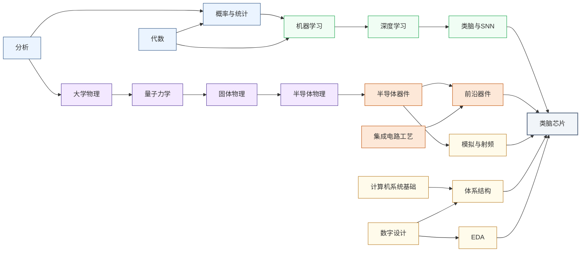

---
hide:
  - navigation
---
模仿大脑神经元的脉冲放电机制，设计比传统深度学习硬件更节能的类脑芯片。

<svg viewBox="0 0 1140 532" xmlns="http://www.w3.org/2000/svg" style="width:100%;max-width:1140px;display:block;margin:1.5rem auto;font-family:system-ui,-apple-system,sans-serif;">
  <rect width="1140" height="532" rx="10" fill="#FFFFFF" stroke="#CBD5E1" stroke-width="1.5"/>
  <text x="570" y="26" text-anchor="middle" font-size="17" font-weight="bold" fill="#1E293B">集成电路科研方向全景图</text>
  <text x="250" y="54" text-anchor="middle" font-size="13.5" font-weight="bold" fill="#0E7490">← 计算媒介更奇异</text>
  <text x="1000" y="54" text-anchor="middle" font-size="13.5" font-weight="bold" fill="#16A34A">更贴近物理世界 →</text>
  <defs><filter id="loc-b" x="-5%" y="-5%" width="110%" height="110%"><feGaussianBlur stdDeviation="1.4"/></filter></defs>
  <rect x="88" y="88" width="147" height="298" rx="6" fill="#ECFEFF"/>
  <rect x="239" y="88" width="147" height="298" rx="6" fill="#F8FAFC"/>
  <rect x="390" y="88" width="147" height="298" rx="6" fill="#FEF2F2"/>
  <rect x="541" y="88" width="289" height="298" rx="6" fill="#EFF6FF"/>
  <rect x="834" y="88" width="76" height="298" rx="6" fill="#FFFBEB"/>
  <rect x="914" y="88" width="218" height="298" rx="6" fill="#F0FDF4"/>
  <text x="161" y="82" text-anchor="middle" font-size="12" font-weight="bold" fill="#0E7490">量子 · 光子</text>
  <text x="312" y="82" text-anchor="middle" font-size="12" font-weight="bold" fill="#64748B">存算 · 类脑</text>
  <text x="463" y="82" text-anchor="middle" font-size="12" font-weight="bold" fill="#DC2626">模拟 · 射频</text>
  <text x="685" y="82" text-anchor="middle" font-size="13" font-weight="bold" fill="#1D4ED8">数字计算</text>
  <text x="872" y="82" text-anchor="middle" font-size="12" font-weight="bold" fill="#D97706">功率电子</text>
  <text x="1023" y="82" text-anchor="middle" font-size="12" font-weight="bold" fill="#16A34A">传感 · 生物 · 机械</text>
  <line x1="86" y1="92" x2="1132" y2="92" stroke="#E2E8F0" stroke-width="1"/>
  <line x1="86" y1="150" x2="1132" y2="150" stroke="#EEF2F6" stroke-width="1"/>
  <line x1="86" y1="208" x2="1132" y2="208" stroke="#EEF2F6" stroke-width="1"/>
  <line x1="86" y1="266" x2="1132" y2="266" stroke="#EEF2F6" stroke-width="1"/>
  <line x1="86" y1="324" x2="1132" y2="324" stroke="#EEF2F6" stroke-width="1"/>
  <line x1="86" y1="382" x2="1132" y2="382" stroke="#E2E8F0" stroke-width="1"/>
  <line x1="86" y1="92" x2="86" y2="382" stroke="#CBD5E1" stroke-width="1"/>
  <text x="81" y="124" text-anchor="end" font-size="10.5" fill="#475569">算法 / 应用</text>
  <text x="81" y="182" text-anchor="end" font-size="10.5" fill="#475569">系统 / 软件</text>
  <text x="81" y="240" text-anchor="end" font-size="10.5" fill="#475569">体系结构</text>
  <text x="81" y="298" text-anchor="end" font-size="10.5" fill="#475569">电路</text>
  <text x="81" y="356" text-anchor="end" font-size="10.5" fill="#475569">器件</text>
  <g filter="url(#loc-b)" opacity="0.42">
  <rect x="92" y="92" width="68" height="290" rx="5" fill="#CFFAFE" stroke="#0E7490" stroke-width="1.2"/>
  <text x="126" y="231" text-anchor="middle" font-size="10.5" font-weight="bold" fill="#0E7490">量子计算</text>
  <text x="126" y="246" text-anchor="middle" font-size="10.5" font-weight="bold" fill="#0E7490">与量子芯片</text>
  <rect x="163" y="92" width="68" height="290" rx="5" fill="#CFFAFE" stroke="#0E7490" stroke-width="1.2"/>
  <text x="197" y="231" text-anchor="middle" font-size="10.5" font-weight="bold" fill="#0E7490">光电子</text>
  <text x="197" y="246" text-anchor="middle" font-size="10.5" font-weight="bold" fill="#0E7490">与硅光集成</text>
  <rect x="394" y="266" width="68" height="116" rx="5" fill="#FEE2E2" stroke="#DC2626" stroke-width="1.2"/>
  <text x="428" y="317" text-anchor="middle" font-size="10.5" font-weight="bold" fill="#DC2626">模拟与</text>
  <text x="428" y="332" text-anchor="middle" font-size="10.5" font-weight="bold" fill="#DC2626">混合信号IC</text>
  <rect x="465" y="266" width="68" height="116" rx="5" fill="#FEE2E2" stroke="#DC2626" stroke-width="1.2"/>
  <text x="499" y="317" text-anchor="middle" font-size="10.5" font-weight="bold" fill="#DC2626">射频与</text>
  <text x="499" y="332" text-anchor="middle" font-size="10.5" font-weight="bold" fill="#DC2626">毫米波IC</text>
  <rect x="243" y="92" width="68" height="290" rx="5" fill="#FEE2E2" stroke="#DC2626" stroke-width="1.2"/>
  <text x="277" y="239" text-anchor="middle" font-size="11.5" font-weight="bold" fill="#DC2626">类脑芯片</text>
  <rect x="314" y="92" width="68" height="290" rx="5" fill="#EDE9FE" stroke="#7C3AED" stroke-width="1.2"/>
  <text x="348" y="231" text-anchor="middle" font-size="10.5" font-weight="bold" fill="#7C3AED">存算一体</text>
  <text x="348" y="246" text-anchor="middle" font-size="10.5" font-weight="bold" fill="#7C3AED">与近存计算</text>
  <rect x="545" y="92" width="68" height="290" rx="5" fill="#EDE9FE" stroke="#7C3AED" stroke-width="1.2"/>
  <text x="579" y="231" text-anchor="middle" font-size="10.5" font-weight="bold" fill="#7C3AED">硬件安全</text>
  <text x="579" y="246" text-anchor="middle" font-size="10.5" font-weight="bold" fill="#7C3AED">与可信计算</text>
  <rect x="616" y="92" width="68" height="174" rx="5" fill="#DBEAFE" stroke="#1D4ED8" stroke-width="1.2"/>
  <text x="650" y="172" text-anchor="middle" font-size="10.5" font-weight="bold" fill="#1D4ED8">AI 算法</text>
  <text x="650" y="187" text-anchor="middle" font-size="10.5" font-weight="bold" fill="#1D4ED8">与系统</text>
  <rect x="687" y="150" width="68" height="116" rx="5" fill="#DBEAFE" stroke="#1D4ED8" stroke-width="1.2"/>
  <text x="721" y="201" text-anchor="middle" font-size="10.5" font-weight="bold" fill="#1D4ED8">处理器架构</text>
  <text x="721" y="216" text-anchor="middle" font-size="10.5" font-weight="bold" fill="#1D4ED8">与编译系统</text>
  <rect x="758" y="208" width="68" height="116" rx="5" fill="#DBEAFE" stroke="#1D4ED8" stroke-width="1.2"/>
  <text x="792" y="259" text-anchor="middle" font-size="10.5" font-weight="bold" fill="#1D4ED8">可重构计算</text>
  <text x="792" y="274" text-anchor="middle" font-size="10.5" font-weight="bold" fill="#1D4ED8">与 FPGA</text>
  <rect x="838" y="266" width="68" height="116" rx="5" fill="#FEF3C7" stroke="#D97706" stroke-width="1.2"/>
  <text x="872" y="317" text-anchor="middle" font-size="10.5" font-weight="bold" fill="#B45309">功率半导体</text>
  <text x="872" y="332" text-anchor="middle" font-size="10" font-weight="bold" fill="#B45309">与宽禁带器件</text>
  <rect x="918" y="92" width="68" height="290" rx="5" fill="#ECFCCB" stroke="#65A30D" stroke-width="1.2"/>
  <text x="952" y="239" text-anchor="middle" font-size="11.5" font-weight="bold" fill="#4D7C0F">具身智能</text>
  <rect x="989" y="266" width="68" height="116" rx="5" fill="#D1FAE5" stroke="#059669" stroke-width="1.2"/>
  <text x="1023" y="317" text-anchor="middle" font-size="10.5" font-weight="bold" fill="#047857">生物电子</text>
  <text x="1023" y="332" text-anchor="middle" font-size="10.5" font-weight="bold" fill="#047857">与脑机接口</text>
  <rect x="1060" y="266" width="68" height="116" rx="5" fill="#DCFCE7" stroke="#16A34A" stroke-width="1.2"/>
  <text x="1094" y="317" text-anchor="middle" font-size="10.5" font-weight="bold" fill="#15803D">MEMS 与</text>
  <text x="1094" y="332" text-anchor="middle" font-size="10.5" font-weight="bold" fill="#15803D">微纳传感器</text>
  </g>
  <text x="81" y="450" text-anchor="end" font-size="10.5" fill="#475569">各方向通用</text>
  <g filter="url(#loc-b)" opacity="0.42">
  <rect x="92" y="408" width="1040" height="28" rx="5" fill="#F1F5F9" stroke="#64748B" stroke-width="1.1"/>
  <text x="612" y="426" text-anchor="middle" font-size="12" font-weight="bold" fill="#475569">EDA 与设计自动化</text>
  <rect x="92" y="440" width="1040" height="28" rx="5" fill="#EEF2F6" stroke="#64748B" stroke-width="1.1"/>
  <text x="612" y="458" text-anchor="middle" font-size="12" font-weight="bold" fill="#475569">先进封装与系统集成</text>
  <rect x="92" y="472" width="1040" height="30" rx="5" fill="#E2E8F0" stroke="#475569" stroke-width="1.2"/>
  <text x="612" y="491" text-anchor="middle" font-size="12" font-weight="bold" fill="#334155">半导体器件与先进工艺</text>
  </g>
  <rect x="92" y="512" width="13" height="13" rx="2" fill="#DBEAFE" stroke="#1D4ED8" stroke-width="1.1"/>
  <text x="110" y="522" text-anchor="start" font-size="10.5" fill="#475569">数字</text>
  <rect x="160" y="512" width="13" height="13" rx="2" fill="#FEE2E2" stroke="#DC2626" stroke-width="1.1"/>
  <text x="178" y="522" text-anchor="start" font-size="10.5" fill="#475569">模拟</text>
  <rect x="228" y="512" width="13" height="13" rx="2" fill="#EDE9FE" stroke="#7C3AED" stroke-width="1.1"/>
  <text x="246" y="522" text-anchor="start" font-size="10.5" fill="#475569">数字 / 模拟 交叉</text>
  <rect x="227" y="95" width="104" height="290" rx="9" fill="#1E293B" opacity="0.16"/>
  <rect x="225" y="92" width="104" height="290" rx="9" fill="#FEE2E2" stroke="#DC2626" stroke-width="2.6"/>
  <text x="277" y="244" text-anchor="middle" font-size="14" font-weight="bold" fill="#DC2626">类脑芯片</text>
</svg>

## 这个方向在研究什么

Yann LeCun 反复讲过这样一个对比：训练 GPT-3 一次的碳排放就有约 552 吨 CO₂，相当于 460 次旧金山到纽约的往返航班；而能完成相当复杂任务的人脑，全程只消耗 20 瓦上下。中间隔着几个数量级，这个差距大到不可能靠工艺迭代抹平。把工艺从 7nm 推到 2nm 能省一些，救不回这么大的缺口。<u>要把能效逼近大脑这个量级，需要计算方式本身的改变。</u><u>大脑节能，不是因为神经元工作得多快，而是因为绝大多数神经元绝大多数时候都在"沉睡"，这便是"稀疏性"。</u>视觉皮层、运动皮层里的神经元，只在某些条件被触发时才发出一个不到一毫秒的**电脉冲**（spike），然后回到静默，能量花在"实际发生的事件"上，不花在"电路规模"上。GPU 上的标准神经网络则不同：不管输入向量某个分量是 0 还是 0.7，矩阵乘法都把所有连接计算一遍，所有元素同步、稠密、不分轻重。这是个根本性的范式差异，类脑芯片这个方向就是从这里出发的。

<svg viewBox="0 0 860 220" xmlns="http://www.w3.org/2000/svg" style="width:100%;max-width:860px;display:block;margin:1.5rem auto;font-family:system-ui,sans-serif;">
  <defs>
    <marker id="snn-arrow" markerWidth="8" markerHeight="8" refX="6" refY="3" orient="auto">
      <path d="M0,0 L0,6 L8,3 z" fill="#64748B"/>
    </marker>
  </defs>
  <!-- Panel 1: ANN -->
  <rect x="10" y="10" width="255" height="200" rx="8" fill="#F8FAFC" stroke="#CBD5E1" stroke-width="1.5"/>
  <text x="137" y="32" text-anchor="middle" font-size="14" font-weight="600" fill="#334155">① 传统神经网络（ANN）</text>
  <!-- Input vector -->
  <rect x="28" y="45" width="30" height="120" rx="4" fill="#DBEAFE" stroke="#3B82F6" stroke-width="1"/>
  <text x="43" y="85" text-anchor="middle" font-size="11" fill="#1D4ED8">0.8</text>
  <text x="43" y="100" text-anchor="middle" font-size="11" fill="#1D4ED8">0.3</text>
  <text x="43" y="115" text-anchor="middle" font-size="11" fill="#1D4ED8">0.9</text>
  <text x="43" y="130" text-anchor="middle" font-size="11" fill="#1D4ED8">0.2</text>
  <text x="43" y="145" text-anchor="middle" font-size="11" fill="#1D4ED8">0.7</text>
  <text x="43" y="175" text-anchor="middle" font-size="11" fill="#64748B">输入</text>
  <!-- × symbol -->
  <text x="75" y="112" text-anchor="middle" font-size="16" font-weight="bold" fill="#475569">×</text>
  <!-- Weight matrix -->
  <rect x="88" y="45" width="80" height="120" rx="4" fill="#DBEAFE" stroke="#3B82F6" stroke-width="1"/>
  <text x="128" y="70" text-anchor="middle" font-size="9" fill="#1D4ED8">W₁₁ W₁₂ W₁₃</text>
  <text x="128" y="85" text-anchor="middle" font-size="9" fill="#1D4ED8">W₂₁ W₂₂ W₂₃</text>
  <text x="128" y="100" text-anchor="middle" font-size="9" fill="#1D4ED8">W₃₁ W₃₂ W₃₃</text>
  <text x="128" y="115" text-anchor="middle" font-size="9" fill="#1D4ED8">W₄₁ W₄₂ W₄₃</text>
  <text x="128" y="130" text-anchor="middle" font-size="9" fill="#1D4ED8">W₅₁ W₅₂ W₅₃</text>
  <text x="128" y="175" text-anchor="middle" font-size="11" fill="#64748B">权重矩阵</text>
  <!-- = symbol -->
  <text x="183" y="112" text-anchor="middle" font-size="16" font-weight="bold" fill="#475569">=</text>
  <!-- Output -->
  <rect x="196" y="65" width="30" height="80" rx="4" fill="#DBEAFE" stroke="#3B82F6" stroke-width="1"/>
  <text x="211" y="95" text-anchor="middle" font-size="11" fill="#1D4ED8">0.6</text>
  <text x="211" y="110" text-anchor="middle" font-size="11" fill="#1D4ED8">0.4</text>
  <text x="211" y="125" text-anchor="middle" font-size="11" fill="#1D4ED8">0.8</text>
  <text x="211" y="175" text-anchor="middle" font-size="11" fill="#64748B">输出</text>
  <text x="137" y="195" text-anchor="middle" font-size="11" fill="#64748B">每层全量计算 | 功耗高 | GPU擅长</text>
  <!-- Arrow -->
  <line x1="265" y1="110" x2="295" y2="110" stroke="#64748B" stroke-width="1.5" marker-end="url(#snn-arrow)"/>
  <!-- Panel 2: SNN -->
  <rect x="297" y="10" width="260" height="200" rx="8" fill="#F8FAFC" stroke="#CBD5E1" stroke-width="1.5"/>
  <text x="427" y="32" text-anchor="middle" font-size="14" font-weight="600" fill="#334155">② 脉冲神经网络（SNN）</text>
  <!-- Neurons (circles) - most silent, few firing -->
  <!-- Row 1 -->
  <circle cx="340" cy="70" r="10" fill="#E2E8F0" stroke="#94A3B8" stroke-width="1"/>
  <circle cx="370" cy="70" r="10" fill="#E2E8F0" stroke="#94A3B8" stroke-width="1"/>
  <circle cx="400" cy="70" r="10" fill="#FEF3C7" stroke="#D97706" stroke-width="2"/>
  <line x1="400" y1="58" x2="400" y2="44" stroke="#D97706" stroke-width="2"/>
  <polyline points="394,44 400,36 406,44" fill="none" stroke="#D97706" stroke-width="1.5"/>
  <circle cx="430" cy="70" r="10" fill="#E2E8F0" stroke="#94A3B8" stroke-width="1"/>
  <circle cx="460" cy="70" r="10" fill="#E2E8F0" stroke="#94A3B8" stroke-width="1"/>
  <!-- Row 2 -->
  <circle cx="340" cy="110" r="10" fill="#E2E8F0" stroke="#94A3B8" stroke-width="1"/>
  <circle cx="370" cy="110" r="10" fill="#FEF3C7" stroke="#D97706" stroke-width="2"/>
  <line x1="370" y1="98" x2="370" y2="84" stroke="#D97706" stroke-width="2"/>
  <polyline points="364,84 370,76 376,84" fill="none" stroke="#D97706" stroke-width="1.5"/>
  <circle cx="400" cy="110" r="10" fill="#E2E8F0" stroke="#94A3B8" stroke-width="1"/>
  <circle cx="430" cy="110" r="10" fill="#E2E8F0" stroke="#94A3B8" stroke-width="1"/>
  <circle cx="460" cy="110" r="10" fill="#E2E8F0" stroke="#94A3B8" stroke-width="1"/>
  <!-- Row 3 -->
  <circle cx="340" cy="150" r="10" fill="#E2E8F0" stroke="#94A3B8" stroke-width="1"/>
  <circle cx="370" cy="150" r="10" fill="#E2E8F0" stroke="#94A3B8" stroke-width="1"/>
  <circle cx="400" cy="150" r="10" fill="#E2E8F0" stroke="#94A3B8" stroke-width="1"/>
  <circle cx="430" cy="150" r="10" fill="#FEF3C7" stroke="#D97706" stroke-width="2"/>
  <line x1="430" y1="138" x2="430" y2="124" stroke="#D97706" stroke-width="2"/>
  <polyline points="424,124 430,116 436,124" fill="none" stroke="#D97706" stroke-width="1.5"/>
  <circle cx="460" cy="150" r="10" fill="#E2E8F0" stroke="#94A3B8" stroke-width="1"/>
  <!-- Legend -->
  <circle cx="490" cy="80" r="7" fill="#E2E8F0" stroke="#94A3B8" stroke-width="1"/>
  <text x="502" y="84" font-size="11" fill="#64748B">静默</text>
  <circle cx="490" cy="100" r="7" fill="#FEF3C7" stroke="#D97706" stroke-width="1.5"/>
  <text x="502" y="104" font-size="11" fill="#D97706">激活</text>
  <text x="427" y="180" text-anchor="middle" font-size="11" fill="#64748B">事件驱动 | 只有脉冲才耗能 | 稀疏高效</text>
  <text x="427" y="195" text-anchor="middle" font-size="11" fill="#64748B">信息以脉冲时序和频率编码</text>
  <!-- Arrow -->
  <line x1="557" y1="110" x2="587" y2="110" stroke="#64748B" stroke-width="1.5" marker-end="url(#snn-arrow)"/>
  <!-- Panel 3: Bio Neuron -->
  <rect x="590" y="10" width="260" height="200" rx="8" fill="#F8FAFC" stroke="#CBD5E1" stroke-width="1.5"/>
  <text x="720" y="32" text-anchor="middle" font-size="14" font-weight="600" fill="#334155">③ 生物神经元（参照）</text>
  <!-- Dendrite -->
  <line x1="620" y1="110" x2="660" y2="110" stroke="#16A34A" stroke-width="2"/>
  <line x1="625" y1="95" x2="660" y2="110" stroke="#16A34A" stroke-width="1.5"/>
  <line x1="625" y1="125" x2="660" y2="110" stroke="#16A34A" stroke-width="1.5"/>
  <text x="630" y="145" text-anchor="middle" font-size="11" fill="#15803D">树突</text>
  <!-- Soma -->
  <circle cx="690" cy="110" r="20" fill="#DCFCE7" stroke="#16A34A" stroke-width="2"/>
  <text x="690" y="114" text-anchor="middle" font-size="11" fill="#15803D">胞体</text>
  <!-- Axon -->
  <line x1="710" y1="110" x2="790" y2="110" stroke="#16A34A" stroke-width="2"/>
  <!-- Sparse spikes on axon -->
  <line x1="730" y1="110" x2="730" y2="90" stroke="#D97706" stroke-width="2"/>
  <line x1="755" y1="110" x2="755" y2="90" stroke="#D97706" stroke-width="2"/>
  <text x="720" y="145" text-anchor="middle" font-size="11" fill="#64748B">轴突（稀疏放电）</text>
  <text x="720" y="175" text-anchor="middle" font-size="11" fill="#64748B">大脑约 20 W</text>
  <text x="720" y="192" text-anchor="middle" font-size="11" fill="#64748B">完成复杂认知任务</text>
</svg>

**脉冲神经网络**（Spiking Neural Network, SNN）是这套范式在算法层的形式化：每个神经元维护一个**膜电位**状态，输入脉冲来了就累加，超过阈值便向下游发出一个脉冲，同时把自己的电位复位。信息不存在某个浮点激活值里，而是编码在脉冲的**时序和频率**里，即何时发、发多密。对应到硬件，神经形态芯片是**事件驱动**的：没有全局时钟把所有单元拍成一拍，哪里有脉冲来，哪里才被唤醒处理；没有事件时电路静止，静态功耗近乎为零。这一线最具代表性的两块芯片是 IBM 的 **TrueNorth**(2014)和清华施路平团队的**天机**(Tianjic，2019)。TrueNorth 第一次在大规模芯片上落地了事件驱动架构；天机让 SNN 和 CNN 共存于同一颗芯片，2019 年用于无人自行车控制、登上 *Nature* 封面，这说明类脑架构不必脱离主流深度学习自成一派。但在 ImageNet 这类标准分类任务上，SNN 的精度仍落后 ANN（Artificial Neural Network，人工神经网络）几个百分点。根源在于训练。

训练这件事卡在一个底层的数学问题上。标准深度学习的反向传播需要每个激活的梯度，而 SNN 的脉冲是离散跳变，电位没到阈值是 0，到了瞬间跳到 1，这个函数不可微，没有梯度可传。解决这个问题有两种方法。第一个方法是**替代梯度**（surrogate gradient）：前向传播照常用真实的脉冲函数，反向传播时把它替换成一个平滑的近似函数计算梯度。这条路有效，但前向反向用的不是同一个东西，引入了系统性的近似误差，规模越大误差越显眼。第二个方法是 **ANN-to-SNN 转换**：先用标准方法训练好一个 ANN，再把权重转换成等价的 SNN 脉冲频率编码，精度损失更小，代价是 SNN 推理时需要多个时间步累积才能给出稳定结果，会引入额外延迟。这两条路各有代价，如何在精度、能耗、延迟之间找一个工程上可用的折中，目前还没有定论。<u>但它们有一个共同点——训练在软件里完成，把权重训好之后再灌进神经形态芯片</u>。大脑里却没有这种二分，神经元一边在工作，突触一边在调整自己。要把"事件驱动"这套思路再往前推一步，让"学"本身也发生在硬件里，问题就从神经元转向了突触。

大脑里两个神经元之间的连接强度，会根据它们的脉冲时间差自动调整。前面的神经元先发放动作电位，后面的跟着发，这条突触就被加强；反过来则被削弱。这种特性叫 **STDP**（Spike-Timing-Dependent Plasticity，脉冲时序依赖可塑性），是大脑学习的物理基础之一。要在硬件上做出这种"会自己变化"的连接，SRAM 这类标准存储不行，它只能存离散二值，没办法连续调整，更不会随输入历史漂移。**忆阻器**在类脑芯片这一领域则登堂入室。和存算一体（CIM）不同，CIM 也有用忆阻器的，但利用的是忆阻器"电阻可调 + 电流在列线上自然求和"这两个特性来直接做矩阵乘法，把存储和计算合一，这一点在类脑场景里也成立。<u>但类脑芯片还利用了忆阻器的"漂移"行为</u>。施加脉冲序列时，忆阻器的电阻会随脉冲历史自然变化，这一特性在 CIM 里曾被当作缺陷(电阻不稳定让权重难以精确编程)，在类脑场景下反而是可利用的性质。如果能让忆阻器的漂移规律对齐 STDP，那么"学习"就不再需要从外部加载新权重，而是芯片在工作中自己改变自己。这样一来，<u>训练发生的地点就从软件转移到了硬件</u>。

### 核心研究问题

- **忆阻器突触与 STDP**：忆阻器加脉冲序列时电阻按历史自然漂移，这一在存算一体里被当作缺陷的特性，能否驯化成 STDP 的物理载体、让学习直接发生在器件上。
- **SNN 训练与替代梯度**：膜电位过阈瞬间从 0 跳到 1，这个阶跃函数没有梯度，标准反向传播直接失效；替代梯度前向用真实脉冲、反向换平滑近似，又引入系统性误差，大网络上难收敛。
- **ANN-SNN 转换**：把训好的 ANN 权重转成脉冲频率编码，精度损失更小，但推理要多个时间步累积才稳定，精度、能耗、延迟很难同时兼顾。
- **事件驱动的神经形态电路**：积分-触发神经元要做成模拟的、片上网络要做成异步事件驱动的，没事件时电路近乎静止，静态功耗才能压到近零。
- **SNN/ANN 异构集成**：天机已证明脉冲网络和 CNN 能在同一颗芯片上共存，但这种异构架构的片上网络、调度与编译运行时还有不少要补的课。
- **类脑感知器件**：让感光、感触这些感知环节本身就以脉冲事件输出、就地稀疏处理，仿视网膜的事件相机是代表。

### 知识路径

算法线（数学→ML→DL→SNN）提供神经形态计算模型，器件线（物理→半导体器件→前沿器件）提供忆阻器等新型存储单元，电路线与体系结构线决定芯片最终能实现什么。节点对应[学习地图](../学习地图/index.md)里的目录：

- 数学：[分析](../学习地图/数学/分析/index.md) · [代数](../学习地图/数学/代数/index.md)（线性代数） · [概率与统计](../学习地图/数学/概率与统计/index.md)
- 人工智能：[机器学习](../学习地图/人工智能/机器学习/index.md) · [深度学习](../学习地图/人工智能/深度学习/index.md) · [类脑与SNN](../学习地图/人工智能/类脑与SNN/index.md)
- 物理：[大学物理](../学习地图/物理/大学物理/index.md) · [量子力学](../学习地图/物理/量子力学/index.md) · [固体物理](../学习地图/物理/固体物理/index.md) · [半导体物理](../学习地图/物理/半导体物理/index.md)
- 器件与工艺：[半导体器件](../学习地图/器件与工艺/半导体器件/index.md) · [集成电路工艺](../学习地图/器件与工艺/集成电路工艺/index.md) · [前沿器件](../学习地图/器件与工艺/前沿器件/index.md)（忆阻器、相变存储）
- 电路：[模拟与射频](../学习地图/电路/模拟与射频/index.md) · [数字设计](../学习地图/电路/数字设计/index.md) · [EDA](../学习地图/电路/EDA/index.md)
- 系统架构：[计算机系统基础](../学习地图/系统架构/计算机系统基础/index.md) · [体系结构](../学习地图/系统架构/体系结构/index.md)

## 这个方向适合谁

适合觉得”换一种计算方式”比沿着旧路再提升一些性能更有意思的人。切口有两个，模拟电路扎实的去做神经元电路和脉冲路由，对器件物理有兴趣的去研究忆阻器，让它的漂移对齐 STDP、让学习直接发生在硬件上。日常横跨两个领域，白天调电路或器件，晚上读 SNN 训练的算法论文，社区偏小且分散，得习惯两边来回切换。还要有心理准备，SNN 的精度至今落后主流神经网络几个百分点，做这个方向看重的是能效那几个数量级的差距，不是榜单上的名次。

## 学术界

### 课题组

**境内**

-   **[白恩慧](https://www.ime.tsinghua.edu.cn/info/1015/2267.htm)** 清华

    神经形态计算电路 | 仿生神经晶体管 | 时空信息处理

-   **[施路平](https://faculty.dpi.tsinghua.edu.cn/shiluping/zh_CN/index.htm)** 清华

    天机/天眸神经形态芯片 | SNN/ANN 融合 | 视觉感知与机器人

-   **[吴华强](https://www.ime.tsinghua.edu.cn/info/1015/1787.htm)** 清华

    忆阻器存算一体芯片 | 神经网络硬件加速 | 贝叶斯/在线学习

-   **[张悠慧](https://craft.cs.tsinghua.edu.cn/)** 清华

    SNN 芯片编译与运行时 | 可编程神经形态处理器 | 软硬件协同设计

-   **[裴京](https://craft.cs.tsinghua.edu.cn/author/jing-pei/)** 清华

    天机芯片混合架构 | ANN/SNN 统一计算范式 | 脑启发系统层次

-   **[唐建石](https://www.ime.tsinghua.edu.cn/info/1035/1595.htm)** 清华

    忆阻器突触与神经元器件 | 储备池计算 | 脑机接口神经解码

-   **[陈虹](https://www.sic.tsinghua.edu.cn/info/1014/1827.htm)** 清华 

    异步SNN处理器芯片 | 片上增量学习 | 超低功耗边缘AI

-   **[张续猛](https://icmne.fudan.edu.cn/2d/5e/c48925a732510/page.htm)** 复旦

    忆阻器神经元电路 | 铁电突触阵列 | 脉冲驱动类脑芯片

-   **[周鹏](https://icmne.fudan.edu.cn/2d/61/c48925a732513/page.htm)** 复旦

    二维材料存内计算 | 仿生人工神经元 | 视网膜神经假体

-   **[刘琦](https://icmne.fudan.edu.cn/2d/2a/c48925a732458/page.htm)** 复旦

    ReRAM 交叉阵列 | SNN 片上在线学习 | 忆阻器脉冲神经元集成

-   **[王明](https://icmne.fudan.edu.cn/2d/44/c48925a732484/page.htm)** 复旦

    神经形态忆阻器件 | 柔性智能电子

-   **[陈贤哲](https://icmne.fudan.edu.cn/2c/a8/c48925a732328/page.htm)** 复旦

    自旋存储器件 | 忆阻器神经形态计算 | 铁电与反铁磁材料

-   **[黄如](https://ic.pku.edu.cn/szdw/ysfc/hr/index.htm)** 北大 

    铁电存储器突触器件 | 脉冲神经元电路 | 边缘智能计算芯片

-   **[杨玉超](http://yuchaolab.cn/)** 北大

    忆阻器大规模集成 | 混合动态忆阻器SNN | 存算一体芯片

-   **[蔡一茂](https://ic.pku.edu.cn/en/Faculty/Facultys/DepartmentofMicroNanoelectronics/CaiYimao/index.htm)** 北大

    RRAM忆阻器件 | 神经形态芯片设计 | 先进存储集成

-   **[杨睿](https://sites.gc.sjtu.edu.cn/rui-yang/)** 交大

    阻变存储器（RRAM）存内计算 | 神经形态计算系统 | 二维材料纳机电器件

-   **[缪峰](https://physics.nju.edu.cn/szdw/qbmd/20240321/i261985.html)** 南大

    二维材料忆阻器阵列 | 传感器内计算视觉感知 | 并行内存神经形态系统

-   **[万昌锦](https://ese.nju.edu.cn/wcj/list.htm)** 南大

    脉冲编码人工感觉神经元 | 忆阻器储层计算阵列 | 神经形态感知与假肢系统

-   **[余林蔚](https://ese.nju.edu.cn/ylw/list.htm)** 南大

    硅纳米线忆阻器 | 概率激活神经形态计算 | 柔性仿生传感与人机接口

-   **[申富饶](https://ai.nju.edu.cn/e9/5e/c18540a321886/pagem.htm)** 南大

    脉冲神经网络（SNN）训练 | 自组织增量在线学习 | 神经形态计算与边缘部署

-   **[潘纲](https://person.zju.edu.cn/gpan)** 浙大

    Darwin 系列类脑芯片 | 大规模 SNN 硬件映射 | 片上学习与 NoC 架构

-   **[林芃](https://person.zju.edu.cn/linpeng)** 浙大

    电化学忆阻类脑器件 | 单器件神经形态感知 | 存算一体在线学习

-   **[马德](https://person.zju.edu.cn/made)** 浙大

    SNN 硬件映射与基准测试 | 多核神经形态处理器架构 | 片上网络 NoC 互联设计

-   **[胡绍刚](https://icse.uestc.edu.cn/info/1205/7308.htm)** 电子科大

    忆阻器件 | 类脑芯片 | 数字集成电路

<button class="prof-show-all">显示全部 ↓</button>

**境外**

-   **[Ngai Wong（黃毅）](https://www.eee.hku.hk/~nwong/)** 港大

    忆阻器/ReRAM 突触器件 | 边缘端神经形态推理芯片 | 紧凑神经网络加速

-   **[Kwabena Boahen](https://web.stanford.edu/group/brainsinsilicon/)** Stanford

    脉冲神经网络 SNN | 树突计算与在线学习 | 大规模类脑芯片（Neurogrid）

-   **[Yiran Chen（陈怡然）](https://ece.duke.edu/faculty/yiran-chen)** Duke

    脉冲神经网络加速 | 存内计算芯片 | 边缘 AI 系统

-   **[Shimeng Yu（余诗孟）](https://shimeng.ece.gatech.edu/)** Georgia Tech

    新型非易失存储器（RRAM/FeFET） | 存算一体（CIM）芯片设计 | NeuroSim 架构仿真评估

-   **[Marian Verhelst](https://www.esat.kuleuven.be/micas/index.php/marian-verhelst)** KU Leuven / imec 

    嵌入式神经网络加速器 | 数模混合 AI 芯片 | 边缘低功耗推理

-   **[Damien Querlioz](https://sites.google.com/site/damienquerlioz/)** Paris-Saclay / CNRS

    忆阻器人工突触 | 自供能神经网络 | 随机硬件贝叶斯推理

-   **[Kaushik Roy](https://engineering.purdue.edu/NRL)** Purdue

    脉冲神经网络与片上在线学习 | 混合模数 CIM 加速器 | 铁电/自旋器件协同设计

-   **[Wei Lu（卢伟）](https://web.eecs.umich.edu/~wluee/)** U Michigan

    RRAM/忆阻器突触阵列 | Crossbar 存算一体 | 神经形态在线学习电路

<button class="prof-show-all">显示全部 ↓</button>

### 学术会议与期刊

  
会议
    ISSCC
    IEDM
    VLSI Symposium
    NeurIPS
    ICLR
    AAAI
    DAC
  

  
期刊
    Nature / Nature Electronics / Nature Machine Intelligence
    JSSC
    TED
    TNNLS
  

## 毕业去向

### 企业

  
国内
    <a class="dm-chip" href="https://www.lynxi.com">灵汐科技（Lynxi）</a>
    <a class="dm-chip" href="https://www.synsense.ai">时识科技（SynSense）</a>
  

  
国外
    <a href="https://www.intel.com/content/www/us/en/research/neuromorphic-computing.html">Intel</a>
    <a href="https://research.ibm.com/">IBM</a>
    <a href="https://brainchip.com">BrainChip</a>
  

### 科研院所

  
国内
    <a class="dm-chip" href="https://www.ime.ac.cn">中科院微电子研究所</a>
    <a class="dm-chip" href="https://www.ia.cas.cn">中科院自动化研究所</a>
    <a class="dm-chip" href="https://www.zhejianglab.org">之江实验室</a>
  

  
国外
    <a class="dm-chip" href="https://www.imec-int.com">imec</a>
    <a class="dm-chip" href="https://www.ipms.fraunhofer.de/en/Strategic-Research-Areas/Neuromorphic-Computing.html">Fraunhofer IPMS</a>
  

## 相关科普

  <a class="vc-card" href="https://www.bilibili.com/video/BV1zT4y1n74q" target="_blank" rel="noopener">
    
      
      B站
    
    
      功耗相差10000倍，类脑计算是啥？【硬核揭秘】神经形态芯片
      新石器公园 · 31.6万播放
    
  </a>
  <a class="vc-card" href="https://www.bilibili.com/video/BV1nN411g7HC" target="_blank" rel="noopener">
    
      
      B站
    
    
      计算能效快1000倍！忆阻器芯片到底是什么？它会是吊打GPU的存在吗？
      新石器公园 · 63.1万播放
    
  </a>

## 论文推荐

!!! note "待补充"
    欢迎推荐该方向的入门综述或经典论文，[参与建设 →](../参与建设.md)
